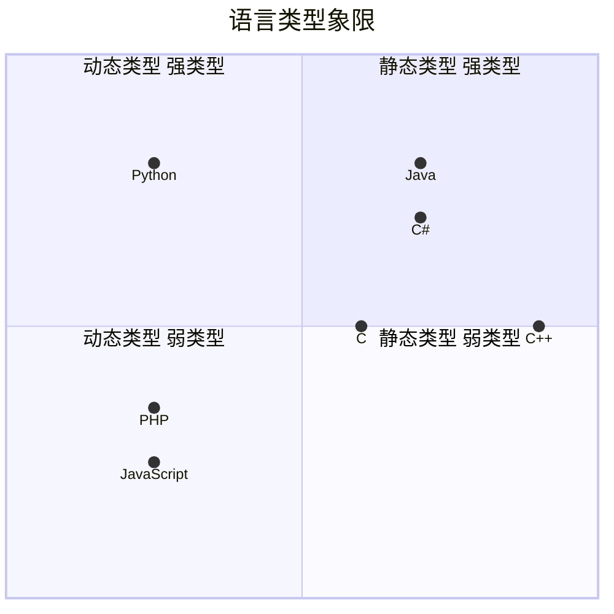

# 类型基础

## 静态类型语言

  在编译阶段确定所有变量的类型

## 动态类型语言

  在执行阶段确定所有变量的类型

|静态类型语言|动态类型语言|
|---|---|
|对类型极度严格|对类型非常宽松|
|立即发现错误|Bug可能隐藏很久|
|运行时性能较好|运行时性能差|
|自文档化|可读性差|

## 强类型语言

  不允许程序在发生错误后继续执行



## 数据类型

|ES6 数据类型|TypeScript数据类型|
|---|---|
|Boolean|Boolean|
|Number|Number|
|String|String|
|Array|Array|
|Function|Function|
|Object|Object|
|Symbol|Symbol|
|undefiend|undefined|
|null|null|
||void|
||any|
||never|
||元组|
||枚举|
||高级类型|

## 类型注解

作用：相当于强类型语言中的类型声明
语法：（变量/函数）：type

```ts
// 原始类型
let bool: boolean = true
let num: number = 10
let str: string = 'dataType'

// 数组

let arr1: number[] = [1, 2, 3]
let arr2: Array<number> = [1, 2, 3]

// 元组

let tuple: [number, string] = [0, '1']

// 函数

let add = (x: number, y: number): number => x + y
// 定义函数类型
let fn: (x: number, y: number) => number
fn = (x, y) => x + y

// 对象

let obj: object = { x: 1, y: 1 }

// symbol

let s1: symbol = Symbol()
let s2 = Symbol()

// undefined, null

let un: undefined = undefined
let nu: null = null

// void

let noR = () => { }

// any

let x

// never 永远不会有返回值的类型

let error = () => {
  throw new Error('error')
}

let endless = () => {
  while (true) {

  }
}
```

## 枚举

枚举成员的值是个只读属性。

### 数字枚举

```ts
enum Role {
  Reporter,
  Developer,
  Maintainer,
  Owner,
  Guest
}
```

数字枚举的实现原理 -- 反向映射
枚举的正向映射（通过名称访问其值）和反向映射（通过值访问其名称）

Role.Reporter = 0
Role.0 = "Reporter"

```js
"use strict";
var Role;
(function (Role) {
    Role[Role["Reporter"] = 0] = "Reporter";
    Role[Role["Developer"] = 1] = "Developer";
    Role[Role["Maintainer"] = 2] = "Maintainer";
    Role[Role["Owner"] = 3] = "Owner";
    Role[Role["Guest"] = 4] = "Guest";
})(Role || (Role = {}));

```

### 字符串枚举

```ts

enum Message {
  Success = '成功了',
  Fail = '失败了'
}

```

字符串枚举不能够进行反映映射

```js
"use strict";
var Message;
(function (Message) {
    Message["Success"] = "\u6210\u529F\u4E86";
    Message["Fail"] = "\u5931\u8D25\u4E86";
})(Message || (Message = {}));
```

### 异构枚举

```ts
enum Answer {
  N,
  Y = 'Yes'
}
```

```js
"use strict";
var Answer;
(function (Answer) {
    Answer[Answer["N"] = 0] = "N";
    Answer["Y"] = "Yes";
})(Answer || (Answer = {}));

```

### 枚举成员

枚举成员分为两类

  1. 常量枚举 （会在编译时，计算出结果，以常量的形式出现在运行时环境）
     1. 没有初始值
     2. 对已有枚举成员的引用
     3. 常量表达式
  2. 需要被计算的枚举成员（非常量表达式：不会在编译阶段计算，会保留到程序执行阶段）

`在需要计算的枚举成员后的 枚举成员一定要赋一个初始值`

```ts
enum Char {
  a,
  b = Char.a,
  c = 1 + 3,
  d = Math.random(),
  e = '123'.length

}
```

TypeScript 允许不同枚举成员有相同的值，但反向映射时只会返回第一个匹配的键

```js
"use strict";
var Char;
(function (Char) {
    Char[Char["a"] = 0] = "a";
    Char[Char["b"] = 0] = "b";
    Char[Char["c"] = 4] = "c";
    Char[Char["d"] = Math.random()] = "d";
    Char[Char["e"] = '123'.length] = "e";
})(Char || (Char = {}));

```

也就是说 `char[0] = "a"`

### 常量枚举

常量枚举是在枚举声明前加上`const`关键字的枚举类型，主要特点是在编译阶段会被完全删除，不会生成实际的JavaScript代码，而是直接替换为对应的值。这样做的优势是减少代码体积，提升性能，因为不需要在运行时保留枚举的结构

常量枚举适用于那些不需要运行时访问枚举成员的场景，比如单纯的数值替换。

```ts
const enum Week {
  Sun,
  Mon,
  Tues,
  Wednes,
  Thurs,
  Fri,
  Satur
}
let week = [Week.Sun, Week.Mon, Week.Tues] 

```

```js
"use strict";
let week = [0 /* Week.Sun */, 1 /* Week.Mon */, 2 /* Week.Tues */];
```

- 特性
  - 编译时内联
  - 无法通过索引访问
  - 只能包含常量成员
- 作用
  - 优化性能
  - 减少代码体积
  - 类型安全

```ts
// 枚举类型

enum E { a, b }
enum F { a = 0, b = 1 }
enum G { a = "apple", b = "banana" }

let e: E = 1
let f: F = 0

let e1: E.a
let e2: E.b
let e3: E.a

let g1: G
let g2: G.a
```

## 接口

### 鸭式辨型

在 TypeScript 中，"鸭式辨型"（Duck Typing）是一种基于结构类型系统的类型匹配原则，其核心思想是：
`“如果它走起来像鸭子，叫起来像鸭子，那么它就是鸭子”`
`if it walks like a duck and quacks like a duck, then it must be a duck`

TypeScript 的结构类型系统（Structural Typing）不关心类型的名称（名义类型），只关注类型的实际结构是否匹配。这与 Java/C# 等语言的名义类型系统（Nominal Typing）有本质区别。

#### 核心概念与示例

##### 1.基本结构匹配

```ts
interface Duck {
  walk: () => void;
  quack: () => void
}

class FakeDuck {
  walk() { console.log('走路') }
  quack() { console.log('叫声') }
}

// 结构匹配，即使没有显示实现 Duck 接口

const duck: Duck = new FakeDuck()
```

##### 2.函数参数兼容性

  只要参数结构匹配，类型就兼容

```ts
interface Point2D {
  x: number,
  y: number
}

interface Point3D {
  x: number,
  y: number,
  z: number
}

function logPoint2D(point: Point2D) {
  console.log(`(${point.x}, ${point.y})`)
}

const point3D: Point3D = { x: 2, y: 3, z: 4 }

// 允许传入Point3D（包含 Point2D的所有属性）
logPoint2D(point3D)

```

##### 3.类型推断与超集规则

  TypeScript 允许包含额外属性的对象

```ts
interface BasicUser {
  name: string,
  age: number
}

// 包含额外属性 email，但结构兼容 BasicUser

const userWithEmail = { name: 'Alice', age: 30, email: 'alice@cloud.com' }

const basicUser: BasicUser = userWithEmail

```

#### 应用场景

##### 1.灵活的函数传参

```ts
function printCoordinates(point: { x: number, y: number }) {
  console.log(`X: ${point.x}, Y:${point.y}`)
}

printCoordinates({ x: 10, y: 20 })

printCoordinates(new DOMRect())
```

##### 2. 动态对象处理

```ts
function hasName(obj: unknown): obj is { name: string } {
  return typeof obj === 'object' && obj !== null && 'name' in obj
}

const data = JSON.parse('{"name":"Bob"}')

if (hasName(data)) {
  console.log(data.name.toLocaleUpperCase())
}
```

##### 3.与泛性结合

```ts
function merge<T extends object, U extends object>(a: T, b: U): T & U {
  return { ...a, ...b }
}

// 自动推断为 { name: string; age: number }
const result = merge({ name: 'Alice' }, { age: 30 })

```

#### 注意事项

##### 1. 多余属性检查

  直接传递对象字面量时，TypeScript会严格检查额外属性

```ts
interface Cat {
  name: string,
  age: number
}


// 对象字面量只能指定已知属性，并且“color”不在类型“Cat”中。

// const tom: Cat = {
//   name: 'Tom',
//   age: 2,
//   color: 'white'
// }


// 通过中间变量绕过检查
const temp = {
  name: 'Tom',
  age: 3,
  color: 'black'
}

const tom1: Cat = temp
```

##### 2. 方法签名匹配

  方法参数和返回值需要满足协变/逆变规则

```ts
interface A {
  run(value: string): void
}

interface B {
  run(value: string | number): void
}

let a: A = {
  run: (val: string) => { }
}

let b: B = {
  run: (val: string | number) => { }
}

a = b //不安全（B.run 允许更宽泛的参数）
b = a //允许（A.run 参数更严格）
```

##### 3. 私有属性破坏结构兼容性

  如果类包含私有属性，会破坏结构兼容性

```ts
class C {
  private secret = 123;
  value = 1
}


class D {
  private secret = 555;
  value = 2
}

// 不能将类型“D”分配给类型“C”。  类型具有私有属性“secret”的单独声明。
// const c:C = new D()

```

### 可索引类型的接口

```ts
// 数字索引的接口
interface StringArray {
  [index: number]: string
}

let chars: StringArray = ['A', 'B']


console.log(chars[0])
// 字符串索引的接口

interface Names {
  [x: string]: string
  [z: number]: string
}

```

### 函数类型的接口

- 用变量定义一个函数类型

```ts
let addF: (x: number, y: number) => number
```

- 用接口定义一个函数类型

```ts
interface AddF {
  (x: number, y: number): number
}
```

以上两种定义方式是等价的

- 使用类型别名定义

```ts
type AddF = (x:number, y:number) => number

let addF: AddF = (a, b) => a + b

```

- 使用混合方法定义一个类库

```ts
// 定义
interface Lib {
  ():void;
  version:string;
  doSomething():void;
}

// 实现
function getLib() {
  let lib: Lib = (() => { }) as Lib
  lib.version = '2.0.0'
  lib.doSomething = () => { }
  return lib
}

let lib1 = getLib()
lib1()
lib1.doSomething()

let lib2 = getLib()
lib2()
```

### 逆变 协变

在 TypeScript 中，协变（Covariance） 和 逆变（Contravariance） 是描述类型系统如何处理子类型关系的核心概念，尤其在函数参数和返回值中表现明显。它们是类型安全的基石。

#### 协变（Covariance）

- 概念：若`A`是`B`的子类型（A extends B），则 `T<A>`是`T<B>`的子类型
- 子类型关系与父类型方向一致
- 经典场景：返回值类型

  ```ts
  class Animal {}

  class Dog extends Animal {}

  // 协变：返回值的子类型兼容性
  type GetAnimal = () => Animal;
  type GetDog = () => Dog

  // Dog 是 Animal 的子类型 → GetDog 可以赋值给 GetAnimal
  const getDog: GetDog = () => new Dog()
  const getAnimal: GetAnimal = getDog // 允许协变
  ```

#### 逆变（Contravariance）

- 概念：若`A`是`B`的子类型（A extends B），则`T<B>`是`T<A>`的子类型
- 子类型关系与父类型方向相反
- 经典场景：函数参数类型

```ts

type HandleAnimal = (animal: Animal) => void
type HandleDog = (dog: Dog) => void

//逆变：参数的父类型兼容性
const handleAnimal: HandleAnimal = (animal) => { }

const handleDog: HandleDog = handleAnimal //Animal 是 Dog 的父类型 → 允许逆变

// 错误示例（协变参数会不安全）
const handleDogUnsafe: HandleDog = (dog: Dog) => { }
const handleAnimalUnsafe: HandleAnimal = handleDogUnsafe;

handleAnimalUnsafe(new Animal()) // 运行时可能出错（参数类型不匹配）
```

## 函数

### 定义函数的四种方式

```ts
// 通过function 关键字定义
function add1(x:number,y:number) {
  return x + y
}

// 通过变量定义函数类型
let add2:(x:number,y:number) => number

// 通过别名定义函数类型
type add3 = (x:number, y:number) => number

// 通过接口定义函数类型
interface add4{
  (x:number,y:number):number
}
```

`函数的参数 必须要和定义的形成类型个数一致`

### 可选参数

```ts
function add5(x: number, y?: number) {
  return y ? x + y : x
}
```

`可选参数必须位于必选参数之后`

### 函数参数的默认值

```ts
function add6(x: number, y = 0, z: number, q = 1) {
  return x + y + z + q
}

// x + z + q
add6(1,undefined,1)

// x + z

add6(1, undfiend,0)

// x + y

add(1, 1, 0, 0)

```

`在必选参数前，默认参数是不可省略的`

```ts
function add7(x: number, ...rest: number[]) {
  return x + rest.reduce((pre, cur) => pre + cur)
}

console.log(add7(1, 2, 4, 6))
```

### 函数重载

- 根据参数类型返回不同结果

```ts
// 重载签名（类型声明）
function add8(...rest: number[]): number;
function add8(...rest: string[]): string;

// 实现签名（具体实现）
function add8(...rest: any): any {
  let first = rest[0]
  if (typeof first === 'string') {
    return rest.join('')
  }
  if (typeof first == "number") {
    return rest.reduce((pre: number, cur: number) => pre + cur)
  }
}


console.log(add8(1, 2, 4, 6))
console.log(add8('sp', 'ee', 'd'))
```

- 参数数量不同的重载

```ts
//重载签名
function createDate(timestamp: number): Date
function createDate(year: number, month: number, day: number): Date

// 实现签名
function createDate(monthOrTimestamp: number, day?: number, year?: number): Date {
  if(day !== undefined && year !== undefined) {
    return new Date(year, monthOrTimestamp, day)
  } else {
    return new Date(monthOrTimestamp)
  }
}

```

- 联合类型与重载对比
当需要**精确控制返回类型**时，重载比联合类型更合适：

```ts
function process1(input: string| number):string|number {
  return typeof input === 'string'? input.toUpperCase() : input.toFixed(2)
}

const result1 = process1('hello') // 类型为 string ｜ number 需要类型断言

// 使用函数重载（精确返回类型）

function process2(input:string):string
function process2(input: number):number
function process2(input: string|number):string|number {
  return typeof input === 'string'? input.toUpperCase() : input.toFixed(2)

}

process2('hello') // 类型明确为string
```

- 复杂类型匹配

```ts

function parseInput(input: string): string[]
function parseInput(input: number): number[]

function parseInput(input:string | number): string[] | number[] {
  if (typeof input === "string") {
    return input.split(",");
  } else {
    return [input, input * 2, input * 3];
  }
}
const arr1 = parseInput('a,bc,cc')
const arr2 = parseInput(5)
```

- 最佳实践

  - 优先使用联合类型

  ```ts
  function simpleExample(input:string | number):string | number {
    ...
  }
  ```

  - 需要精确输入输出匹配时用重载

  ```ts
  interface User {
    name: string
  }

  interface Error {
    code: number
  }

  function fetchData(id:string):User
  function fetchData(id: number):Error
  function fetchData(id:string | number):User|Error {
    ...
  }
  ```

  - 限制重载数量
  过多的重载会降低可读性，建议不超过5个
