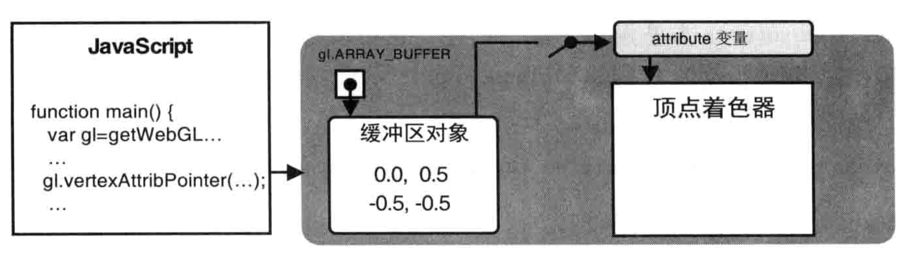

# 绘制和变换三角形

已经了解了如何获取`WebGL上下文`，清空`<canvas>`为2D/3D绘图作准备，探究了顶点着色器与片元着色器的功能与特征，以及使用着色器进行绘图的方法。

本章学习内容：
1. 三角形在三维图形学中的重要地位，以及WebGL如何绘制三角形
2. 使用多个三角形绘制其他类型的基本图形
3. 利用简单的方程对三角形做基本地变换，如移动、旋转和缩放
4. 利用矩阵简化变换

**三维模型的基本单位是三角形**

## 绘制多个点

上一章中的方式只能绘制一个点。对于那些由多个顶点组成的图形，比如三角形、矩形和立方体来说，我们需要一次性地将图形的顶点全部传出顶点着色器，然后才能把图形画出来。


WebGL提供了提供了一种很方便的机制，记缓冲区对象（buffer object），他可以一次性地向着色器传入多个顶点的数据。缓冲区对象是`WebGL`系统中的一块内存区域，
我们可以一次性地向缓冲区对象中填充大量的顶点数，然后将这些数据保存在其中供`顶点着色器`使用。

```js
const VSHADER_SOURCE =
    'attribute vec4 a_Position;\n' +
    'void main() {\n' +
        'gl_Position = a_Position;\n' +
        'gl_PointSize = 10.0;\n' +
    '}\n'
const FSHADER_SOURCE =
   ' void main() {\n'+
        'gl_FragColor = vec4(1.0, 1.0, 0.0,1.0);\n'+
    '}\n'


function main() {
    var canvas = document.getElementById('webgl')
    var gl = getWebGLContext(canvas)
    if(!gl) {
        console.error('Failed to get the rendering context for WebGL')
        return;
    }

    // 初始化着色器
    if(!initShaders(gl, VSHADER_SOURCE, FSHADER_SOURCE)) {
        console.error('Failed to initialize shaders.')
        return;
    }

    // 设置顶点着色器
    var n = initVertexBuffers(gl); // [!code ++]

    if(n < 0) {
        console.error('Failed to set the positions of the vertices')
        return;
    }

    // // 获取attribut变量的存储位置
    var a_Position = gl.getAttribLocation(gl.program, 'a_Position')
    //
    // var u_FragColor = gl.getUniformLocation(gl.program, 'u_FragColor')
    if(a_Position < 0) {
        console.error('Failed to get the storage location of a_Position')
        return;
    }
    //

    // 设置canvas背景色
    gl.clearColor(0.0,0.0,0.0,1.0)

    // 清空canvas
    gl.clear(gl.COLOR_BUFFER_BIT);

    // 绘制三个点
    gl.drawArrays(gl.POINTS, 0, 1) // [!code --]
    gl.drawArrays(gl.POINTS, 0, n) // [!code ++]


}

function initVertexBuffers(gl) { // [!code ++]
    var vertices = new Float32Array([ // [!code ++]
        0.0, 0.5, -0.5, -0.5, 0.5, -0.5 // [!code ++]
    ]) // [!code ++]
    var n = 3 // 点的个数 // [!code ++]

    // 创建缓冲区对象 // [!code ++]
    var vertexBuffer = gl.createBuffer(); // [!code ++]
    if(!vertexBuffer) { // [!code ++]
        console.error('Failed to create the buffer object') // [!code ++]
        return -1; // [!code ++]
    } // [!code ++]

    // 将缓冲区对象绑定到目标 // [!code ++]
    gl.bindBuffer(gl.ARRAY_BUFFER, vertexBuffer) // [!code ++]

    // 向缓冲区对象中写入数据 // [!code ++]
    gl.bufferData(gl.ARRAY_BUFFER, vertices, gl.STATIC_DRAW); // [!code ++]

    var a_Position = gl.getAttribLocation(gl.program, 'a_Position'); // [!code ++]

    // 将缓冲区对象分配给a_Position变量 // [!code ++]
    gl.vertexAttribPointer(a_Position, 2, gl.FLOAT, false, 0, 0) // [!code ++]

    // 连接a_Position变量与分配给它的缓冲对象 // [!code ++]
    gl.enableVertexAttribArray(a_Position) // [!code ++]
    return n // [!code ++]
}

```
流程：

1. 获取WebGL绘图上下文
2. 初始化着色器
3. 设置点的坐标信息
4. 设置`<canvas>`背景色
5. 清空`<canvas>`
6. 绘制


`initVertexBuffers()`函数的任务是创建顶点缓冲区对象，并将多个顶点的数据保存在缓冲区中，然后将缓冲区传入给顶点着色器。

`gl.drawArrays(gl.POINTS, 0, n)`, 这里的n为要画的顶点数，因为在`initVertexBuffers()`函数中利用缓冲区对象向顶点着色器传输了多个顶点数据，所以需要通过第3个参数告诉`gl.drawArrays()`函数需要绘制多少个顶点。


### 使用缓冲区对象

使用缓冲区对象需要遵循五个步骤：

1. 创建缓冲区对象（gl.createBuffer()）
2. 绑定缓冲区对象（gl.bindBuffer()）
3. 将数据写入缓冲区对象（gl.bufferData()）
4. 将缓冲区对象分配给一个attribute变量（gl.vertexAttribPointer()）
5. 开启attribute变量（gl.enableVertexAttribArray()）


#### 创建缓冲区对象 （gl.createBuffer()）
使用`gl.createBuffer()`方法来创建缓冲区对象


| 返回值   | 描述        |
|-------|-----------|
| 非null | 新创建的缓冲区对象 |
| null  | 创建缓冲区对象失败 |
| 错误    | 无         |

可以使用`gl.deleteBuffer(buffer)`函数，删除被`gl.createBuffer()`创建出来的缓冲区对象

| 参数     | 描述        |
|--------|-----------|
| buffer | 待删除的缓冲区对象 |
| 返回值    | 无         |
| 错误     | 无         |


#### 绑定缓冲区 （gl.bindBuffer()）

将创建好的缓冲区对象绑定到`WebGL`系统中以及存在的目标上。这个目标表示缓冲区对象的用途，这样`WebGL`才能够正确处理其中的内容。


gl.bindBuffer(target, buffer)

| 参数                      | 描述                                                         |
|-------------------------|------------------------------------------------------------|
| target                  |                                                            |
| gl.ARRAY_BUFFER         | 表示缓冲区对象中包含了顶点的数据                                           |
| gl.ELEMENT_ARRAY_BUFFER | 表示缓冲区对象中包含了顶点的索引值                                          |
| buffer                  | 指定之前由gl.createBuffer()返回的待绑定的缓冲区对象，如果指定为null，则禁用对target的绑定 |
| 返回值                     | 无                                                          |

| 错误           | 描述                           |
|--------------|------------------------------|
| INVALID_ENUM | target不是上述值之一，这时将保持原有的绑定情况不变 |


#### 向缓冲区对象中写入数据（gl.bufferData()）

开辟空间，并向缓冲区中写入数据。


gl.bufferData(gl.ARRAY_BUFFER, vertices, gl.STATIC_DRAW)

将第2个参数`vertices`中的数据写入了绑定到第1个参数gl.ARRAY_BUFFER上的缓冲对象。我们不能直接向缓冲对象区写入数据，而只能向“目标”写入数据，所以要向缓冲区写入数据，必须先绑定。

`gl.bufferData(target, data, usage)`

开辟存储空间，向绑定在`target`上的缓冲区对象写入数据`data`

| 参数              | 描述                                                                         |
|-----------------|----------------------------------------------------------------------------|
| target          | gl.ARRAY_BUFFER 或 gl.ELEMENT_ARRAY_BUFFER                                  |
| data            | 写入缓冲区对象的数据（类型化数组）                                                          |
| usage           | 表示程序将如何使用存储在缓冲区对象中的数据。该参数将帮助WebGL优化操作，但是就算传入错误的值，也不会终止程序（仅降低程序运行效率）        |
| gl.STATIC_DRAW  | 只会向缓冲区对象中写入一次数据，但需要绘制很多次；表示缓冲区的数据不会或几乎不会改变。在数据上传后，绘制操作会频繁使用这些数据，但不会对它们进行修改 |
| gl.STREAM_DRAW  | 只会向缓冲区对象中写入一次数据，然后绘制若干次；表示缓冲区的数据会快速改变，通常在每次绘制之前都会更新                        |
| gl.DYNAMIC_DRAW | 会向缓冲区对象中多次写入数据，并绘制很多次；表示缓冲区的数据会频繁改变，但不一定在每次绘制时都更新。适合在多个绘制调用之间修改数据的情况       |


### 类型化数组

`javascript`中常见的`Array`对象，是一种通用的类型，既可以存储数字，也可以存错字符串，而并没有对“大量元素都是同一类型”这种情况进行优化。为了解决这个问题，`WebGL`引入了类型化数组。

浏览器事先知道数组中的数据类型，所以处理起来更加有效率

WebGL使用的各种类型化数组

| 数组类型         | 每个元素所占字节数 | 描述（c语言中的数据类型）            |
|--------------|-----------|--------------------------|
| Int8Array    | 1         | 8位整型数（signed char）       |
| UInt8Array   | 1         | 8位无符号整型数（unsigned char）  |
| Int16Array   | 2         | 16位整型数（signed char）      |
| UInt16Array  | 2         | 16位无符号整型数（unsigned char） |
| Int32Array   | 4         | 32位整型数（signed char）      |
| UInt32Array  | 4         | 32位无符号整型数（unsigned char） |
| Float32Array | 4         | 单精度32位浮点数（float）         |
| Float64Array | 8         | 双精度64位符点数（double）        |

类型化数组的方法、属性和常量

| 方法、属性和常量           | 描述                           |
|--------------------|------------------------------|
| get(index)         | 获取第index个元素值                 |
| set(index, value)  | 设置第index个元素的值为value          |
| set(array, offset) | 从第offset个元素开始将数组array中的值填充进去 |
| length             | 数组的长度                        |
| BYTES_PER_ELEMENT  | 数组中每个元素所占的字节数                |


**创建类型化数组的唯一方法就是使用`new`运算符**

```js
var vertices = new Float32Array([
    0.0, 0.5, -0.5, -0.5, 0.5, -0.5
])

// 指定数组元素的个数来创建一个空的类型化数组
var vertices = new Float32Array(4)
```

**以上就是建立和使用缓冲区的前三个步骤（在WebGL系统中创建缓冲区， 绑定缓冲区对象到目标，向缓冲区对象中写入数据）**


### 将缓冲区对象分配给attribute变量（gl.vertexAttribPointer()）

可以使用`gl.vertexAttrib[1234]f系列函数为attribute变量分配值。但是，这些方法一次只能向attribute变量分配一个值。而现在，需要将整个数组中的所有值，一次性第分配给一个attribute变量。

gl.vertexAttribPointer()方法解决了这个问题，他可以将整个缓冲区对象分配个attribute变量。

`gl.vertexAttribPointer(location, size, type, normalized, stride, offset)`

将绑定到`gl.ARRAY_BUFFER`的缓冲区对象分配给由`location`指定的`attribute`变量

| 参数                | 描述                                                                                     |
|-------------------|----------------------------------------------------------------------------------------|
| location          | 指定待分配attribute变量的存储位置                                                                  |
| size              | 指定缓冲区中每个顶点的分量个数（1到4）。若size比attribute变量需要的分量数小，缺失分量将按照与gl.vertexAttrib[1234]f()相同的规则不全。 |
| type              | 用以下类型之一来指定数据格式                                                                         |
| gl.UNSIGNED_BYTE  | 无符号字节，Uint8Array                                                                       |
| gl.SHORT          | 短整型， Int16Array                                                                        |
| gl.UNSIGNED_SHORT | 无符号短整型， Uint16Array                                                                    |
| gl.INT            | 整型，Int32Array                                                                          |
| gl.UNSIGNED_INT   | 无符号整型， Unit32Array                                                                     |
| gl.FLOAT          | 符点型，Float32Array                                                                       |
| normalize         | 传入true或false，表明是否将非符点型的数据归一化到[0,1]或[-1,1]区间                                            |
| stride            | 指定相邻两个顶点间的字节数，默认为0                                                                     |
| offset            | 指定缓冲区对象中的偏移量（以字节为单位），即attribute变量从缓冲区中的何处开始存储。如果是从起始位置开始的，offset设为0                    |
| 返回值               | 无                                                                                      |

| 错误                | 描述                                                     |
|-------------------|--------------------------------------------------------|
| INVALID_OPERATION | 不存在当前程序                                                |
| INVALID_VALUE     | location大于等于attribute变量的最大数目（默认为8）。或者stride或offset是负值› |

