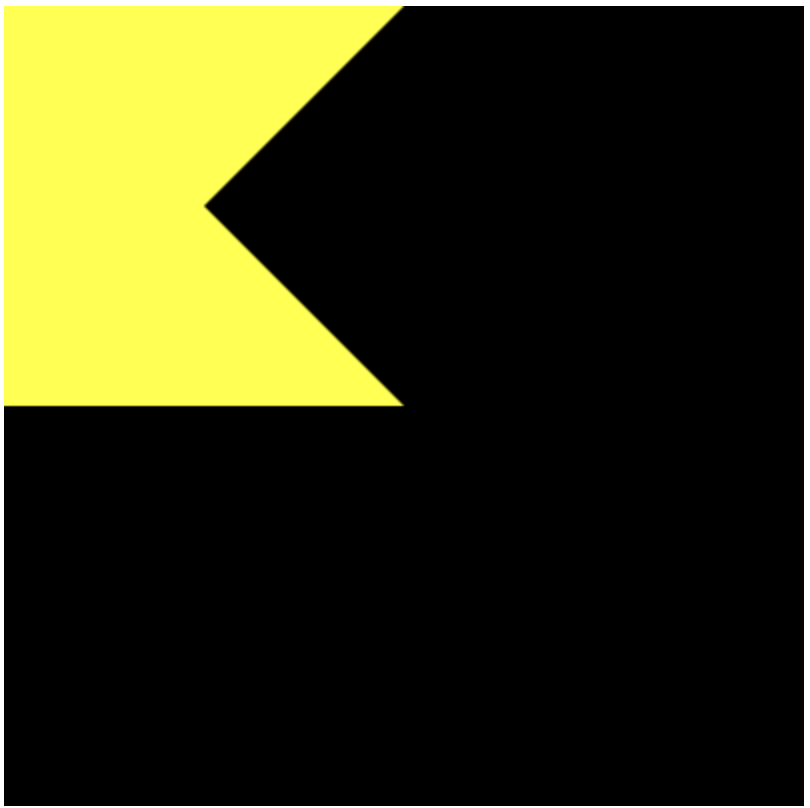
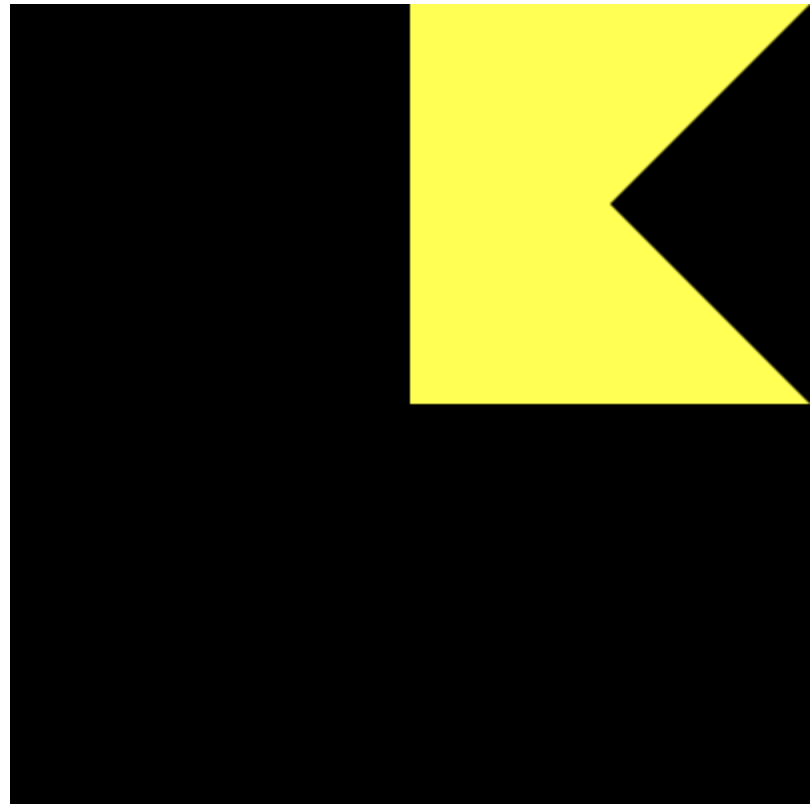
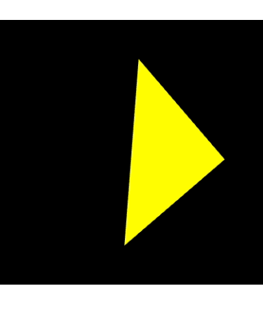

# 高级变换与动画基础

1. 学习使用一个矩阵变换库，该库封装了矩阵运算的数学细节
2. 快速上手使用矩阵库，对图形进行复合变换
3. 在该矩阵库的帮助下，实现简单的动画效果

## 平移 然后旋转

平移、旋转、缩放等变换操作都可以用一个 4x4的矩阵表示。使用矩阵库可以简化编程（手动计算每个矩阵很耗费时间）

`Matrix4`对象表示一个4x4的矩阵。该对象内部使用类型化数组`Float32Array`来存储矩阵的元素

**WebGL和OpenGL一样，矩阵元素是按列主序存储在数组中的**

`mat4` 和 `vec4` 的区别：

1. 定义和结构
    - mat4:
        - 表示一个**4x4的矩阵**，用于进行各种线性变换，如平移、旋转、缩放和透视投影
        - 包含16个元素（4行4列），通常以列优先的方式储存
        - 如：
        ```smalltalk
        | m00 m01 m02 m03 |
        | m10 m11 m12 m13 |
        | m20 m21 m22 m23 |
        | m30 m31 m32 m33 |
        ```
    - vec4:
        - 表示一个**4维向量**，通常用于表示点、方向或颜色
        - 包含4个元素，通常是x，y，z，w
        - 如：
        ```
        | x |
        | y |
        | z |
        | w |
        ```
2. 用途
    - mat4
        - 用于处理变换和投影。在图形渲染中，模型变换、视图变换和投影变换通常都会用到mat4
        - 可以与vec4进行相乘，以应用变换
        ```glsl
        vec4 transformedPositon = modelMatrix * originalPosition
        ```
    - vec4
        - 用于表示物体的位置、颜色或光照等特征。
            - 位置：在3D空间中的点（通常w分量用于齐次坐标）
            - 颜色：RGBA颜色值（红、绿、蓝、透明度）
        - 也可以与其他向量进行运算
            ```glsl
            vec4 color = vec4(1.0, 0.5, 0,0, 1.0)
            ```
3. 运算
    - 矩阵和向量的运算：
      mat4和vec4可以结合使用，通过矩阵和向量的乘法进行变换。矩阵乘法会改变向量的坐标，应用变换效果
    - 向量运算：
      vec4之间可以进行加减、点积、叉积等运算

**mat4是一种用于表示和操作4x4矩阵的类型，主要用于变换**
**vec4是一种表示4维向量的类型，主要用于表示颜色、位置和方向**


**`gl.uniformMatrix4fv(location, transpose, array)`**

将*array*表示的4x4矩阵分配给由`location`指定的`uniform`变量

| 参数                | 描述                           |
|-------------------|------------------------------|
| location          | uniform变量的存储位置               |
| Transpose         | 在WebGL中必须指定为false            |
| array             | 带传输的类型化数组，4x4矩阵按列主序存储在其中     |
| 返回值               | 无                            |
| 错误                | 描述                           |
| INVALID_OPERATION | 不存在当前程序对象                    |
| INVALID_VALUE     | transpose不为false，或者数组的长度小于16 |

```js
const VSHADER_SOURCE =
    'attribute vec4 a_Position;\n' +
    'uniform float u_CosB, u_SinB;\n' + // [!code --]
    'uniform mat4 u_xformMatrix;\n' + // [!code ++]
    'void main() {\n' +
    'gl_Position.x = a_Position.x * u_CosB - a_Position.y * u_SinB;\n' + // [!code --]
    'gl_Position.y = a_Position.x * u_SinB + a_Position.y * u_CosB;\n' + // [!code --]
    'gl_Position.z = a_Position.z;\n' + // [!code --]
    'gl_Position.w = 1.0;\n' + // [!code --]
    'gl_Position = u_xformMatrix * a_Position;\n' + // [!code ++]
    '}\n'
const FSHADER_SOURCE =
    ' void main() {\n' +
    'gl_FragColor = vec4(1.0, 1.0, 0.0,1.0);\n' +
    '}\n'


var ANGLE = 90.0

function main() {
    var canvas = document.getElementById('webgl')
    var gl = getWebGLContext(canvas)
    if (!gl) {
        console.error('Failed to get the rendering context for WebGL')
        return;
    }

    // 初始化着色器
    if (!initShaders(gl, VSHADER_SOURCE, FSHADER_SOURCE)) {
        console.error('Failed to initialize shaders.')
        return;
    }

    // 设置顶点着色器
    var n = initVertexBuffers(gl);

    if (n < 0) {
        console.error('Failed to set the positions of the vertices')
        return;
    }

    var radian = Math.PI * ANGLE / 180.0; // [!code --]
    var conB = Math.cos(radian); // [!code --]
    var sinB = Math.sin(radian); // [!code --]

    var u_CosB = gl.getUniformLocation(gl.program, 'u_CosB'); // [!code --]
    var u_SinB = gl.getUniformLocation(gl.program, 'u_SinB'); // [!code --]

    gl.uniform1f(u_CosB, conB) // [!code --]
    gl.uniform1f(u_SinB, sinB) // [!code --]

    var u_xformMatrix = gl.getUniformLocation(gl.program, 'u_xformMatrix') // [!code ++]

    var xformMatrix = new Matrix4() // [!code ++]
    xformMatrix.setRotate(ANGLE, 0, 0, 1) // [!code ++]

    gl.uniformMatrix4fv(u_xformMatrix, false, xformMatrix.elements) // [!code ++]


    // // 获取attribut变量的存储位置
    var a_Position = gl.getAttribLocation(gl.program, 'a_Position')
    //
    // var u_FragColor = gl.getUniformLocation(gl.program, 'u_FragColor')
    if (a_Position < 0) {
        console.error('Failed to get the storage location of a_Position')
        return;
    }

    // 设置canvas背景色
    gl.clearColor(0.0, 0.0, 0.0, 1.0)

    // 清空canvas
    gl.clear(gl.COLOR_BUFFER_BIT);

    // 绘制三个点
    gl.drawArrays(gl.TRIANGLE_FAN, 0, n)

}

function initVertexBuffers(gl) {
    var vertices = new Float32Array([
        -0.5, 0.5, -0.5, -0.5, 0.5, 0.5, 0.5, -0.5
    ])
    var n = 4 // 点的个数

    // 创建缓冲区对象
    var vertexBuffer = gl.createBuffer();
    if (!vertexBuffer) {
        console.error('Failed to create the buffer object')
        return -1;
    }

    // 将缓冲区对象绑定到目标
    gl.bindBuffer(gl.ARRAY_BUFFER, vertexBuffer)

    // 向缓冲区对象中写入数据
    gl.bufferData(gl.ARRAY_BUFFER, vertices, gl.STATIC_DRAW);

    var a_Position = gl.getAttribLocation(gl.program, 'a_Position');

    // 将缓冲区对象分配给a_Position变量
    gl.vertexAttribPointer(a_Position, 2, gl.FLOAT, false, 0, 0)

    // 连接a_Position变量与分配给它的缓冲对象
    gl.enableVertexAttribArray(a_Position)
    return n
}

```

`Matrix4` 对象所支持的方法和属性

| 方法和属性名称                        | 描述                                                                                        |
|--------------------------------|-------------------------------------------------------------------------------------------|
| Matrix4.setIdentity()          | 将Matrix4实例初始化为单位阵                                                                         |
| Matrix4.setTranslate(x,y,z)    | 将Matrix4实例设置为平移变换矩阵，在x轴上平移的距离为x，在y轴<br/>上平移的距离为y，在z轴上平移的距离为在                              |
| Matrix4.setRotate(angle,x,y,z) | 将Matrix4实例设置为旋转变换矩阵，旋转的角度为angle，旋转轴为（x,y,z)。<br/>旋转轴（x,y,z）无须归一化                          |
| Matrix4.setScale(x,y,z)        | 将Matrix4实例设置为缩放变换矩阵，在三个轴上的缩放因子分别为x，y和z                                                    |
| Matrix4.translate(x,y,z)       | 将Matrix4实例乘以一个平移变换矩阵（该平移矩阵在x轴上平移的距离为x，在y轴<br/>上平移的距离为y，在z轴上平移的距离为z），所得的结果还储存在Matrix4中     |
| Matrix4.rotate(angle,x,y,z)    | 将Matrix4实例乘以一个旋转变换矩阵（该旋转矩阵旋转的角度为angle，旋转轴为<br/>（x，y，z）。旋转轴（x，y，z）无须归一化），所得的结果还存储在Matrix4中 |
| Matrix4.scale(x,y,z)           | 将Matrix4实例乘以一个缩放变换矩阵（该缩放矩阵在三个轴上的缩放因子分别为x，y和z），所得的结果还储存在Matrix4中                           |
| Matrix4.set(m)                 | 将Matrix4实例设置为m，m必须也是一个Matrix4实例                                                           |
| Matrix4.elements               | 类型化数组（Float32Array）包含了Matrix4 实例的矩阵元素                                                     |

**单位阵在矩阵乘法中的行为，就像数字1在乘法中的行为一样。将一个矩阵乘以单位阵，得到的结果和原矩阵完全相同。在单位阵中，对角线上的元素为1.0，其余的元素为0.0**

包含set前缀的方法会根据参数计算处变换矩阵，然后将变换矩阵写入到自身中；不含set前缀的方法，会先根据参数计算出变换矩阵，然后将自身与刚刚计算得到的变换矩阵相乘，然后把最终得到的结果再写入到Matrix4对象中

## 复合变换
平移 旋转

### 先平移后旋转

平移后的坐标 = 平移矩阵 * 原始坐标

旋转后的坐标 = 旋转矩阵 * 平移后的坐标

即：

平移后旋转的坐标 = 旋转矩阵 * （平移矩阵 * 原始坐标） = （旋转矩阵 * 平移矩阵） * 原始坐标

在`javascript`中,计算 `旋转矩阵` * `平移矩阵`，将得到的矩阵传入顶点着色器。这样就可以把多个变换复合起来。一个模型可能经过了多次变换
将这些变换全部复合成一个等效的变换，就得到了`模型变换(model transformation)` 或称`建模变换(modeling transformation)`,相应地，模型变换
的矩阵称为`模型矩阵(model matrix)`

```js
const VSHADER_SOURCE =
    'attribute vec4 a_Position;\n' +
    'uniform mat4 u_xformMatrix;\n' + // [!code --]
    'uniform mat4 u_ModelMatrix;\n' + // [!code ++]
    'void main() {\n' +
    'gl_Position = u_xformMatrix * a_Position;\n' + // [!code --]
    'gl_Position = u_ModelMatrix * a_Position;\n' + // [!code ++]
    // 'gl_PointSize = 10.0;\n' +
    '}\n'
const FSHADER_SOURCE =
    ' void main() {\n' +
    'gl_FragColor = vec4(1.0, 1.0, 0.0,1.0);\n' +
    '}\n'


var ANGLE = 90.0

function main() {
    var canvas = document.getElementById('webgl')
    var gl = getWebGLContext(canvas)
    if (!gl) {
        console.error('Failed to get the rendering context for WebGL')
        return;
    }

    // 初始化着色器
    if (!initShaders(gl, VSHADER_SOURCE, FSHADER_SOURCE)) {
        console.error('Failed to initialize shaders.')
        return;
    }

    // 设置顶点着色器
    var n = initVertexBuffers(gl);

    if (n < 0) {
        console.error('Failed to set the positions of the vertices')
        return;
    }

    var u_xformMatrix = gl.getUniformLocation(gl.program, 'u_xformMatrix') // [!code --]
    
    var u_ModelMatrix = gl.getUniformLocation(gl.program, 'u_ModelMatrix') // [!code ++]

    var modelMatrix = new Matrix4()

    xformMatrix.setRotate(ANGLE, 0, 0, 1) // [!code --]

    gl.uniformMatrix4fv(u_xformMatrix, false, xformMatrix.elements) // [!code --]

    var Tx = 0.5 // [!code ++]


    modelMatrix.setRotate(ANGLE, 0, 0, 1) // [!code ++]
    modelMatrix.translate(Tx, 0.5, 1) // [!code ++]

    gl.uniformMatrix4fv(u_ModelMatrix, false, modelMatrix.elements) // [!code ++]


    // // 获取attribut变量的存储位置
    var a_Position = gl.getAttribLocation(gl.program, 'a_Position')
    //
    // var u_FragColor = gl.getUniformLocation(gl.program, 'u_FragColor')
    if (a_Position < 0) {
        console.error('Failed to get the storage location of a_Position')
        return;
    }
    //
    // canvas.onmousedown = function (ev) {click(ev, gl, canvas, a_Position, u_FragColor)}


    // gl.vertexAttrib3f(a_Position, 0.0, 0.0, 0.0)

    // 设置canvas背景色
    gl.clearColor(0.0, 0.0, 0.0, 1.0)

    // 清空canvas
    gl.clear(gl.COLOR_BUFFER_BIT);

    // 绘制三个点
    gl.drawArrays(gl.TRIANGLE_FAN, 0, n)

}

function initVertexBuffers(gl) {
    var vertices = new Float32Array([
        -0.5, 0.5, -0.5, -0.5, 0.5, 0.5, 0.5, -0.5
    ])
    var n = 4 // 点的个数

    // 创建缓冲区对象
    var vertexBuffer = gl.createBuffer();
    if (!vertexBuffer) {
        console.error('Failed to create the buffer object')
        return -1;
    }

    // 将缓冲区对象绑定到目标
    gl.bindBuffer(gl.ARRAY_BUFFER, vertexBuffer)

    // 向缓冲区对象中写入数据
    gl.bufferData(gl.ARRAY_BUFFER, vertices, gl.STATIC_DRAW);

    var a_Position = gl.getAttribLocation(gl.program, 'a_Position');

    // 将缓冲区对象分配给a_Position变量
    gl.vertexAttribPointer(a_Position, 2, gl.FLOAT, false, 0, 0)

    // 连接a_Position变量与分配给它的缓冲对象
    gl.enableVertexAttribArray(a_Position)
    return n
}
```

modelMatrix.setRotate(ANGLE, 0, 0, 1) // 设置模型矩阵为旋转矩阵
modelMatrix.translate(Tx, 0, 0) // 将模型矩阵乘以平移矩阵

**先平移后旋转的顺序与构造模型矩阵 旋转矩阵 * 平移矩阵 的顺序是相反的，这是因为变换矩阵最终要与三角形的三个顶点的原始坐标矢量相乘**


**平移旋转**

```js
// 平移旋转
    modelMatrix.setRotate(ANGLE, 0, 0, 1)
    modelMatrix.translate(Tx, 0.5, 1)
```




**旋转平移**
```js
// 旋转平移
    modelMatrix.setTranslate(Tx, 0.5, 1)
    modelMatrix.rotate(ANGLE, 0, 0, 1)
```




**平移个旋转的次序不一样 导致的结果页不一样**


## 动画

将矩阵变换运用到动画图形中去


### 动画基础

为了让一个三角形转动起来，需要做到是：不断擦除和重绘三角形，并且在每次重绘时轻微地改变角度


```js
const VSHADER_SOURCE =
    'attribute vec4 a_Position;\n' +
    'uniform mat4 u_ModelMatrix;\n' +
    'void main() {\n' +
    'gl_Position = u_ModelMatrix * a_Position;\n' +
    // 'gl_PointSize = 10.0;\n' +
    '}\n'
const FSHADER_SOURCE =
    ' void main() {\n' +
    'gl_FragColor = vec4(1.0, 1.0, 0.0,1.0);\n' +
    '}\n'


var ANGLE = 90.0

var ANGLE_STEP = 45.0 // [!code ++]

function main() {
    var canvas = document.getElementById('webgl')
    var gl = getWebGLContext(canvas)
    if (!gl) {
        console.error('Failed to get the rendering context for WebGL')
        return;
    }

    // 初始化着色器
    if (!initShaders(gl, VSHADER_SOURCE, FSHADER_SOURCE)) {
        console.error('Failed to initialize shaders.')
        return;
    }

    // 设置顶点着色器
    var n = initVertexBuffers(gl);


    if (n < 0) {
        console.error('Failed to set the positions of the vertices')
        return;
    }

    gl.clearColor(0.0, 0.0, 0.0, 1.0) // [!code ++]

    var u_ModelMatrix = gl.getUniformLocation(gl.program, 'u_ModelMatrix')

    var currentAngle = 0.0 // [!code ++]

    var modelMatrix = new Matrix4()

    var tick = function () { // [!code ++]
        currentAngle = animate(currentAngle) // 更新旋转角 // [!code ++]
        draw(gl, n, currentAngle, modelMatrix, u_ModelMatrix) // [!code ++]

        requestAnimationFrame(tick) // [!code ++]

    } // [!code ++]
    tick() // [!code ++]
    var Tx = 0.5

    // 平移旋转
    modelMatrix.setRotate(ANGLE, 0, 0, 1)
    modelMatrix.translate(Tx, 0.5, 1)

    // 旋转平移
    modelMatrix.setTranslate(Tx, 0.5, 1)
    modelMatrix.rotate(ANGLE, 0, 0, 1)


    gl.uniformMatrix4fv(u_ModelMatrix, false, modelMatrix.elements)


    // 获取attribut变量的存储位置
    var a_Position = gl.getAttribLocation(gl.program, 'a_Position')
    //
    // var u_FragColor = gl.getUniformLocation(gl.program, 'u_FragColor')
    if (a_Position < 0) {
        console.error('Failed to get the storage location of a_Position')
        return;
    }

    canvas.onmousedown = function (ev) {click(ev, gl, canvas, a_Position, u_FragColor)}


    gl.vertexAttrib3f(a_Position, 0.0, 0.0, 0.0)

    // 设置canvas背景色
    gl.clearColor(0.0, 0.0, 0.0, 1.0)

    // 清空canvas
    gl.clear(gl.COLOR_BUFFER_BIT);

    // 绘制三个点
    gl.drawArrays(gl.TRIANGLES, 0, n)

}

function draw(gl, n, currentAngle, modelMatrix, u_ModelMatrix) { // [!code ++]
    // 设置旋转矩阵 // [!code ++]
    modelMatrix.setRotate(currentAngle, 0, 0, 1) // [!code ++]
    // 将旋转矩阵传输给顶点着色器 // [!code ++]
    gl.uniformMatrix4fv(u_ModelMatrix, false, modelMatrix.elements) // [!code ++]

    // 清除 canvas // [!code ++]
    gl.clear(gl.COLOR_BUFFER_BIT) // [!code ++]

    // 绘制三角形 // [!code ++]

    gl.drawArrays(gl.TRIANGLES, 0, n) // [!code ++]
} // [!code ++]

var g_last = Date.now() // [!code ++]

function animate(angle) { // [!code ++]
    var now = Date.now() // [!code ++]

    var elapsed = now - g_last; // [!code ++]

    g_last = now // [!code ++]

    var newAngle = angle + (ANGLE_STEP * elapsed) / 1000.0 // [!code ++]

    return newAngle %= 360 // [!code ++]
} // [!code ++]

function initVertexBuffers(gl) {
    var vertices = new Float32Array([
        -0.5, 0.5, -0.5, -0.5, 0.5, 0.5, 0.5, -0.5
    ])
    var n = 4 // 点的个数

    // 创建缓冲区对象
    var vertexBuffer = gl.createBuffer();
    if (!vertexBuffer) {
        console.error('Failed to create the buffer object')
        return -1;
    }

    // 将缓冲区对象绑定到目标
    gl.bindBuffer(gl.ARRAY_BUFFER, vertexBuffer)

    // 向缓冲区对象中写入数据
    gl.bufferData(gl.ARRAY_BUFFER, vertices, gl.STATIC_DRAW);

    var a_Position = gl.getAttribLocation(gl.program, 'a_Position');

    // 将缓冲区对象分配给a_Position变量
    gl.vertexAttribPointer(a_Position, 2, gl.FLOAT, false, 0, 0)

    // 连接a_Position变量与分配给它的缓冲对象
    gl.enableVertexAttribArray(a_Position)
    return n
}

```



**为了是三角形动起来，需要反复进行两步操作**

1. 更新三角形的当前角度 currentTriangle
2. 调用绘制函数，根据当前角度绘制三角形

### 请求再次被调用(requestAnimationFrame())

如果想要Javascript重复执行某个特定的任务，可以使用`setInterval()`函数

`setInterval(func, delay)`
| 参数    | 描述             |
|-------|----------------|
| func  | 指定需要多次调用的函数    |
| delay | 指定时间间隔（以毫秒为单位） |
| 返回值   | Time id        |

现代浏览器都支持多个标签页，每个标签页具有单独的Javascript运行环境，但是自`setInterval()`函数诞生之初，浏览器还没有开始支持多标签页。所以在现代浏览器中，
不管是标签页是否被激活，其中的`setInterval()`函数都会反复调用func，如果标签页比较多，就会增加浏览器的负荷(现在浏览器有优化了，失活时间太长，它调用的次数会被减少)。所有后来，浏览器又引入了`requestAnimation()`方法，
该方法只有当标签页处于激活状态时才会生效。`requestAnimationFrame()`是新引入的方法。

**requestAnimationFrame()**
当调用`requestAnimationFrame()`函数时，即是在告诉浏览器在将来的某个时间调用作为第一个参数的函数。

`requestAnimationFrame(func)`

| 参数   | 描述                                        |
|------|-------------------------------------------|
| func | 指定将来某个时刻调用的函数。函数将会接收一个time参数，用来表示此次调用的时间戳 |
| 返回值  | Request id                                |


这个函数的好处是可以避免在未激活的标签页上运行动画。

但是无法指定重复调用的间隔；函数func会在浏览器需要网页的某个元素重绘时被调用。此外还需要注意，在浏览器成功地调用了一次func后，想要再次被调用，就必须要再次发起请求，因为前一次请求已经结束。（也就是说，requestAnimationFrame更像setTimeOut而不是setInterval，
不会因为你发起一次请求，就会不停地循环调用func）。在调用函数后，需要发出下次调用的请求，因为上一次关于调用的请求在调用完成之后就结束了使命。

`cancelAnimationFrame()`

取消由`requestAnimationFrame()`发起的请求

| 参数        | 描述                            |
|-----------|-------------------------------|
| requestID | 指定requestAnimationFrame()的返回值 |
| 返回值       | 无                             |
