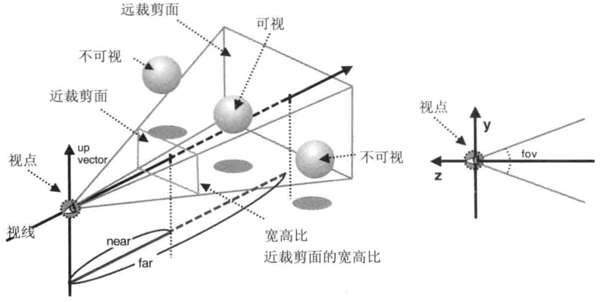

# 进入三维世界

- 以用户视角而进入三维世界
- 控制三维可视空间
- 裁剪
- 处理物体的前后关系
- 绘制三维的立方体

## 视点和视线

- 观察方向，即观察者自己在什么位置，在看场景的哪一部分
- 可视距离，即观察者能够看多远

将观察者所处的位置称为**视点**，从视点出发沿着观察方向的射线称作**视线**。

## 视点、观察目标点和上方向

为了确定观察者的状态，需要获取两项信息：**视点**，即观察者的位置；**观察目标点**，即被观察目标所在的点，它可以用来确定视线。
因为需要把观察到的景象绘制到屏幕上，还需要知道**上方向**。


- 视点：观察者所在的三维空间中位置，视线的起点。
- 观察目标点：被观察目标所在的点。视线从视点出发，穿过观察目标点并继续延申。注意，观察目标点是一个点，而不是视线方向，只有同时知道观察目标点和视点，才能算出视线方向。
- 上方向：最终绘制在屏幕上的影像中的向上的方向。试想，如果仅仅确定了视点和观察点，观察者还是可能以视线为轴旋转的（如图，头部偏移会导致观察到的场景也偏移了）。所以，为了将观察者固定住，还需要指定上方向。上方向是具有3个分量的矢量。


在WebGL中，我们可以用上述三个矢量创建一个**视图矩阵**，然后将该矩阵传给顶点着色器。视图矩阵可以表示观察者的状态，含有观察者的视点、观察目标点、上方向等信息。之所以被称为视图矩阵，是因为它最终影响了显示在屏幕上的视图，也就是观察者观察到的场景。

**Matrix4.setLookAt(eyeX，eyeY，eyeZ，atX，atY，atZ，upX，upY，upZ)**

| 参数             | 描述                                         |
|----------------|--------------------------------------------|
| eyeX，eyeY，eyeZ | 指定视点                                       |
| atX，atY，atZ    | 指定观察点                                      |
| upX，upY，upZ    | 指定上方向，如果上方向是Y轴正方向，那么（upX，upY，upZ）就是（0，1，0） |

在WebGL中，观察者的默认状态应该是这样的：

- 视点位于坐标系统原点（0，0，0）
- 视线为Z轴负方向，观察点为（0，0，-1），上方向为Y轴正方向，即（0，1，0）

```glsl
var initialViewMatrix = new Matrix4()

initialViewMatrix.setLookAt(0,0,0,0,0,-1,0,1,0)
```

LookAtTriangle.js

```js
const VSHADER_SOURCE =
    'attribute vec4 a_Position;\n' +
    'attribute vec4 a_Color;\n' +
    'uniform mat4 u_ViewMatrix;\n' +
    'varying vec4 v_Color;\n' +
    'void main(){\n' +
    'gl_Position = u_ViewMatrix * a_Position;\n' +
    'v_Color = a_Color;\n' +
    '}\n'

const FSHADER_SOURCE =
    '#ifdef GL_ES\n'+
    'precision mediump float;\n' +
    '#endif\n' +
    'varying vec4 v_Color;\n' +
    'void main(){\n' +
    'gl_FragColor = v_Color;\n' +
    '}\n'


function main() {
    const canvas = document.querySelector('canvas');
    const gl = canvas.getContext('webgl');
    if(!gl){
        console.error('Unable to initialize WebGL!');
        return;
    }

    if(!initShaders(gl, VSHADER_SOURCE, FSHADER_SOURCE)) {
        console.error('Failed to initialize shaders.')
    }


    const n = initVertexBuffers(gl);

    if (n < 0) {
        console.error('Failed to initialize shaders.')
    }
    
    // 获取 u_ViewMatrix 变量
    const u_ViewMatrix = gl.getUniformLocation(gl.program, 'u_ViewMatrix')
    // 设置视点 视线 上方向
    const viewMatrix = new Matrix4()
    viewMatrix.setLookAt(0.20, 0.25,0.25, 0,0,0,0,1,0)


    // 将视图矩阵 传给u_ViewMatrix 变量
    gl.uniformMatrix4fv(u_ViewMatrix,false, viewMatrix.elements)
    
    gl.clearColor(0.0, 0.0, 0.0, 1.0)

    gl.clear(gl.COLOR_BUFFER_BIT)
    gl.drawArrays(gl.TRIANGLE_STRIP, 0, n)
}

function initVertexBuffers(gl) {
    const verticesColors = new Float32Array([
        0.0, 0.5, -0.4, 0.4, 1.0, 0.4,
        -0.5, -0.5, -0.4, 0.4, 1.0, 0.4,
        0.5, -0.5, -0.4, 1.0, 0.4, 0.4,

        0.5, 0.4, -0.2, 1.0, 0.4, 0.4,
        -0.5, 0.4, -0.2, 1.0, 1.0, 0.4,
        0.0, -0.6, -0.2, 1.0, 1.0, 0.4,

        0.0, 0.5, 0.0, 0.4, 0.4, 1.0,
        -0.5, -0.5, 0.0, 0.4, 0.4, 1.0,
        0.5, -0.5, 0.0, 1.0, 0.4, 0.4
    ])
    const n = 9;
    
    // 创建缓冲区对象
    const vertexColorbuffer = gl.createBuffer();
    // 绑定缓冲区对象
    gl.bindBuffer(gl.ARRAY_BUFFER, vertexColorbuffer)
    // 给缓冲区对象绑定数据
    gl.bufferData(gl.ARRAY_BUFFER, verticesColors, gl.STATIC_DRAW);
    
    // 获取类型化数组中的每个元素所占用的字节数
    const size = verticesColors.BYTES_PER_ELEMENT
    
    // 获取 a_Position 变量
    const a_Position = gl.getAttribLocation(gl.program, 'a_Position')
    // 将缓冲区对象分配给变量
    gl.vertexAttribPointer(a_Position, 3, gl.FLOAT, false, size * 6, 0);
    // 开启变量 方便顶点着色器访问缓冲区内的数据
    gl.enableVertexAttribArray(a_Position)

    // 获取变量
    const a_Color = gl.getAttribLocation(gl.program, 'a_Color');
    // 将缓冲区对象分配给变量
    gl.vertexAttribPointer(a_Color, 3, gl.FLOAT, false, size * 6, size * 3);
    // 开启变量
    gl.enableVertexAttribArray(a_Color);
    // 返回 点数
    return n

}
```


**注意：**
上面绘制的图形为`gl.drawArrays(gl.TRIANGLE_STRIP, 0, n)`

下面绘制的图形为`gl.drawArrays(gl.TRIANGLES, 0, n)`


## 从指定视点观察旋转后的三角形

需要两个矩阵，一个是旋转矩阵，一个是视图矩阵。

矩阵乘以顶点坐标，得到的结果是顶点经过矩阵变换后的新坐标。用旋转矩阵乘以顶点坐标，得到旋转后的顶点坐标。

要想要图形旋转，就需要旋转矩阵乘以旋转前的顶点坐标。

<旋转后的顶点坐标> = <旋转矩阵> x <原始顶点坐标>

<从视点看上去 的旋转顶点坐标> = <视图矩阵> x <旋转矩阵> x <原始顶点坐标>

除了旋转矩阵外，还可以使用平移、缩放等基本变换矩阵或者他们的组合，这时矩阵被称为**模型矩阵**
可以写成：

<视图矩阵> x <模型矩阵> x <原始顶点坐标>

```js
const VSHADER_SOURCE =
    'attribute vec4 a_Position;\n' +
    'attribute vec4 a_Color;\n' +
    'uniform mat4 u_ViewMatrix;\n' +
    'uniform mat4 u_ModelMatrix;\n' +
    'varying vec4 v_Color;\n' +
    'void main(){\n' +
    'gl_Position = u_ViewMatrix * u_ModelMatrix * a_Position;\n' +
    'v_Color = a_Color;\n' +
    '}\n'

const FSHADER_SOURCE =
    '#ifdef GL_ES\n' +
    'precision mediump float;\n' +
    '#endif\n' +
    'varying vec4 v_Color;\n' +
    'void main(){\n' +
    'gl_FragColor = v_Color;\n' +
    '}\n'

function main() {
    const canvas = document.querySelector('canvas')
    const gl = canvas.getContext('webgl')

    if(!gl) {
        console.error('Unable to initialize WebGL.')
        return
    }

    if(!initShaders(gl, VSHADER_SOURCE,FSHADER_SOURCE)) {
        console.error('Failed to initialize shaders.')
    }

    const n = initVertexBuffers(gl);

    if(n < 0) {
        console.error('Faild to initialize shaders.')
    }

    draw(gl,n)
}

function initVertexBuffers(gl) {
    const verticesColors = new Float32Array([
        // 最后边绿色三角形
        0.0, 0.5, -0.4, 0.4, 1.0, 0.4,
        -0.5, -0.5, -0.4, 0.4, 1.0, 0.4,
        0.5, -0.5, -0.4, 1.0, 0.4, 0.4,

        // 中间的黄色三角形
        0.5, 0.4, -0.2, 1.0, 0.4, 0.4,
        -0.5, 0.4, -0.2, 1.0, 1.0, 0.4,
        0.0, -0.6, -0.2, 1.0, 1.0, 0.4,

        // 最前边的蓝色山角形
        0.0, 0.5, 0.0, 0.4, 0.4, 1.0,
        -0.5, -0.5, 0.0, 0.4, 0.4, 1.0,
        0.5, -0.5, 0.0, 1.0, 0.4, 0.4,
    ])
    const n = 9
    const size = verticesColors.BYTES_PER_ELEMENT

    // 创建缓冲区
    const vertexColorBuffer = gl.createBuffer()
    // 绑定缓冲区
    gl.bindBuffer(gl.ARRAY_BUFFER, vertexColorBuffer)
    // 向缓冲区写入数据
    gl.bufferData(gl.ARRAY_BUFFER, verticesColors, gl.STATIC_DRAW)

    // 获取attribute变量
    // const a_Position = gl.getAttribLocation(gl.program, 'a_Position')
    const a_Position = gl.getAttribLocation(gl.program, 'a_Position')
    // 将缓冲区数据分配给变量
    gl.vertexAttribPointer(a_Position, 3, gl.FLOAT, false, size * 6, 0)
    // 开启变量 方便着色器访问缓冲区内的数据
    gl.enableVertexAttribArray(a_Position)

    const a_Color = gl.getAttribLocation(gl.program, 'a_Color')
    gl.vertexAttribPointer(a_Color, 3, gl.FLOAT, false, size * 6, size*3)
    gl.enableVertexAttribArray(a_Color)

    return n
}

function draw(gl,n) {
    const u_ViewMatrix = gl.getUniformLocation(gl.program, 'u_ViewMatrix')
    const u_ModelMatrix = gl.getUniformLocation(gl.program, 'u_ModelMatrix')

    const viewMatrix = new Matrix4()
    viewMatrix.setLookAt(0.20,0.25,0.25,0,0,0,0,1,0)

    const modelMatrix = new Matrix4()
    modelMatrix.setRotate(-50, 0, 0, 1)


    gl.uniformMatrix4fv(u_ModelMatrix, false, modelMatrix.elements)

    gl.uniformMatrix4fv(u_ViewMatrix, false, viewMatrix.elements)

    gl.clearColor(0.0, 0.0, 0.0, 1.0)

    gl.clear(gl.COLOR_BUFFER_BIT)
    gl.drawArrays(gl.TRIANGLES, 0, n)
}

```


### 模型视图矩阵

上面的例子中，程序对每个顶点都要计算视图矩阵 X 模型矩阵。 如果顶点数量很多，这一步操作就会造成不必要的开销。这是因为，无论对哪个顶点而言，两个矩阵相乘的结果都是一样的。
所有可以在javascript中事先吧这两个矩阵相乘的结果计算出来，在传给顶点着色器。这两个矩阵相乘得到的结果被称为**模型视图矩阵**

$$

<模型视图矩阵> = <视图矩阵> x <模型矩阵>

$$

即

<模型视图矩阵> x <顶点坐标>

```js
const VSHADER_SOURCE =
    'attribute vec4 a_Position;\n' +
    'attribute vec4 a_Color;\n' +
    'uniform mat4 u_ModelViewMatrix;\n' +
    'varying vec4 v_Color;\n' +
    'void main(){\n' +
    'gl_Position = u_ModelViewMatrix * a_Position;\n' +
    'v_Color = a_Color;\n' +
    '}\n'

const FSHADER_SOURCE =
    '#ifdef GL_ES\n' +
    'precision mediump float;\n' +
    '#endif\n' +
    'varying vec4 v_Color;\n' +
    'void main(){\n' +
    'gl_FragColor = v_Color;\n' +
    '}\n'

function main() {
    const canvas = document.querySelector('canvas')
    const gl = canvas.getContext('webgl')

    if(!gl) {
        console.error('Unable to initialize WebGL.')
        return
    }

    if(!initShaders(gl, VSHADER_SOURCE,FSHADER_SOURCE)) {
        console.error('Failed to initialize shaders.')
    }

    const n = initVertexBuffers(gl);

    if(n < 0) {
        console.error('Faild to initialize shaders.')
    }

    draw(gl,n)
}

function initVertexBuffers(gl) {
    const verticesColors = new Float32Array([
        // 最后边绿色三角形
        0.0, 0.5, -0.4, 0.4, 1.0, 0.4,
        -0.5, -0.5, -0.4, 0.4, 1.0, 0.4,
        0.5, -0.5, -0.4, 1.0, 0.4, 0.4,

        // 中间的黄色三角形
        0.5, 0.4, -0.2, 1.0, 0.4, 0.4,
        -0.5, 0.4, -0.2, 1.0, 1.0, 0.4,
        0.0, -0.6, -0.2, 1.0, 1.0, 0.4,

        // 最前边的蓝色山角形
        0.0, 0.5, 0.0, 0.4, 0.4, 1.0,
        -0.5, -0.5, 0.0, 0.4, 0.4, 1.0,
        0.5, -0.5, 0.0, 1.0, 0.4, 0.4,
    ])
    const n = 9
    const size = verticesColors.BYTES_PER_ELEMENT

    // 创建缓冲区
    const vertexColorBuffer = gl.createBuffer()
    // 绑定缓冲区
    gl.bindBuffer(gl.ARRAY_BUFFER, vertexColorBuffer)
    // 向缓冲区写入数据
    gl.bufferData(gl.ARRAY_BUFFER, verticesColors, gl.STATIC_DRAW)

    // 获取attribute变量
    // const a_Position = gl.getAttribLocation(gl.program, 'a_Position')
    const a_Position = gl.getAttribLocation(gl.program, 'a_Position')
    // 将缓冲区数据分配给变量
    gl.vertexAttribPointer(a_Position, 3, gl.FLOAT, false, size * 6, 0)
    // 开启变量 方便着色器访问缓冲区内的数据
    gl.enableVertexAttribArray(a_Position)

    const a_Color = gl.getAttribLocation(gl.program, 'a_Color')
    gl.vertexAttribPointer(a_Color, 3, gl.FLOAT, false, size * 6, size*3)
    gl.enableVertexAttribArray(a_Color)

    return n
}

function draw(gl,n) {
    const u_ModelViewMatrix = gl.getUniformLocation(gl.program, 'u_ModelViewMatrix')

    const viewMatrix = new Matrix4()
    viewMatrix.setLookAt(0.20,0.25,0.25,0,0,0,0,1,0)

    const modelMatrix = new Matrix4()
    modelMatrix.setRotate(-90, 0, 0, 1)

    const modeViewMatrix = viewMatrix.multiply(modelMatrix)


    gl.uniformMatrix4fv(u_ModelViewMatrix, false, modeViewMatrix.elements)

    gl.clearColor(0.0, 0.0, 0.0, 1.0)

    gl.clear(gl.COLOR_BUFFER_BIT)
    gl.drawArrays(gl.TRIANGLES, 0, n)
}
```


### 利用键盘改变点位

```js
const VSHADER_SOURCE =
    'attribute vec4 a_Position;\n' +
    'attribute vec4 a_Color;\n' +
    'uniform mat4 u_ModelViewMatrix;\n' +
    'varying vec4 v_Color;\n' +
    'void main(){\n' +
    'gl_Position = u_ModelViewMatrix * a_Position;\n' +
    'v_Color = a_Color;\n' +
    '}\n'

const FSHADER_SOURCE =
    '#ifdef GL_ES\n' +
    'precision mediump float;\n' +
    '#endif\n' +
    'varying vec4 v_Color;\n' +
    'void main(){\n' +
    'gl_FragColor = v_Color;\n' +
    '}\n'

function main() {
    const canvas = document.querySelector('canvas')
    const gl = canvas.getContext('webgl')

    if(!gl) {
        console.error('Unable to initialize WebGL.')
        return
    }

    if(!initShaders(gl, VSHADER_SOURCE,FSHADER_SOURCE)) {
        console.error('Failed to initialize shaders.')
    }

    const n = initVertexBuffers(gl);

    if(n < 0) {
        console.error('Faild to initialize shaders.')
    }
    const u_ModelViewMatrix = gl.getUniformLocation(gl.program, 'u_ModelViewMatrix')

    const viewMatrix = new Matrix4()
    document.onkeydown = function (ev) {
        onkeydown(ev, gl, n, u_ModelViewMatrix, viewMatrix)
    }

    draw(gl,n,u_ModelViewMatrix, viewMatrix)


}
let g_eyeX = 0.20, g_eyeY = 0.25, g_eyeZ = 0.25

function onkeydown(ev, gl, n, u_ModelViewMatrix, viewMatrix) {
    console.log(ev)
    if(ev.keyCode == 39) {
        g_eyeX += 0.01
    } else if(ev.keyCode == 37) {
        g_eyeX -= 0.01
    } else {return}
    draw(gl, n, u_ModelViewMatrix, viewMatrix)
}

function initVertexBuffers(gl) {
    const verticesColors = new Float32Array([
        // 最后边绿色三角形
        0.0, 0.5, -0.4, 0.4, 1.0, 0.4,
        -0.5, -0.5, -0.4, 0.4, 1.0, 0.4,
        0.5, -0.5, -0.4, 1.0, 0.4, 0.4,

        // 中间的黄色三角形
        0.5, 0.4, -0.2, 1.0, 0.4, 0.4,
        -0.5, 0.4, -0.2, 1.0, 1.0, 0.4,
        0.0, -0.6, -0.2, 1.0, 1.0, 0.4,

        // 最前边的蓝色山角形
        0.0, 0.5, 0.0, 0.4, 0.4, 1.0,
        -0.5, -0.5, 0.0, 0.4, 0.4, 1.0,
        0.5, -0.5, 0.0, 1.0, 0.4, 0.4,
    ])
    const n = 9
    const size = verticesColors.BYTES_PER_ELEMENT

    // 创建缓冲区
    const vertexColorBuffer = gl.createBuffer()
    // 绑定缓冲区
    gl.bindBuffer(gl.ARRAY_BUFFER, vertexColorBuffer)
    // 向缓冲区写入数据
    gl.bufferData(gl.ARRAY_BUFFER, verticesColors, gl.STATIC_DRAW)

    // 获取attribute变量
    // const a_Position = gl.getAttribLocation(gl.program, 'a_Position')
    const a_Position = gl.getAttribLocation(gl.program, 'a_Position')
    // 将缓冲区数据分配给变量
    gl.vertexAttribPointer(a_Position, 3, gl.FLOAT, false, size * 6, 0)
    // 开启变量 方便着色器访问缓冲区内的数据
    gl.enableVertexAttribArray(a_Position)

    const a_Color = gl.getAttribLocation(gl.program, 'a_Color')
    gl.vertexAttribPointer(a_Color, 3, gl.FLOAT, false, size * 6, size*3)
    gl.enableVertexAttribArray(a_Color)

    return n
}

function draw(gl,n, u_ModelViewMatrix, viewMatrix) {

    viewMatrix.setLookAt(g_eyeX,g_eyeY,g_eyeZ,0,0,0,0,1,0)

    const modelMatrix = new Matrix4()
    modelMatrix.setRotate(-90, 0, 0, 1)

    const modeViewMatrix = viewMatrix.multiply(modelMatrix)


    gl.uniformMatrix4fv(u_ModelViewMatrix, false, modeViewMatrix.elements)

    gl.clearColor(0.0, 0.0, 0.0, 1.0)

    gl.clear(gl.COLOR_BUFFER_BIT)
    gl.drawArrays(gl.TRIANGLES, 0, n)
}

```


**当视点在极限位置时，三角形就会缺少一个部分**


### 独缺一角

三角形缺了一角的原因时，没有指定**可视范围**，即实际观察得到的区域边界。


## 可视范围（正射类型）

虽然可以将三维物体放在三维空间中的任何地方，但是只有它在可视范围内时，WebGL才会绘制它。事实上，不绘制可视范围外的对象，是基本地降低程序开销的手段。
绘制可视范围外的对象没有意义，即使把它们绘制出来也不会在屏幕上显示。从某种程序上来说，这样做也模拟了人类观察物体的方式。
**WebGL，只绘制可视范围内的三维对象**

除了水平和垂直范围内的限制，WebGL还限制观察者的可是深度，即“能够看多远”，所有这些限制，包括水平视角、垂直视角和可视深度，定义了**可视空间**。由于没有显示指定可视空间，默认的可是深度又远不够，所以三角形的一个角看上去就消失了。

### 可视空间

- 长方体可视空间，也称盒状空间，由**正射投影(orthographic projection)**产生
- 四棱锥/金字塔可视空间，由**透视投影(perspective projection)**产生

在透视投影下，产生的三维场景看上去更有深度感，更加自然，我们平时观察真实世界用的也是透视投影。大多数情况下，比如三维射击类游戏中，我们都应当采用透视投影。相比之下，正射投影的好处是用户可以方便地比较场景中物体（比如两个原子模型）的大小，这是因为物体看上去的大小和其所在的位置没有关系。在建筑平面图等技术绘图的相关场合，应当使用这种投影。

**基于正射投影的盒状可视空间的工作原理**


可视空间由前后两个矩形表面确定，分别称为**近裁剪面（near clipping plane）** 和 **远裁剪面（far clipping plane）**，前者的四个顶点为（right，top，-near），（-left，top，-near），（-left，-bottom，-near），（right，-bottom，-near），
而后者的四个顶点为（right， top，far），（-left，top，far），（-left，-bottom，far），（right，-bottom，far）。

`<canvas>`上显示的就是可视空间中物体在近裁剪面上的投影。如果裁剪面的宽高比和`<canvas>`不一样，那么画面就会被按照`<canvas>`的宽高比进行压缩，物体会被扭曲。近裁剪面与远裁剪面之间的盒形空间就是可视空间，只有在此空间内的物体会被显示出来。如果某个物体一部分在可视空间内，一部分在其外，那就只显示空间内的部分。


#### 定义盒状可视空间

**Matrix4.setOtrho(left, right, bottom, top, near, far)**

| 参数     | 描述                  |
|--------|---------------------|
| left   | 指定近裁剪面的左边界          |
| right  | 指定近裁剪面的右边界          |
| top    | 指定近裁剪面的上边界          |
| bottom | 指定近裁剪面的下边界          |
| near   | 指定近裁剪面的位置，即可视空间的近边界 |
| far    | 指定远裁剪面的位置，即可视空间的远边界 |

| 返回值 | 描述 |
|-----|----|
| 无   |    |

```js
const VSHADER_SOURCE =
    'attribute vec4 a_Position;\n' +
    'attribute vec4 a_Color;\n' +
    'uniform mat4 u_ProjMatrix;\n' +
    'varying vec4 v_Color;\n' +
    'void main(){\n' +
    'gl_Position = u_ProjMatrix * a_Position;\n' +
    'v_Color = a_Color;\n' +
    '}\n'

const FSHADER_SOURCE =
    '#ifdef GL_ES\n' +
    'precision mediump float;\n' +
    '#endif\n' +
    'varying vec4 v_Color;\n' +
    'void main(){\n' +
    'gl_FragColor = v_Color;\n' +
    '}\n'

function main() {
    const canvas = document.querySelector('canvas')
    const nf = document.getElementById('nearFar')

    const gl = canvas.getContext('webgl')

    if(!gl) {
        console.error('Unable to initialize WebGL.')
        return
    }

    if(!initShaders(gl, VSHADER_SOURCE,FSHADER_SOURCE)) {
        console.error('Failed to initialize shaders.')
    }

    const n = initVertexBuffers(gl);

    if(n < 0) {
        console.error('Faild to initialize shaders.')
    }
    const u_ProjMatrix = gl.getUniformLocation(gl.program, 'u_ProjMatrix')

    const projMatrix = new Matrix4()
    document.onkeydown = function (ev) {
        onkeydown(ev, gl, n, u_ProjMatrix, projMatrix, nf)
    }

    draw(gl,n,u_ProjMatrix, projMatrix,nf)


}

let g_near = 0.0, g_far=0.5;
function onkeydown(ev, gl, n, u_ProjMatrix, projMatrix,nf) {
    switch (ev.keyCode) {
        case 39: g_near += 0.01; break;
        case 37: g_near -= 0.01; break;
        case 38: g_far += 0.01; break;
        case 40: g_far -= 0.01; break;
        default: return;
    }
    draw(gl, n, u_ProjMatrix, projMatrix, nf)
}

function initVertexBuffers(gl) {
    const verticesColors = new Float32Array([
        // 最后边绿色三角形
        0.0, 0.5, -0.4, 0.4, 1.0, 0.4,
        -0.5, -0.5, -0.4, 0.4, 1.0, 0.4,
        0.5, -0.5, -0.4, 1.0, 0.4, 0.4,

        // 中间的黄色三角形
        0.5, 0.4, -0.2, 1.0, 0.4, 0.4,
        -0.5, 0.4, -0.2, 1.0, 1.0, 0.4,
        0.0, -0.6, -0.2, 1.0, 1.0, 0.4,

        // 最前边的蓝色山角形
        0.0, 0.5, 0.0, 0.4, 0.4, 1.0,
        -0.5, -0.5, 0.0, 0.4, 0.4, 1.0,
        0.5, -0.5, 0.0, 1.0, 0.4, 0.4,
    ])
    const n = 9
    const size = verticesColors.BYTES_PER_ELEMENT

    // 创建缓冲区
    const vertexColorBuffer = gl.createBuffer()
    // 绑定缓冲区
    gl.bindBuffer(gl.ARRAY_BUFFER, vertexColorBuffer)
    // 向缓冲区写入数据
    gl.bufferData(gl.ARRAY_BUFFER, verticesColors, gl.STATIC_DRAW)

    // 获取attribute变量
    // const a_Position = gl.getAttribLocation(gl.program, 'a_Position')
    const a_Position = gl.getAttribLocation(gl.program, 'a_Position')
    // 将缓冲区数据分配给变量
    gl.vertexAttribPointer(a_Position, 3, gl.FLOAT, false, size * 6, 0)
    // 开启变量 方便着色器访问缓冲区内的数据
    gl.enableVertexAttribArray(a_Position)

    const a_Color = gl.getAttribLocation(gl.program, 'a_Color')
    gl.vertexAttribPointer(a_Color, 3, gl.FLOAT, false, size * 6, size*3)
    gl.enableVertexAttribArray(a_Color)

    return n
}

function draw(gl,n, u_ProjMatrix, projMatrix,nf) {

    projMatrix.setOrtho(-1,1,-1,1, g_near ,g_far)

    gl.uniformMatrix4fv(u_ProjMatrix, false, projMatrix.elements)

    gl.clearColor(0.0, 0.0, 0.0, 1.0)

    gl.clear(gl.COLOR_BUFFER_BIT)
    gl.drawArrays(gl.TRIANGLES, 0, n)
}
```


### 补上却掉的角

被裁剪的三角形，是由于远裁剪面过于接近视点导致的，只需要将远裁剪面移动到距离视点更远的地方。

关于可视空间的正射投影矩阵，以及关于视点与视线的视图矩阵。在顶点着色器中，需要用视图矩阵乘以顶点坐标，得到顶点在视图坐标系下的坐标，再乘以正色投影矩阵并赋值给`gl_Position`

$$
<正射投影矩阵> X <视图矩阵> X <顶点坐标>
$$


```js
const VSHADER_SOURCE =
    'attribute vec4 a_Position;\n' +
    'attribute vec4 a_Color;\n' +
    'uniform mat4 u_ModelViewMatrix;\n' +
    'uniform mat4 u_ProjMatrix;\n' +
    'varying vec4 v_Color;\n' +
    'void main(){\n' +
    'gl_Position = u_ProjMatrix * u_ModelViewMatrix * a_Position;\n' +
    'v_Color = a_Color;\n' +
    '}\n'

const FSHADER_SOURCE =
    '#ifdef GL_ES\n' +
    'precision mediump float;\n' +
    '#endif\n' +
    'varying vec4 v_Color;\n' +
    'void main(){\n' +
    'gl_FragColor = v_Color;\n' +
    '}\n'

function main() {
    const canvas = document.querySelector('canvas')
    const gl = canvas.getContext('webgl')

    if(!gl) {
        console.error('Unable to initialize WebGL.')
        return
    }

    if(!initShaders(gl, VSHADER_SOURCE,FSHADER_SOURCE)) {
        console.error('Failed to initialize shaders.')
    }

    const n = initVertexBuffers(gl);

    if(n < 0) {
        console.error('Faild to initialize shaders.')
    }
    const u_ModelViewMatrix = gl.getUniformLocation(gl.program, 'u_ModelViewMatrix')
    const u_ProjMatrix = gl.getUniformLocation(gl.program, 'u_ProjMatrix')
    const viewMatrix = new Matrix4()

    const proMatrix = new Matrix4()

    proMatrix.setOrtho(-1.0, 1.0, -1.0, 1.0, 0.0, 2.0)

    gl.uniformMatrix4fv(u_ProjMatrix, false, proMatrix.elements)

    document.onkeydown = function (ev) {
        onkeydown(ev, gl, n, u_ModelViewMatrix, viewMatrix)
    }

    draw(gl,n,u_ModelViewMatrix, viewMatrix)


}
let g_eyeX = 0.20, g_eyeY = 0.25, g_eyeZ = 0.25

function onkeydown(ev, gl, n, u_ModelViewMatrix, viewMatrix) {
    console.log(ev)
    if(ev.keyCode == 39) {
        g_eyeX += 0.01
    } else if(ev.keyCode == 37) {
        g_eyeX -= 0.01
    } else {return}
    draw(gl, n, u_ModelViewMatrix, viewMatrix)
}

function initVertexBuffers(gl) {
    const verticesColors = new Float32Array([
        // 最后边绿色三角形
        0.0, 0.5, -0.4, 0.4, 1.0, 0.4,
        -0.5, -0.5, -0.4, 0.4, 1.0, 0.4,
        0.5, -0.5, -0.4, 1.0, 0.4, 0.4,

        // 中间的黄色三角形
        0.5, 0.4, -0.2, 1.0, 0.4, 0.4,
        -0.5, 0.4, -0.2, 1.0, 1.0, 0.4,
        0.0, -0.6, -0.2, 1.0, 1.0, 0.4,

        // 最前边的蓝色山角形
        0.0, 0.5, 0.0, 0.4, 0.4, 1.0,
        -0.5, -0.5, 0.0, 0.4, 0.4, 1.0,
        0.5, -0.5, 0.0, 1.0, 0.4, 0.4,
    ])
    const n = 9
    const size = verticesColors.BYTES_PER_ELEMENT

    // 创建缓冲区
    const vertexColorBuffer = gl.createBuffer()
    // 绑定缓冲区
    gl.bindBuffer(gl.ARRAY_BUFFER, vertexColorBuffer)
    // 向缓冲区写入数据
    gl.bufferData(gl.ARRAY_BUFFER, verticesColors, gl.STATIC_DRAW)

    // 获取attribute变量
    // const a_Position = gl.getAttribLocation(gl.program, 'a_Position')
    const a_Position = gl.getAttribLocation(gl.program, 'a_Position')
    // 将缓冲区数据分配给变量
    gl.vertexAttribPointer(a_Position, 3, gl.FLOAT, false, size * 6, 0)
    // 开启变量 方便着色器访问缓冲区内的数据
    gl.enableVertexAttribArray(a_Position)

    const a_Color = gl.getAttribLocation(gl.program, 'a_Color')
    gl.vertexAttribPointer(a_Color, 3, gl.FLOAT, false, size * 6, size*3)
    gl.enableVertexAttribArray(a_Color)

    return n
}

function draw(gl,n, u_ModelViewMatrix, viewMatrix) {

    viewMatrix.setLookAt(g_eyeX,g_eyeY,g_eyeZ,0,0,0,0,1,0)

    const modelMatrix = new Matrix4()
    modelMatrix.setRotate(-90, 0, 0, 1)

    const modeViewMatrix = viewMatrix.multiply(modelMatrix)


    gl.uniformMatrix4fv(u_ModelViewMatrix, false, modeViewMatrix.elements)

    gl.clearColor(0.0, 0.0, 0.0, 1.0)

    gl.clear(gl.COLOR_BUFFER_BIT)
    gl.drawArrays(gl.TRIANGLES, 0, n)
}

```


## 可视空间（透视投影）

**近大远小**

在正射投影的可视空间中，不管三角形与视点的距离是远是近，它有多大，那么画出来就有多大。为了打破这条限制，我们可以使用透视投影可视空间，它将使场景具有深度感。

使用透视投影矩阵后，WebGL就能够自动将距离远的物体缩小显示。从而产生深度感。

### 定义透视投影可视空间

透视投影可视空间。就像盒状可视空间那样，透视投影可视空间也有视点、视线、近裁剪面和远裁剪面，这样可视空间内的物体才会被显示，可视空间外的物体则不会显示。那些跨越可视空间边界的物体则只会显示其在可视空间内的部分。



不论是透视投影可视空间还是盒状可视空间，我们都用投影矩阵来表示它，但是定义矩阵的参数不同。Matrix4对象的`setPerspective()`方法可以用来定义透视投影可视空间

**Matrix4.setPerspective(fov, aspect, near, far)**

| 参数        | 描述                                           |
|-----------|----------------------------------------------|
| fov       | 指定垂直视角，即可视空间顶面和底面的角，必须大于0                    |
| aspect    | 指定近裁剪面的宽高比（宽度/高度）                            |
| near, far | 指定近裁剪面和远裁剪面的位置，即可视空间的近边界和远边界（near和far都必须大于0） |


| 返回值 | 描述 |
|-----|----|
| 无   |    |


```js
const VSHADER_SOURCE =
    'attribute vec4 a_Position;\n' +
    'attribute vec4 a_Color;\n' +
    'uniform mat4 u_ViewMatrix;\n' +
    'uniform mat4 u_ProjMatrix;\n' +
    'varying vec4 v_Color;\n' +
    'void main(){\n' +
    'gl_Position = u_ProjMatrix * u_ViewMatrix * a_Position;\n' +
    'v_Color = a_Color;\n' +
    '}\n';
const FSHADER_SOURCE=
    '#ifdef GL_ES\n' +
    'precision mediump float;\n' +
    '#endif\n' +
    'varying vec4 v_Color;\n' +
    'void main(){\n' +
    'gl_FragColor = v_Color;\n' +
    '}\n';

function main() {
    const canvas = document.querySelector('canvas')
    const gl = canvas.getContext('webgl')
    if(!gl) {
        console.error('Unable to initialize WebGL.')
        return
    }
    if(!initShaders(gl, VSHADER_SOURCE, FSHADER_SOURCE)) {
        console.error('Failed to initialize shaders.')
        return;
    }

    const n = initVertexBuffers(gl)

    if(n < 0){
        console.error('Failed to set the positions of the vertices.')
    }

    const u_ViewMatrix = gl.getUniformLocation(gl.program,'u_ViewMatrix')
    const u_ProjMatrix = gl.getUniformLocation(gl.program, 'u_ProjMatrix')

    // 视图矩阵
    const viewMatrix = new Matrix4()
    // 投影矩阵
    const projMatrix = new Matrix4()

    viewMatrix.setLookAt(0,0,5,0,0,-100,0,1,0)
    projMatrix.setPerspective(30, canvas.width / canvas.height, 1, 100)

    // 将视图矩阵 投影矩阵 传递给 变量
    gl.uniformMatrix4fv(u_ProjMatrix, false, projMatrix.elements)
    gl.uniformMatrix4fv(u_ViewMatrix, false, viewMatrix.elements)

    gl.clearColor(0.0, 0.0,0.0,1.0)
    gl.clear(gl.COLOR_BUFFER_BIT)
    gl.drawArrays(gl.TRIANGLES, 0, n)
}

function initVertexBuffers(gl){
    const verticesColors = new Float32Array([
        // 右侧的三个三角形
        0.75, 1.0, -4.0, 0.4, 1.0, 0.4,
        0.25, -1.0, -4.0, 0.4, 1.0, 0.4,
        1.25, -1.0, -4.0, 1.0, 0.4, 0.4,

        0.75, 1.0, -2.0, 1.0, 1.0, 0.4,
        0.25, -1.0, -2.0, 1.0, 1.0, 0.4,
        1.25, -1.0, -2.0, 1.0, 0.4, 0.4,

        0.75, 1.0, 0.0, 1.0, 1.0, 0.4,
        0.25, -1.0, 0.0, 0.4, 0.4, 1.0,
        1.25, -1.0, 0.0, 1.0, 0.4, 0.4,

        // 左侧的3个三角形
        -0.75, 1.0, -4.0, 0.4, 1.0, 0.4,
        -1.25, -1.0, -4.0, 0.4, 1.0, 0.4,
        -0.25, -1.0, -4.0, 1.0, 0.4, 0.4,

        -0.75, 1.0, -2.0, 1.0, 1.0, 0.4,
        -1.25, -1.0, -2.0, 1.0, 1.0, 0.4,
        -0.25, -1.0, -2.0, 1.0, 0.4, 0.4,

        -0.75, 1.0, 0.0, 0.4, 0.4, 1.0,
        -1.25, -1.0, 0.0, 0.4, 0.4, 1.0,
        -0.25, -1.0, 0.0, 1.0, 0.4, 0.4
    ])
    const n = 18

    const size = verticesColors.BYTES_PER_ELEMENT

    const vertexColorBuffer = gl.createBuffer()

    gl.bindBuffer(gl.ARRAY_BUFFER, vertexColorBuffer)

    gl.bufferData(gl.ARRAY_BUFFER, verticesColors, gl.STATIC_DRAW)

    const a_Position = gl.getAttribLocation(gl.program, 'a_Position')
    gl.vertexAttribPointer(a_Position, 3, gl.FLOAT, false, size * 6 ,0)
    gl.enableVertexAttribArray(a_Position)

    const a_Color = gl.getAttribLocation(gl.program, 'a_Color')
    gl.vertexAttribPointer(a_Color, 3, gl.FLOAT, false, size * 6, size *3)
    gl.enableVertexAttribArray(a_Color)

    return n
}
```


### 投影矩阵的作用

透视投影矩阵对三角形进行了两次变换，

- 根据三角形与视点的距离，按比例对三角形进行缩小变换
- 对三角形进行平移变换，使其贴近视线

可视空间的规范（对透视投影可视空间来说，就是近、远裁剪面，垂直视角，宽高比）可以用一系列基本变换（如缩放、平移）来定义。
Matrix4对象的setPerspective()方法自动地根据上述可视空间的参数计算出对应的变换矩阵。

透视投影矩阵实际上将金字塔状的可视空间变换为盒状的可视空间，这个盒状的可视空间又称为**规范立方体**。 正射投影矩阵不能产生深度感。
正射投影矩阵的工作仅仅是将顶点从盒状的可视空间映射到规范立方体中。顶点着色器输出的顶点都必须在规范立方体中，这样才会显示在屏幕上。

有了投影矩阵、模型矩阵和视图矩阵，我们就能过处理顶点需要经过的所有的几何变换（平移、旋转、缩放），最终达到 “具有深度感”的视觉效果。

### 共冶一炉（模型矩阵、视图矩阵和投影矩阵）

上一个例子中，用了一段枯燥的代码来定义所有顶点和颜色的数据。图中只有6个三角形，还需要手动管理这些数据，但是如果三角形的数量过多，
那就相当繁杂。对于这个问题，确实还有更高效的方法。

左右两组三角形的大小、位置、颜色都是对应的。我么可以将它们向x轴正方向平移0.75单位就可以得到右侧的三角形，向x轴负方向平移0.75
单位就可以得到左侧的三角形。

- 在z轴准备3个三角形的顶点数据
- 将其沿x轴正方向（以原始位置为基准）平移0.75单位，绘制三角形
- 将其沿x轴负方向（以原始位置为基准）平移0.75单位，绘制三角形

$$
<视图矩阵> X <模型矩阵> X <顶点坐标>

<投影矩阵> X <视图矩阵> X <顶点坐标>

<投影矩阵> X <视图矩阵> X <模型矩阵> X <顶点坐标>
$$

```js
const VSHADER_SOURCE=
    'attribute vec4 a_Position;\n' +
    'attribute vec4 a_Color;\n' +
    'uniform mat4 u_ViewMatrix;\n' +
    'uniform mat4 u_ProjMatrix;\n' +
    'uniform mat4 u_ModelMatrix;\n' +
    'varying vec4 v_Color;\n' +
    'void main(){\n' +
    'gl_Position = u_ProjMatrix * u_ViewMatrix * u_ModelMatrix * a_Position;\n' +
    'v_Color = a_Color;\n' +
    '}\n';
const FSHADER_SOURCE =
    '#ifdef GL_ES\n' +
    'precision mediump float;\n' +
    '#endif\n' +
    'varying vec4 v_Color;\n' +
    'void main(){\n' +
    'gl_FragColor = v_Color;\n' +
    '}\n';

function main() {
    const canvas = document.querySelector('canvas')
    const gl = canvas.getContext('webgl')
    if(!gl) {
        console.error('Unable oto initialize WebGL.')
        return
    }

    if(!initShaders(gl, VSHADER_SOURCE, FSHADER_SOURCE)) {
        console.error('Failed to initialize shaders.')
        return;
    }

    const n = initVertexBuffers(gl)
    if(n < 0) {
        console.error('Failed to set the positions of the vertices.')
        return;
    }

    const u_ViewMatrix = gl.getUniformLocation(gl.program, 'u_ViewMatrix')
    const u_ProjMatrix = gl.getUniformLocation(gl.program, 'u_ProjMatrix')
    const u_ModelMatrix = gl.getUniformLocation(gl.program, 'u_ModelMatrix')

    const modelMatrix = new Matrix4()
    const viewMatrix = new Matrix4()
    const projMatrix = new Matrix4()

    modelMatrix.setTranslate(0.75,0,0)

    projMatrix.setPerspective(30, canvas.width/canvas.height, 1, 100)

    viewMatrix.setLookAt(0,0,5,0,0,-100,0,1,0)

    gl.uniformMatrix4fv(u_ModelMatrix, false, modelMatrix.elements)
    gl.uniformMatrix4fv(u_ViewMatrix, false, viewMatrix.elements)
    gl.uniformMatrix4fv(u_ProjMatrix, false, projMatrix.elements)

    gl.clearColor(0.0,0.0, 0.0, 1.0)
    gl.clear(gl.COLOR_BUFFER_BIT)
    gl.drawArrays(gl.TRIANGLES, 0, n)

    modelMatrix.setTranslate(-0.75, 0, 0)
    gl.uniformMatrix4fv(u_ModelMatrix, false, modelMatrix.elements)
    gl.drawArrays(gl.TRIANGLES, 0, n)
}

function initVertexBuffers(gl) {
    const verticesColors = new Float32Array([
        0.0, 1.0, -4.0, 0.4, 1.0, 0.4,
        -0.5, -1.0, -4.0, 0.4, 1.0, 0.4,
        0.5, -1.0, -4.0, 1.0, 0.4, 0.4,

        0.0, 1.0, -2.0, 1.0, 1.0, 0.4,
        -0.5, -1.0, -2.0, 1.0, 1.0, 0.4,
        0.5, -1.0, -2.0, 1.0, 0.4, 0.4,

        0.0, 1.0, 0.0, 0.4, 0.4, 1.0,
        -0.5, -1.0, 0.0, 0.4, 0.4, 1.0,
        0.5, -1.0, 0.0, 1.0, 0.4, 0.4
    ])
    const n = 9
    const size = verticesColors.BYTES_PER_ELEMENT

    const vertexColorBuffer = gl.createBuffer()

    gl.bindBuffer(gl.ARRAY_BUFFER, vertexColorBuffer)

    gl.bufferData(gl.ARRAY_BUFFER, verticesColors, gl.STATIC_DRAW)

    const a_Position = gl.getAttribLocation(gl.program, 'a_Position')
    gl.vertexAttribPointer(a_Position, 3, gl.FLOAT, false, size * 6 ,0)
    gl.enableVertexAttribArray(a_Position)

    const a_Color = gl.getAttribLocation(gl.program, 'a_Color')
    gl.vertexAttribPointer(a_Color, 3, gl.FLOAT, false, size * 6, size *3)
    gl.enableVertexAttribArray(a_Color)

    return n
}

```


这样做虽然减少了顶点的个数，但是增加了调用`gl.drawArrays()`的次数