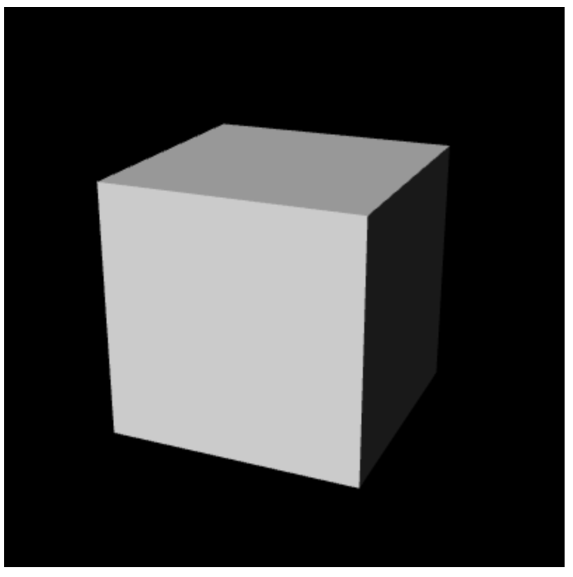

# 光照

- 明暗、阴影、不同类型的光：点光源光、平行光和散射光
- 物体表面反射光线的方式：漫反射和环境反射
- 编写代码视线光照效果，使三维模型看上去更逼真

## 光照原理

- 根据光源和光线方向，物体不同表面的明暗程度变得不一致
- 根据光源和光线方向，物体向地面投下了影子

在三维图形学中术语 **着色（shading** 的真正含义就是，根据光照条件重建 “物体各表面明暗不一的效果” 的过程。物体向地面投下影子的现象，又被称为 **阴影（shadowing）**

### 着色

在讨论着色过程之前，考虑两件事：
- 发出光线的光源的类型
- 物体表面如何反射光线

### 光源类型

- 平行光：可以用一个方向和一个颜色来定义
- 点光源光：需要指定点光源的位置和颜色。光线的方向将根据点光源的位置和被照射之处的位置计算出来，因为点光源的光线的方向在场景内的不同位置是不同的
- 环境光：是指那些经光源（点光源或平行光源）发出后，被墙壁等物体多次反射，然后照到物体表面上的光。环境光从各个角度照射物体，其强度都是一致的。环境光不用指定位置和方向，只需要指定颜色即可

### 反射类型

物体向哪个方向反射光，反射的光是什么颜色，取决于一下两个因素：入射光和物体表面的类型。入射光的信息包括入射光的方向和颜色，而物体表面的信息包括表面的固有颜色和反射特性。

物体表面反射光线的方式有两种：**漫反射** 和 **环境反射**

#### 漫反射

漫反射是针对平行光或这点光源而言的。在漫反射中，反射光的颜色取决于入射光的颜色、表面的基底色、入射光与表面形成的入射角。我们将入射角定义为入射光与表面的法线形成的夹角，并用 θ 表示，

$$
<漫反射光的颜色> = <入射光颜色> * <表面基底色> * cosθ
$$

`<入射光颜色>` 指的是点光源或平行光的颜色，乘法操作是在颜色矢量上逐分量（R，G，B）进行的。因为漫反射光在各个方向上都是 均匀 的，所以从任何角度看上去其强度都相等。


#### 环境反射

环境反射是针对环境光而言的。在环境光反射中，反射光的方向可以认为就是入射光的反方向。由于环境光照射物体的方式就是各方向均匀、强度相等的，所以反射光也是各向均匀的。

$$
<环境反射光的颜色> = <入射光颜色> * <表面基底色>
$$

`<入射光颜色>` 实际上也就是环境光的颜色


当漫反射和环境反射同时存在时，将两者加起来，就会得到物体最终被观察的颜色

$$
<表面的反射光颜色> = <漫反射光颜色> + <环境反射光颜色>
$$


#### 平行光下的漫反射

$$
<漫反射光颜色> = <入射光颜色> * <表面基底色> * cosθ
$$

- 平行入射光颜色
- 表面的基底色
- 入射光与表面形成的入射角θ

#### 根据光线和表面的方向计算入射角

必须根据入射光的方向和物体表面的朝向（即法线方向）来计算出入射角。*这并不简单，因为在创建三维模型的时候，我们无法预先确定光线将以怎样的角度照射到每个表面上。但是，我们可以确定每个表面的朝向。在指定光源的时候，
在确定光的方向，就可以用这两项信息来计算出入射角了*

我们可以通过计算两个矢量的点积，来计算这两个矢量的夹角余炫值cosθ。点击运算的使用非常频繁，GLSL ES内置了点积运算函数。在公式中，我们使用点符号·来表示点积运算。这样，cosθ就可以通过下式计算出来：

$$
cosθ = <光线方向> · <法线方向>
$$
即
$$
<漫反射光颜色> = <入射光颜色> * <表面基底色> * (<光线方向> · <法线方向>)
$$

注意：
- 光线方向矢量和表面法线矢量的长度必须为1，否则反射光的颜色就会过暗或过亮。将一个矢量的长度调整为1，同时保持方向不变的过程称为**归一化**。
- 这里所谓的**光线方向**，实际上是入射方向的反方向，即从入射点指向光源方向

#### 法线：表面的朝向

物体表面的朝向，即垂直与表面的方向，又称法线或法向量。法向量有三个分量，向量（nx，ny，nz）表示从原点（0，0，0）指向点（nx，ny，nz）的方向。如，向量（1，0，0）表示x轴正方向，向量（0，0，1）表示z轴正方向。

**一个物体表面具有两个法向量**

每个表面都有两个面，“正面” 和 “背面”。两个面各自具有一个法向量。如，垂直于z轴的x-y 平面，其背面的法向量为x正半轴，即（0，0，1），而背面的法向量为x负半轴，即（0，0，-1）。

在三维图形学中，表面的正面和背面取决于绘制表面时的顶点顺序。当你按照v0，v1，v2，v3的顶点顺序绘制一个平面，那么当你从正面观察这个表面时，这4个顶点是顺时针的，而从背面观察该表面，这4个顶点就是逆时针的。

**平面的法向量唯一**

由于法向量表示的是方向，与位置无关，所以一个平面只有一个法向量。换句话说，平面的任意一点都具有相同的法向量。即使有两个不同的平面，只要其朝向相同（两个平面平行），法向量也相同。

```js
const VSHADER_SOURCE=
    'attribute vec4 a_Position;\n' +
    'attribute vec4 a_Color;\n' +
    'attribute vec4 a_Normal;\n' +  // 法向量
    'uniform mat4 u_MvpMatrix;\n' +
    'uniform vec3 u_LightColor;\n' + // 光线颜色
    'uniform vec3 u_LightDirection;\n' +  // 归一化的世界坐标
    'varying vec4 v_Color;\n' +
    'void main(){' +
    'gl_Position = u_MvpMatrix * a_Position;\n' +
    'vec3 normal = normalize(vec3(a_Normal));\n' +  // 对法向量进行归一化
    'float nDotL = max(dot(u_LightDirection, normal), 0.0);\n' +  // 计算光线方向和法向量的点积
    'vec3 diffuse = u_LightColor * vec3(a_Color) * nDotL;\n' +  // 计算漫反射的颜色
    'v_Color = vec4(diffuse, a_Color.a);\n' +
    '}'

const FSHADER_SOURCE =
    '#ifdef GL_ES\n' +
    'precision mediump float;\n' +
    '#endif\n' +
    'varying vec4 v_Color;\n' +
    'void main(){' +
    'gl_FragColor = v_Color;\n' +
    '}'

function main() {
    const canvas = document.querySelector('canvas')
    const gl = canvas.getContext('webgl')
    if(!gl) {
        console.error('Unable to initialize WebGL.')
        return
    }

    if(!initShaders(gl, VSHADER_SOURCE, FSHADER_SOURCE)) {
        console.error('Failed to initialize shaders.')
        return;
    }
    const n = initVertexBuffers(gl)

    if(n < 0) {
        console.error('Failed to initvertexBuffer ')

        return;
    }

    gl.clearColor(0.0, 0.0, 0.0, 1.0)
    gl.enable(gl.DEPTH_TEST)

    const u_MvpMatrix = gl.getUniformLocation(gl.program, 'u_MvpMatrix')

    const u_LightColor = gl.getUniformLocation(gl.program, 'u_LightColor')

    const u_LightDirection = gl.getUniformLocation(gl.program, 'u_LightDirection')

    // 设置光线的颜色
    gl.uniform3f(u_LightColor,1.0, 1.0, 1.0)

    // 设置光线的方向
    const lightDirection = new Vector3([0.5, 3.0, 4.0])

    lightDirection.normalize();

    gl.uniform3fv(u_LightDirection, lightDirection.elements)

    const mvpMatrix = new Matrix4()

    mvpMatrix.setPerspective(30, canvas.width/canvas.height, 1, 100)

    mvpMatrix.lookAt(3,3,7,0,0,0,0,1,0)

    gl.uniformMatrix4fv(u_MvpMatrix, false, mvpMatrix.elements)

    gl.clear(gl.COLOR_BUFFER_BIT | gl.DEPTH_BUFFER_BIT)

    gl.drawElements(gl.TRIANGLES,n,gl.UNSIGNED_BYTE,0)
}

function initVertexBuffers(gl) {
    const vertices = new Float32Array([
        // front
        1.0, 1.0, 1.0, -1.0, 1.0, 1.0, -1.0, -1.0, 1.0,1.0, -1.0, 1.0, // 0 1 2 3

        // right
        1.0, 1.0, 1.0, 1.0, -1.0, 1.0, 1.0, -1.0, -1.0, 1.0, 1.0, -1.0, // 0 3 4 5

        // up
        1.0, 1.0, 1.0, 1.0, 1.0, -1.0, -1.0, 1.0, -1.0, -1.0, 1.0, 1.0, // 0 5 6 2

        // left
        -1.0, 1.0, 1.0, -1.0, 1.0, -1.0, -1.0, -1.0, -1.0,-1.0, -1.0, 1.0, // 1 6 7 2

        //down
        -1.0, -1.0, -1.0, 1.0, -1.0, -1.0, 1.0, -1.0, 1.0,-1.0, -1.0, 1.0, // 7 4 3 2


        //back
        -1.0, -1.0, -1.0,  1.0, -1.0, -1.0, 1.0, 1.0, -1.0, -1.0, 1.0, -1.0// 7 4 5 6

    ])
    const colors = new Float32Array([
        1.0, 1.0, 1.0, 1.0, 1.0, 1.0, 1.0, 1.0, 1.0, 1.0, 1.0, 1.0,
        1.0, 1.0, 1.0, 1.0, 1.0, 1.0, 1.0, 1.0, 1.0, 1.0, 1.0, 1.0,
        1.0, 1.0, 1.0, 1.0, 1.0, 1.0, 1.0, 1.0, 1.0, 1.0, 1.0, 1.0,
        1.0, 1.0, 1.0, 1.0, 1.0, 1.0, 1.0, 1.0, 1.0, 1.0, 1.0, 1.0,
        1.0, 1.0, 1.0, 1.0, 1.0, 1.0, 1.0, 1.0, 1.0, 1.0, 1.0, 1.0,
        1.0, 1.0, 1.0, 1.0, 1.0, 1.0, 1.0, 1.0, 1.0, 1.0, 1.0, 1.0,
    ])

    const indices = new Uint8Array([
        0, 1, 2, 0, 2, 3, // 前
        4, 5, 6, 4, 6, 7, // 右
        8,9,10, 8,10,11, // 上
        12, 13, 14, 12, 14, 15, // 左
        16, 17, 18, 16, 18, 19, // 下
        20, 21, 22, 20, 22, 23, // 后
    ])
    // 法向量数据
    const normals = new Float32Array([
        0.0, 0.0, 1.0, 0.0, 0.0, 1.0, 0.0, 0.0, 1.0, 0.0, 0.0, 1.0,
        1.0, 0.0, 0.0, 1.0, 0.0, 0.0, 1.0, 0.0, 0.0, 1.0, 0.0, 0.0,
        0.0, 1.0, 0.0, 0.0, 1.0, 0.0, 0.0, 1.0, 0.0, 0.0, 1.0, 0.0,
        -1.0, 0.0, 0.0, -1.0, 0.0, 0.0, -1.0, 0.0, 0.0, -1.0, 0.0, 0.0,
        0.0, -1.0, 0.0, 0.0, -1.0, 0.0, 0.0, -1.0, 0.0, 0.0, -1.0, 0.0,
        0.0, 0.0, -1.0, 0.0, 0.0, -1.0, 0.0, 0.0, -1.0, 0.0, 0.0, -1.0,
    ])

    if(!initArrayBuffer(gl, normals, 3, gl.FLOAT, 'a_Normal')) {
        return  -1;
    }
    if(!initArrayBuffer(gl, vertices, 3, gl.FLOAT, 'a_Position')) {
        console.log(32)
        return  -1;
    }


    if(!initArrayBuffer(gl, colors, 3, gl.FLOAT, 'a_Color')) {
        console.log(43)
        return -1;
    }

    const indexBuffer = gl.createBuffer()

    gl.bindBuffer(gl.ELEMENT_ARRAY_BUFFER, indexBuffer)
    gl.bufferData(gl.ELEMENT_ARRAY_BUFFER, indices, gl.STATIC_DRAW)

    return indices.length;


}

function initArrayBuffer(gl, data, num, type, attribute) {
    const buffer = gl.createBuffer()

    gl.bindBuffer(gl.ARRAY_BUFFER, buffer)
    gl.bufferData(gl.ARRAY_BUFFER, data, gl.STATIC_DRAW)

    const a_attribute = gl.getAttribLocation(gl.program, attribute)

    gl.vertexAttribPointer(a_attribute, num, type, false, 0, 0)
    gl.enableVertexAttribArray(a_attribute)
    return true
}
```


