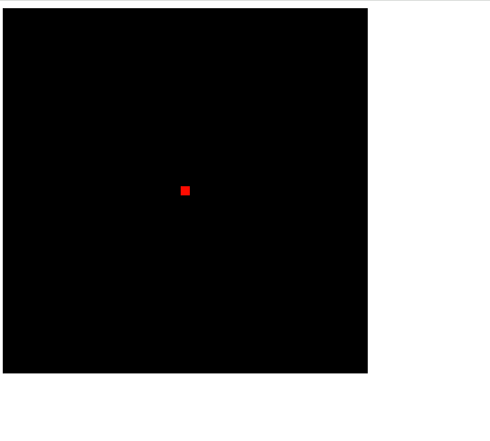

# WebGL

## 最短的WebGL程序

使用背景色清空canvas标签的绘图区


1. 获取`<canvas>`元素
2. 获取WebGL绘图上下文
3. 设置背景色
4. 清空`<canvas>`

### getWebGLContext(canvas) 是WebGL编程有用的辅助函数之一
获取WebGL绘图上下文，如果开启了debug属性，遇到错误时将在控制台显示错误消息

getWebGLContext(element, [, debug])

| 参数        | 描述                                                  |
|-----------|-----------------------------------------------------|
| element   | 指定 canvas 元素                                        |
| debug(可选) | 默认为false，如果设置为true，javascript中发生的错误将被显示在控制台上。它会影响性能 |
| 返回值       | 描述                                                  |
| non-null  | WebGL绘制上下文                                          |
| null      | WebGL 不可用                                           |

### gl.clearColor 指定绘图区的背景色
`gl.clearColor(red,green,blue,alpha)`

一旦指定了背景色之后，背景色就会驻存在WebGL系统中，在下一次调用gl.clearColor()方法前不会改变。

这个函数用于定义清空画布时的背景色。

### gl.clear(gl.COLOR_BUFFER_BIT)

函数的参数是`gl.COLOR_BUFFER_BIT`,而不是表示绘图区域的`<canvas>`。因为WebGL中的gl.clear()方法实际上继承自OpenGL，它基于多基本缓冲区模型，和清除二维绘图上下文不一样。
清空绘图区域，实际上是在清空颜色缓冲区（color buffer），传递参数`gl.COLOR_BUFFER_BIT`就是在告诉WebGL清空颜色缓冲区。除了颜色缓冲区，WebGL还会使用其他种类的缓冲区，比如`深度缓冲区`和`模版缓冲区`。


当调用gl.clear时，它会用之前设置的背景色来填充整个画布。也就是说，清空画布并不会导致背景色消失，而是将画布填充为你在gl.clearColor中定义的颜色。


| 参数                    | 描述                           |
|-----------------------|------------------------------|
| buffer                | 指定待清空的缓冲区，为操作符 （｜）可用来指定多个缓冲区 |
| gl.COLOR_BUFFER_BIT   | 指定颜色缓存                       |
| gl.DEPTH_BUFFER_BIT   | 指定深度缓冲区                      |
| gl.STENCIL_BUFFER_BIT | 指定模版缓冲区                      |
| 返回值                   | 无                            |
| 错误                    | 描述                           |
| INVALID_VALUE         | 缓冲区不是以上三种类型                  |

若没有指定背景色，则使用默认值

| 缓冲区名称 | 默认值               | 相关函数                                |
|-------|-------------------|-------------------------------------|
| 颜色缓存区 | （0.0，0.0，0.0，0.0） | gl.clearColor(red,green,blue,alpha) |
| 深度缓冲区 | 1.0               | gl.clearDepth(depth)                |
| 模版缓冲区 | 0                 | gl.clearStencil(s)                  |


## drawPoint

### 着色器（shader）
WebGL依赖于一种新的称为着色器的绘图机制。着色器提供了灵活且强大的绘制二维和三维图形的方法。WebGL程序必须使用它。着色器不仅强大，而且更复杂，仅仅通过一条简单的绘图命令是不能操作它的。

在代码中，着色器程序是以字符串的形式“嵌入”在`javascript`文件中的，在程序真正开始运行前他就设置好了。

WebGL需要两种着色器：
- 顶点着色器（Vertex shader）

    顶点着色器是用来描述顶点特性（位置、颜色等）的程序。

    顶点（vertex）是指二维或三维空间中的一个点
- 片元着色器（Fragment shader）

    进行逐片元处理过程（光照）的程序。

    片元（fragment）是一个WebGL术语。可以理解为像素（图像的单元）

在三维场景中，仅仅用线条和颜色把图形画出来是远远不够的。必须考虑，如光线照上去之后，或者观察者的视角发生变化，对场景会有什么影响，着色器可以高度灵活的完成这些工作，提供各种渲染效果。

 
着色器使用类似于C的`OpenGL ES 着色器语言`来编写。因为着色器程序代码必须预先处理成单个字符串的形式。

### 初始化着色器

1. 获取`<canvas>`元素
2. 获取WebGL绘图上下文
3. 初始化着色器
4. 设置`<canvas>`背景色
5. 清空`<canvas>`
6. 绘图

### initShaders(gl, vshader, fshader)

在WebGL系统内部`建立`和`初始化`着色器

| 参数      | 描述               |
|---------|------------------|
| gl      | 指定渲染上下文          |
| vshader | 指定顶点着色器程序代码（字符串） |
| fshader | 指定片元着色器程序代码（字符串） |
| 返回值     | 描述               |
| true    | 初始化着色器成功         |
| false   | 初始化着色器失败         |


**WebGL程序包括`运行在浏览器中的Javascript`和`运行在WebGl系统的着色器程序`这两部分**


#### 顶点着色器

顶点着色器和C语言程序一样，必须包含一个`main()`函数。`main()`前面的关键字`void`表示这个函数不会有返回值。

不能为`main()`指定参数

顶点着色器的内置变量

| 类型和变量名             | 描述          |
|--------------------|-------------|
| vec4 gl_Position   | 表示顶点位置      |
| float gl_PointSize | 表示点的尺寸（像素数） |


GLSL SE(编程语言)中的数据类型

| 类型    | 描述                      |
|-------|-------------------------|
| float | 表示浮点数                   |
| vec4  | 表示由四个符点数组成的矢量           |
|       | float float float float |


vec4类型的变量

vec4(v0, v1, v2, v3)
根据v0、v1、v2、v3值创建vec4对象

| 参数          | 描述                    |
|-------------|-----------------------|
| v0,v1,v2,v3 | 指定4个符点型的分量            |
| 返回值         | 由v0,v1,v2,v3组成的vec4对象 |

##### 齐次坐标
由四个分量组成的矢量称为齐次坐标。齐次坐标是四维的。

表示：(x,y,z,w)，

当需要使用齐次坐标表示顶点坐标的时候，只要将最后一个分量赋为1.0就可以了

>齐次坐标(x,y,z,w)等价于三维坐标(x/w, y/w, z/w)。如果齐次坐标的第4个分量为1,就可以当作三维坐标来使用。且w的值必须是大于等于0的。如果w趋近于0，它表示的点将趋近无穷远，在齐次坐标中有无穷远的概念。齐次坐标的存在，使得用矩阵乘法来描述顶点变换成为可能，三维图形系统在计算过程中，通常使用齐次坐标来表示顶点的三维坐标。

#### 片元着色器

顶点着色器控制点的位置和大小，片元着色器控制点的颜色。

片元着色器的作用是处理片元，使其显示在屏幕上。

片元着色器唯一内置变量`gl_FragColor`

| 类型和变量名            | 描述             |
|-------------------|----------------|
| vec4 gl_FragColor | 指定片元颜色（RGBA格式） |

#### 绘制操作

着色器建立完成后，就需要进行绘制操作了。

`gl.drawArrays()` 是一个强大的函数，可以用来绘制各种图形，该函数的规范如下

| 参数            | 描述                                                                                                                        |
|---------------|---------------------------------------------------------------------------------------------------------------------------|
| mode          | 指定绘制的方式，可以接收以下常量符合：gl.POINTS,gl.LINES,gl.LINE_STRIP,<br/>gl.LINE_LOOP,gl.TRIANGLES,gl.TRIANGLE_STRIP,<br/>gl.TRIANGLE_FAN |
| first         | 指定从哪个顶点开始绘制（整数型）                                                                                                          |
| count         | 指定绘制需要用到多少个顶点（整数型）                                                                                                        |
| 返回值           | 无                                                                                                                         |
| 错误            | 描述                                                                                                                        |
| INVALID_ENUM  | 传入的mode参数不是前述参数之一                                                                                                         |
| INVALID_VALUE | 参数first或count是负数                                                                                                          |




### WebGL坐标系统
WebGL处理的是三维图形，所以它使用三维坐标系统（笛卡尔坐标系），X轴，Y轴，Z轴。在WebGL中，当面向计算机屏幕时，X轴是水平的（向右为正），Y轴是垂直的（向下为正），Z轴是垂直于屏幕的（向外为正）。


## 绘制一个点（另一个版本）

### 使用attribute变量

将位置信息从`javascript`程序中传给顶点着色器，有两种方式可以做到这点。attribute变量和uniform变量。至于使用哪个变量取决于需传递的数据本身，
attribute变量传输的是那些与顶点相关的数据，uniform变量传输的是那些对于所以顶点都相同（或与顶点无关）的数据。

- attribute变量

  attribute变量是一种GLSL ES变量，被用来从外部向顶点着色器内传输数据，只有顶点着色器能使用它
  
  使用attribute变量，需要包含以下步骤：

  1. 在顶点着色器中，声明attribute变量
  2. 将attribute变量赋值个`gl_Position变量
  3. 向attribute变量传输数据
  
  ```js
  var VSHADER_SOURCE =
      'attribute vec4 a_Position;\n' +
      'void main() {\n' +
          'gl_Position = a_Position;\n' +
          'gl_PointSize = 10.0;\n' +
      '}\n'
  var FSHADER_SOURCE =
     ' void main() {\n'+
          'gl_FragColor = vec4(1.0, 0.0, 0.0, 1.0);\n'+
      '}\n'
  
  
  function main() {
      var canvas = document.getElementById('webgl')
      var gl = getWebGLContext(canvas)
      if(!gl) {
          console.error('Failed to get the rendering context for WebGL')
          return;
      }
  
      // 初始化着色器
      if(!initShaders(gl, VSHADER_SOURCE, FSHADER_SOURCE)) {
          console.error('Failed to initialize shaders.')
          return;
      }
      // 获取attribut变量的存储位置
      var a_Position = gl.getAttribLocation(gl.program, 'a_Position')
  
      if(a_Position < 0) {
          console.error('Failed to get the storage location of a_Position')
          return;
      }
  
      gl.vertexAttrib3f(a_Position, 0.0, 0.0, 0.0)
  
      // 设置canvas背景色
      gl.clearColor(0.0,0.0,0.0,1.0)
  
      // 清空canvas
      gl.clear(gl.COLOR_BUFFER_BIT);
  
      // 绘制一个点
      gl.drawArrays(gl.POINTS, 0, 1)
  }
  ```
  4. 获取attribut变量的存储位置
  使用`initShaders()`在WebGL系统中建立了顶点着色器，WebGL就会对着色器进行解析，辨识出着色器具有的attribute变量，每个变量都具有一个存储地址，
  以便通过存储向变量传输数据。当想要向顶点着色器的`a_Position`变量传输数据时，首先需要向WebGL系统请求该变量的存储地址。使用`gl.getAttribLocation()`
  来获取`attribute`变量的地址
  
  | 参数                | 描述                                    |
  |-------------------|---------------------------------------|
  | program           | 指定包含顶点着色器和片元着色器的着色器程序对象               |
  | name              | 指定想要获取存储地址的attribute变量名称              |
  | 返回值               | 描述                                    |
  | 大于等于0             | attribute变量的存储地址                      |
  | -1                | 指定的attribute变量不存在，或者命名具有gl_或webgl_前缀  |
  | 错误                | 描述                                    |
  | INVALID_OPERATION | 程序对象未能成功连接                            |
  | INVALID_VALUE     | name参数的长度大于attribute变量名的最大长度（默认256字节） |

  5. 向attribute变量赋值
  一旦将`attribute`变量的存储地址保存在`Javascript`变量`a_Position`中，下面就需要使用该变量来向着色器传入值。使用`gl.vertexAttrib3f()`函数来完成这一步
  
  | 参数                | 描述                                 |
  |-------------------|------------------------------------|
  | location          | 指定将要修改的attribute变量的储存位置            |
  | v0                | 指定填充attribute变量第一个分量的值             |
  | v1                | 指定填充attribute变量第二个分量的值             |
  | v2                | 指定填充attribute变量第三个分量的值             |
  | 返回值               | 无                                  |
  | 错误                | 描述                                 |
  | INVALID_OPERATION | 没有当前的program对象                     |
  | INVALID_VALUE     | location大于等于attribute变量的最大数目（默认为8） |


### `gl.vertexAttrib3f()`的同族函数

`gl.vertexAttrib3f()`是一系列同族函数中的一个，该系列函数的任务就是从`javascript`向顶点着色器中的`attribute`变量传值。`gl.vertexAttrib1f()`传输1个单精度值（v0），
`gl.vertexAttrib2f()`传输2个值，`gl.vertexAttrib4f()`传输4个值。


`gl.vertexAttrib1f(location, v0)`

`gl.vertexAttrib2f(location, v0, v1)`

`gl.vertexAttrib3f(location, v0, v1, v2)`

`gl.vertexAttrib4f(location, v0, v1, v2, v3)`

将数据传输个`location`参数指定的`attribute`变量。如果仅传输一个值，那么这个值会被填充到第一个分量中，第二个分量，第三个分量将被设为 0.0，第4个分量将被设为 1.0。

| 参数            | 描述                                |
|---------------|-----------------------------------|
| location      | 指定attribute变量的存储位置                |
| v0,v1,v2,v3   | 指定传输给attribute变量的四个分量的值           |
| 返回值           | 无                                 |
| 错误            | 描述                                |
| INVALID_VALUE | location大于等于attribute变量的最大数目（默认8） |


