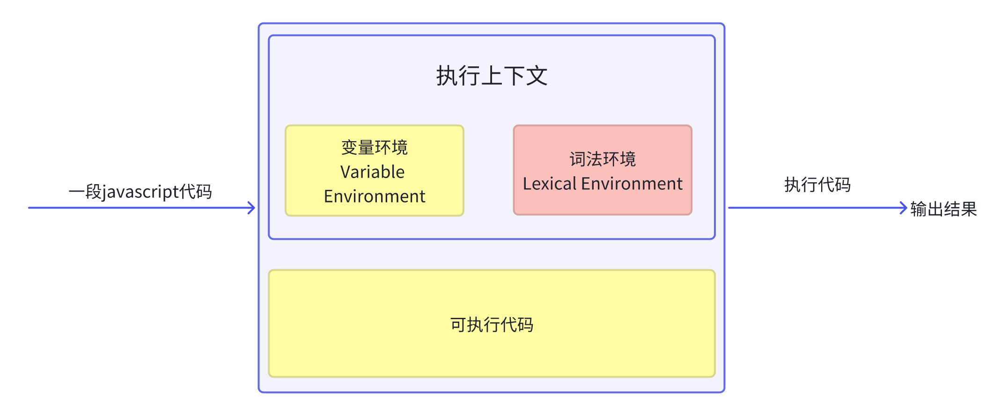

# Javascript运行机制

## 执行上下文




输入一段代码，经过编译后，会生成两部分内容：**执行上下文、可执行代码**

执行上下文是javascript执行一段代码时的运行环境，调用一个函数，就会进入这个函数执行上下文，确定该函数在执行期间用到的变量、this、对象以及函数等。

其中执行上下文中的变量环境中存放的是变量提升的内容 像var定义的变量 函数声明（就是用function关键字定义的函数，javascript引擎会将函数定义存储到堆中，并在变量环境对象中创建一个与函数同名的属性，且这个属性指向堆中的函数位置）等。

其他函数声明之外的代码会编译成字节码，

然后javascript引擎开始执行可执行代码...


## 调用栈（用来管理函数调用关系的一种数据结构）


* javascript执行全局代码的时候，会编译全局代码并创建全局执行上下文，而且在整个页面的生存周期内，全局执行上下文只有一份
* 调用一个函数时侯，函数体内的代码会被编译，并创建函数执行上下文，函数执行结束之后，创建的函数执行上下文会被销毁（闭包除外）
* 使用eval函数的时候，eval的代码也会被编译，并创建执行上下文

当一段代码执行时，会先创建全局上下文，并将其压入栈底，然后javascript引擎开始执行全局代码，若在中途遇到调用函数，javascript引擎会编译该函数，并为该函数创建一个执行上下文，且会将这个执行上下文压入栈中。然后执行刚刚压入栈的这个函数的代码，如果在这又遇到函数，继续上面的操作，创建执行上下文、压入栈中，然后在执行可执行的代码。当栈顶的函数执行完了，便会将栈顶的这个可执行上下文出栈，接着执行栈顶的内容，直至全局上下文中的代码执行完毕。

调用栈也是有大小的，当入栈的执行上下文超过一定数量，会导致**栈溢出**。

## 块级作用域

ES6中引入了块级作用域并配合let const 关键字，使用这俩关键字定义的变量，不会发生变量提升，但是var 在es6中并没有废弃（javascript需要向下兼容）。

#### 作用域

作用域是指在程序中定义变量的区域，该位置决定了变量的生命周期。即变量和函数的可访问范围。

* 全局作用域
* 函数作用域
* 块级作用域

有引用的变量时，不会被垃圾回收,

```JavaScript
function bar() {
    for(var i = 0; i < 5; i++ ) {
    }
    console.log(i)
}
bar()
```

块级作用域中定义的变量（const let），会在编译阶段存放在执行上下文的词法环境中，查找变量的值的顺序也是先从词法环境中查找，未找到，才会去变量环境中查找，然后是全局环境。在函数内部使用let定义的，只有进入到函数内部的作用域块时，才会将它们加入到词法环境中。

> [!TIP]
>
> 暂时性死区：ES6 明确规定，如果区块中存在`let`和`const`命令，这个区块对这些命令声明的变量，从一开始就形成了封闭作用域。凡是在声明之前就使用这些变量，就会报错。

es6是通过变量环境和词法环境来同时支持变量提示和块级作用域的

## 作用域链

#### 执行上下文 词法环境 变量环境 调用栈 之间的关系

javascript代码开始执行全局代码时，会创建一个全局可执行上下文，并将存在变量提升的变量存放到变量环境中，如果是函数，会将函数放入到堆中，并创建一个与函数同名的属性值为这个函数堆的地址放入到变量环境中。然后当代码执行到某个函数时，会创建一个函数可执行上下文，变量环境，和词法环境，并将其压入到调用栈中。变量环境中存放的时存在变量提升定义的变量，当函数中的代码执行到let const 声明的变量时，会将这两关键字定义的变量存放到词法环境中。

在每个执行上下文的变量环境中，都包含一个外部引用——outer，用来指向外部的执行上下文。

#### 词法作用域

就是指作用域是由代码中函数声明的位置来决定的，所以词法作用域是静态的作用域，通过它就能够预测代码在执行过程中如何查找标识符。 词法作用域是代码阶段就决定好的。和函数是怎么调用的没有关系。

#### 闭包

**在 ****JavaScript**** 中，根据词法****作用域****的规则，内部函数总是可以访问其外部函数中声明的变量，当通过调用一个外部函数返回一个内部函数后，即使该外部函数已经执行结束了，但是内部函数引用外部函数的变量依然保存在****内存****中，我们就把这些变量的集合称为闭包。**

函数里边定义函数，内部函数访问了外部函数的变量，通过外部函数的调用返回这个内部函数，这就形成了闭包，

特点：

* 保护私有变量， 只能通过这个外部函数获取
* 维持内部私有变量的状态

缺点：

会存在内存泄露

#### 闭包回收

判断闭包这块内容如果已经不再被使用，javascript引擎的垃圾回收器就会回收这块内存

## 在对象内部的方法中使用对象内部的属性 ——this 机制

每一个执行上下文中都有一个this

#### 全局执行上下文中的this

这个this指向window对象。作用域链的最低端也指向window对象。

#### 函数执行上下文中的this

默认情况下调用一个 函数，其执行上下文执行window对象。

###### 可以通过call 或apply 或bind 修改this的指向

```JavaScript
// 会立即执行，返回值就是fn1的返回值
fn1.call(this, ...args)

// 会立即执行，返回值就是就是fn1的返回值
fn1.apply(this, args)

// 不会立即执行，返回一个函数
fn1.bind(this, ...args)()
```

###### 通过对象调用方法设置

使用对象来调用其内部的方法，this指向对象本身

###### 通过构造函数设置

使用new关键字是发生了什么

* 创建一个简单的javascript对象
* 如果构造函数的prototype属性是个对象，新创建的这个空对象的prototype指向这个构造函数的prototype，如果构造函数的prototype属性不是对象，新创建的对象将保持为一个普通对象，其prototype为Object.prototype
* 使用给定参数执行构造函数，并将构造函数中的this执行这个新创建的对象的this上

除了 [Object](https://developer.mozilla.org/zh-CN/docs/Web/JavaScript/Data_structures#object) 以外，所有类型都定义了表示在语言最低层面的[不可变](https://developer.mozilla.org/zh-CN/docs/Glossary/Immutable)值。我们将这些值称为*原始值*。

就是基础类型数据定义的值叫原始值：布尔值、undefined、null、数字值、字符串、Symbol、

* 如果构造函数返回非原始值，则该返回值成为整个new表达式结果。否则，如果构造函数未返回任何值或返回了一个原始值，则返回新创建的对象

```JavaScript
function Person(name, age) {
  this.name = name;
  this.age = age;
  // 在构造函数中返回一个对象
  if (age < 18) {
    return { status: 'minor' };
  }
  // 构造函数没有返回值或返回原始值
  // 默认返回新创建的对象实例
}

var john = new Person('John', 25);
var mary = new Person('Mary', 16);
console.log(john); // 输出：Person { name: 'John', age: 25 }
console.log(mary); // 输出：{ status: 'minor' }

/*****************************************/

function Person(name, age) {
  this.name = name;
  this.age = age;
  // 在构造函数中返回一个对象
  if (age < 18) {
    return this.age;
  }
  // 构造函数没有返回值或返回原始值
  // 默认返回新创建的对象实例
}

var john = new Person('John', 25);
var mary = new Person('Mary', 16);
console.log(john); // 输出：Person { name: 'John', age: 25 }
console.log(mary); // 输出：Person {name: 'Mary', age: 16}
```

构造函数中的this指向了当前实例化对象

###### this的设计缺陷以及应对方案

1. 嵌套函数中的this不会从外层函数中继承

```JavaScript
var obj = {
    name: "myObj",
    getName: function() {
        console.log(this)
        function inner() {
            console.log(this)
        }
        inner()
    }
}
obj.getName()

//{name: 'myObj', getName: ƒ}
//Window {window: Window, self: Window, document: document, name: '', location: Location, …}
```

* 在外层函数中定义一个变量，并将this赋值给这个变量
* 使用箭头函数，箭头函数没有自己的执行上下文，所以会继承调用函数中的this

this没有作用域的限制
