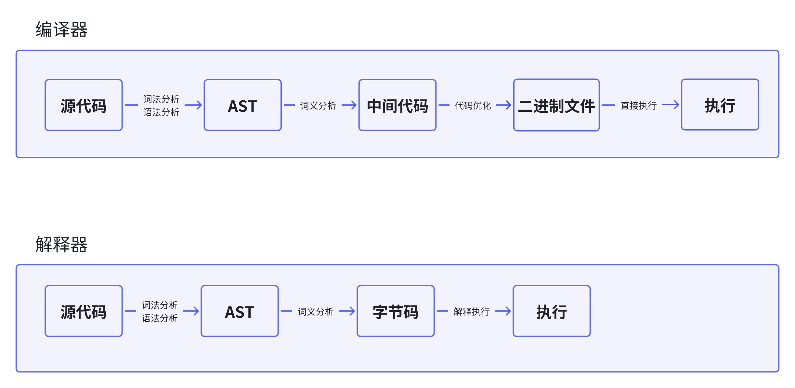

# 编译器（Compiler）和 解释器（Interpreter）

编译型语言在程序执行之前，需要经过编译器的编译过程，并且编译之后会直接保留机器能读懂的二进制文件，这样每次运行程序时，都可以直接运行该二进制文件，而不需要再次重新编译 c c++ Go等

解释型语言编写的程序，在每次运行时都需要通过解释器对程序进行动态解释和执行 javascript python等

**暂时无法在飞书文档外展示此内容**

1. 在编译型语言的编译过程中，编译器首先会依次对源代码进行词法分析、语法分析、生成抽象语法树、优化代码、最后生成处理器可执行的机器码。编译成功会生成一个可执行的文件。后续运行这个可执行的文件即可。
2. 在解释型语言的解释过程中，解释器会对源码依次进行词法分析、语法分析、生成抽象树，基于抽象树生成字节码，根据字节码执行程序，输出结果。

# 抽象语法树（AST）

将源代码转化为抽象树，并执行上下文，

Bable是一个被广泛使用的代码转码器，可以将ES6代码转为ES5代码。

Bable的工作原理就是先将ES6源码转换为AST，然后再将ES6语法的AST转换为ES5语法的AST，最后利用ES5的AST生成javascript源代码

ESLint是一个用来检查javascript编写规范的插件，其检测流程也是需要将源码转换为AST，然后再利用AST来检查代码规范化的问题

生成AST需要两个阶段：

* 分词——词法分析：

将一行行的源码拆解成一个个token——语法上不可再分的最小单个字符或字符串。 将标识符 变量 运算符 字符串等 处理成不同的token

* 解析——语法分析：

将生成的token数据，根据语法规则转为AST。源码存在语法错误，到这会被终止，并抛出一个 语法错误

有了AST后，v8就会生成该段代码的执行上下文。

# 字节码（Bytecode）

有了AST和执行上下文，解释器Ignition会根据AST生成字节码，并解释执行字节码。

在最开始v8是直接将AST转换为机器码，由于执行机器码的效率是非常高效的，所以效果一直很好。但随着chrome在手机上的广泛普及，机器码占用内存的问题暴露出来了，v8需要消耗大量的内存来存放转换后的机器码。为了解决这个问题v8团队重构了引擎架构，引入了字节码，并抛弃了之前的编译器。

**字节码是介于****AST****和机器码之间的一种代码。但是与特定类型的机器码无关，字节码需要通过****解释器****将其转换为机器码后才能执行**

如果有一段第一次执行的字节码，解释器Ignition会逐条解释执行。在执行字节码的过程中，如果发现有热代码（HotSpot）（一段代码被重复多次执行），后台编译器TurboFan就会把该段热点的字节码编译成高效的机器码，然后当再次执行到这段被优化的代码时，只需要执行编译后的机器码就可以，大大提升了代码的执行效率

# 即时编译器（JIT）

字节码配合解释器和编译器的技术，就叫即时编译

在v8中，指的是解释器Ignition在解释执行字节码的同时，收集代码信息，当发现某一部分代码变热后，TurboFan编译器就会将这些热代码转换为机器码，并把转换后的机器码保存起来，用于后续使用。
