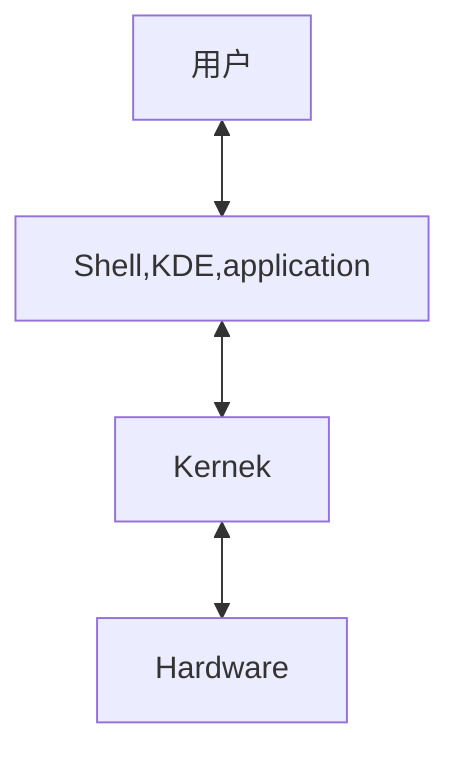
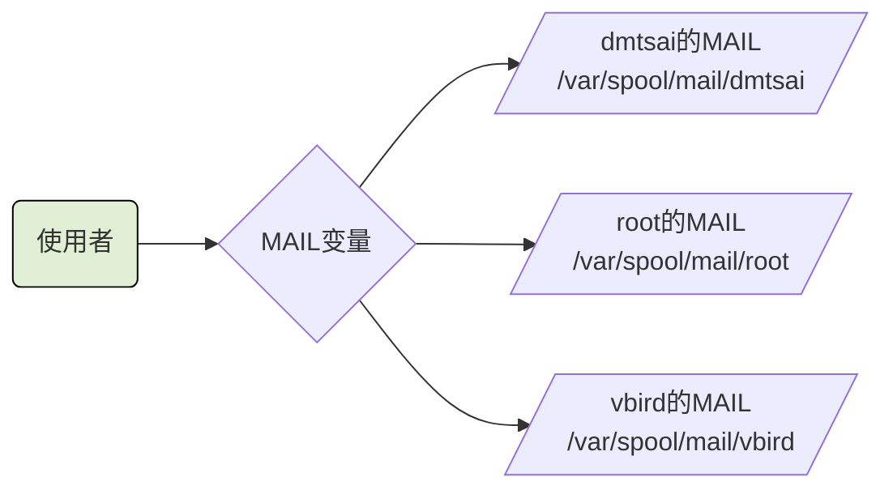

# BASH 与 Shell

## 什么是Shell
> Shell 是使用者的指令与核心进行沟通的工具


> 用户下达的指令 通过 shell 控制核心以便控制硬件实现某些功能

shell版本
>  Bourne SHell(sh)、C SHell、K SHell、TCSH等等
> Linux 使用的版本是 Bourne　Again SHell (bash),这个是Bourne Shell的增强版本。

所有的shell都在/etc/shells这个文件下
为什么系统上合法的shell要写入/etc/shells这个文件下呢。这是因为系统某些服务在运作过程中，会去检查使用者能够使用的shells，而这些shell的查询就是由/etc/shells这个文件

如某些FTP网站会去检查使用者的可用shell，而如果不想要让这些用户使用FTP以为的主机资源，可能会给予使用者一些怪怪的shell，让使用者无法以其他服务登入主机。这时就需要将这个shell写入到/etc/shells中。

```shell
[root@iZbp13op1xah7j3j1x457dZ ~]# cat /etc/passwd
root:x:0:0:root:/root:/bin/bash
bin:x:1:1:bin:/bin:/sbin/nologin
daemon:x:2:2:daemon:/sbin:/sbin/nologin
adm:x:3:4:adm:/var/adm:/sbin/nologin
lp:x:4:7:lp:/var/spool/lpd:/sbin/nologin
sync:x:5:0:sync:/sbin:/bin/sync
shutdown:x:6:0:shutdown:/sbin:/sbin/shutdown
halt:x:7:0:halt:/sbin:/sbin/halt
mail:x:8:12:mail:/var/spool/mail:/sbin/nologin
operator:x:11:0:operator:/root:/sbin/nologin
games:x:12:100:games:/usr/games:/sbin/nologin
ftp:x:14:50:FTP User:/var/ftp:/sbin/nologin
nobody:x:99:99:Nobody:/:/sbin/nologin
systemd-network:x:192:192:systemd Network Management:/:/sbin/nologin
dbus:x:81:81:System message bus:/:/sbin/nologin
polkitd:x:999:998:User for polkitd:/:/sbin/nologin
sshd:x:74:74:Privilege-separated SSH:/var/empty/sshd:/sbin/nologin
postfix:x:89:89::/var/spool/postfix:/sbin/nologin
chrony:x:998:996::/var/lib/chrony:/sbin/nologin
nscd:x:28:28:NSCD Daemon:/:/sbin/nologin
tcpdump:x:72:72::/:/sbin/nologin
rpc:x:32:32:Rpcbind Daemon:/var/lib/rpcbind:/sbin/nologin
rpcuser:x:29:29:RPC Service User:/var/lib/nfs:/sbin/nologin
nfsnobody:x:65534:65534:Anonymous NFS User:/var/lib/nfs:/sbin/nologin
nginx:x:997:995:Nginx web server:/var/lib/nginx:/sbin/nologin
gitlab-www:x:996:993::/var/opt/gitlab/nginx:/bin/false
git:x:995:992::/var/opt/gitlab:/bin/sh
gitlab-redis:x:994:991::/var/opt/gitlab/redis:/bin/false
gitlab-psql:x:993:990::/var/opt/gitlab/postgresql:/bin/sh
gitlab-prometheus:x:992:989::/var/opt/gitlab/prometheus:/bin/sh
az:x:1000:1000::/home/az:/bin/bash
alex:x:1001:1002::/home/alex:/bin/bash
arod:x:1002:1001::/home/arod:/bin/bash
[root@iZbp13op1xah7j3j1x457dZ ~]# 
```
## Bash shell 的功能

- 命令记忆能力（history）
  .bahs_history记录的是前一次登录以前所执行过的指令，而至于这一次登入所执行的指令都被暂存在内存中，当成功注销系统后，该指令记忆才会记录到.bash_history当中
- 命令与文件补全功能 （[tab] 按键的好处）
  [Tab] 接在一串指令的第一个字的后面，则为命令补全
  [Tab] 接在一串指令的第二个字以后时，则为 文件补全
- 命令别名设定功能 （alias）
  自定义指令：alias lm = 'ls -al'
- 工作控制、前景背景控制 （job control, foreground, background）
- 程序化脚本 （shell scripts）
- 通配符 （Wildcard）
  ls -l /usr/bin/X*

### 查询指令是否为Bash shell 的内建命令： type、
|选项|解释|
|---|---|
||没有任何参数时，type 会显示出name是外部指令还是bash内建指令|
|-t|type会将name 以下面这些字眼显示出他的意义|
||file：表示为外部指令|
||alias：表示该指令为命令别名所设定的名称|
||builtin：表示该指令为bash内建的指令功能|
|-p|如果后面接的name为外部指令时，才是显示完整文件名|
|-a|会有PATH变量定义的路径中，将所有含name的指令都显示出来，包含alias|

```shell
[root@iZbp13op1xah7j3j1x457dZ ~]# type ls
ls is aliased to `ls --color=auto'
[root@iZbp13op1xah7j3j1x457dZ ~]# type -t ls
alias
[root@iZbp13op1xah7j3j1x457dZ ~]# type -a ls
ls is aliased to `ls --color=auto'
ls is /usr/bin/ls
[root@iZbp13op1xah7j3j1x457dZ ~]# type cd
cd is a shell builtin
[root@iZbp13op1xah7j3j1x457dZ ~]# 
```

### 指令的下达与快速编辑按钮
```shell
[root@iZbp13op1xah7j3j1x457dZ ~]# cp /var/spool/mail/root /etc/crontab \
> /etc/fstab /root
```

快速的将这串指令整个删除掉。
|组合键|解释|
|---|---|
|[ctrl] + u/[ctrl] + k|分别是从光标处向前删除指令串([ctrl] + u)及向后删除指令串([ctrl] + k)|
|[ctrl] + a/[ctrl] + e|分别是让光标移动到整个指令串的最前面([ctrl] + a) 或最后面([ctrl] + e)|

## Shell的变量功能

- 变量的取用与设定：echo，变量设定的规则，unset

### 取变量值
```shell
[root@iZbp13op1xah7j3j1x457dZ ~]# echo $variable

[root@iZbp13op1xah7j3j1x457dZ ~]# echo $PATH
/root/.vscode-server/bin/019f4d1419fbc8219a181fab7892ebccf7ee29a2/bin/remote-cli:/usr/local/sbin:/usr/local/bin:/usr/sbin:/usr/bin:/root/bin
[root@iZbp13op1xah7j3j1x457dZ ~]# echo ${PATH}
/root/.vscode-server/bin/019f4d1419fbc8219a181fab7892ebccf7ee29a2/bin/remote-cli:/usr/local/sbin:/usr/local/bin:/usr/sbin:/usr/bin:/root/bin
[root@iZbp13op1xah7j3j1x457dZ ~]# 

```

### 设定变量值
```shell
[root@iZbp13op1xah7j3j1x457dZ ~]# echo ${myname}

[root@iZbp13op1xah7j3j1x457dZ ~]# myname=VBrid
[root@iZbp13op1xah7j3j1x457dZ ~]# echo ${myname}
VBrid
[root@iZbp13op1xah7j3j1x457dZ ~]# 

```

### 变量的设定规则：
  - 变量与变量内容以一个 = 连结： 如 myname = VBird
  - 等号两边不能直接接空格符
  - 变量名称只能是英文字母与数字，但是开头字符不能是数字
  - 变量内容若有空格符可使用双引号或单引号将变量内容结合起来
      - 双引号的特殊字符如 $ 等，可以保有原本的特性。
        ```shell
        [root@iZbp13op1xah7j3j1x457dZ ~]# var="lang is $LANG"
        [root@iZbp13op1xah7j3j1x457dZ ~]# ehco $var
        bash: ehco: command not found
        [root@iZbp13op1xah7j3j1x457dZ ~]# echo $var
        lang is en_US.UTF-8
        [root@iZbp13op1xah7j3j1x457dZ ~]# 
        ```
      - 单引号内的特殊字符则仅为一般字符（纯文本）
        ```shell
        [root@iZbp13op1xah7j3j1x457dZ ~]# var='lang is $LANG'
        [root@iZbp13op1xah7j3j1x457dZ ~]# echo $var
        lang is $LANG
        [root@iZbp13op1xah7j3j1x457dZ ~]#
        ```
  - 可用跳脱字符 \ 将特殊符号（[Enter], $, \ , 空格符 " 等） 变成一般字符
  - 在一串指令的执行中，还需要其他额外的指令所提供的信息时，可以使用反单引号 &grave;指令&grave; 或 $指令
    ```shell
    [root@iZbp13op1xah7j3j1x457dZ ~]# version=$(uname -r)
    [root@iZbp13op1xah7j3j1x457dZ ~]# echo $version
    3.10.0-1160.114.2.el7.x86_64
    [root@iZbp13op1xah7j3j1x457dZ ~]# 

    ```
  - 若变量为扩展变量内容时，则可用 ”$变量名称“或$｛变量｝累加内容
    ```shell
    [root@iZbp13op1xah7j3j1x457dZ ~]# echo ${myname}
    VBrid
    [root@iZbp13op1xah7j3j1x457dZ ~]# myname="$myname"yes
    [root@iZbp13op1xah7j3j1x457dZ ~]# echo ${myname}
    VBridyes
    [root@iZbp13op1xah7j3j1x457dZ ~]# myname=${myname}yes
    [root@iZbp13op1xah7j3j1x457dZ ~]# echo ${myname}\
    > ^C
    [root@iZbp13op1xah7j3j1x457dZ ~]# echo ${myname}
    VBridyesyes
    [root@iZbp13op1xah7j3j1x457dZ ~]# 
    ```
  - 若该变量需要在其他子程序执行，则需要export来使变量变成环境变量 如 export PATH
    ```shell
    [root@iZbp13op1xah7j3j1x457dZ ~]# bash
    [root@iZbp13op1xah7j3j1x457dZ ~]# echo ${myname}
    
    [root@iZbp13op1xah7j3j1x457dZ ~]# exit
    exit
    [root@iZbp13op1xah7j3j1x457dZ ~]# export myname
    [root@iZbp13op1xah7j3j1x457dZ ~]# bash
    [root@iZbp13op1xah7j3j1x457dZ ~]# echo ${myname}
    VBridyesyes
    [root@iZbp13op1xah7j3j1x457dZ ~]# exit
    exit
    [root@iZbp13op1xah7j3j1x457dZ ~]# 
    ```
  - 通常大写字符为系统默认变量，自行设定变量可以使用小写字符，方便判断
  - 取消变量的方法为使用unst 如 unset myname
    ```shell
    [root@iZbp13op1xah7j3j1x457dZ ~]# unset myname
    [root@iZbp13op1xah7j3j1x457dZ ~]# echo ${myname}
    
    [root@iZbp13op1xah7j3j1x457dZ ~]# 
    ```
### 环境变量的功能
- 用env观察环境变量与常见环境变量说明
  ```shell
  [root@iZbp13op1xah7j3j1x457dZ ~]# env
  XDG_SESSION_ID=8160      # 当前的登录会话
  TERM_PROGRAM=vscode      # 终端程序
  HOSTNAME=iZbp13op1xah7j3j1x457dZ      # 主机名
  TERM=xterm-256color      # 终端机使用的环境类型
  SHELL=/bin/bash      # 目前这个环境下，使用的Shell是哪个程序
  HISTSIZE=1000      # 记录指令的数量 默认是1000
  SSH_CLIENT=36.142.32.177 14018 22      # ssh 客户端地址
  TERM_PROGRAM_VERSION=1.87.0      # 终端程序版本
  OLDPWD=/tmp/vitest      # 最近一次工作目录
  USER=root      # 使用者名称
  LS_COLORS=rs=0:di=38;5;27:ln=38;5;51:mh=44;38;5;15:pi=40;38;5;11:so=38;5;13:do=38;5;5:bd=48;5;232;38;5;11:cd=48;5;232;38;5;3:or=48;5;232;38;5;9:mi=05;48;5;232;38;5;15:su=48;5;196;38;5;15:sg=48;5;11;38;5;16:ca=48;5;196;38;5;226:tw=48;5;10;38;5;16:ow=48;5;10;38;5;21:st=48;5;21;38;5;15:ex=38;5;34:*.tar=38;5;9:*.tgz=38;5;9:*.arc=38;5;9:*.arj=38;5;9:*.taz=38;5;9:*.lha=38;5;9:*.lz4=38;5;9:*.lzh=38;5;9:*.lzma=38;5;9:*.tlz=38;5;9:*.txz=38;5;9:*.tzo=38;5;9:*.t7z=38;5;9:*.zip=38;5;9:*.z=38;5;9:*.Z=38;5;9:*.dz=38;5;9:*.gz=38;5;9:*.lrz=38;5;9:*.lz=38;5;9:*.lzo=38;5;9:*.xz=38;5;9:*.bz2=38;5;9:*.bz=38;5;9:*.tbz=38;5;9:*.tbz2=38;5;9:*.tz=38;5;9:*.deb=38;5;9:*.rpm=38;5;9:*.jar=38;5;9:*.war=38;5;9:*.ear=38;5;9:*.sar=38;5;9:*.rar=38;5;9:*.alz=38;5;9:*.ace=38;5;9:*.zoo=38;5;9:*.cpio=38;5;9:*.7z=38;5;9:*.rz=38;5;9:*.cab=38;5;9:*.jpg=38;5;13:*.jpeg=38;5;13:*.gif=38;5;13:*.bmp=38;5;13:*.pbm=38;5;13:*.pgm=38;5;13:*.ppm=38;5;13:*.tga=38;5;13:*.xbm=38;5;13:*.xpm=38;5;13:*.tif=38;5;13:*.tiff=38;5;13:*.png=38;5;13:*.svg=38;5;13:*.svgz=38;5;13:*.mng=38;5;13:*.pcx=38;5;13:*.mov=38;5;13:*.mpg=38;5;13:*.mpeg=38;5;13:*.m2v=38;5;13:*.mkv=38;5;13:*.webm=38;5;13:*.ogm=38;5;13:*.mp4=38;5;13:*.m4v=38;5;13:*.mp4v=38;5;13:*.vob=38;5;13:*.qt=38;5;13:*.nuv=38;5;13:*.wmv=38;5;13:*.asf=38;5;13:*.rm=38;5;13:*.rmvb=38;5;13:*.flc=38;5;13:*.avi=38;5;13:*.fli=38;5;13:*.flv=38;5;13:*.gl=38;5;13:*.dl=38;5;13:*.xcf=38;5;13:*.xwd=38;5;13:*.yuv=38;5;13:*.cgm=38;5;13:*.emf=38;5;13:*.axv=38;5;13:*.anx=38;5;13:*.ogv=38;5;13:*.ogx=38;5;13:*.aac=38;5;45:*.au=38;5;45:*.flac=38;5;45:*.mid=38;5;45:*.midi=38;5;45:*.mka=38;5;45:*.mp3=38;5;45:*.mpc=38;5;45:*.ogg=38;5;45:*.ra=38;5;45:*.wav=38;5;45:*.axa=38;5;45:*.oga=38;5;45:*.spx=38;5;45:*.xspf=38;5;45:
  PATH=/root/.vscode-server/bin/019f4d1419fbc8219a181fab7892ebccf7ee29a2/bin/remote-cli:/usr/local/sbin:/usr/local/bin:/usr/sbin:/usr/bin:/root/bin      
  MAIL=/var/spool/mail/root      # 用户所取用的mailbox位置
  PWD=/root      # 当前用户所在的工作目录
  LANG=en_US.UTF-8      # 语系
  HISTCONTROL=ignoredups      
  HOME=/root
  SHLVL=5
  LOGNAME=root
  SSH_CONNECTION=36.142.32.177 14018 172.16.100.115 22
  VSCODE_IPC_HOOK_CLI=/run/user/0/vscode-ipc-3d44973d-80c4-4823-bcba-e5faa38779f9.sock
  LESSOPEN=||/usr/bin/lesspipe.sh %s
  BROWSER=/root/.vscode-server/bin/019f4d1419fbc8219a181fab7892ebccf7ee29a2/bin/helpers/browser.sh
  XDG_RUNTIME_DIR=/run/user/0
  COLORTERM=truecolor
  _=/usr/bin/env
  [root@iZbp13op1xah7j3j1x457dZ ~]# 
  ```
- set 观察所有变量（包含环境变量与自定义变量）
  

