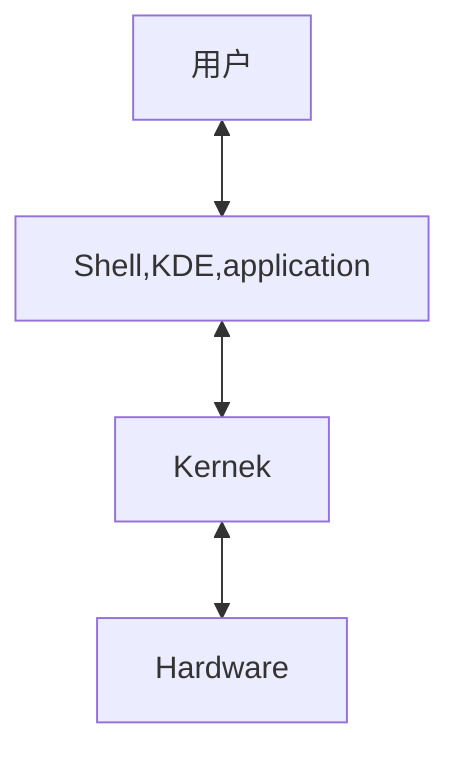
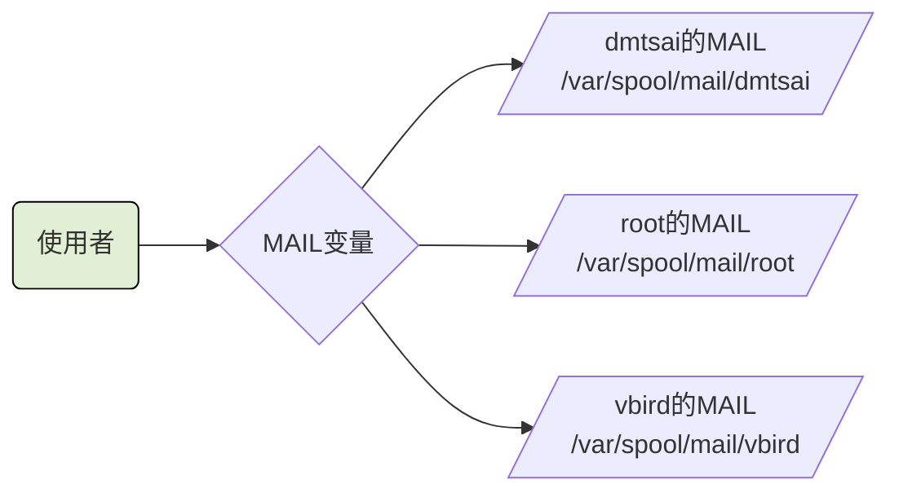

# BASH 与 Shell

## 什么是Shell
> Shell 是使用者的指令与核心进行沟通的工具


> 用户下达的指令 通过 shell 控制核心以便控制硬件实现某些功能

shell版本
>  Bourne SHell(sh)、C SHell、K SHell、TCSH等等
> Linux 使用的版本是 Bourne　Again SHell (bash),这个是Bourne Shell的增强版本。

所有的shell都在/etc/shells这个文件下
为什么系统上合法的shell要写入/etc/shells这个文件下呢。这是因为系统某些服务在运作过程中，会去检查使用者能够使用的shells，而这些shell的查询就是由/etc/shells这个文件

如某些FTP网站会去检查使用者的可用shell，而如果不想要让这些用户使用FTP以为的主机资源，可能会给予使用者一些怪怪的shell，让使用者无法以其他服务登入主机。这时就需要将这个shell写入到/etc/shells中。

```shell
[root@iZbp13op1xah7j3j1x457dZ ~]# cat /etc/passwd
root:x:0:0:root:/root:/bin/bash
bin:x:1:1:bin:/bin:/sbin/nologin
daemon:x:2:2:daemon:/sbin:/sbin/nologin
adm:x:3:4:adm:/var/adm:/sbin/nologin
lp:x:4:7:lp:/var/spool/lpd:/sbin/nologin
sync:x:5:0:sync:/sbin:/bin/sync
shutdown:x:6:0:shutdown:/sbin:/sbin/shutdown
halt:x:7:0:halt:/sbin:/sbin/halt
mail:x:8:12:mail:/var/spool/mail:/sbin/nologin
operator:x:11:0:operator:/root:/sbin/nologin
games:x:12:100:games:/usr/games:/sbin/nologin
ftp:x:14:50:FTP User:/var/ftp:/sbin/nologin
nobody:x:99:99:Nobody:/:/sbin/nologin
systemd-network:x:192:192:systemd Network Management:/:/sbin/nologin
dbus:x:81:81:System message bus:/:/sbin/nologin
polkitd:x:999:998:User for polkitd:/:/sbin/nologin
sshd:x:74:74:Privilege-separated SSH:/var/empty/sshd:/sbin/nologin
postfix:x:89:89::/var/spool/postfix:/sbin/nologin
chrony:x:998:996::/var/lib/chrony:/sbin/nologin
nscd:x:28:28:NSCD Daemon:/:/sbin/nologin
tcpdump:x:72:72::/:/sbin/nologin
rpc:x:32:32:Rpcbind Daemon:/var/lib/rpcbind:/sbin/nologin
rpcuser:x:29:29:RPC Service User:/var/lib/nfs:/sbin/nologin
nfsnobody:x:65534:65534:Anonymous NFS User:/var/lib/nfs:/sbin/nologin
nginx:x:997:995:Nginx web server:/var/lib/nginx:/sbin/nologin
gitlab-www:x:996:993::/var/opt/gitlab/nginx:/bin/false
git:x:995:992::/var/opt/gitlab:/bin/sh
gitlab-redis:x:994:991::/var/opt/gitlab/redis:/bin/false
gitlab-psql:x:993:990::/var/opt/gitlab/postgresql:/bin/sh
gitlab-prometheus:x:992:989::/var/opt/gitlab/prometheus:/bin/sh
az:x:1000:1000::/home/az:/bin/bash
alex:x:1001:1002::/home/alex:/bin/bash
arod:x:1002:1001::/home/arod:/bin/bash
[root@iZbp13op1xah7j3j1x457dZ ~]# 
```
## Bash shell 的功能

- 命令记忆能力（history）
  .bahs_history记录的是前一次登录以前所执行过的指令，而至于这一次登入所执行的指令都被暂存在内存中，当成功注销系统后，该指令记忆才会记录到.bash_history当中
- 命令与文件补全功能 （[tab] 按键的好处）
  [Tab] 接在一串指令的第一个字的后面，则为命令补全
  [Tab] 接在一串指令的第二个字以后时，则为 文件补全
- 命令别名设定功能 （alias）
  自定义指令：alias lm = 'ls -al'
- 工作控制、前景背景控制 （job control, foreground, background）
- 程序化脚本 （shell scripts）
- 通配符 （Wildcard）
  ls -l /usr/bin/X*

### 查询指令是否为Bash shell 的内建命令： type、
|选项|解释|
|---|---|
||没有任何参数时，type 会显示出name是外部指令还是bash内建指令|
|-t|type会将name 以下面这些字眼显示出他的意义|
||file：表示为外部指令|
||alias：表示该指令为命令别名所设定的名称|
||builtin：表示该指令为bash内建的指令功能|
|-p|如果后面接的name为外部指令时，才是显示完整文件名|
|-a|会有PATH变量定义的路径中，将所有含name的指令都显示出来，包含alias|

```shell
[root@iZbp13op1xah7j3j1x457dZ ~]# type ls
ls is aliased to `ls --color=auto'
[root@iZbp13op1xah7j3j1x457dZ ~]# type -t ls
alias
[root@iZbp13op1xah7j3j1x457dZ ~]# type -a ls
ls is aliased to `ls --color=auto'
ls is /usr/bin/ls
[root@iZbp13op1xah7j3j1x457dZ ~]# type cd
cd is a shell builtin
[root@iZbp13op1xah7j3j1x457dZ ~]# 
```

### 指令的下达与快速编辑按钮
```shell
[root@iZbp13op1xah7j3j1x457dZ ~]# cp /var/spool/mail/root /etc/crontab \
> /etc/fstab /root
```

快速的将这串指令整个删除掉。
|组合键|解释|
|---|---|
|[ctrl] + u/[ctrl] + k|分别是从光标处向前删除指令串([ctrl] + u)及向后删除指令串([ctrl] + k)|
|[ctrl] + a/[ctrl] + e|分别是让光标移动到整个指令串的最前面([ctrl] + a) 或最后面([ctrl] + e)|

## Shell的变量功能

- 变量的取用与设定：echo，变量设定的规则，unset

### 取变量值
```shell
[root@iZbp13op1xah7j3j1x457dZ ~]# echo $variable

[root@iZbp13op1xah7j3j1x457dZ ~]# echo $PATH
/root/.vscode-server/bin/019f4d1419fbc8219a181fab7892ebccf7ee29a2/bin/remote-cli:/usr/local/sbin:/usr/local/bin:/usr/sbin:/usr/bin:/root/bin
[root@iZbp13op1xah7j3j1x457dZ ~]# echo ${PATH}
/root/.vscode-server/bin/019f4d1419fbc8219a181fab7892ebccf7ee29a2/bin/remote-cli:/usr/local/sbin:/usr/local/bin:/usr/sbin:/usr/bin:/root/bin
[root@iZbp13op1xah7j3j1x457dZ ~]# 

```

### 设定变量值
```shell
[root@iZbp13op1xah7j3j1x457dZ ~]# echo ${myname}

[root@iZbp13op1xah7j3j1x457dZ ~]# myname=VBrid
[root@iZbp13op1xah7j3j1x457dZ ~]# echo ${myname}
VBrid
[root@iZbp13op1xah7j3j1x457dZ ~]# 

```

### 变量的设定规则
  - 变量与变量内容以一个 = 连结： 如 myname = VBird
  - 等号两边不能直接接空格符
  - 变量名称只能是英文字母与数字，但是开头字符不能是数字
  - 变量内容若有空格符可使用双引号或单引号将变量内容结合起来
      - 双引号的特殊字符如 $ 等，可以保有原本的特性。
        ```shell
        [root@iZbp13op1xah7j3j1x457dZ ~]# var="lang is $LANG"
        [root@iZbp13op1xah7j3j1x457dZ ~]# ehco $var
        bash: ehco: command not found
        [root@iZbp13op1xah7j3j1x457dZ ~]# echo $var
        lang is en_US.UTF-8
        [root@iZbp13op1xah7j3j1x457dZ ~]# 
        ```
      - 单引号内的特殊字符则仅为一般字符（纯文本）
        ```shell
        [root@iZbp13op1xah7j3j1x457dZ ~]# var='lang is $LANG'
        [root@iZbp13op1xah7j3j1x457dZ ~]# echo $var
        lang is $LANG
        [root@iZbp13op1xah7j3j1x457dZ ~]#
        ```
  - 可用跳脱字符 \ 将特殊符号（[Enter], $, \ , 空格符 " 等） 变成一般字符
  - 在一串指令的执行中，还需要其他额外的指令所提供的信息时，可以使用反单引号 &grave;指令&grave; 或 $指令
    ```shell
    [root@iZbp13op1xah7j3j1x457dZ ~]# version=$(uname -r)
    [root@iZbp13op1xah7j3j1x457dZ ~]# echo $version
    3.10.0-1160.114.2.el7.x86_64
    [root@iZbp13op1xah7j3j1x457dZ ~]# 

    ```
  - 若变量为扩展变量内容时，则可用 ”$变量名称“或$｛变量｝累加内容
    ```shell
    [root@iZbp13op1xah7j3j1x457dZ ~]# echo ${myname}
    VBrid
    [root@iZbp13op1xah7j3j1x457dZ ~]# myname="$myname"yes
    [root@iZbp13op1xah7j3j1x457dZ ~]# echo ${myname}
    VBridyes
    [root@iZbp13op1xah7j3j1x457dZ ~]# myname=${myname}yes
    [root@iZbp13op1xah7j3j1x457dZ ~]# echo ${myname}\
    > ^C
    [root@iZbp13op1xah7j3j1x457dZ ~]# echo ${myname}
    VBridyesyes
    [root@iZbp13op1xah7j3j1x457dZ ~]# 
    ```
  - 若该变量需要在其他子程序执行，则需要export来使变量变成环境变量 如 export PATH
    ```shell
    [root@iZbp13op1xah7j3j1x457dZ ~]# bash
    [root@iZbp13op1xah7j3j1x457dZ ~]# echo ${myname}
    
    [root@iZbp13op1xah7j3j1x457dZ ~]# exit
    exit
    [root@iZbp13op1xah7j3j1x457dZ ~]# export myname
    [root@iZbp13op1xah7j3j1x457dZ ~]# bash
    [root@iZbp13op1xah7j3j1x457dZ ~]# echo ${myname}
    VBridyesyes
    [root@iZbp13op1xah7j3j1x457dZ ~]# exit
    exit
    [root@iZbp13op1xah7j3j1x457dZ ~]# 
    ```
  - 通常大写字符为系统默认变量，自行设定变量可以使用小写字符，方便判断
  - 取消变量的方法为使用unst 如 unset myname
    ```shell
    [root@iZbp13op1xah7j3j1x457dZ ~]# unset myname
    [root@iZbp13op1xah7j3j1x457dZ ~]# echo ${myname}
    
    [root@iZbp13op1xah7j3j1x457dZ ~]# 
    ```
### 环境变量的功能
- 用env观察环境变量与常见环境变量说明
  ```shell
  [root@iZbp13op1xah7j3j1x457dZ ~]# env
  XDG_SESSION_ID=8160      # 当前的登录会话
  TERM_PROGRAM=vscode      # 终端程序
  HOSTNAME=iZbp13op1xah7j3j1x457dZ      # 主机名
  TERM=xterm-256color      # 终端机使用的环境类型
  SHELL=/bin/bash      # 目前这个环境下，使用的Shell是哪个程序
  HISTSIZE=1000      # 记录指令的数量 默认是1000
  SSH_CLIENT=36.142.32.177 14018 22      # ssh 客户端地址
  TERM_PROGRAM_VERSION=1.87.0      # 终端程序版本
  OLDPWD=/tmp/vitest      # 最近一次工作目录
  USER=root      # 使用者名称
  LS_COLORS=rs=0:di=38;5;27:ln=38;5;51:mh=44;38;5;15:pi=40;38;5;11:so=38;5;13:do=38;5;5:bd=48;5;232;38;5;11:cd=48;5;232;38;5;3:or=48;5;232;38;5;9:mi=05;48;5;232;38;5;15:su=48;5;196;38;5;15:sg=48;5;11;38;5;16:ca=48;5;196;38;5;226:tw=48;5;10;38;5;16:ow=48;5;10;38;5;21:st=48;5;21;38;5;15:ex=38;5;34:*.tar=38;5;9:*.tgz=38;5;9:*.arc=38;5;9:*.arj=38;5;9:*.taz=38;5;9:*.lha=38;5;9:*.lz4=38;5;9:*.lzh=38;5;9:*.lzma=38;5;9:*.tlz=38;5;9:*.txz=38;5;9:*.tzo=38;5;9:*.t7z=38;5;9:*.zip=38;5;9:*.z=38;5;9:*.Z=38;5;9:*.dz=38;5;9:*.gz=38;5;9:*.lrz=38;5;9:*.lz=38;5;9:*.lzo=38;5;9:*.xz=38;5;9:*.bz2=38;5;9:*.bz=38;5;9:*.tbz=38;5;9:*.tbz2=38;5;9:*.tz=38;5;9:*.deb=38;5;9:*.rpm=38;5;9:*.jar=38;5;9:*.war=38;5;9:*.ear=38;5;9:*.sar=38;5;9:*.rar=38;5;9:*.alz=38;5;9:*.ace=38;5;9:*.zoo=38;5;9:*.cpio=38;5;9:*.7z=38;5;9:*.rz=38;5;9:*.cab=38;5;9:*.jpg=38;5;13:*.jpeg=38;5;13:*.gif=38;5;13:*.bmp=38;5;13:*.pbm=38;5;13:*.pgm=38;5;13:*.ppm=38;5;13:*.tga=38;5;13:*.xbm=38;5;13:*.xpm=38;5;13:*.tif=38;5;13:*.tiff=38;5;13:*.png=38;5;13:*.svg=38;5;13:*.svgz=38;5;13:*.mng=38;5;13:*.pcx=38;5;13:*.mov=38;5;13:*.mpg=38;5;13:*.mpeg=38;5;13:*.m2v=38;5;13:*.mkv=38;5;13:*.webm=38;5;13:*.ogm=38;5;13:*.mp4=38;5;13:*.m4v=38;5;13:*.mp4v=38;5;13:*.vob=38;5;13:*.qt=38;5;13:*.nuv=38;5;13:*.wmv=38;5;13:*.asf=38;5;13:*.rm=38;5;13:*.rmvb=38;5;13:*.flc=38;5;13:*.avi=38;5;13:*.fli=38;5;13:*.flv=38;5;13:*.gl=38;5;13:*.dl=38;5;13:*.xcf=38;5;13:*.xwd=38;5;13:*.yuv=38;5;13:*.cgm=38;5;13:*.emf=38;5;13:*.axv=38;5;13:*.anx=38;5;13:*.ogv=38;5;13:*.ogx=38;5;13:*.aac=38;5;45:*.au=38;5;45:*.flac=38;5;45:*.mid=38;5;45:*.midi=38;5;45:*.mka=38;5;45:*.mp3=38;5;45:*.mpc=38;5;45:*.ogg=38;5;45:*.ra=38;5;45:*.wav=38;5;45:*.axa=38;5;45:*.oga=38;5;45:*.spx=38;5;45:*.xspf=38;5;45:
  PATH=/root/.vscode-server/bin/019f4d1419fbc8219a181fab7892ebccf7ee29a2/bin/remote-cli:/usr/local/sbin:/usr/local/bin:/usr/sbin:/usr/bin:/root/bin      
  MAIL=/var/spool/mail/root      # 用户所取用的mailbox位置
  PWD=/root      # 当前用户所在的工作目录
  LANG=en_US.UTF-8      # 语系
  HISTCONTROL=ignoredups      
  HOME=/root
  SHLVL=5
  LOGNAME=root
  SSH_CONNECTION=36.142.32.177 14018 172.16.100.115 22
  VSCODE_IPC_HOOK_CLI=/run/user/0/vscode-ipc-3d44973d-80c4-4823-bcba-e5faa38779f9.sock
  LESSOPEN=||/usr/bin/lesspipe.sh %s
  BROWSER=/root/.vscode-server/bin/019f4d1419fbc8219a181fab7892ebccf7ee29a2/bin/helpers/browser.sh
  XDG_RUNTIME_DIR=/run/user/0
  COLORTERM=truecolor
  _=/usr/bin/env
  [root@iZbp13op1xah7j3j1x457dZ ~]# 
  ```
- set 观察所有变量（包含环境变量与自定义变量）
  使用｛大写的字母｝来设定的变量，一般为系统内定需要的变量
  - PS1：（提示字符的设定）
    这是命令提示符。每次按下enter取执行某个指令后，最后再次出现提示字符时，就会主动取读取这个变量值

    |选项|解释|
    |---|---|
    |\d|可显示出 星期 月 日 的日期格式 |
    |\H|完整的主机名|
    |\h|仅取主机名在第一个小数点之前的名字|
    |\t|显示时间，为24小时格式的 HH：MM：SS|
    |\T|显示时间，为12小时格式的 HH：MM：SS|
    |\A|显示时间，为24小时格式的 HH：MM|
    |\@|显示时间，为12小时格式的 am/pm |
    |\u|目前使用者的账号名称|
    |\v|BASH的版本信息|
    |\w|完整的工作目录名称，有根目录写器的目录名称。 但家目录会以~代替|
    |\W|利用basename函数取得工作目录名称，所以仅会列出最后一个目录名|
    |\#|下达的第几个指令|
    |\$|提示字符，若是root 则为# 否则为$|
    ```shell
    [root@iZbp13op1xah7j3j1x457dZ ~]# cd /home
    [root@iZbp13op1xah7j3j1x457dZ home]# PS1='[\u@\h \w \A #\#]\$'
    [root@iZbp13op1xah7j3j1x457dZ /home 17:38 #14]#
    ```
  - $ shell的PID（线程代号）
    ```shell
    [root@iZbp13op1xah7j3j1x457dZ ~]# echo $$
    25061
    [root@iZbp13op1xah7j3j1x457dZ ~]# 
    ```
  - ? (关于上个执行指令的回传值)
    执行某些指令时，都会回传一个执行后的代码。一般来说，如果成功的执行了该指令，则会回传一个0值。如果执行过程中发生了错误，就会回传 错误代码
    ```shell
    [root@iZbp13op1xah7j3j1x457dZ ~]# echo $SHELL
    /bin/bash
    [root@iZbp13op1xah7j3j1x457dZ ~]# echo $?
    0
    [root@iZbp13op1xah7j3j1x457dZ ~]# 12name=VBrid
    bash: 12name=VBrid: command not found
    [root@iZbp13op1xah7j3j1x457dZ ~]# echo $?
    127
    # 关于上一个指令的回传值
    [root@iZbp13op1xah7j3j1x457dZ ~]# echo $?
    0
    [root@iZbp13op1xah7j3j1x457dZ ~]# 
    ```
  - OSTYPE，HOSTTYPE，MACHTYPE（主机硬件与核心的等级）
    个人主机的CPU主要分为32/64位，32位又可分为i386，i586，i686,。64位称为x86_64。不同等级的CPU指令集不太相同，这可能需要针对某些CPU进行优化，以取得较佳的性能。高价的硬件通常会向下兼容旧的软件，高价的软件不兼容旧的硬件。
  - export 自定义变量转化成环境变量
    环境变量与自定义的变量差异是该变量是否会被子程序所继承引用
    在一个bash底下下达的任何指令都是由这个bash所衍生出来的，那些被下达的指令就被称为子程序。
    子程序仅会继承父程序的环境变量，不会继承父程序的自定义变量。
### 影响显示结果的语系变量（locale）

locale -a 查看支持的语系
```shell
[root@iZbp13op1xah7j3j1x457dZ ~]# locale -a
aa_DJ
aa_DJ.iso88591
aa_DJ.utf8
aa_ER
aa_ER@saaho
aa_ER.utf8
aa_ER.utf8@saaho
aa_ET
aa_ET.utf8
af_ZA
...
zh_CN
zh_CN.gb18030
zh_CN.gb2312
zh_CN.gbk
zh_CN.utf8
zh_HK
zh_HK.big5hkscs
zh_HK.utf8
zh_SG
zh_SG.gb2312
zh_SG.gbk
zh_SG.utf8
zh_TW
zh_TW.big5
zh_TW.euctw
zh_TW.utf8
zu_ZA
zu_ZA.iso88591
zu_ZA.utf8
[root@iZbp13op1xah7j3j1x457dZ ~]#

# 查看当前使用的语系
[root@iZbp13op1xah7j3j1x457dZ ~]# locale
LANG=en_US.UTF-8      # 系统的默认语言环境
LC_CTYPE="en_US.UTF-8"      # 字符分类、大小写转换、字符编解码等行为的语言环境
LC_NUMERIC="en_US.UTF-8"      # 数字格式,如小数点和千位分隔符的显示方式
LC_TIME="en_US.UTF-8"      # 日期和时间的格式化方式
LC_COLLATE="en_US.UTF-8"      # 字符串的排序和比较规则
LC_MONETARY="en_US.UTF-8"      # 货币符号、小数点、千位分隔符等货币格式
LC_MESSAGES="en_US.UTF-8"      # 系统消息的语言
LC_PAPER="en_US.UTF-8"      # 纸张大小和方向等打印相关的本地化选项
LC_NAME="en_US.UTF-8"      # 人名的格式化方式
LC_ADDRESS="en_US.UTF-8"      # 地址的格式化方式
LC_TELEPHONE="en_US.UTF-8"      # 电话号码的格式化方式
LC_MEASUREMENT="en_US.UTF-8"      # 度量单位的格式化方式
LC_IDENTIFICATION="en_US.UTF-8"      # 包含了 locale 的标识信息
LC_ALL=      # 可以用来覆盖所有其他的 LC_ 设置,将所有本地化选项统一设置为同一个 locale。但在这里它是空的,表示不使用这个设置
[root@iZbp13op1xah7j3j1x457dZ ~]# 
```
如果设定了LANG 或 LC_ALL,则其他的语系变量就会被中两个变量所取代
语系文件在  /usr/lib/locale/ 目录中， 整体系统默认的语系在 /etc/local.conf这个目录下。

### 变量的有效范围
环境变量=全局变量
自定义变量=局部变量

为什么环境变量的数据可以被子程序所引用呢，这是因为内存配置的关系。理论上是这样
- 当启动要给shell，操作系统分配一记忆区块给shell使用，此内存的变量可以让子程序使用
- 若在父程序利用export功能，可以让自定义变量的内容写到上述的记忆区块当中（环境变量）
- 当加载另一个shell时（即启动子程序，而离开原本的父程序），子shell可以将父shell的环境变量所在的记忆区块导入自己的环境变量区块当中

### 变量键盘读取、数组与宣告： read，array，declare

- read
  |选项|解释|
  |---|---|
  |-p|后面可以接提示字符|
  |-t|后面可以接等待的 秒数 |

  ```shell
  # 将用户输入的内容变成 atest变量的内容
  [root@iZbp13op1xah7j3j1x457dZ ~]# read atest
  this is a test
  [root@iZbp13op1xah7j3j1x457dZ ~]# echo ${atest}
  this is a test
  # 30秒内输入自己的名字，并将输入字符串作为名为named的变量内容
  [root@iZbp13op1xah7j3j1x457dZ ~]# read -p "Please keyin your name:" -t 30 named
  Please keyin your name:VBrid Tsai
  [root@iZbp13op1xah7j3j1x457dZ ~]# echo ${named}
  VBrid Tsai
  [root@iZbp13op1xah7j3j1x457dZ ~]# 
  ```
- declare / typeset
  声明变量类型 如果使用declare后面没有接任何参数，bash就会主动将所有变量名称与内容通通叫出来
  |选项|解释|
  |---|---|
  |-a|将后面名为variable的变量定义成为数组array类型|
  |-i|将后面名为variable的变量定义成为整数数字（integer）类型|
  |-x|用法与export一样，就是将后面的variable变成环境变量|
  |-r|将变量设定成为readonly类型，该变量不可被更改内容，也不能unset|
  ```shell
  [root@iZbp13op1xah7j3j1x457dZ ~]# sum=100+400+50
  [root@iZbp13op1xah7j3j1x457dZ ~]# echo ${sum}
  100+400+50
  # 上面没有计算是因为他是文本类型
  [root@iZbp13op1xah7j3j1x457dZ ~]# declare -i sum=100+400+50
  [root@iZbp13op1xah7j3j1x457dZ ~]# echo ${sum}
  550
  [root@iZbp13op1xah7j3j1x457dZ ~]#

  # 将sum变成环境变量
  [root@iZbp13op1xah7j3j1x457dZ ~]# declare -x sum
  [root@iZbp13op1xah7j3j1x457dZ ~]# export | grep sum
  declare -ix sum="550"
  [root@iZbp13op1xah7j3j1x457dZ ~]#

  # 将sum 变成只读属性
  [root@iZbp13op1xah7j3j1x457dZ ~]# declare -r sum
  [root@iZbp13op1xah7j3j1x457dZ ~]# sum=testting
  bash: sum: readonly variable
  [root@iZbp13op1xah7j3j1x457dZ ~]#

  # 将sum变成非环境变量的自定义变量
  [root@iZbp13op1xah7j3j1x457dZ ~]# declare +x sum
  [root@iZbp13op1xah7j3j1x457dZ ~]# declare -p sum
  declare -ir sum="550"
  [root@iZbp13op1xah7j3j1x457dZ ~]# 
  ```
- 数组（array）变量类型
  在bash中 数组的设定方式：var[index]=content
  ```shell
  [root@iZbp13op1xah7j3j1x457dZ ~]# var[1]='small min'
  [root@iZbp13op1xah7j3j1x457dZ ~]# var[2]='big min'
  [root@iZbp13op1xah7j3j1x457dZ ~]# var[3]='nice min'
  [root@iZbp13op1xah7j3j1x457dZ ~]# echo "${var[1]},${var[2]},${var[3]}"
  small min,big min,nice min
  [root@iZbp13op1xah7j3j1x457dZ ~]# 
  ```
### 与文件系统及程序的限制关系：ulimit
限制用户的某些系统资源，包括可以开启的文件数量，可以使用的CUP时间，可以使用的内存总量等等
|选项|解释|
|---|---|
|-H|hard limit，严格的设定，必定不能超过这个设定的数值|
|-S|soft limit，警告的设定，可以超过这个设定值，但是若超过则有警告讯息，在设定上，通常soft会比hard小。如： soft可以设定为80而hard设定为100，那么可以使用到90系统会有警告讯息通知|
|-a|后面不接任何选项与参数，可列出所有限制额度|
|-c|当某些程序发生错误时，系统可能会将该程序在内存中的信息写成文件（除错用）。这种文件就被称为核心文件（core file）。此为限制每个核心文件的最大容量|
|-f|此shell可以建立的最大文件容量（一般可能设定为2GB）单位为KBytes|
|-d|程序可使用的最大断裂内存（segment）容量|
|-l|可用于锁定（lock）的内存量|
|-t|可使用的最大CPU时间（单位为秒）|
|-u|单一用户可以使用的最大程序（process）数量|
```shell
[root@iZbp13op1xah7j3j1x457dZ ~]# ulimit -a
core file size          (blocks, -c) 0      # 只要是0就代表没限制
data seg size           (kbytes, -d) unlimited
scheduling priority             (-e) 0
file size               (blocks, -f) unlimited       # 可建立的单一文件的大小
pending signals                 (-i) 6942
max locked memory       (kbytes, -l) 64
max memory size         (kbytes, -m) unlimited
open files                      (-n) 65535       # 同时可开启的文件数量
pipe size            (512 bytes, -p) 8
POSIX message queues     (bytes, -q) 819200
real-time priority              (-r) 0
stack size              (kbytes, -s) 8192
cpu time               (seconds, -t) unlimited
max user processes              (-u) 6942
virtual memory          (kbytes, -v) unlimited
file locks                      (-x) unlimited
[root@iZbp13op1xah7j3j1x457dZ ~]# 

```
### 变量内容的删除、取代与替换（Optional）
- 变量内容的删除与取代
  |变量设定方式|说明|
  |---|---|
  |$\{变量#关键词}|若变量内容从头开始的数据符合 关键词 ，则将符合的最短数据删除|
  |$\{变量##关键词}|若变量内容从头开始的数据符合　关键词，　则将符合的最长数据删除|
  |$\{变量%关键词}|若变量内容从尾向前的数据符合 关键词， 则将符合的最短数据删除|
  |$\{变量%%关键词}|若变量内容从尾向前的数据符合 关键词， 则讲符合的最长数据删除|
  |$\{变量/旧字符串/新字符串}|若变量内容符合 旧字符串 则 第一个旧字符串会被新字符串取代|
  |$\{变量//旧字符串/新字符串}|若变量内容符合 旧字符串 则 全部的旧字符串会被新字符串取代|
- 变量的测试与内容替换
  ```shell
  [root@iZbp13op1xah7j3j1x457dZ ~]# echo ${username}

  [root@iZbp13op1xah7j3j1x457dZ ~]# username=${username-root}
  [root@iZbp13op1xah7j3j1x457dZ ~]# echo ${usrename}
  
  [root@iZbp13op1xah7j3j1x457dZ ~]# echo ${username}
  root
  [root@iZbp13op1xah7j3j1x457dZ ~]# user='vbird tsai'
  [root@iZbp13op1xah7j3j1x457dZ ~]# user=${user-root}
  [root@iZbp13op1xah7j3j1x457dZ ~]# echo ${user}
  vbird tsai
  [root@iZbp13op1xah7j3j1x457dZ ~]# 

  [root@iZbp13op1xah7j3j1x457dZ ~]# username=""
  [root@iZbp13op1xah7j3j1x457dZ ~]# username=${username-root}
  [root@iZbp13op1xah7j3j1x457dZ ~]# echo ${username}
  
  [root@iZbp13op1xah7j3j1x457dZ ~]# username=${username:-root}
  [root@iZbp13op1xah7j3j1x457dZ ~]# echo ${username}
  root
  [root@iZbp13op1xah7j3j1x457dZ ~]# 

  ```
  |变量设定方式|str没有设定|str为空字符串|str已设定非为空字符串|
  |---|---|---|---|
  |var=$\{str-expr}|var=expr|var=|var=$str|
  |var=$\{str:expr}|var=expr|var=expr|var=$str|
  |var=$\{str+expr}|var=|var=expr|var=expr|
  |var=$\{str:+expr}|var=|var=|var=expr|
  |var=$\{str=expr}|str=expr var=expr|str不变 var=|str 不变 var=$str|
  |var=$\{str:=expr}|str=expr var=expr|str=expr var=expr|str 不变  var=$str|
  |var=$\{str?expr}|expr输出至stderr|var=|var=$str|
  |var=$\{str:?expr}|expr输出至stderr|expr输出至stdrr|var=$str|

### 命令别名与历史命令
- 命令别名设定： alias，unalias
- 历史命令：history
  
|选项|解释|
|---|---|
|n|数字，意思是 要列出最近的n笔命令行表|
|-c|将目前的shell中的所有history内容全部消除|
|-a|将目前新增的history指令新增入的his他file中，若没有加histfiles，则预设写入 ~/.bash_history|
|-r|将histfiles的内容读到目前这个shell的history记忆中|
|-w|将目前的histroy记忆内容写入histfiles中|
  
### Bash Shell 的操作环境
- 路径与指令搜寻顺序
  指令执行的顺序 如下
  ```shell
  [root@iZbp13op1xah7j3j1x457dZ ~]# alias echo="echo -n"
  [root@iZbp13op1xah7j3j1x457dZ ~]# type -a echo
  echo is aliased to `echo -n'
  echo is a shell builtin
  echo is /usr/bin/echo
  [root@iZbp13op1xah7j3j1x457dZ ~]# 

  ```
- bash的进站与欢迎讯息： /etc/issue, /etc/motd
  终端机接口（tty1~tty6）登入的时候，会有几行提示字符串，这就是进站画面，这些字符串写在 /etc/issue里面
  ```shell
  [root@iZbp13op1xah7j3j1x457dZ ~]# cat /etc/issue
  \S
  Kernel \r on an \m
  
  [root@iZbp13op1xah7j3j1x457dZ ~]# 

  ```
  |issue内的各代码意义|
  |---|
  |\d 本地端时间的日期|
  |\l 显示第几个终端机接口|
  |\m 显示硬件的等级（i386/i486/i586/i686...）|
  |\n 显示主机的网络名称|
  |\O 显示domain name|
  |\r 操作系统的版本（相当于 uname -r）|
  |\t 显示本地端时间的时间|
  |\S 操作系统名称|
  |\v 操作系统版本|

  让使用者登入后取得一些讯息， 可以将讯息加入 /etc/motd 里面去！

- bash的环境配置文件
  - login 与 non-login shell
    login shell：取得bash时需要完整的登入流程。如：要使用tty1~tty6登入，需要输入用户的账号与密码，此时取得的bash 称为login shell
    non-login：取得bash接口的方法不需要重复登入的动作。如 在原本的bash环境下再下达bash这个指令，这第二个子程序就是non-login shell。以X window 登入的Linux后，再以X的图形化接口启动终端机，此时这个终端机并没有输入账号与密码，这时它也是non-login shell。
    这两中方式取得bash，读取的配置文件数据是不一样的。
    - login shell读取的配置文件
      
      /etc/profile: 系统整体的设定，
      
      ```shell
        1 # /etc/profile
        2 
        3 # System wide environment and startup programs, for login setup
        4 # Functions and aliases go in /etc/bashrc
        5 
        6 # It's NOT a good idea to change this file unless you know what you
        7 # are doing. It's much better to create a custom.sh shell script in
        8 # /etc/profile.d/ to make custom changes to your environment, as this
        9 # will prevent the need for merging in future updates.
       10 
       11 pathmunge () {
       12     case ":${PATH}:" in
       13         *:"$1":*)
       14             ;;
       15         *)
       16             if [ "$2" = "after" ] ; then
       17                 PATH=$PATH:$1
       18             else
       19                 PATH=$1:$PATH
       20             fi
       21     esac
       22 }
       23 
       24 
       25 if [ -x /usr/bin/id ]; then
       26     if [ -z "$EUID" ]; then
       27         # ksh workaround
       28         EUID=`/usr/bin/id -u`
       29         UID=`/usr/bin/id -ru`
       30     fi
       31     USER="`/usr/bin/id -un`"
       32     LOGNAME=$USER
       33     MAIL="/var/spool/mail/$USER"
       34 fi
       35 
       36 # Path manipulation
       37 if [ "$EUID" = "0" ]; then
       38     pathmunge /usr/sbin
       39     pathmunge /usr/local/sbin
       40 else
       41     pathmunge /usr/local/sbin after
       42     pathmunge /usr/sbin after
       43 fi
       44 
       45 HOSTNAME=`/usr/bin/hostname 2>/dev/null`
       46 HISTSIZE=1000
       47 if [ "$HISTCONTROL" = "ignorespace" ] ; then
       48     export HISTCONTROL=ignoreboth
       49 else
       50     export HISTCONTROL=ignoredups
       51 fi
       52 
       53 export PATH USER LOGNAME MAIL HOSTNAME HISTSIZE HISTCONTROL
       54 
       55 # By default, we want umask to get set. This sets it for login shell
       56 # Current threshold for system reserved uid/gids is 200
       57 # You could check uidgid reservation validity in
       58 # /usr/share/doc/setup-*/uidgid file
       59 if [ $UID -gt 199 ] && [ "`/usr/bin/id -gn`" = "`/usr/bin/id -un`" ]; then
       60     umask 002
       61 else
       62     umask 022
       63 fi
       64 
       65 for i in /etc/profile.d/*.sh /etc/profile.d/sh.local ; do
       66     if [ -r "$i" ]; then
       67         if [ "${-#*i}" != "$-" ]; then
       68             . "$i"
       69         else
       70             . "$i" >/dev/null
       71         fi
       72     fi
       73 done
       74 
       75 unset i
      ```
      - PATH: 会根据UID决定PATH变量要不要含有sbin的系统指令目录
      - MAIL：根据账号设定好使用者的mailbox到/var/spool/mail/账号名
      - USER：根据用户的账号设定这一变量的内容
      - HOSTNAME：根据主机的hostname指令决定这个变量的内容
      - HISTSIZE：历史命令记录笔数
      - umask：root默认为022 而一般用户为002
        
      下面的这些数据也会被呼叫进来
       - /etc/profile.d/*sh
         只要在/etc/profile.d/目录下且扩展名为.sh，使用者有r的权限，那么该文件就会被/etc/profile呼叫进来。这个目录下的文件规范了bash操作接口的颜色、语系、ll与ls指令的命令别名、vi的命令别名、which的命令别名等。如果需要帮助使用者设定一些共享的命令别名时，可以在这个目录下新建扩展名为.sh的文件，并将所需要的数据写入即可
       - /etc/locale.conf
         这个文件是由/etc/profile.d/lang.sh呼叫进来的。这也是决定bash预设哪种语系的重要配置文件。文件里最重要的就是LANG/LC_ALL这些个变量的设定。
       - /usr/share/bash-completion/completions/*
         命令补全、档名补全以及进行指令的选项/参数不全功能，就是从这个目录里面找到相应的指令来处理的。这个目录里的内容是由/etc/profile.d/bash_completion.sh这个文件载入的
    bash的login shell情况下所读取的整体环境配置文件其实只有/etc/profile,但是/etc/profile还会呼叫其他的配置文件，所以可以让bash操作接口变得非常友善    
      \~/.bash_profile或~/.bash_login 或 ~/.profile： 使用者个人设定，
      bash读取完系统整体配置文件后，便会读取使用者的个人配置文件。依序有如下三个主要文件
        1. ~/.bash_profile
        2. ~/.bash_login
        3. \~/.profile
      其实bash的login shell 设定只会读取上面三个文件中的一个，二读取的顺序则是按照上面的顺序进行读取的。也就是说，如果~/.bash_profile存在，那么其他两个文件不论有无存在，都不会被读取。如果~/.bash_profile不存在才会读取~/.bash_login。依此类推。 之所有会有这么多的文件，是因为其他shell转换过来的使用者的习惯
      ```shell
      [root@iZbp13op1xah7j3j1x457dZ ~]# cat ~/.bash_profile
      # .bash_profile
      
      # Get the aliases and functions
      if [ -f ~/.bashrc ]; then
              . ~/.bashrc
      fi
      
      # User specific environment and startup programs
      
      PATH=$PATH:$HOME/bin
      
      export PATH
      [root@iZbp13op1xah7j3j1x457dZ ~]# 

      [az@iZbp13op1xah7j3j1x457dZ root]$ cat ~/.bash_profile
      # .bash_profile
      
      # Get the aliases and functions
      if [ -f ~/.bashrc ]; then      # 判断并读取 ~/.bashrc
              . ~/.bashrc
      fi
      
      # User specific environment and startup programs
      
      PATH=$PATH:$HOME/.local/bin:$HOME/bin   #  处理个人化设定
      
      export PATH
      [az@iZbp13op1xah7j3j1x457dZ root]$ 
      ```
      文件内有设定PATH这个变量，并使用export 将 PATH变成环境变量。由于PATH在/etc/profile当中已经设定过了，所以这里就以累加的方式增加用户家目录下的~/bin/为额外的执行文件放置的目录。也就是说，可以将自己建立的执行档放置到自己家目录下的~/bin/ 目录。就可以直接执行该执行档而不需要使用绝对/相对路径来执行该文件。
      ```mermaid
      flowchart LR;
          A("/etc/profile")--> B("~/.bash_profile")--> C("开始操作BASH")
          A -.->D("/etc/profile.d/*.sh")
          D -.->E("/etc/locale.conf")
          B -.->F("~/.bashrc")
          F -.->G("/etc/bashrc")
      ```
      实现的方向是主流程，虚线的方向则是被呼叫的配置文件。
      - source：读取环境配置文件的指令
        将配置文件设定好后，通常都是注销后再次登入，才会生效，使用source这个指令可以直接读取配置文件而不用注销登录。 使用 `source ~/.bashrc` 与 `. ~/.bashrc` 效果一样
    - non-login shell 读取的配置文件
      - ~/.bashrc
        使用 non-login shell这种非登录情况下取得bash操作接口的环境配置文件仅仅是 ~/.bashrc。
        ```shell
        [az@iZbp13op1xah7j3j1x457dZ root]$ cat ~/.bashrc
        # .bashrc
        
        # Source global definitions
        if [ -f /etc/bashrc ]; then
                . /etc/bashrc
        fi
        
        # Uncomment the following line if you don't like systemctl's auto-paging feature:
        # export SYSTEMD_PAGER=
        
        # User specific aliases and functions
        [az@iZbp13op1xah7j3j1x457dZ root]$ su -
        Password: 
        Last login: Thu Aug  8 11:37:28 CST 2024 from 36.142.32.177 on pts/2
        Last failed login: Sat Aug 17 12:31:05 CST 2024 from 121.196.208.112 on ssh:notty
        There were 183 failed login attempts since the last successful login.
        [root@iZbp13op1xah7j3j1x457dZ ~]# cat ~/.bashrc
        # .bashrc
        
        # User specific aliases and functions
        
        alias rm='rm -i'
        alias cp='cp -i'
        alias mv='mv -i'
        
        # Source global definitions
        if [ -f /etc/bashrc ]; then
                . /etc/bashrc
        fi
        [root@iZbp13op1xah7j3j1x457dZ ~]# 
        ```
        在/etc/bashrc中帮bash定义了如下数据：
          - 根据不同的UID规范出umask的值
          - 根据不同的UID规范出提示字符（PS1的变量）
          - 呼叫/etc/profile.d/*.sh的设定
  - 其他相关配置文件
      - /etc/man_db.conf
      - \~/.bash_history
      - \~/.bash_logout : 当注销bash后，系统需要处理完其他这些任务才能离开    
- 终端机的环境设定：stty，set
  在tty1~tty6这六个文件接口的终端机环境中登录的时候可以取得一下字符设定的功能。如：使用backspace来删除命令行上的字符，使用ctrl+c 强制终止一个指令的运行，当输入错误时，会有警告声等等。这是因为登录终端机的时候，会自动取得一些终端机的输入环境的设定。
  ```shell
  # stty 即 setting tty
  [root@iZbp13op1xah7j3j1x457dZ ~]# stty -a
  speed 38400 baud; rows 19; columns 98; line = 0;
  intr = ^C; quit = ^\; erase = ^?; kill = ^U; eof = ^D; eol = M-^?; eol2 = M-^?; swtch = <undef>;
  start = ^Q; stop = ^S; susp = ^Z; rprnt = ^R; werase = ^W; lnext = ^V; flush = ^O;
  min = 1; time = 0;
  -parenb -parodd -cmspar cs8 hupcl -cstopb cread -clocal -crtscts
  -ignbrk brkint -ignpar -parmrk -inpck -istrip -inlcr -igncr icrnl ixon -ixoff -iuclc ixany imaxbel
  iutf8
  opost -olcuc -ocrnl onlcr -onocr -onlret -ofill -ofdel nl0 cr0 tab0 bs0 vt0 ff0
  isig icanon iexten echo echoe echok -echonl -noflsh -xcase -tostop -echoprt echoctl echoke
  [root@iZbp13op1xah7j3j1x457dZ ~]# 
  ```
  - intr：发送一个interrupt（中断）的信号给目前正在run的程序      [Ctrl] +　C
  - quit：发送一个quit的信号给目前正在run的程序      [Ctrl] +　\
  - erase：向后删除字符      [Ctrl] +　?
  - kill：删除在目前指令列上的所有文字      [Ctrl] +　U
  - eof：End of file ，代表结束输入      [Ctrl] +　D
  - start：在某个程序停止后，重新启动它的output      [Ctrl] +　Q
  - stop：停止目前屏幕的输出      [Ctrl] +　S
  - susp：发送一个terminal stop 的信号给正在run的程序      [Ctrl] +　Z
  ```shell
  [root@iZbp13op1xah7j3j1x457dZ ~]# stty erase ^h # 自定义快捷键
  ```
  其他终端机设置的方式： set

  |选项|解释|
  |---|---|
  |-u|默认不启用。若启用，当使用未设定变量时，会显示错误信息|
  |-v|默认不启用。若启用，在信息被输出前，会先显示信息的原始内容|
  |-x|默认不启用。若启用，在指令被执行前，会显示指令内容（前面有++符号）|
  |-h|默认启用。与历史命令有关|
  |-H|默认启用。与历史命令有关|
  |-m|默认启用。与工作管理有关|
  |-B|默认启用。与[]的作用有关|
  |-C|默认不启用。若使用>等，则若文件存在时，该文件不会被覆盖|
  
  ```shell
  # 显示目前所有的set设定值
  [root@iZbp13op1xah7j3j1x457dZ ~]# echo $-
  himBH
  # $- 变量内容就是set的所有设定。 bash预设是himBH
  [root@iZbp13op1xah7j3j1x457dZ ~]# 

  # 默认情况下 -u 不开启，所有未设定的变量为空
  [root@iZbp13op1xah7j3j1x457dZ ~]# echo $vbirding
  
  [root@iZbp13op1xah7j3j1x457dZ ~]# set－ｕ
  bash: set－ｕ: command not found
  # 使用未设定的变量时，会显示错误信息
  [root@iZbp13op1xah7j3j1x457dZ ~]# set -u
  [root@iZbp13op1xah7j3j1x457dZ ~]# echo $vbirding
  bash: vbirding: unbound variable
  [root@iZbp13op1xah7j3j1x457dZ ~]# 

  root@iZbp13op1xah7j3j1x457dZ ~]# echo ${HOME}
  /root
  [root@iZbp13op1xah7j3j1x457dZ ~]# set -x
  +++ __vsc_preexec_only -x
  +++ '[' 1 = 0 ']'
  ++ __vsc_prompt_cmd_original
  ++ __vsc_status=0
  ++ __vsc_restore_exit_code 0
  ++ return 0
  ++ for cmd in '"${__vsc_original_prompt_command[@]}"'
  ++ eval 'printf "\033]0;%s@%s:%s\007" "${USER}" "${HOSTNAME%%.*}" "${PWD/#$HOME/~}"'
  +++ printf '\033]0;%s@%s:%s\007' root iZbp13op1xah7j3j1x457dZ '~'
  ++ __vsc_precmd
  ++ __vsc_command_complete 0
  ++ '[' 'set -x' = '' ']'
  ++ builtin printf '\e]633;D;%s\a' 0
  ++ __vsc_update_cwd
  +++ __vsc_escape_value /root
  +++ '[' 5 -ge 2000 ']'
  +++ builtin local LC_ALL=C str=/root i byte token out=
  +++ (( i=0 ))
  +++ (( i < 5 ))
  +++ byte=/
  +++ '[' / = '\' ']'
  +++ '[' / = ';' ']'
  +++ token=/
  +++ out+=/
  +++ (( ++i  ))
  +++ (( i < 5 ))
  +++ byte=r
  +++ '[' r = '\' ']'
  +++ '[' r = ';' ']'
  +++ token=r
  +++ out+=r
  +++ (( ++i  ))
  +++ (( i < 5 ))
  +++ byte=o
  +++ '[' o = '\' ']'
  +++ '[' o = ';' ']'
  +++ token=o
  +++ out+=o
  +++ (( ++i  ))
  +++ (( i < 5 ))
  +++ byte=o
  +++ '[' o = '\' ']'
  +++ '[' o = ';' ']'
  +++ token=o
  +++ out+=o
  +++ (( ++i  ))
  +++ (( i < 5 ))
  +++ byte=t
  +++ '[' t = '\' ']'
  +++ '[' t = ';' ']'
  +++ token=t
  +++ out+=t
  +++ (( ++i  ))
  +++ (( i < 5 ))
  +++ builtin printf '%s\n' /root
  ++ builtin printf '\e]633;P;Cwd=%s\a' /root
  ++ __vsc_current_command=
  ++ __vsc_update_prompt
  ++ '[' 1 = 1 ']'
  ++ [[ \[\][\u@\h \W]\$ \[\] == '' ]]
  ++ [[ \[\][\u@\h \W]\$ \[\] != \\\[\]\6\3\3\;\A\\\\]\[\\\u\@\\\h\ \\\W\]\\\$\ \\\[\]\6\3\3\;\B\\\\] ]]
  ++ [[ \[\]> \[\] == '' ]]
  ++ [[ \[\]> \[\] != \\\[\]\6\3\3\;\F\\\\]\>\ \\\[\]\6\3\3\;\G\\\\] ]]
  ++ __vsc_in_command_execution=0

  
  [root@iZbp13op1xah7j3j1x457dZ ~]# echo ${HOME}
  ++ __vsc_preexec_only -x
  ++ '[' 0 = 0 ']'
  ++ __vsc_in_command_execution=1
  ++ __vsc_preexec
  ++ __vsc_initialized=1
  ++ [[ ! echo ${HOME} == __vsc_prompt* ]]
  ++ '[' 0 = 1 ']'
  ++ __vsc_current_command='echo ${HOME}'
  ++ __vsc_command_output_start
  ++ builtin printf '\e]633;C\a'
  +++ __vsc_escape_value 'echo ${HOME}'
  +++ '[' 12 -ge 2000 ']'
  +++ builtin local LC_ALL=C 'str=echo ${HOME}' i byte token out=
  +++ (( i=0 ))
  +++ (( i < 12 ))
  +++ byte=e
  +++ '[' e = '\' ']'
  +++ '[' e = ';' ']'
  +++ token=e
  +++ out+=e
  +++ (( ++i  ))
  +++ (( i < 12 ))
  +++ byte=c
  +++ '[' c = '\' ']'
  +++ '[' c = ';' ']'
  +++ token=c
  +++ out+=c
  +++ (( ++i  ))
  +++ (( i < 12 ))
  +++ byte=h
  +++ '[' h = '\' ']'
  +++ '[' h = ';' ']'
  +++ token=h
  +++ out+=h
  +++ (( ++i  ))
  +++ (( i < 12 ))
  +++ byte=o
  +++ '[' o = '\' ']'
  +++ '[' o = ';' ']'
  +++ token=o
  +++ out+=o
  +++ (( ++i  ))
  +++ (( i < 12 ))
  +++ byte=' '
  +++ '[' ' ' = '\' ']'
  +++ '[' ' ' = ';' ']'
  +++ token=' '
  +++ out+=' '
  +++ (( ++i  ))
  +++ (( i < 12 ))
  +++ byte='$'
  +++ '[' '$' = '\' ']'
  +++ '[' '$' = ';' ']'
  +++ token='$'
  +++ out+='$'
  +++ (( ++i  ))
  +++ (( i < 12 ))
  +++ byte='{'
  +++ '[' '{' = '\' ']'
  +++ '[' '{' = ';' ']'
  +++ token='{'
  +++ out+='{'
  +++ (( ++i  ))
  +++ (( i < 12 ))
  +++ byte=H
  +++ '[' H = '\' ']'
  +++ '[' H = ';' ']'
  +++ token=H
  +++ out+=H
  +++ (( ++i  ))
  +++ (( i < 12 ))
  +++ byte=O
  +++ '[' O = '\' ']'
  +++ '[' O = ';' ']'
  +++ token=O
  +++ out+=O
  +++ (( ++i  ))
  +++ (( i < 12 ))
  +++ byte=M
  +++ '[' M = '\' ']'
  +++ '[' M = ';' ']'
  +++ token=M
  +++ out+=M
  +++ (( ++i  ))
  +++ (( i < 12 ))
  +++ byte=E
  +++ '[' E = '\' ']'
  +++ '[' E = ';' ']'
  +++ token=E
  +++ out+=E
  +++ (( ++i  ))
  +++ (( i < 12 ))
  +++ byte='}'
  +++ '[' '}' = '\' ']'
  +++ '[' '}' = ';' ']'
  +++ token='}'
  +++ out+='}'
  +++ (( ++i  ))
  +++ (( i < 12 ))
  +++ builtin printf '%s\n' 'echo ${HOME}'
  ++ builtin printf '\e]633;E;%s;%s\a' 'echo ${HOME}' 9f04bede-f3e7-4945-bb97-1397f4f4e115
  + echo /root
  /root
  +++ __vsc_preexec_only /root
  +++ '[' 1 = 0 ']'
  ++ __vsc_prompt_cmd_original
  ++ __vsc_status=0
  ++ __vsc_restore_exit_code 0
  ++ return 0
  ++ for cmd in '"${__vsc_original_prompt_command[@]}"'
  ++ eval 'printf "\033]0;%s@%s:%s\007" "${USER}" "${HOSTNAME%%.*}" "${PWD/#$HOME/~}"'
  +++ printf '\033]0;%s@%s:%s\007' root iZbp13op1xah7j3j1x457dZ '~'
  ++ __vsc_precmd
  ++ __vsc_command_complete 0
  ++ '[' 'echo ${HOME}' = '' ']'
  ++ builtin printf '\e]633;D;%s\a' 0
  ++ __vsc_update_cwd
  +++ __vsc_escape_value /root
  +++ '[' 5 -ge 2000 ']'
  +++ builtin local LC_ALL=C str=/root i byte token out=
  +++ (( i=0 ))
  +++ (( i < 5 ))
  +++ byte=/
  +++ '[' / = '\' ']'
  +++ '[' / = ';' ']'
  +++ token=/
  +++ out+=/
  +++ (( ++i  ))
  +++ (( i < 5 ))
  +++ byte=r
  +++ '[' r = '\' ']'
  +++ '[' r = ';' ']'
  +++ token=r
  +++ out+=r
  +++ (( ++i  ))
  +++ (( i < 5 ))
  +++ byte=o
  +++ '[' o = '\' ']'
  +++ '[' o = ';' ']'
  +++ token=o
  +++ out+=o
  +++ (( ++i  ))
  +++ (( i < 5 ))
  +++ byte=o
  +++ '[' o = '\' ']'
  +++ '[' o = ';' ']'
  +++ token=o
  +++ out+=o
  +++ (( ++i  ))
  +++ (( i < 5 ))
  +++ byte=t
  +++ '[' t = '\' ']'
  +++ '[' t = ';' ']'
  +++ token=t
  +++ out+=t
  +++ (( ++i  ))
  +++ (( i < 5 ))
  +++ builtin printf '%s\n' /root
  ++ builtin printf '\e]633;P;Cwd=%s\a' /root
  ++ __vsc_current_command=
  ++ __vsc_update_prompt
  ++ '[' 1 = 1 ']'
  ++ [[ \[\][\u@\h \W]\$ \[\] == '' ]]
  ++ [[ \[\][\u@\h \W]\$ \[\] != \\\[\]\6\3\3\;\A\\\\]\[\\\u\@\\\h\ \\\W\]\\\$\ \\\[\]\6\3\3\;\B\\\\] ]]
  ++ [[ \[\]> \[\] == '' ]]
  ++ [[ \[\]> \[\] != \\\[\]\6\3\3\;\F\\\\]\>\ \\\[\]\6\3\3\;\G\\\\] ]]
  ++ __vsc_in_command_execution=0
  [root@iZbp13op1xah7j3j1x457dZ ~]# 
  ```
- 通配符与特殊符号

  |符号|意义|
  |---|---|
  |*|代表 0 到 无穷多个 任意字符|
  |?|代表 一定有一个 任意字符|
  |[]|代表一定有一个在括号内的字符（非任意字符）。如 [abcd]代表 一定有一个字符，可能是a, b, c, d 这四个任何一个|
  |[-]|代表 在编码顺序内的所有字符 如 [0-9] 代表0 - 9 之间的所有数字，因为数字的语系是编码连续的|
  |[^]|代表反向选择 如[^abc]代表一定有一个字符，只要是非a，b， c的其他字符就解说|
  |#|批注符合：这个最常被使用在script当中|
  |\|跳脱符号：将 特殊字符或通配符 还原成一般字符|
  |||管线（pipe）：分隔两个管线命令的界定|
  |;|连续指令下达分隔符：连续性命令的界定|
  |~|用户的家目录|
  |$|取用变数前导符：即变量之前需要加的变量取代值|
  |&|工作控制：将指令变成背景下工作|
  |!|逻辑运算意义上的 非|
  |/|目录符合：路径分隔的符合|
  |>, >>|数据流重导向：输出导向，分别是取代与累加|
  |<, <<|数据流重导向： 输入导向|
  |''|单引号，不具有变量置换功能（$变为纯文本）|
  |""|具有变量置换的功能（$可保留相关功能）|
  |``|两个 ` 中间为可以先执行的指令，也可使用 ${}|
  |()|在中间为子 shell 的起始与结束|
  |{}|在中间为命令区块的组合|

### 数据流重导向（redirect）： 将数据给它传导到其他地方
 #### 数据流重导向就是将某个指令执行后应该要出现在屏幕上的数据，给他传输到其他的地方
  ```mermaid
  flowchart LR
      A(file)-->|Standard input STDIN <, <<|B(Command)-->|Standard output STDOUT >, >>|C(screen file/device)
      B-->|standard error output STDERR 2>, 2>>|D(screen file/device)
  ```
   standard output 与 standard error output
    标准输出： 指令执行所回传的正确的信息
    标志错误输出：指令执行失败后，所回传的错误信息
    数据流重导向可以将standard output与standard error output 分别传送到其他文件或装置中
    1. 标准输入 （stdin）：代码为0， 使用 < 或 <<;
    2. 标准输出 （stdout）：代码为1， 使用 > 或 >>;
    3. 标准错误输出（stderr）：代码为2， 使用2> 或 2>>;
    ```shell
    [az@iZbp13op1xah7j3j1x457dZ root]$ ll /
    total 64
    lrwxrwxrwx.   1 root root     7 Mar 22 11:16 bin -> usr/bin
    dr-xr-xr-x.   5 root root  4096 Apr 19 09:53 boot
    drwxr-xr-x   19 root root  3000 Aug  1 22:52 dev
    drwxr-xr-x.  81 root root  4096 Aug 17 22:07 etc
    drwxr-xr-x.   5 root root  4096 Jul 26 16:21 home
    lrwxrwxrwx.   1 root root     7 Mar 22 11:16 lib -> usr/lib
    lrwxrwxrwx.   1 root root     9 Mar 22 11:16 lib64 -> usr/lib64
    drwx------.   2 root root 16384 Mar 22 11:16 lost+found
    drwxr-xr-x.   2 root root  4096 Apr 11  2018 media
    drwxr-xr-x.   2 root root  4096 Apr 11  2018 mnt
    drwxr-xr-x.   2 root root  4096 Jun 23 01:53 opt
    dr-xr-xr-x  111 root root     0 Jun 22 23:25 proc
    dr-xr-x---.  11 root root  4096 Aug 17 22:50 root
    drwxr-xr-x   26 root root   800 Aug  6 22:09 run
    lrwxrwxrwx.   1 root root     8 Mar 22 11:16 sbin -> usr/sbin
    drwxr-xr-x.   3 root root  4096 Aug  1 22:43 srv
    dr-xr-xr-x   13 root root     0 Jul 12 16:27 sys
    drwxrwxrwt.  10 root root  4096 Aug 19 11:12 tmp
    drwxr-xr-x.  13 root root  4096 Mar 22 11:16 usr
    drwxr-xr-x.  19 root root  4096 Mar 22 03:20 var
    drwxr-xr-x    6 root root  4096 Jun 22 22:21 web
    [az@iZbp13op1xah7j3j1x457dZ root]$ ll / > ~/rootfile
    [az@iZbp13op1xah7j3j1x457dZ root]$ ll ~/rootfile
    -rw-rw-r-- 1 az az 1101 Aug 19 15:26 /home/az/rootfile
    [az@iZbp13op1xah7j3j1x457dZ root]$
    [az@iZbp13op1xah7j3j1x457dZ root]$ cat ~/rootfile
    total 64
    lrwxrwxrwx.   1 root root     7 Mar 22 11:16 bin -> usr/bin
    dr-xr-xr-x.   5 root root  4096 Apr 19 09:53 boot
    drwxr-xr-x   19 root root  3000 Aug  1 22:52 dev
    drwxr-xr-x.  81 root root  4096 Aug 17 22:07 etc
    drwxr-xr-x.   5 root root  4096 Jul 26 16:21 home
    lrwxrwxrwx.   1 root root     7 Mar 22 11:16 lib -> usr/lib
    lrwxrwxrwx.   1 root root     9 Mar 22 11:16 lib64 -> usr/lib64
    drwx------.   2 root root 16384 Mar 22 11:16 lost+found
    drwxr-xr-x.   2 root root  4096 Apr 11  2018 media
    drwxr-xr-x.   2 root root  4096 Apr 11  2018 mnt
    drwxr-xr-x.   2 root root  4096 Jun 23 01:53 opt
    dr-xr-xr-x  113 root root     0 Jun 22 23:25 proc
    dr-xr-x---.  11 root root  4096 Aug 17 22:50 root
    drwxr-xr-x   26 root root   800 Aug  6 22:09 run
    lrwxrwxrwx.   1 root root     8 Mar 22 11:16 sbin -> usr/sbin
    drwxr-xr-x.   3 root root  4096 Aug  1 22:43 srv
    dr-xr-xr-x   13 root root     0 Jul 12 16:27 sys
    drwxrwxrwt.  10 root root  4096 Aug 19 11:12 tmp
    drwxr-xr-x.  13 root root  4096 Mar 22 11:16 usr
    drwxr-xr-x.  19 root root  4096 Mar 22 03:20 var
    drwxr-xr-x    6 root root  4096 Jun 22 22:21 web
    [az@iZbp13op1xah7j3j1x457dZ root]$

    # > 会将输出到一个已经存在的文件中的数据覆盖掉
    [az@iZbp13op1xah7j3j1x457dZ root]$ ll /home > ~/rootfile
    [az@iZbp13op1xah7j3j1x457dZ root]$ ll ~/rootfile
    -rw-rw-r-- 1 az az 154 Aug 19 15:32 /home/az/rootfile
    [az@iZbp13op1xah7j3j1x457dZ root]$ cat ~/rootfile
    total 12
    drwx------ 2 alex alex    4096 Jul 26 16:31 alex
    drwx------ 2 arod project 4096 Jul 26 16:31 arod
    drwx------ 2 az   az      4096 Aug 19 15:26 az
    [az@iZbp13op1xah7j3j1x457dZ root]$
    # 如果需要追加，而不是覆盖掉原本的数据 可以使用 >>
    [az@iZbp13op1xah7j3j1x457dZ root]$ ll / >> ~/rootfile
    [az@iZbp13op1xah7j3j1x457dZ root]$ cat ~/rootfile
    total 12
    drwx------ 2 alex alex    4096 Jul 26 16:31 alex
    drwx------ 2 arod project 4096 Jul 26 16:31 arod
    drwx------ 2 az   az      4096 Aug 19 15:26 az
    total 64
    lrwxrwxrwx.   1 root root     7 Mar 22 11:16 bin -> usr/bin
    dr-xr-xr-x.   5 root root  4096 Apr 19 09:53 boot
    drwxr-xr-x   19 root root  3000 Aug  1 22:52 dev
    drwxr-xr-x.  81 root root  4096 Aug 17 22:07 etc
    drwxr-xr-x.   5 root root  4096 Jul 26 16:21 home
    lrwxrwxrwx.   1 root root     7 Mar 22 11:16 lib -> usr/lib
    lrwxrwxrwx.   1 root root     9 Mar 22 11:16 lib64 -> usr/lib64
    drwx------.   2 root root 16384 Mar 22 11:16 lost+found
    drwxr-xr-x.   2 root root  4096 Apr 11  2018 media
    drwxr-xr-x.   2 root root  4096 Apr 11  2018 mnt
    drwxr-xr-x.   2 root root  4096 Jun 23 01:53 opt
    dr-xr-xr-x  111 root root     0 Jun 22 23:25 proc
    dr-xr-x---.  11 root root  4096 Aug 17 22:50 root
    drwxr-xr-x   26 root root   800 Aug  6 22:09 run
    lrwxrwxrwx.   1 root root     8 Mar 22 11:16 sbin -> usr/sbin
    drwxr-xr-x.   3 root root  4096 Aug  1 22:43 srv
    dr-xr-xr-x   13 root root     0 Jul 12 16:27 sys
    drwxrwxrwt.  10 root root  4096 Aug 19 11:12 tmp
    drwxr-xr-x.  13 root root  4096 Mar 22 11:16 usr
    drwxr-xr-x.  19 root root  4096 Mar 22 03:20 var
    drwxr-xr-x    6 root root  4096 Jun 22 22:21 web
    [az@iZbp13op1xah7j3j1x457dZ root]$ 
    ```
    - 1>:以覆盖的方法将【正确的数据】输出到指定的文件或装置上；
    - 1>>:以累加的方法将【正确的数据】输出到指定的文件或装置上；
    - 2>:以覆盖的方法将【错误的数据】输出到指定的文件或装置上；
    - 2>>:以累加的方法将【错误的数据】输出到指定的文件或装置上；
    ```shell
    [az@iZbp13op1xah7j3j1x457dZ root]$ find /home -name .bashrc
    find: ‘/home/arod’: Permission denied      # Standard error output
    find: ‘/home/alex’: Permission denied      # Standard error output
    /home/az/.bashrc      # Standard output
    [az@iZbp13op1xah7j3j1x457dZ root]$
    [az@iZbp13op1xah7j3j1x457dZ root]$ find /home -name .bashrc > ~/list_right 2> ~/list_error
    [az@iZbp13op1xah7j3j1x457dZ root]$ cat ~/list_right
    /home/az/.bashrc
    [az@iZbp13op1xah7j3j1x457dZ root]$ cat ~/list_error
    find: ‘/home/arod’: Permission denied
    find: ‘/home/alex’: Permission denied
    [az@iZbp13op1xah7j3j1x457dZ root]$ 
    ```
  - /dev/null 垃圾通黑洞装置与特殊写法
    如果知道错误信息会发生，所有要将错误信息忽略掉而不显示或存储。/dev/null 可以吃掉任何导向这个装置的信息
    ```shell
    [az@iZbp13op1xah7j3j1x457dZ root]$ find /home -name .bashrc 2> /dev/null
    /home/az/.bashrc
    [az@iZbp13op1xah7j3j1x457dZ root]$
    # 将正确与错误数据写入同一个文件中
    [az@iZbp13op1xah7j3j1x457dZ root]$ find /home -name .bashrc > list  2> list # 错误 由于两股数据同时写入同一个文件，有没有使用特殊的语法，此时两股数据可能会交叉写入该文件内，造成次序的错乱
    [az@iZbp13op1xah7j3j1x457dZ root]$ find /home -name .bashrc > list  2>&1    # 正确
    [az@iZbp13op1xah7j3j1x457dZ root]$ find /home -name .bashrc &> list         # 错误
    ```
  - standard input： < 与 <<
    将原本需要由键盘输入的数据，改由文件内容取代
    ```shell
    [az@iZbp13op1xah7j3j1x457dZ ~]$ cat > catfile
    testing 
    cat file test
    tty ^\Quit
    [az@iZbp13op1xah7j3j1x457dZ ~]$ cat catfile
    testing 
    cat file test
    [az@iZbp13op1xah7j3j1x457dZ ~]$ cat >> catfile
    test tow
    测试终端机的环境设定 stty tty
    [az@iZbp13op1xah7j3j1x457dZ ~]$ cat catfile
    testing 
    cat file test
    test tow
    测试终端机的环境设定 stty tty
    [az@iZbp13op1xah7j3j1x457dZ ~]$ cat > catfile < ~/.bashrc
    [az@iZbp13op1xah7j3j1x457dZ ~]$ ll catfile ~/.bashrc
    -rw-rw-r-- 1 az az 231 Aug 19 16:01 catfile
    -rw-r--r-- 1 az az 231 Nov 25  2021 /home/az/.bashrc
    [az@iZbp13op1xah7j3j1x457dZ ~]$ cat catfile
    # .bashrc
    
    # Source global definitions
    if [ -f /etc/bashrc ]; then
            . /etc/bashrc
    fi
    
    # Uncomment the following line if you don't like systemctl's auto-paging feature:
    # export SYSTEMD_PAGER=
    
    # User specific aliases and functions
    [az@iZbp13op1xah7j3j1x457dZ ~]$

    # 关键词结束，当输入这个关键词时便会退出
    [az@iZbp13op1xah7j3j1x457dZ ~]$ cat > catfile << 'eof'
    > this is a test
    > OK now stop
    > eof
    [az@iZbp13op1xah7j3j1x457dZ ~]$ 
    ```
#### 命令执行的判断依据： ;,&&,||
  - cmd: cmd(不考虑指令相关性的连续指令下达)
    指令与指令中间利用分号（;）来隔开
    
    ```shell
    [az@iZbp13op1xah7j3j1x457dZ ~]$ sync; sync; shutdown -h now
    ```
    
  -  $?(指令回传值)与&& 或 ||
    
      若前一个指令执行的结果为正确，在linux底下会回传一个\$\?\=0的值

  |指令下达的情况|说明|
  |---|---|
  |cmd1 && cmd2|若cmd1执行完毕且正确执行（$?=0），则开始执行cmd2。<br> 若cmd1执行完毕且为错误（$?!=0），则cmd2不执行|
  |cmd1||cmd2|若cmd1执行完毕且正确执行($?=0)，则cmd2不执行。<br>若cmd1执行完毕且为错误($?!=0)，则开始执行cmd2|
  ```shell
  # 若/tmp/abc是否存在，若存在则用 touch 建立 /tmp/abc/hehe
  [az@iZbp13op1xah7j3j1x457dZ ~]$ ls /tmp/abc && touch /tmp/abc/hehe
  ls: cannot access /tmp/abc: No such file or directory
  [az@iZbp13op1xah7j3j1x457dZ ~]$ mkdir /tmp/abc
  [az@iZbp13op1xah7j3j1x457dZ ~]$ ls /tmp/abc && touch /tmp/abc/hehe
  [az@iZbp13op1xah7j3j1x457dZ ~]$ ll /tmp/abc
  total 0
  -rw-rw-r-- 1 az az 0 Aug 19 16:43 hehe
  [az@iZbp13op1xah7j3j1x457dZ ~]$ 

  ```
    
### 管线命令（pipe）
  管线命令仅会处理standard output，对于standard error output会给予忽略
  管线命令必须要能够接受来自一个指令的数据成为standard input继续处理才行
  ```shell
  [az@iZbp13op1xah7j3j1x457dZ ~]$ ls -al /etc | less
  ```
  #### 截取命令： cut，grep
  - cut： 在一行信息中，取出某部分我们想要的
  |选项|解释|
  |---|---|
  |-d|后面接分隔字符。 与-f一起使用|
  |-f|根据-d的分隔字符将一段信息分区成为数段，用-f取出第几段的意思|
  |-c|以字符的单位取出固定字符区间|
  ```shell
  [az@iZbp13op1xah7j3j1x457dZ ~]$ echo ${PATH}
  /root/.vscode-server/bin/019f4d1419fbc8219a181fab7892ebccf7ee29a2/bin/remote-cli:/usr/local/sbin:/usr/local/bin:/usr/sbin:/usr/bin:/root/bin
  #                                           1                                   |        2      |      3       |    4    |    5   |     6    |       
  [az@iZbp13op1xah7j3j1x457dZ ~]$ echo ${PATH} | cut -d ':' -f 3
  /usr/local/bin
  [az@iZbp13op1xah7j3j1x457dZ ~]$ echo ${PATH} | cut -d ':' -f 5
  /usr/bin
  [az@iZbp13op1xah7j3j1x457dZ ~]$ echo ${PATH} | cut -d ':' -f 3,5
  /usr/local/bin:/usr/bin
  [az@iZbp13op1xah7j3j1x457dZ ~]$ 
  ```
  ```shell
  [az@iZbp13op1xah7j3j1x457dZ ~]$ export
  declare -x BROWSER="/root/.vscode-server/bin/019f4d1419fbc8219a181fab7892ebccf7ee29a2/bin/helpers/browser.sh"
  declare -x COLORTERM="truecolor"
  declare -x HISTCONTROL="ignoredups"
  declare -x HISTSIZE="1000"
  declare -x HOME="/home/az"
  declare -x HOSTNAME="iZbp13op1xah7j3j1x457dZ"
  declare -x LANG="en_US.UTF-8"
  declare -x LESSOPEN="||/usr/bin/lesspipe.sh %s"
  declare -x LOGNAME="az"
  declare -x LS_COLORS="rs=0:di=38;5;27:ln=38;5;51:mh=44;38;5;15:pi=40;38;5;11:so=38;5;13:do=38;5;5:bd=48;5;232;38;5;11:cd=48;5;232;38;5;3:or=48;5;232;38;5;9:mi=05;48;5;232;38;5;15:su=48;5;196;38;5;15:sg=48;5;11;38;5;16:ca=48;5;196;38;5;226:tw=48;5;10;38;5;16:ow=48;5;10;38;5;21:st=48;5;21;38;5;15:ex=38;5;34:*.tar=38;5;9:*.tgz=38;5;9:*.arc=38;5;9:*.arj=38;5;9:*.taz=38;5;9:*.lha=38;5;9:*.lz4=38;5;9:*.lzh=38;5;9:*.lzma=38;5;9:*.tlz=38;5;9:*.txz=38;5;9:*.tzo=38;5;9:*.t7z=38;5;9:*.zip=38;5;9:*.z=38;5;9:*.Z=38;5;9:*.dz=38;5;9:*.gz=38;5;9:*.lrz=38;5;9:*.lz=38;5;9:*.lzo=38;5;9:*.xz=38;5;9:*.bz2=38;5;9:*.bz=38;5;9:*.tbz=38;5;9:*.tbz2=38;5;9:*.tz=38;5;9:*.deb=38;5;9:*.rpm=38;5;9:*.jar=38;5;9:*.war=38;5;9:*.ear=38;5;9:*.sar=38;5;9:*.rar=38;5;9:*.alz=38;5;9:*.ace=38;5;9:*.zoo=38;5;9:*.cpio=38;5;9:*.7z=38;5;9:*.rz=38;5;9:*.cab=38;5;9:*.jpg=38;5;13:*.jpeg=38;5;13:*.gif=38;5;13:*.bmp=38;5;13:*.pbm=38;5;13:*.pgm=38;5;13:*.ppm=38;5;13:*.tga=38;5;13:*.xbm=38;5;13:*.xpm=38;5;13:*.tif=38;5;13:*.tiff=38;5;13:*.png=38;5;13:*.svg=38;5;13:*.svgz=38;5;13:*.mng=38;5;13:*.pcx=38;5;13:*.mov=38;5;13:*.mpg=38;5;13:*.mpeg=38;5;13:*.m2v=38;5;13:*.mkv=38;5;13:*.webm=38;5;13:*.ogm=38;5;13:*.mp4=38;5;13:*.m4v=38;5;13:*.mp4v=38;5;13:*.vob=38;5;13:*.qt=38;5;13:*.nuv=38;5;13:*.wmv=38;5;13:*.asf=38;5;13:*.rm=38;5;13:*.rmvb=38;5;13:*.flc=38;5;13:*.avi=38;5;13:*.fli=38;5;13:*.flv=38;5;13:*.gl=38;5;13:*.dl=38;5;13:*.xcf=38;5;13:*.xwd=38;5;13:*.yuv=38;5;13:*.cgm=38;5;13:*.emf=38;5;13:*.axv=38;5;13:*.anx=38;5;13:*.ogv=38;5;13:*.ogx=38;5;13:*.aac=38;5;45:*.au=38;5;45:*.flac=38;5;45:*.mid=38;5;45:*.midi=38;5;45:*.mka=38;5;45:*.mp3=38;5;45:*.mpc=38;5;45:*.ogg=38;5;45:*.ra=38;5;45:*.wav=38;5;45:*.axa=38;5;45:*.oga=38;5;45:*.spx=38;5;45:*.xspf=38;5;45:"
  declare -x MAIL="/var/spool/mail/root"
  declare -x OLDPWD="/root"
  declare -x PATH="/root/.vscode-server/bin/019f4d1419fbc8219a181fab7892ebccf7ee29a2/bin/remote-cli:/usr/local/sbin:/usr/local/bin:/usr/sbin:/usr/bin:/root/bin"
  declare -x PWD="/home/az"
  declare -x SHELL="/bin/bash"
  declare -x SHLVL="6"
  declare -x SSH_CLIENT="36.142.58.226 7382 22"
  declare -x SSH_CONNECTION="36.142.58.226 7382 172.16.100.115 22"
  declare -x TERM="xterm-256color"
  declare -x TERM_PROGRAM="vscode"
  declare -x TERM_PROGRAM_VERSION="1.87.0"
  declare -x USER="az"
  declare -x VSCODE_IPC_HOOK_CLI="/run/user/0/vscode-ipc-873feb97-9108-4fee-8805-82c6ffc09c9d.sock"
  declare -x XDG_RUNTIME_DIR="/run/user/0"
  declare -x XDG_SESSION_ID="10253"


  
  [az@iZbp13op1xah7j3j1x457dZ ~]$ export | cut -c 12-
  BROWSER="/root/.vscode-server/bin/019f4d1419fbc8219a181fab7892ebccf7ee29a2/bin/helpers/browser.sh"
  COLORTERM="truecolor"
  HISTCONTROL="ignoredups"
  HISTSIZE="1000"
  HOME="/home/az"
  HOSTNAME="iZbp13op1xah7j3j1x457dZ"
  LANG="en_US.UTF-8"
  LESSOPEN="||/usr/bin/lesspipe.sh %s"
  LOGNAME="az"
  LS_COLORS="rs=0:di=38;5;27:ln=38;5;51:mh=44;38;5;15:pi=40;38;5;11:so=38;5;13:do=38;5;5:bd=48;5;232;38;5;11:cd=48;5;232;38;5;3:or=48;5;232;38;5;9:mi=05;48;5;232;38;5;15:su=48;5;196;38;5;15:sg=48;5;11;38;5;16:ca=48;5;196;38;5;226:tw=48;5;10;38;5;16:ow=48;5;10;38;5;21:st=48;5;21;38;5;15:ex=38;5;34:*.tar=38;5;9:*.tgz=38;5;9:*.arc=38;5;9:*.arj=38;5;9:*.taz=38;5;9:*.lha=38;5;9:*.lz4=38;5;9:*.lzh=38;5;9:*.lzma=38;5;9:*.tlz=38;5;9:*.txz=38;5;9:*.tzo=38;5;9:*.t7z=38;5;9:*.zip=38;5;9:*.z=38;5;9:*.Z=38;5;9:*.dz=38;5;9:*.gz=38;5;9:*.lrz=38;5;9:*.lz=38;5;9:*.lzo=38;5;9:*.xz=38;5;9:*.bz2=38;5;9:*.bz=38;5;9:*.tbz=38;5;9:*.tbz2=38;5;9:*.tz=38;5;9:*.deb=38;5;9:*.rpm=38;5;9:*.jar=38;5;9:*.war=38;5;9:*.ear=38;5;9:*.sar=38;5;9:*.rar=38;5;9:*.alz=38;5;9:*.ace=38;5;9:*.zoo=38;5;9:*.cpio=38;5;9:*.7z=38;5;9:*.rz=38;5;9:*.cab=38;5;9:*.jpg=38;5;13:*.jpeg=38;5;13:*.gif=38;5;13:*.bmp=38;5;13:*.pbm=38;5;13:*.pgm=38;5;13:*.ppm=38;5;13:*.tga=38;5;13:*.xbm=38;5;13:*.xpm=38;5;13:*.tif=38;5;13:*.tiff=38;5;13:*.png=38;5;13:*.svg=38;5;13:*.svgz=38;5;13:*.mng=38;5;13:*.pcx=38;5;13:*.mov=38;5;13:*.mpg=38;5;13:*.mpeg=38;5;13:*.m2v=38;5;13:*.mkv=38;5;13:*.webm=38;5;13:*.ogm=38;5;13:*.mp4=38;5;13:*.m4v=38;5;13:*.mp4v=38;5;13:*.vob=38;5;13:*.qt=38;5;13:*.nuv=38;5;13:*.wmv=38;5;13:*.asf=38;5;13:*.rm=38;5;13:*.rmvb=38;5;13:*.flc=38;5;13:*.avi=38;5;13:*.fli=38;5;13:*.flv=38;5;13:*.gl=38;5;13:*.dl=38;5;13:*.xcf=38;5;13:*.xwd=38;5;13:*.yuv=38;5;13:*.cgm=38;5;13:*.emf=38;5;13:*.axv=38;5;13:*.anx=38;5;13:*.ogv=38;5;13:*.ogx=38;5;13:*.aac=38;5;45:*.au=38;5;45:*.flac=38;5;45:*.mid=38;5;45:*.midi=38;5;45:*.mka=38;5;45:*.mp3=38;5;45:*.mpc=38;5;45:*.ogg=38;5;45:*.ra=38;5;45:*.wav=38;5;45:*.axa=38;5;45:*.oga=38;5;45:*.spx=38;5;45:*.xspf=38;5;45:"
  MAIL="/var/spool/mail/root"
  OLDPWD="/root"
  PATH="/root/.vscode-server/bin/019f4d1419fbc8219a181fab7892ebccf7ee29a2/bin/remote-cli:/usr/local/sbin:/usr/local/bin:/usr/sbin:/usr/bin:/root/bin"
  PWD="/home/az"
  SHELL="/bin/bash"
  SHLVL="6"
  SSH_CLIENT="36.142.58.226 7382 22"
  SSH_CONNECTION="36.142.58.226 7382 172.16.100.115 22"
  TERM="xterm-256color"
  TERM_PROGRAM="vscode"
  TERM_PROGRAM_VERSION="1.87.0"
  USER="az"
  VSCODE_IPC_HOOK_CLI="/run/user/0/vscode-ipc-873feb97-9108-4fee-8805-82c6ffc09c9d.sock"
  XDG_RUNTIME_DIR="/run/user/0"
  XDG_SESSION_ID="10253"
  [az@iZbp13op1xah7j3j1x457dZ ~]$ 
  ```
  
  ```shell
  [az@iZbp13op1xah7j3j1x457dZ ~]$ last
  root     pts/2        36.142.32.177    Thu Aug  8 11:37 - 13:55  (02:18)    
  root     pts/2        36.142.32.177    Wed Aug  7 17:44 - 20:21  (02:36)    
  root     pts/3        42.91.165.230    Thu Aug  1 22:48 - 01:08  (02:19)    
  root     pts/2        42.91.165.230    Thu Aug  1 22:42 - 00:54  (02:12)    
  root     pts/1        42.91.165.230    Thu Aug  1 22:13 - 00:24  (02:11)    
  root     pts/1        36.142.66.249    Thu Jul 25 15:05 - 17:19  (02:13)    
  root     pts/1        36.142.43.234    Tue Jul 23 17:03 - 17:03  (00:00)    
  root     pts/0        36.142.43.234    Tue Jul 23 16:53 - 19:05  (02:11)    
  root     pts/1        36.142.41.63     Fri Jul 12 16:33 - 18:53  (02:19)    
  root     pts/0        36.142.41.63     Fri Jul 12 16:07 - 18:49  (02:41)    
  root     pts/0        36.142.40.246    Wed Jul 10 19:00 - 22:08  (03:07)    
  root     pts/0        36.142.33.124    Wed Jun 26 17:37 - 20:05  (02:28)    
  root     pts/1        42.91.175.208    Sun Jun 23 01:34 - 04:05  (02:30)    
  root     pts/2        8.139.112.56     Sun Jun 23 01:13 - 01:26  (00:12)    
  root     pts/2        8.139.99.236     Sun Jun 23 01:13 - 01:13  (00:00)    
  root     pts/1        47.96.60.217     Sat Jun 22 23:58 - 01:26  (01:28)    
  root     pts/1        47.96.60.109     Sat Jun 22 23:58 - 23:58  (00:00)    
  root     pts/0        42.91.175.208    Sat Jun 22 23:53 - 03:01  (03:08)    
  root     pts/0        42.91.175.208    Sat Jun 22 23:32 - 23:32  (00:00)    
  reboot   system boot  3.10.0-1160.114. Sat Jun 22 23:25 - 17:23 (57+17:57)  
  root     pts/0        42.91.175.208    Sat Jun 22 22:44 - crash  (00:40)    
  root     pts/0        47.96.60.216     Sat Jun 22 21:35 - 22:42  (01:06)    
  root     pts/0        47.96.60.218     Sat Jun 22 21:35 - 21:35  (00:00)    
  root     pts/0        47.96.60.211     Thu Jun 20 22:22 - 00:00  (01:37)    
  root     pts/0        47.96.60.218     Thu Jun 20 22:22 - 22:22  (00:00)    
  root     pts/2        8.139.112.103    Tue Apr 30 15:26 - 15:29  (00:03)    
  root     pts/1        47.96.60.110     Tue Apr 30 15:26 - 15:26  (00:00)    
  root     pts/1        47.96.60.216     Tue Apr 30 15:26 - 15:26  (00:00)    
  root     pts/0        8.139.112.109    Tue Apr 30 15:19 - 15:41  (00:21)    
  root     pts/0        8.139.112.97     Tue Apr 30 15:19 - 15:19  (00:00)    
  root     pts/1        47.96.60.213     Mon Apr 29 16:28 - 22:41  (06:12)    
  root     pts/0        8.139.112.153    Mon Apr 29 16:28 - 22:29  (06:00)    
  root     pts/0        47.96.60.217     Mon Apr 29 16:28 - 16:28  (00:00)    
  root     pts/0        8.139.112.183    Mon Apr 29 16:28 - 16:28  (00:00)    
  root     pts/3        8.139.112.25     Sun Apr 28 22:35 - 22:35  (00:00)    
  root     pts/3        8.139.112.77     Sun Apr 28 22:35 - 22:35  (00:00)    
  root     pts/1        8.139.112.25     Sun Apr 28 22:26 - 04:51  (06:25)    
  root     pts/1        8.139.112.161    Sun Apr 28 22:26 - 22:26  (00:00)    
  root     pts/2        8.139.112.147    Sun Apr 28 22:24 - 23:52  (01:28)    
  root     pts/1        8.139.99.209     Sun Apr 28 22:24 - 22:24  (00:00)    
  root     pts/1        8.139.99.209     Sun Apr 28 22:24 - 22:24  (00:00)    
  root     pts/0        8.139.112.83     Sun Apr 28 21:59 - 04:36  (06:36)    
  root     pts/0        8.139.112.54     Sun Apr 28 21:59 - 21:59  (00:00)    
  root     pts/2        118.31.243.36    Fri Apr 26 15:07 - 21:17  (06:10)    
  root     pts/2        118.31.243.249   Fri Apr 26 15:07 - 15:07  (00:00)    
  root     pts/0        47.96.60.110     Fri Apr 26 11:38 - 17:39  (06:01)    
  root     pts/1        118.31.243.178   Fri Apr 26 11:38 - 17:40  (06:02)    
  root     pts/1        118.31.243.222   Fri Apr 26 11:38 - 11:38  (00:00)    
  root     pts/0        118.31.243.60    Fri Apr 26 11:15 - 11:38  (00:23)    
  root     pts/0        118.31.243.246   Fri Apr 26 11:15 - 11:15  (00:00)    
  root     pts/0        47.96.60.109     Sat Apr 20 11:47 - 13:06  (01:19)    
  root     pts/0        47.96.60.213     Sat Apr 20 11:47 - 11:47  (00:00)    
  root     pts/0        47.96.60.109     Sat Apr 20 11:44 - 11:44  (00:00)    
  root     pts/0        47.96.60.218     Sat Apr 20 11:44 - 11:44  (00:00)    
  root     pts/1        47.96.60.110     Sat Apr 20 11:23 - 13:06  (01:43)    
  root     pts/1        47.96.60.214     Sat Apr 20 11:23 - 11:23  (00:00)    
  root     pts/0        118.31.243.176   Sat Apr 20 11:11 - 11:42  (00:30)    
  root     pts/0        118.31.243.97    Sat Apr 20 11:11 - 11:11  (00:00)    
  root     pts/0        47.96.60.216     Fri Apr 19 09:33 - 16:04  (06:30)    
  root     pts/0        47.96.60.213     Fri Apr 19 09:33 - 09:33  (00:00)    
  reboot   system boot  3.10.0-1160.108. Fri Apr 19 09:29 - 17:23 (122+07:53) 
  
  wtmp begins Fri Mar 22 11:34:39 2024
  [az@iZbp13op1xah7j3j1x457dZ ~]$ last | cut -d ' ' -f 1
  root
  root
  root
  root
  root
  root
  root
  root
  root
  root
  root
  root
  root
  root
  root
  root
  root
  root
  root
  reboot
  root
  root
  root
  root
  root
  root
  root
  root
  root
  root
  root
  root
  root
  root
  root
  root
  root
  root
  root
  root
  root
  root
  root
  root
  root
  root
  root
  root
  root
  root
  root
  root
  root
  root
  root
  root
  root
  root
  root
  root
  reboot
  
  wtmp
  ```
  若是处理多个空格相连的数据时，就会比较不容易了

  - grep：分析一行信息，若当中有我们需要的信息，就将该行拿出来

  |选项|解释|
  |---|---|
  |-a|将binary文件以text文件的方式搜寻数据|
  |-c|计算找到 ‘搜寻字符串’的次数|
  |-i|忽略大小写的不同，所以大小写视为相同|
  |-n|顺便输出行号|
  |-v|反向选择，亦即显示出没有 ‘搜寻字符串’内容的那一行|
  |--color=auto|可以讲找到的关键词部分加上颜色的显示|
  ```shell
  [az@iZbp13op1xah7j3j1x457dZ ~]$ last | grep 'root'
  root     pts/2        36.142.32.177    Thu Aug  8 11:37 - 13:55  (02:18)    
  root     pts/2        36.142.32.177    Wed Aug  7 17:44 - 20:21  (02:36)    
  root     pts/3        42.91.165.230    Thu Aug  1 22:48 - 01:08  (02:19)    
  root     pts/2        42.91.165.230    Thu Aug  1 22:42 - 00:54  (02:12)    
  root     pts/1        42.91.165.230    Thu Aug  1 22:13 - 00:24  (02:11)    
  root     pts/1        36.142.66.249    Thu Jul 25 15:05 - 17:19  (02:13)    
  root     pts/1        36.142.43.234    Tue Jul 23 17:03 - 17:03  (00:00)    
  root     pts/0        36.142.43.234    Tue Jul 23 16:53 - 19:05  (02:11)    
  root     pts/1        36.142.41.63     Fri Jul 12 16:33 - 18:53  (02:19)    
  root     pts/0        36.142.41.63     Fri Jul 12 16:07 - 18:49  (02:41)    
  root     pts/0        36.142.40.246    Wed Jul 10 19:00 - 22:08  (03:07)    
  root     pts/0        36.142.33.124    Wed Jun 26 17:37 - 20:05  (02:28)    
  root     pts/1        42.91.175.208    Sun Jun 23 01:34 - 04:05  (02:30)    
  root     pts/2        8.139.112.56     Sun Jun 23 01:13 - 01:26  (00:12)    
  root     pts/2        8.139.99.236     Sun Jun 23 01:13 - 01:13  (00:00)    
  root     pts/1        47.96.60.217     Sat Jun 22 23:58 - 01:26  (01:28)    
  root     pts/1        47.96.60.109     Sat Jun 22 23:58 - 23:58  (00:00)    
  root     pts/0        42.91.175.208    Sat Jun 22 23:53 - 03:01  (03:08)    
  root     pts/0        42.91.175.208    Sat Jun 22 23:32 - 23:32  (00:00)    
  root     pts/0        42.91.175.208    Sat Jun 22 22:44 - crash  (00:40)    
  root     pts/0        47.96.60.216     Sat Jun 22 21:35 - 22:42  (01:06)    
  root     pts/0        47.96.60.218     Sat Jun 22 21:35 - 21:35  (00:00)    
  root     pts/0        47.96.60.211     Thu Jun 20 22:22 - 00:00  (01:37)    
  root     pts/0        47.96.60.218     Thu Jun 20 22:22 - 22:22  (00:00)    
  root     pts/2        8.139.112.103    Tue Apr 30 15:26 - 15:29  (00:03)    
  root     pts/1        47.96.60.110     Tue Apr 30 15:26 - 15:26  (00:00)    
  root     pts/1        47.96.60.216     Tue Apr 30 15:26 - 15:26  (00:00)    
  root     pts/0        8.139.112.109    Tue Apr 30 15:19 - 15:41  (00:21)    
  root     pts/0        8.139.112.97     Tue Apr 30 15:19 - 15:19  (00:00)    
  root     pts/1        47.96.60.213     Mon Apr 29 16:28 - 22:41  (06:12)    
  root     pts/0        8.139.112.153    Mon Apr 29 16:28 - 22:29  (06:00)    
  root     pts/0        47.96.60.217     Mon Apr 29 16:28 - 16:28  (00:00)    
  root     pts/0        8.139.112.183    Mon Apr 29 16:28 - 16:28  (00:00)    
  root     pts/3        8.139.112.25     Sun Apr 28 22:35 - 22:35  (00:00)    
  root     pts/3        8.139.112.77     Sun Apr 28 22:35 - 22:35  (00:00)    
  root     pts/1        8.139.112.25     Sun Apr 28 22:26 - 04:51  (06:25)    
  root     pts/1        8.139.112.161    Sun Apr 28 22:26 - 22:26  (00:00)    
  root     pts/2        8.139.112.147    Sun Apr 28 22:24 - 23:52  (01:28)    
  root     pts/1        8.139.99.209     Sun Apr 28 22:24 - 22:24  (00:00)    
  root     pts/1        8.139.99.209     Sun Apr 28 22:24 - 22:24  (00:00)    
  root     pts/0        8.139.112.83     Sun Apr 28 21:59 - 04:36  (06:36)    
  root     pts/0        8.139.112.54     Sun Apr 28 21:59 - 21:59  (00:00)    
  root     pts/2        118.31.243.36    Fri Apr 26 15:07 - 21:17  (06:10)    
  root     pts/2        118.31.243.249   Fri Apr 26 15:07 - 15:07  (00:00)    
  root     pts/0        47.96.60.110     Fri Apr 26 11:38 - 17:39  (06:01)    
  root     pts/1        118.31.243.178   Fri Apr 26 11:38 - 17:40  (06:02)    
  root     pts/1        118.31.243.222   Fri Apr 26 11:38 - 11:38  (00:00)    
  root     pts/0        118.31.243.60    Fri Apr 26 11:15 - 11:38  (00:23)    
  root     pts/0        118.31.243.246   Fri Apr 26 11:15 - 11:15  (00:00)    
  root     pts/0        47.96.60.109     Sat Apr 20 11:47 - 13:06  (01:19)    
  root     pts/0        47.96.60.213     Sat Apr 20 11:47 - 11:47  (00:00)    
  root     pts/0        47.96.60.109     Sat Apr 20 11:44 - 11:44  (00:00)    
  root     pts/0        47.96.60.218     Sat Apr 20 11:44 - 11:44  (00:00)    
  root     pts/1        47.96.60.110     Sat Apr 20 11:23 - 13:06  (01:43)    
  root     pts/1        47.96.60.214     Sat Apr 20 11:23 - 11:23  (00:00)    
  root     pts/0        118.31.243.176   Sat Apr 20 11:11 - 11:42  (00:30)    
  root     pts/0        118.31.243.97    Sat Apr 20 11:11 - 11:11  (00:00)    
  root     pts/0        47.96.60.216     Fri Apr 19 09:33 - 16:04  (06:30)    
  root     pts/0        47.96.60.213     Fri Apr 19 09:33 - 09:33  (00:00)    
  [az@iZbp13op1xah7j3j1x457dZ ~]$ last | grep -v 'root'
  reboot   system boot  3.10.0-1160.114. Sat Jun 22 23:25 - 17:33 (57+18:07)  
  reboot   system boot  3.10.0-1160.108. Fri Apr 19 09:29 - 17:33 (122+08:03) 
  
  wtmp begins Fri Mar 22 11:34:39 2024
  [az@iZbp13op1xah7j3j1x457dZ ~]$ last | grep 'root' | cut -d ' ' -f1
  root
  root
  root
  root
  root
  root
  root
  root
  root
  root
  root
  root
  root
  root
  root
  root
  root
  root
  root
  root
  root
  root
  root
  root
  root
  root
  root
  root
  root
  root
  root
  root
  root
  root
  root
  root
  root
  root
  root
  root
  root
  root
  root
  root
  root
  root
  root
  root
  root
  root
  root
  root
  root
  root
  root
  root
  root
  root
  root
  [az@iZbp13op1xah7j3j1x457dZ ~]$
  [az@iZbp13op1xah7j3j1x457dZ ~]$ grep --color=auto "MANPATH" /etc/man_db.conf
  # MANDATORY_MANPATH                     manpath_element
  # MANPATH_MAP           path_element    manpath_element
  # every automatically generated MANPATH includes these fields
  #MANDATORY_MANPATH                      /usr/src/pvm3/man
  MANDATORY_MANPATH                       /usr/man
  MANDATORY_MANPATH                       /usr/share/man
  MANDATORY_MANPATH                       /usr/local/share/man
  # set up PATH to MANPATH mapping
  #               *PATH*        ->        *MANPATH*
  MANPATH_MAP     /bin                    /usr/share/man
  MANPATH_MAP     /usr/bin                /usr/share/man
  MANPATH_MAP     /sbin                   /usr/share/man
  MANPATH_MAP     /usr/sbin               /usr/share/man
  MANPATH_MAP     /usr/local/bin          /usr/local/man
  MANPATH_MAP     /usr/local/bin          /usr/local/share/man
  MANPATH_MAP     /usr/local/sbin         /usr/local/man
  MANPATH_MAP     /usr/local/sbin         /usr/local/share/man
  MANPATH_MAP     /usr/X11R6/bin          /usr/X11R6/man
  MANPATH_MAP     /usr/bin/X11            /usr/X11R6/man
  MANPATH_MAP     /usr/games              /usr/share/man
  MANPATH_MAP     /opt/bin                /opt/man
  MANPATH_MAP     /opt/sbin               /opt/man
  #               *MANPATH*     ->        *CATPATH*
  [az@iZbp13op1xah7j3j1x457dZ ~]$ 
  ```
  
  ####  排序命令： sort，wc， uniq
   - sort排序
  
  |选项|解释|
  |---|---|
  |-f|忽略大小写的差异|
  |-b|忽略最前面的空格符部分|
  |-M|以月份的名字来排序|
  |-n|使用 纯数字 进行排序（默认是以文字型态来排序的）|
  |-r|反向排序|
  |-u|就是uniq，相同的数据中，仅出现一行代表|
  |-t|分隔符，预设是 tab 来分隔|
  |-k|以哪个区间（field）来进行排序|

  ```shell
  [az@iZbp13op1xah7j3j1x457dZ ~]$ cat /etc/passwd | sort
  adm:x:3:4:adm:/var/adm:/sbin/nologin
  alex:x:1001:1002::/home/alex:/bin/bash
  arod:x:1002:1001::/home/arod:/bin/bash
  az:x:1000:1000::/home/az:/bin/bash
  bin:x:1:1:bin:/bin:/sbin/nologin
  chrony:x:998:996::/var/lib/chrony:/sbin/nologin
  daemon:x:2:2:daemon:/sbin:/sbin/nologin
  dbus:x:81:81:System message bus:/:/sbin/nologin
  ftp:x:14:50:FTP User:/var/ftp:/sbin/nologin
  games:x:12:100:games:/usr/games:/sbin/nologin
  gitlab-prometheus:x:992:989::/var/opt/gitlab/prometheus:/bin/sh
  gitlab-psql:x:993:990::/var/opt/gitlab/postgresql:/bin/sh
  gitlab-redis:x:994:991::/var/opt/gitlab/redis:/bin/false
  gitlab-www:x:996:993::/var/opt/gitlab/nginx:/bin/false
  git:x:995:992::/var/opt/gitlab:/bin/sh
  halt:x:7:0:halt:/sbin:/sbin/halt
  lp:x:4:7:lp:/var/spool/lpd:/sbin/nologin
  mail:x:8:12:mail:/var/spool/mail:/sbin/nologin
  nfsnobody:x:65534:65534:Anonymous NFS User:/var/lib/nfs:/sbin/nologin
  nginx:x:997:995:Nginx web server:/var/lib/nginx:/sbin/nologin
  nobody:x:99:99:Nobody:/:/sbin/nologin
  nscd:x:28:28:NSCD Daemon:/:/sbin/nologin
  operator:x:11:0:operator:/root:/sbin/nologin
  polkitd:x:999:998:User for polkitd:/:/sbin/nologin
  postfix:x:89:89::/var/spool/postfix:/sbin/nologin
  root:x:0:0:root:/root:/bin/bash
  rpcuser:x:29:29:RPC Service User:/var/lib/nfs:/sbin/nologin
  rpc:x:32:32:Rpcbind Daemon:/var/lib/rpcbind:/sbin/nologin
  shutdown:x:6:0:shutdown:/sbin:/sbin/shutdown
  sshd:x:74:74:Privilege-separated SSH:/var/empty/sshd:/sbin/nologin
  sync:x:5:0:sync:/sbin:/bin/sync
  systemd-network:x:192:192:systemd Network Management:/:/sbin/nologin
  tcpdump:x:72:72::/:/sbin/nologin

  
  [az@iZbp13op1xah7j3j1x457dZ ~]$ cat /etc/passwd
  root:x:0:0:root:/root:/bin/bash
  bin:x:1:1:bin:/bin:/sbin/nologin
  daemon:x:2:2:daemon:/sbin:/sbin/nologin
  adm:x:3:4:adm:/var/adm:/sbin/nologin
  lp:x:4:7:lp:/var/spool/lpd:/sbin/nologin
  sync:x:5:0:sync:/sbin:/bin/sync
  shutdown:x:6:0:shutdown:/sbin:/sbin/shutdown
  halt:x:7:0:halt:/sbin:/sbin/halt
  mail:x:8:12:mail:/var/spool/mail:/sbin/nologin
  operator:x:11:0:operator:/root:/sbin/nologin
  games:x:12:100:games:/usr/games:/sbin/nologin
  ftp:x:14:50:FTP User:/var/ftp:/sbin/nologin
  nobody:x:99:99:Nobody:/:/sbin/nologin
  systemd-network:x:192:192:systemd Network Management:/:/sbin/nologin
  dbus:x:81:81:System message bus:/:/sbin/nologin
  polkitd:x:999:998:User for polkitd:/:/sbin/nologin
  sshd:x:74:74:Privilege-separated SSH:/var/empty/sshd:/sbin/nologin
  postfix:x:89:89::/var/spool/postfix:/sbin/nologin
  chrony:x:998:996::/var/lib/chrony:/sbin/nologin
  nscd:x:28:28:NSCD Daemon:/:/sbin/nologin
  tcpdump:x:72:72::/:/sbin/nologin
  rpc:x:32:32:Rpcbind Daemon:/var/lib/rpcbind:/sbin/nologin
  rpcuser:x:29:29:RPC Service User:/var/lib/nfs:/sbin/nologin
  nfsnobody:x:65534:65534:Anonymous NFS User:/var/lib/nfs:/sbin/nologin
  nginx:x:997:995:Nginx web server:/var/lib/nginx:/sbin/nologin
  gitlab-www:x:996:993::/var/opt/gitlab/nginx:/bin/false
  git:x:995:992::/var/opt/gitlab:/bin/sh
  gitlab-redis:x:994:991::/var/opt/gitlab/redis:/bin/false
  gitlab-psql:x:993:990::/var/opt/gitlab/postgresql:/bin/sh
  gitlab-prometheus:x:992:989::/var/opt/gitlab/prometheus:/bin/sh
  az:x:1000:1000::/home/az:/bin/bash
  alex:x:1001:1002::/home/alex:/bin/bash
  arod:x:1002:1001::/home/arod:/bin/bash
  [az@iZbp13op1xah7j3j1x457dZ ~]$

  [az@iZbp13op1xah7j3j1x457dZ ~]$ cat /etc/passwd | sort -t ':' -k 3
  root:x:0:0:root:/root:/bin/bash
  az:x:1000:1000::/home/az:/bin/bash
  alex:x:1001:1002::/home/alex:/bin/bash
  arod:x:1002:1001::/home/arod:/bin/bash
  operator:x:11:0:operator:/root:/sbin/nologin
  bin:x:1:1:bin:/bin:/sbin/nologin
  games:x:12:100:games:/usr/games:/sbin/nologin
  ftp:x:14:50:FTP User:/var/ftp:/sbin/nologin
  systemd-network:x:192:192:systemd Network Management:/:/sbin/nologin
  daemon:x:2:2:daemon:/sbin:/sbin/nologin
  nscd:x:28:28:NSCD Daemon:/:/sbin/nologin
  rpcuser:x:29:29:RPC Service User:/var/lib/nfs:/sbin/nologin
  rpc:x:32:32:Rpcbind Daemon:/var/lib/rpcbind:/sbin/nologin
  adm:x:3:4:adm:/var/adm:/sbin/nologin
  lp:x:4:7:lp:/var/spool/lpd:/sbin/nologin
  sync:x:5:0:sync:/sbin:/bin/sync
  shutdown:x:6:0:shutdown:/sbin:/sbin/shutdown
  nfsnobody:x:65534:65534:Anonymous NFS User:/var/lib/nfs:/sbin/nologin
  halt:x:7:0:halt:/sbin:/sbin/halt
  tcpdump:x:72:72::/:/sbin/nologin
  sshd:x:74:74:Privilege-separated SSH:/var/empty/sshd:/sbin/nologin
  mail:x:8:12:mail:/var/spool/mail:/sbin/nologin
  dbus:x:81:81:System message bus:/:/sbin/nologin
  postfix:x:89:89::/var/spool/postfix:/sbin/nologin
  gitlab-prometheus:x:992:989::/var/opt/gitlab/prometheus:/bin/sh
  gitlab-psql:x:993:990::/var/opt/gitlab/postgresql:/bin/sh
  gitlab-redis:x:994:991::/var/opt/gitlab/redis:/bin/false
  git:x:995:992::/var/opt/gitlab:/bin/sh
  gitlab-www:x:996:993::/var/opt/gitlab/nginx:/bin/false
  nginx:x:997:995:Nginx web server:/var/lib/nginx:/sbin/nologin
  chrony:x:998:996::/var/lib/chrony:/sbin/nologin
  polkitd:x:999:998:User for polkitd:/:/sbin/nologin
  nobody:x:99:99:Nobody:/:/sbin/nologin
  [az@iZbp13op1xah7j3j1x457dZ ~]$

  # 上面是以文字型态排序的，若要使用数字排序，则要使用 -n 来告知 sort 以数字来排序

  [az@iZbp13op1xah7j3j1x457dZ ~]$ cat /etc/passwd | sort -t ':' -k 3 -n
  root:x:0:0:root:/root:/bin/bash
  bin:x:1:1:bin:/bin:/sbin/nologin
  daemon:x:2:2:daemon:/sbin:/sbin/nologin
  adm:x:3:4:adm:/var/adm:/sbin/nologin
  lp:x:4:7:lp:/var/spool/lpd:/sbin/nologin
  sync:x:5:0:sync:/sbin:/bin/sync
  shutdown:x:6:0:shutdown:/sbin:/sbin/shutdown
  halt:x:7:0:halt:/sbin:/sbin/halt
  mail:x:8:12:mail:/var/spool/mail:/sbin/nologin
  operator:x:11:0:operator:/root:/sbin/nologin
  games:x:12:100:games:/usr/games:/sbin/nologin
  ftp:x:14:50:FTP User:/var/ftp:/sbin/nologin
  nscd:x:28:28:NSCD Daemon:/:/sbin/nologin
  rpcuser:x:29:29:RPC Service User:/var/lib/nfs:/sbin/nologin
  rpc:x:32:32:Rpcbind Daemon:/var/lib/rpcbind:/sbin/nologin
  tcpdump:x:72:72::/:/sbin/nologin
  sshd:x:74:74:Privilege-separated SSH:/var/empty/sshd:/sbin/nologin
  dbus:x:81:81:System message bus:/:/sbin/nologin
  postfix:x:89:89::/var/spool/postfix:/sbin/nologin
  nobody:x:99:99:Nobody:/:/sbin/nologin
  systemd-network:x:192:192:systemd Network Management:/:/sbin/nologin
  gitlab-prometheus:x:992:989::/var/opt/gitlab/prometheus:/bin/sh
  gitlab-psql:x:993:990::/var/opt/gitlab/postgresql:/bin/sh
  gitlab-redis:x:994:991::/var/opt/gitlab/redis:/bin/false
  git:x:995:992::/var/opt/gitlab:/bin/sh
  gitlab-www:x:996:993::/var/opt/gitlab/nginx:/bin/false
  nginx:x:997:995:Nginx web server:/var/lib/nginx:/sbin/nologin
  chrony:x:998:996::/var/lib/chrony:/sbin/nologin
  polkitd:x:999:998:User for polkitd:/:/sbin/nologin
  az:x:1000:1000::/home/az:/bin/bash
  alex:x:1001:1002::/home/alex:/bin/bash
  arod:x:1002:1001::/home/arod:/bin/bash
  nfsnobody:x:65534:65534:Anonymous NFS User:/var/lib/nfs:/sbin/nologin
  [az@iZbp13op1xah7j3j1x457dZ ~]$ 
  ```
  
  - uniq 重复的资料仅列一行显示

  |选项|解释|
  |---|---|
  |-i|忽略大小写字符的不同|
  |-c|进行计数|
  
  ```shell
  [az@iZbp13op1xah7j3j1x457dZ ~]$ last | cut -d ' ' -f1 | sort | uniq

  reboot
  root
  wtmp
  [az@iZbp13op1xah7j3j1x457dZ ~]$ last | cut -d ' ' -f1 | sort | uniq -c
        1 
        2 reboot
       59 root
        1 wtmp
  [az@iZbp13op1xah7j3j1x457dZ ~]$ 
  ```

  - wc 文件中有多少字？ 多少行？ 多少字符？

  |选项|解释|
  |---|---|
  |-l|仅列出行|
  |-w|仅列出多少字（英文单字）|
  |-m|多少字符|
  ```shell
  [az@iZbp13op1xah7j3j1x457dZ ~]$ cat /etc/man_db.conf | wc
      131     723    5171
  #   行      字数   字符数
  [az@iZbp13op1xah7j3j1x457dZ ~]$

  # last 会输出空白行， wtmp， unknown， reboot 等无关账号登入的信息。故使用grep取出非空行，去除无关账号，再计算行数。
  [az@iZbp13op1xah7j3j1x457dZ ~]$ last | grep [a-zA-Z] | grep -v 'wtmp' | grep -v 'reboot' | grep -v 'unknow' | wc -l
  59
  [az@iZbp13op1xah7j3j1x457dZ ~]$ 

  ```
  
  #### 双向重导向： tee
  会同时将数据流分送到文件去与屏幕（screen）；而输出到屏幕的，其实就是stdout。
  
  |选项|解释|
  |---|---|
  |-a|以累加的方式，将数据加入file当中|
  ```shell
  # 将 ls 的数据存一份到 ~/homefile中，同时屏幕上也有输出信息
  [az@iZbp13op1xah7j3j1x457dZ ~]$ ls -l /home/ | tee ~/homefile | more
  total 12
  drwx------ 2 alex alex    4096 Jul 26 16:31 alex
  drwx------ 2 arod project 4096 Jul 26 16:31 arod
  drwx------ 2 az   az      4096 Aug 19 18:06 az
  [az@iZbp13op1xah7j3j1x457dZ ~]$ cat ~/homefile
  total 12
  drwx------ 2 alex alex    4096 Jul 26 16:31 alex
  drwx------ 2 arod project 4096 Jul 26 16:31 arod
  drwx------ 2 az   az      4096 Aug 19 18:06 az
  [az@iZbp13op1xah7j3j1x457dZ ~]$


  [az@iZbp13op1xah7j3j1x457dZ ~]$ last | tee last.list | cut -d ' ' -f1
  root
  root
  root
  root
  root
  root
  root
  root
  root
  root
  root
  root
  root
  root
  root
  root
  root
  root
  root
  reboot
  root
  root
  root
  root
  root
  root
  root
  root
  root
  root
  root
  root
  root
  root
  root
  root
  root
  root
  root
  root
  root
  root
  root
  root
  root
  root
  root
  root
  root
  root
  root
  root
  root
  root
  root
  root
  root
  root
  root
  root
  reboot
  
  wtmp


  [az@iZbp13op1xah7j3j1x457dZ ~]$ cat last.list
  root     pts/2        36.142.32.177    Thu Aug  8 11:37 - 13:55  (02:18)    
  root     pts/2        36.142.32.177    Wed Aug  7 17:44 - 20:21  (02:36)    
  root     pts/3        42.91.165.230    Thu Aug  1 22:48 - 01:08  (02:19)    
  root     pts/2        42.91.165.230    Thu Aug  1 22:42 - 00:54  (02:12)    
  root     pts/1        42.91.165.230    Thu Aug  1 22:13 - 00:24  (02:11)    
  root     pts/1        36.142.66.249    Thu Jul 25 15:05 - 17:19  (02:13)    
  root     pts/1        36.142.43.234    Tue Jul 23 17:03 - 17:03  (00:00)    
  root     pts/0        36.142.43.234    Tue Jul 23 16:53 - 19:05  (02:11)    
  root     pts/1        36.142.41.63     Fri Jul 12 16:33 - 18:53  (02:19)    
  root     pts/0        36.142.41.63     Fri Jul 12 16:07 - 18:49  (02:41)    
  root     pts/0        36.142.40.246    Wed Jul 10 19:00 - 22:08  (03:07)    
  root     pts/0        36.142.33.124    Wed Jun 26 17:37 - 20:05  (02:28)    
  root     pts/1        42.91.175.208    Sun Jun 23 01:34 - 04:05  (02:30)    
  root     pts/2        8.139.112.56     Sun Jun 23 01:13 - 01:26  (00:12)    
  root     pts/2        8.139.99.236     Sun Jun 23 01:13 - 01:13  (00:00)    
  root     pts/1        47.96.60.217     Sat Jun 22 23:58 - 01:26  (01:28)    
  root     pts/1        47.96.60.109     Sat Jun 22 23:58 - 23:58  (00:00)    
  root     pts/0        42.91.175.208    Sat Jun 22 23:53 - 03:01  (03:08)    
  root     pts/0        42.91.175.208    Sat Jun 22 23:32 - 23:32  (00:00)    
  reboot   system boot  3.10.0-1160.114. Sat Jun 22 23:25 - 18:05 (57+18:40)  
  root     pts/0        42.91.175.208    Sat Jun 22 22:44 - crash  (00:40)    
  root     pts/0        47.96.60.216     Sat Jun 22 21:35 - 22:42  (01:06)    
  root     pts/0        47.96.60.218     Sat Jun 22 21:35 - 21:35  (00:00)    
  root     pts/0        47.96.60.211     Thu Jun 20 22:22 - 00:00  (01:37)    
  root     pts/0        47.96.60.218     Thu Jun 20 22:22 - 22:22  (00:00)    
  root     pts/2        8.139.112.103    Tue Apr 30 15:26 - 15:29  (00:03)    
  root     pts/1        47.96.60.110     Tue Apr 30 15:26 - 15:26  (00:00)    
  root     pts/1        47.96.60.216     Tue Apr 30 15:26 - 15:26  (00:00)    
  root     pts/0        8.139.112.109    Tue Apr 30 15:19 - 15:41  (00:21)    
  root     pts/0        8.139.112.97     Tue Apr 30 15:19 - 15:19  (00:00)    
  root     pts/1        47.96.60.213     Mon Apr 29 16:28 - 22:41  (06:12)    
  root     pts/0        8.139.112.153    Mon Apr 29 16:28 - 22:29  (06:00)    
  root     pts/0        47.96.60.217     Mon Apr 29 16:28 - 16:28  (00:00)    
  root     pts/0        8.139.112.183    Mon Apr 29 16:28 - 16:28  (00:00)    
  root     pts/3        8.139.112.25     Sun Apr 28 22:35 - 22:35  (00:00)    
  root     pts/3        8.139.112.77     Sun Apr 28 22:35 - 22:35  (00:00)    
  root     pts/1        8.139.112.25     Sun Apr 28 22:26 - 04:51  (06:25)    
  root     pts/1        8.139.112.161    Sun Apr 28 22:26 - 22:26  (00:00)    
  root     pts/2        8.139.112.147    Sun Apr 28 22:24 - 23:52  (01:28)    
  root     pts/1        8.139.99.209     Sun Apr 28 22:24 - 22:24  (00:00)    
  root     pts/1        8.139.99.209     Sun Apr 28 22:24 - 22:24  (00:00)    
  root     pts/0        8.139.112.83     Sun Apr 28 21:59 - 04:36  (06:36)    
  root     pts/0        8.139.112.54     Sun Apr 28 21:59 - 21:59  (00:00)    
  root     pts/2        118.31.243.36    Fri Apr 26 15:07 - 21:17  (06:10)    
  root     pts/2        118.31.243.249   Fri Apr 26 15:07 - 15:07  (00:00)    
  root     pts/0        47.96.60.110     Fri Apr 26 11:38 - 17:39  (06:01)    
  root     pts/1        118.31.243.178   Fri Apr 26 11:38 - 17:40  (06:02)    
  root     pts/1        118.31.243.222   Fri Apr 26 11:38 - 11:38  (00:00)    
  root     pts/0        118.31.243.60    Fri Apr 26 11:15 - 11:38  (00:23)    
  root     pts/0        118.31.243.246   Fri Apr 26 11:15 - 11:15  (00:00)    
  root     pts/0        47.96.60.109     Sat Apr 20 11:47 - 13:06  (01:19)    
  root     pts/0        47.96.60.213     Sat Apr 20 11:47 - 11:47  (00:00)    
  root     pts/0        47.96.60.109     Sat Apr 20 11:44 - 11:44  (00:00)    
  root     pts/0        47.96.60.218     Sat Apr 20 11:44 - 11:44  (00:00)    
  root     pts/1        47.96.60.110     Sat Apr 20 11:23 - 13:06  (01:43)    
  root     pts/1        47.96.60.214     Sat Apr 20 11:23 - 11:23  (00:00)    
  root     pts/0        118.31.243.176   Sat Apr 20 11:11 - 11:42  (00:30)    
  root     pts/0        118.31.243.97    Sat Apr 20 11:11 - 11:11  (00:00)    
  root     pts/0        47.96.60.216     Fri Apr 19 09:33 - 16:04  (06:30)    
  root     pts/0        47.96.60.213     Fri Apr 19 09:33 - 09:33  (00:00)    
  reboot   system boot  3.10.0-1160.108. Fri Apr 19 09:29 - 18:05 (122+08:36) 
  
  wtmp begins Fri Mar 22 11:34:39 2024
  [az@iZbp13op1xah7j3j1x457dZ ~]$ 
  ```
  ####  字符转换命令： tr, col, join, paste, expand
     在vim程序编辑器中，DOS断行字符与Unix断行字符不同，可以使用`dos2unix` 与 `unix2dos`来完成转换。
     
  - tr 可以用来删除一段信息当中的文字，或者是进行文字信息的替换

  |选项|解释|
  |---|---|
  |-d|删除信息当中的 关键词 这个字符|
  |-s|替换掉重复的字符|
  ```shell
  # 将last输出的信息中，所有的小写转换成大写
  [az@iZbp13op1xah7j3j1x457dZ ~]$ last | tr '[a-z]' '[A-Z]'
  ROOT     PTS/2        36.142.32.177    THU AUG  8 11:37 - 13:55  (02:18)    
  ROOT     PTS/2        36.142.32.177    WED AUG  7 17:44 - 20:21  (02:36)    
  ROOT     PTS/3        42.91.165.230    THU AUG  1 22:48 - 01:08  (02:19)    
  ROOT     PTS/2        42.91.165.230    THU AUG  1 22:42 - 00:54  (02:12)    
  ROOT     PTS/1        42.91.165.230    THU AUG  1 22:13 - 00:24  (02:11)    
  ROOT     PTS/1        36.142.66.249    THU JUL 25 15:05 - 17:19  (02:13)    
  ROOT     PTS/1        36.142.43.234    TUE JUL 23 17:03 - 17:03  (00:00)    
  ROOT     PTS/0        36.142.43.234    TUE JUL 23 16:53 - 19:05  (02:11)    
  ROOT     PTS/1        36.142.41.63     FRI JUL 12 16:33 - 18:53  (02:19)    
  ROOT     PTS/0        36.142.41.63     FRI JUL 12 16:07 - 18:49  (02:41)    
  ROOT     PTS/0        36.142.40.246    WED JUL 10 19:00 - 22:08  (03:07)    
  ROOT     PTS/0        36.142.33.124    WED JUN 26 17:37 - 20:05  (02:28)    
  ROOT     PTS/1        42.91.175.208    SUN JUN 23 01:34 - 04:05  (02:30)    
  ROOT     PTS/2        8.139.112.56     SUN JUN 23 01:13 - 01:26  (00:12)    
  ROOT     PTS/2        8.139.99.236     SUN JUN 23 01:13 - 01:13  (00:00)    
  ROOT     PTS/1        47.96.60.217     SAT JUN 22 23:58 - 01:26  (01:28)    
  ROOT     PTS/1        47.96.60.109     SAT JUN 22 23:58 - 23:58  (00:00)    
  ROOT     PTS/0        42.91.175.208    SAT JUN 22 23:53 - 03:01  (03:08)    
  ROOT     PTS/0        42.91.175.208    SAT JUN 22 23:32 - 23:32  (00:00)    
  REBOOT   SYSTEM BOOT  3.10.0-1160.114. SAT JUN 22 23:25 - 21:16 (57+21:51)  
  ROOT     PTS/0        42.91.175.208    SAT JUN 22 22:44 - CRASH  (00:40)    
  ROOT     PTS/0        47.96.60.216     SAT JUN 22 21:35 - 22:42  (01:06)    
  ROOT     PTS/0        47.96.60.218     SAT JUN 22 21:35 - 21:35  (00:00)    
  ROOT     PTS/0        47.96.60.211     THU JUN 20 22:22 - 00:00  (01:37)    
  ROOT     PTS/0        47.96.60.218     THU JUN 20 22:22 - 22:22  (00:00)    
  ROOT     PTS/2        8.139.112.103    TUE APR 30 15:26 - 15:29  (00:03)    
  ROOT     PTS/1        47.96.60.110     TUE APR 30 15:26 - 15:26  (00:00)    
  ROOT     PTS/1        47.96.60.216     TUE APR 30 15:26 - 15:26  (00:00)    
  ROOT     PTS/0        8.139.112.109    TUE APR 30 15:19 - 15:41  (00:21)    
  ROOT     PTS/0        8.139.112.97     TUE APR 30 15:19 - 15:19  (00:00)    
  ROOT     PTS/1        47.96.60.213     MON APR 29 16:28 - 22:41  (06:12)    
  ROOT     PTS/0        8.139.112.153    MON APR 29 16:28 - 22:29  (06:00)    
  ROOT     PTS/0        47.96.60.217     MON APR 29 16:28 - 16:28  (00:00)    
  ROOT     PTS/0        8.139.112.183    MON APR 29 16:28 - 16:28  (00:00)    
  ROOT     PTS/3        8.139.112.25     SUN APR 28 22:35 - 22:35  (00:00)    
  ROOT     PTS/3        8.139.112.77     SUN APR 28 22:35 - 22:35  (00:00)    
  ROOT     PTS/1        8.139.112.25     SUN APR 28 22:26 - 04:51  (06:25)    
  ROOT     PTS/1        8.139.112.161    SUN APR 28 22:26 - 22:26  (00:00)    
  ROOT     PTS/2        8.139.112.147    SUN APR 28 22:24 - 23:52  (01:28)    
  ROOT     PTS/1        8.139.99.209     SUN APR 28 22:24 - 22:24  (00:00)    
  ROOT     PTS/1        8.139.99.209     SUN APR 28 22:24 - 22:24  (00:00)    
  ROOT     PTS/0        8.139.112.83     SUN APR 28 21:59 - 04:36  (06:36)    
  ROOT     PTS/0        8.139.112.54     SUN APR 28 21:59 - 21:59  (00:00)    
  ROOT     PTS/2        118.31.243.36    FRI APR 26 15:07 - 21:17  (06:10)    
  ROOT     PTS/2        118.31.243.249   FRI APR 26 15:07 - 15:07  (00:00)    
  ROOT     PTS/0        47.96.60.110     FRI APR 26 11:38 - 17:39  (06:01)    
  ROOT     PTS/1        118.31.243.178   FRI APR 26 11:38 - 17:40  (06:02)    
  ROOT     PTS/1        118.31.243.222   FRI APR 26 11:38 - 11:38  (00:00)    
  ROOT     PTS/0        118.31.243.60    FRI APR 26 11:15 - 11:38  (00:23)    
  ROOT     PTS/0        118.31.243.246   FRI APR 26 11:15 - 11:15  (00:00)    
  ROOT     PTS/0        47.96.60.109     SAT APR 20 11:47 - 13:06  (01:19)    
  ROOT     PTS/0        47.96.60.213     SAT APR 20 11:47 - 11:47  (00:00)    
  ROOT     PTS/0        47.96.60.109     SAT APR 20 11:44 - 11:44  (00:00)    
  ROOT     PTS/0        47.96.60.218     SAT APR 20 11:44 - 11:44  (00:00)    
  ROOT     PTS/1        47.96.60.110     SAT APR 20 11:23 - 13:06  (01:43)    
  ROOT     PTS/1        47.96.60.214     SAT APR 20 11:23 - 11:23  (00:00)    
  ROOT     PTS/0        118.31.243.176   SAT APR 20 11:11 - 11:42  (00:30)    
  ROOT     PTS/0        118.31.243.97    SAT APR 20 11:11 - 11:11  (00:00)    
  ROOT     PTS/0        47.96.60.216     FRI APR 19 09:33 - 16:04  (06:30)    
  ROOT     PTS/0        47.96.60.213     FRI APR 19 09:33 - 09:33  (00:00)    
  REBOOT   SYSTEM BOOT  3.10.0-1160.108. FRI APR 19 09:29 - 21:16 (122+11:47) 
  
  WTMP BEGINS FRI MAR 22 11:34:39 2024
  [az@iZbp13op1xah7j3j1x457dZ ~]$

  # 将/etc/passwd输出的信息中的 ： 删除

  [az@iZbp13op1xah7j3j1x457dZ ~]$ cat /etc/passwd | tr -d ':'
  rootx00root/root/bin/bash
  binx11bin/bin/sbin/nologin
  daemonx22daemon/sbin/sbin/nologin
  admx34adm/var/adm/sbin/nologin
  lpx47lp/var/spool/lpd/sbin/nologin
  syncx50sync/sbin/bin/sync
  shutdownx60shutdown/sbin/sbin/shutdown
  haltx70halt/sbin/sbin/halt
  mailx812mail/var/spool/mail/sbin/nologin
  operatorx110operator/root/sbin/nologin
  gamesx12100games/usr/games/sbin/nologin
  ftpx1450FTP User/var/ftp/sbin/nologin
  nobodyx9999Nobody//sbin/nologin
  systemd-networkx192192systemd Network Management//sbin/nologin
  dbusx8181System message bus//sbin/nologin
  polkitdx999998User for polkitd//sbin/nologin
  sshdx7474Privilege-separated SSH/var/empty/sshd/sbin/nologin
  postfixx8989/var/spool/postfix/sbin/nologin
  chronyx998996/var/lib/chrony/sbin/nologin
  nscdx2828NSCD Daemon//sbin/nologin
  tcpdumpx7272//sbin/nologin
  rpcx3232Rpcbind Daemon/var/lib/rpcbind/sbin/nologin
  rpcuserx2929RPC Service User/var/lib/nfs/sbin/nologin
  nfsnobodyx6553465534Anonymous NFS User/var/lib/nfs/sbin/nologin
  nginxx997995Nginx web server/var/lib/nginx/sbin/nologin
  gitlab-wwwx996993/var/opt/gitlab/nginx/bin/false
  gitx995992/var/opt/gitlab/bin/sh
  gitlab-redisx994991/var/opt/gitlab/redis/bin/false
  gitlab-psqlx993990/var/opt/gitlab/postgresql/bin/sh
  gitlab-prometheusx992989/var/opt/gitlab/prometheus/bin/sh
  azx10001000/home/az/bin/bash
  alexx10011002/home/alex/bin/bash
  arodx10021001/home/arod/bin/bash
  [az@iZbp13op1xah7j3j1x457dZ ~]$ 
  ```
  - col
    
  |选项|解释|
  |---|---|
  |-x|将tab键转换成对等的空格键|
  
  ```shell
  [az@iZbp13op1xah7j3j1x457dZ ~]$ cat -A /etc/man_db.conf
  # $
  #$
  # This file is used by the man-db package to configure the man and cat paths.$
  # It is also used to provide a manpath for those without one by examining$
  # their PATH environment variable. For details see the manpath(5) man page.$
  #$
  # Lines beginning with `#' are comments and are ignored. Any combination of$
  # tabs or spaces may be used as `whitespace' separators.$
  #$
  # There are three mappings allowed in this file:$
  # --------------------------------------------------------$
  # MANDATORY_MANPATH^I^I^Imanpath_element$
  # MANPATH_MAP^I^Ipath_element^Imanpath_element$
  # MANDB_MAP^I^Iglobal_manpath^I[relative_catpath]$
  #---------------------------------------------------------$
  # every automatically generated MANPATH includes these fields$
  #$
  #MANDATORY_MANPATH ^I^I^I/usr/src/pvm3/man$
  #$
  MANDATORY_MANPATH^I^I^I/usr/man$
  MANDATORY_MANPATH^I^I^I/usr/share/man$
  MANDATORY_MANPATH^I^I^I/usr/local/share/man$
  #---------------------------------------------------------$
  # set up PATH to MANPATH mapping$
  # ie. what man tree holds man pages for what binary directory.$
  #$
  #^I^I*PATH*        ->^I*MANPATH*$
  #$
  MANPATH_MAP^I/bin^I^I^I/usr/share/man$
  MANPATH_MAP^I/usr/bin^I^I/usr/share/man$
  MANPATH_MAP^I/sbin^I^I^I/usr/share/man$
  MANPATH_MAP^I/usr/sbin^I^I/usr/share/man$
  MANPATH_MAP^I/usr/local/bin^I^I/usr/local/man$
  MANPATH_MAP^I/usr/local/bin^I^I/usr/local/share/man$
  MANPATH_MAP^I/usr/local/sbin^I^I/usr/local/man$
  MANPATH_MAP^I/usr/local/sbin^I^I/usr/local/share/man$
  MANPATH_MAP^I/usr/X11R6/bin^I^I/usr/X11R6/man$
  MANPATH_MAP^I/usr/bin/X11^I^I/usr/X11R6/man$
  MANPATH_MAP^I/usr/games^I^I/usr/share/man$
  MANPATH_MAP^I/opt/bin^I^I/opt/man$
  MANPATH_MAP^I/opt/sbin^I^I/opt/man$
  #---------------------------------------------------------$
  # For a manpath element to be treated as a system manpath (as most of those$
  # above should normally be), it must be mentioned below. Each line may have$
  # an optional extra string indicating the catpath associated with the$
  # manpath. If no catpath string is used, the catpath will default to the$
  # given manpath.$
  #$
  # You *must* provide all system manpaths, including manpaths for alternate$
  # operating systems, locale specific manpaths, and combinations of both, if$
  # they exist, otherwise the permissions of the user running man/mandb will$
  # be used to manipulate the manual pages. Also, mandb will not initialise$
  # the database cache for any manpaths not mentioned below unless explicitly$
  # requested to do so.$
  #$
  # In a per-user configuration file, this directive only controls the$
  # location of catpaths and the creation of database caches; it has no effect$
  # on privileges.$
  #$
  # Any manpaths that are subdirectories of other manpaths must be mentioned$
  # *before* the containing manpath. E.g. /usr/man/preformat must be listed$
  # before /usr/man.$
  #$
  #^I^I*MANPATH*     ->^I*CATPATH*$
  #$
  MANDB_MAP^I/usr/man^I^I/var/cache/man/fsstnd$
  MANDB_MAP^I/usr/share/man^I^I/var/cache/man$
  MANDB_MAP^I/usr/local/man^I^I/var/cache/man/oldlocal$
  MANDB_MAP^I/usr/local/share/man^I/var/cache/man/local$
  MANDB_MAP^I/usr/X11R6/man^I^I/var/cache/man/X11R6$
  MANDB_MAP^I/opt/man^I^I/var/cache/man/opt$
  #$
  #---------------------------------------------------------$
  # Program definitions.  These are commented out by default as the value$
  # of the definition is already the default.  To change: uncomment a$
  # definition and modify it.$
  #$
  #DEFINE ^Ipager^Iless -s$
  #DEFINE ^Icat^Icat$
  #DEFINE ^Itr^Itr '\255\267\264\327' '\055\157\047\170'$
  #DEFINE^I^Igrep^Igrep$
  #DEFINE ^Itroff ^Igroff -mandoc$
  #DEFINE ^Inroff ^Inroff -mandoc -c$
  #DEFINE ^Ieqn ^Ieqn$
  #DEFINE ^Ineqn^Ineqn$
  #DEFINE ^Itbl ^Itbl$
  #DEFINE ^Icol ^Icol$
  #DEFINE ^Ivgrind ^I$
  #DEFINE ^Irefer ^Irefer$
  #DEFINE ^Igrap ^I$
  #DEFINE ^Ipic ^Ipic -S$
  #$
  #DEFINE^I^Icompressor^Igzip -c7$
  #---------------------------------------------------------$
  # Misc definitions: same as program definitions above.$
  #$
  #DEFINE^I^Iwhatis_grep_flags^I^I-i$
  #DEFINE^I^Iapropos_grep_flags^I^I-iEw$
  #DEFINE^I^Iapropos_regex_grep_flags^I-iE$
  #---------------------------------------------------------$
  # Section names. Manual sections will be searched in the order listed here;$
  # the default is 1, n, l, 8, 3, 0, 2, 5, 4, 9, 6, 7. Multiple SECTION$
  # directives may be given for clarity, and will be concatenated together in$
  # the expected way.$
  # If a particular extension is not in this list (say, 1mh), it will be$
  # displayed with the rest of the section it belongs to. The effect of this$
  # is that you only need to explicitly list extensions if you want to force a$
  # particular order. Sections with extensions should usually be adjacent to$
  # their main section (e.g. "1 1mh 8 ...").$
  #$
  SECTION^I^I1 1p 8 2 3 3p 4 5 6 7 9 0p n l p o 1x 2x 3x 4x 5x 6x 7x 8x$
  #$
  #---------------------------------------------------------$
  # Range of terminal widths permitted when displaying cat pages. If the$
  # terminal falls outside this range, cat pages will not be created (if$
  # missing) or displayed.$
  #$
  #MINCATWIDTH^I80$
  #MAXCATWIDTH^I80$
  #$
  # If CATWIDTH is set to a non-zero number, cat pages will always be$
  # formatted for a terminal of the given width, regardless of the width of$
  # the terminal actually being used. This should generally be within the$
  # range set by MINCATWIDTH and MAXCATWIDTH.$
  #$
  #CATWIDTH^I0$
  #$
  #---------------------------------------------------------$
  # Flags.$
  # NOCACHE keeps man from creating cat pages.$
  #NOCACHE$
  [az@iZbp13op1xah7j3j1x457dZ ~]$ cat /etc/man_db.conf | col -x | cat -A | more
  #$
  #$
  # This file is used by the man-db package to configure the man and cat paths.$
  # It is also used to provide a manpath for those without one by examining$
  # their PATH environment variable. For details see the manpath(5) man page.$
  #$
  # Lines beginning with `#' are comments and are ignored. Any combination of$
  # tabs or spaces may be used as `whitespace' separators.$
  #$
  # There are three mappings allowed in this file:$
  # --------------------------------------------------------$
  # MANDATORY_MANPATH                     manpath_element$
  # MANPATH_MAP           path_element    manpath_element$
  # MANDB_MAP             global_manpath  [relative_catpath]$
  #---------------------------------------------------------$
  # every automatically generated MANPATH includes these fields$
  #$
  #MANDATORY_MANPATH                      /usr/src/pvm3/man$
  #$
  MANDATORY_MANPATH                       /usr/man$
  MANDATORY_MANPATH                       /usr/share/man$
  MANDATORY_MANPATH                       /usr/local/share/man$
  #---------------------------------------------------------$
  # set up PATH to MANPATH mapping$
  # ie. what man tree holds man pages for what binary directory.$
  #$
  #               *PATH*        ->        *MANPATH*$
  #$
  MANPATH_MAP     /bin                    /usr/share/man$
  MANPATH_MAP     /usr/bin                /usr/share/man$
  MANPATH_MAP     /sbin                   /usr/share/man$
  MANPATH_MAP     /usr/sbin               /usr/share/man$
  No previous regular expression
  Most commands optionally preceded by integer argument k.  Defaults in brackets.
  Star (*) indicates argument becomes new default.
  -------------------------------------------------------------------------------
  <space>                 Display next k lines of text [current screen size]
  z                       Display next k lines of text [current screen size]*
  <return>                Display next k lines of text [1]*
  d or ctrl-D             Scroll k lines [current scroll size, initially 11]*
  q or Q or <interrupt>   Exit from more
  s                       Skip forward k lines of text [1]
  f                       Skip forward k screenfuls of text [1]
  b or ctrl-B             Skip backwards k screenfuls of text [1]
  '                       Go to place where previous search started
  =                       Display current line number
  /<regular expression>   Search for kth occurrence of regular expression [1]
  n                       Search for kth occurrence of last r.e [1]
  !<cmd> or :!<cmd>       Execute <cmd> in a subshell
  v                       Start up /usr/bin/vi at current line
  ctrl-L                  Redraw screen
  :n                      Go to kth next file [1]
  :p                      Go to kth previous file [1]
  :f                      Display current file name and line number
  .                       Repeat previous command
  -------------------------------------------------------------------------------
  --More--
  Most commands optionally preceded by integer argument k.  Defaults in brackets.
  Star (*) indicates argument becomes new default.
  -------------------------------------------------------------------------------
  <space>                 Display next k lines of text [current screen size]
  z                       Display next k lines of text [current screen size]*
  <return>                Display next k lines of text [1]*
  d or ctrl-D             Scroll k lines [current scroll size, initially 11]*
  q or Q or <interrupt>   Exit from more
  s                       Skip forward k lines of text [1]
  f                       Skip forward k screenfuls of text [1]
  b or ctrl-B             Skip backwards k screenfuls of text [1]
  '                       Go to place where previous search started
  =                       Display current line number
  /<regular expression>   Search for kth occurrence of regular expression [1]
  n                       Search for kth occurrence of last r.e [1]
  !<cmd> or :!<cmd>       Execute <cmd> in a subshell
  v                       Start up /usr/bin/vi at current line
  ctrl-L                  Redraw screen
  :n                      Go to kth next file [1]
  :p                      Go to kth previous file [1]
  :f                      Display current file name and line number
  .                       Repeat previous command
  -------------------------------------------------------------------------------
  --More--
  Most commands optionally preceded by integer argument k.  Defaults in brackets.
  Star (*) indicates argument becomes new default.
  -------------------------------------------------------------------------------
  <space>                 Display next k lines of text [current screen size]
  z                       Display next k lines of text [current screen size]*
  <return>                Display next k lines of text [1]*
  d or ctrl-D             Scroll k lines [current scroll size, initially 11]*
  q or Q or <interrupt>   Exit from more
  s                       Skip forward k lines of text [1]
  f                       Skip forward k screenfuls of text [1]
  b or ctrl-B             Skip backwards k screenfuls of text [1]
  '                       Go to place where previous search started
  =                       Display current line number
  /<regular expression>   Search for kth occurrence of regular expression [1]
  n                       Search for kth occurrence of last r.e [1]
  !<cmd> or :!<cmd>       Execute <cmd> in a subshell
  v                       Start up /usr/bin/vi at current line
  ctrl-L                  Redraw screen
  :n                      Go to kth next file [1]
  :p                      Go to kth previous file [1]
  :f                      Display current file name and line number
  .                       Repeat previous command
  -------------------------------------------------------------------------------
  --More--
  Most commands optionally preceded by integer argument k.  Defaults in brackets.
  Star (*) indicates argument becomes new default.
  -------------------------------------------------------------------------------
  <space>                 Display next k lines of text [current screen size]
  z                       Display next k lines of text [current screen size]*
  <return>                Display next k lines of text [1]*
  d or ctrl-D             Scroll k lines [current scroll size, initially 11]*
  q or Q or <interrupt>   Exit from more
  s                       Skip forward k lines of text [1]
  f                       Skip forward k screenfuls of text [1]
  b or ctrl-B             Skip backwards k screenfuls of text [1]
  '                       Go to place where previous search started
  =                       Display current line number
  /<regular expression>   Search for kth occurrence of regular expression [1]
  n                       Search for kth occurrence of last r.e [1]
  !<cmd> or :!<cmd>       Execute <cmd> in a subshell
  v                       Start up /usr/bin/vi at current line
  ctrl-L                  Redraw screen
  :n                      Go to kth next file [1]
  :p                      Go to kth previous file [1]
  :f                      Display current file name and line number
  .                       Repeat previous command
  -------------------------------------------------------------------------------
  --More--
  ```
  - join 处理两个文件当中，有“相同数据”的那一行，才将它加在一起
    
  |选项|解释|
  |---|---|
  |-t|join默认以空格符分隔数据，并且比对 第一个字段 的数据，<br> 如果两个文件相同，则将两笔数据联成一行，且第一个字段放在第一个|
  |-i|忽略大小写的差异|
  |-1|代表 第一个文件要用那个字段来分析 的意思|
  |-2|代表 第二个文件要用那个字段来分析 的意思|

  ```shell
  [root@iZbp13op1xah7j3j1x457dZ ~]# head -n 3 /etc/passwd /etc/shadow
  ==> /etc/passwd <==
  root:x:0:0:root:/root:/bin/bash
  bin:x:1:1:bin:/bin:/sbin/nologin
  daemon:x:2:2:daemon:/sbin:/sbin/nologin
  
  ==> /etc/shadow <==
  root:$6$zwuInQeQ$u6.Loifs73Fyc8OdP9V1xRIg0.gfmEUvCPQxhShyvCiFiYI94UM3WDT/szMMctv3Oy.9XMUi8FY3/fiMOkaUp/:19914:0:99999:7:::
  bin:*:18353:0:99999:7:::
  daemon:*:18353:0:99999:7:::

  # 由输出的资料可以发现这两个文件最左边字段都是相同的账号，且以：分隔
  [root@iZbp13op1xah7j3j1x457dZ ~]# join -t ':' /etc/passwd /etc/shadow | head -n 3
  root:x:0:0:root:/root:/bin/bash:$6$zwuInQeQ$u6.Loifs73Fyc8OdP9V1xRIg0.gfmEUvCPQxhShyvCiFiYI94UM3WDT/szMMctv3Oy.9XMUi8FY3/fiMOkaUp/:19914:0:99999:7:::
  bin:x:1:1:bin:/bin:/sbin/nologin:*:18353:0:99999:7:::
  daemon:x:2:2:daemon:/sbin:/sbin/nologin:*:18353:0:99999:7:::
  [root@iZbp13op1xah7j3j1x457dZ ~]# 
  # 通过上面的指令，可以将两个文件第一个字段相同的整合成一行
  # 第二个文件的相同字段并不会显示（已经在最左边的字段出现了）

  [root@iZbp13op1xah7j3j1x457dZ ~]# head -n 3 /etc/passwd /etc/group
  ==> /etc/passwd <==
  root:x:0:0:root:/root:/bin/bash
  bin:x:1:1:bin:/bin:/sbin/nologin
  daemon:x:2:2:daemon:/sbin:/sbin/nologin
  
  ==> /etc/group <==
  root:x:0:az
  bin:x:1:
  daemon:x:2:
  [root@iZbp13op1xah7j3j1x457dZ ~]# join -t ':' -1 4 /etc/passwd -2 3 /etc/group | head -n 3
  0:root:x:0:root:/root:/bin/bash:root:x:az
  1:bin:x:1:bin:/bin:/sbin/nologin:bin:x:
  2:daemon:x:2:daemon:/sbin:/sbin/nologin:daemon:x:
  [root@iZbp13op1xah7j3j1x457dZ ~]# 
  [root@iZbp13op1xah7j3j1x457dZ ~]# 
  ```
  在使用join之前，需要处理的文件应该要事先经过排序(sort)处理，否则有些对比的项目会被略过。
  - paste
  join 必须要比对两个文件的数据相关性，而paste就直接将两行贴在一起，且中间以 tab 键隔开

  |选项|解释|
  |---|---|
  |-d|后面可以接分隔字符。默认是以 tab 来分隔的|
  |-|如果file部分写成 - ，表示来自 standard input 的资料的意思|
  
  ```shell
  [root@iZbp13op1xah7j3j1x457dZ ~]# paste /etc/passwd /etc/shadow
  root:x:0:0:root:/root:/bin/bash root:$6$zwuInQeQ$u6.Loifs73Fyc8OdP9V1xRIg0.gfmEUvCPQxhShyvCiFiYI94UM3WDT/szMMctv3Oy.9XMUi8FY3/fiMOkaUp/:19914:0:99999:7:::
  bin:x:1:1:bin:/bin:/sbin/nologin        bin:*:18353:0:99999:7:::
  daemon:x:2:2:daemon:/sbin:/sbin/nologin daemon:*:18353:0:99999:7:::
  adm:x:3:4:adm:/var/adm:/sbin/nologin    adm:*:18353:0:99999:7:::
  lp:x:4:7:lp:/var/spool/lpd:/sbin/nologin        lp:*:18353:0:99999:7:::
  sync:x:5:0:sync:/sbin:/bin/sync sync:*:18353:0:99999:7:::
  shutdown:x:6:0:shutdown:/sbin:/sbin/shutdown    shutdown:*:18353:0:99999:7:::
  halt:x:7:0:halt:/sbin:/sbin/halt        halt:*:18353:0:99999:7:::
  mail:x:8:12:mail:/var/spool/mail:/sbin/nologin  mail:*:18353:0:99999:7:::
  operator:x:11:0:operator:/root:/sbin/nologin    operator:*:18353:0:99999:7:::
  games:x:12:100:games:/usr/games:/sbin/nologin   games:*:18353:0:99999:7:::
  ftp:x:14:50:FTP User:/var/ftp:/sbin/nologin     ftp:*:18353:0:99999:7:::
  nobody:x:99:99:Nobody:/:/sbin/nologin   nobody:*:18353:0:99999:7:::
  systemd-network:x:192:192:systemd Network Management:/:/sbin/nologin    systemd-network:!!:19804::::::
  dbus:x:81:81:System message bus:/:/sbin/nologin dbus:!!:19804::::::
  polkitd:x:999:998:User for polkitd:/:/sbin/nologin      polkitd:!!:19804::::::
  sshd:x:74:74:Privilege-separated SSH:/var/empty/sshd:/sbin/nologin      sshd:!!:19804::::::
  postfix:x:89:89::/var/spool/postfix:/sbin/nologin       postfix:!!:19804::::::
  chrony:x:998:996::/var/lib/chrony:/sbin/nologin chrony:!!:19804::::::
  nscd:x:28:28:NSCD Daemon:/:/sbin/nologin        nscd:!!:19804::::::
  tcpdump:x:72:72::/:/sbin/nologin        tcpdump:!!:19804::::::
  rpc:x:32:32:Rpcbind Daemon:/var/lib/rpcbind:/sbin/nologin       rpc:!!:19804:0:99999:7:::
  rpcuser:x:29:29:RPC Service User:/var/lib/nfs:/sbin/nologin     rpcuser:!!:19804::::::
  nfsnobody:x:65534:65534:Anonymous NFS User:/var/lib/nfs:/sbin/nologin   nfsnobody:!!:19804::::::
  nginx:x:997:995:Nginx web server:/var/lib/nginx:/sbin/nologin   nginx:!!:19832::::::
  gitlab-www:x:996:993::/var/opt/gitlab/nginx:/bin/false  gitlab-www:!!:19894::::::
  git:x:995:992::/var/opt/gitlab:/bin/sh  git:!!:19894::::::
  gitlab-redis:x:994:991::/var/opt/gitlab/redis:/bin/false        gitlab-redis:!!:19894::::::
  gitlab-psql:x:993:990::/var/opt/gitlab/postgresql:/bin/sh       gitlab-psql:!!:19894::::::
  gitlab-prometheus:x:992:989::/var/opt/gitlab/prometheus:/bin/sh gitlab-prometheus:!!:19894::::::
  az:x:1000:1000::/home/az:/bin/bash      az:$6$6jdrWNkL$pDRpsYnngHkoFgSUdT1H0FRiae9of69/pyTWMMaFqXe6IiLuEXs5xvmzSTZe88Rm7gtCSDszcH071DkD5t9UP.:19914:0:99999:7:::
  alex:x:1001:1002::/home/alex:/bin/bash  alex:!!:19930:0:99999:7:::
  arod:x:1002:1001::/home/arod:/bin/bash  arod:!!:19930:0:99999:7:::


  
  [root@iZbp13op1xah7j3j1x457dZ ~]# cat /etc/passwd 
  root:x:0:0:root:/root:/bin/bash
  bin:x:1:1:bin:/bin:/sbin/nologin
  daemon:x:2:2:daemon:/sbin:/sbin/nologin
  adm:x:3:4:adm:/var/adm:/sbin/nologin
  lp:x:4:7:lp:/var/spool/lpd:/sbin/nologin
  sync:x:5:0:sync:/sbin:/bin/sync
  shutdown:x:6:0:shutdown:/sbin:/sbin/shutdown
  halt:x:7:0:halt:/sbin:/sbin/halt
  mail:x:8:12:mail:/var/spool/mail:/sbin/nologin
  operator:x:11:0:operator:/root:/sbin/nologin
  games:x:12:100:games:/usr/games:/sbin/nologin
  ftp:x:14:50:FTP User:/var/ftp:/sbin/nologin
  nobody:x:99:99:Nobody:/:/sbin/nologin
  systemd-network:x:192:192:systemd Network Management:/:/sbin/nologin
  dbus:x:81:81:System message bus:/:/sbin/nologin
  polkitd:x:999:998:User for polkitd:/:/sbin/nologin
  sshd:x:74:74:Privilege-separated SSH:/var/empty/sshd:/sbin/nologin
  postfix:x:89:89::/var/spool/postfix:/sbin/nologin
  chrony:x:998:996::/var/lib/chrony:/sbin/nologin
  nscd:x:28:28:NSCD Daemon:/:/sbin/nologin
  tcpdump:x:72:72::/:/sbin/nologin
  rpc:x:32:32:Rpcbind Daemon:/var/lib/rpcbind:/sbin/nologin
  rpcuser:x:29:29:RPC Service User:/var/lib/nfs:/sbin/nologin
  nfsnobody:x:65534:65534:Anonymous NFS User:/var/lib/nfs:/sbin/nologin
  nginx:x:997:995:Nginx web server:/var/lib/nginx:/sbin/nologin
  gitlab-www:x:996:993::/var/opt/gitlab/nginx:/bin/false
  git:x:995:992::/var/opt/gitlab:/bin/sh
  gitlab-redis:x:994:991::/var/opt/gitlab/redis:/bin/false
  gitlab-psql:x:993:990::/var/opt/gitlab/postgresql:/bin/sh
  gitlab-prometheus:x:992:989::/var/opt/gitlab/prometheus:/bin/sh
  az:x:1000:1000::/home/az:/bin/bash
  alex:x:1001:1002::/home/alex:/bin/bash
  arod:x:1002:1001::/home/arod:/bin/bash


  
  [root@iZbp13op1xah7j3j1x457dZ ~]# cat /etc/shadow
  root:$6$zwuInQeQ$u6.Loifs73Fyc8OdP9V1xRIg0.gfmEUvCPQxhShyvCiFiYI94UM3WDT/szMMctv3Oy.9XMUi8FY3/fiMOkaUp/:19914:0:99999:7:::
  bin:*:18353:0:99999:7:::
  daemon:*:18353:0:99999:7:::
  adm:*:18353:0:99999:7:::
  lp:*:18353:0:99999:7:::
  sync:*:18353:0:99999:7:::
  shutdown:*:18353:0:99999:7:::
  halt:*:18353:0:99999:7:::
  mail:*:18353:0:99999:7:::
  operator:*:18353:0:99999:7:::
  games:*:18353:0:99999:7:::
  ftp:*:18353:0:99999:7:::
  nobody:*:18353:0:99999:7:::
  systemd-network:!!:19804::::::
  dbus:!!:19804::::::
  polkitd:!!:19804::::::
  sshd:!!:19804::::::
  postfix:!!:19804::::::
  chrony:!!:19804::::::
  nscd:!!:19804::::::
  tcpdump:!!:19804::::::
  rpc:!!:19804:0:99999:7:::
  rpcuser:!!:19804::::::
  nfsnobody:!!:19804::::::
  nginx:!!:19832::::::
  gitlab-www:!!:19894::::::
  git:!!:19894::::::
  gitlab-redis:!!:19894::::::
  gitlab-psql:!!:19894::::::
  gitlab-prometheus:!!:19894::::::
  az:$6$6jdrWNkL$pDRpsYnngHkoFgSUdT1H0FRiae9of69/pyTWMMaFqXe6IiLuEXs5xvmzSTZe88Rm7gtCSDszcH071DkD5t9UP.:19914:0:99999:7:::
  alex:!!:19930:0:99999:7:::
  arod:!!:19930:0:99999:7:::
  [root@iZbp13op1xah7j3j1x457dZ ~]# 
  ```
  - expand
    
  |选项|解释|
  |---|---|
  |-t|后面可以姐数字。一个tab按键可以用8个空格键取代<br>也可以自行定义一个 tab 按键代表多少个字符|
  ```shell
  [root@iZbp13op1xah7j3j1x457dZ ~]# grep '^MANPATH' /etc/man_db.conf | head -n 3
  MANPATH_MAP     /bin                    /usr/share/man
  MANPATH_MAP     /usr/bin                /usr/share/man
  MANPATH_MAP     /sbin                   /usr/share/man
  [root@iZbp13op1xah7j3j1x457dZ ~]# grep '^MANPATH' /etc/man_db.conf | head -n 3 | cat -A
  MANPATH_MAP^I/bin^I^I^I/usr/share/man$
  MANPATH_MAP^I/usr/bin^I^I/usr/share/man$
  MANPATH_MAP^I/sbin^I^I^I/usr/share/man$
  # 将 tab 按键 设定成 6 个字符
  [root@iZbp13op1xah7j3j1x457dZ ~]# grep '^MANPATH' /etc/man_db.conf | head -n 3 | expand -t 6 - | cat -A
  MANPATH_MAP /bin              /usr/share/man$
  MANPATH_MAP /usr/bin          /usr/share/man$
  MANPATH_MAP /sbin             /usr/share/man$
  [root@iZbp13op1xah7j3j1x457dZ ~]# 

  ```
  expand 会将tab 转成空格 unexpand 可以将空格转成 tab
  
  #### 分区命令： split
  如果文件太大，导致一些携带式的装置无法复制。可以使用split，它可以将一个大文件，根据文件大小或行数来分区，就可以将大文件分区成小文件了。快速又有效
  
  |选项|解释|
  |---|---|
  |-b|后面可接欲分区的文件大小，可加单位，如：b k m 等|
  |-l|以行数来进行分区|
  |PREFIX|代表前导符的意思，可做为分区文件的前导文字|
  ```shell
  [root@iZbp13op1xah7j3j1x457dZ ~]# cd /tmp; split -b 300k /etc/services services
  [root@iZbp13op1xah7j3j1x457dZ tmp]# ll -k services*
  -rw-r--r-- 1 root root 307200 Aug 19 22:20 servicesaa
  -rw-r--r-- 1 root root 307200 Aug 19 22:20 servicesab
  -rw-r--r-- 1 root root  55893 Aug 19 22:20 servicesac
  [root@iZbp13op1xah7j3j1x457dZ tmp]#
  # 将上面的三个小文件合并成一个文件，名字为 servicesback
  [root@iZbp13op1xah7j3j1x457dZ tmp]# cat services* >> servicesback
  # 查看 / 目录，并将其输出以行数（10行）分区写入 lsroot*中
  [root@iZbp13op1xah7j3j1x457dZ tmp]# ls -al / | split -l 10 - lsroot
  [root@iZbp13op1xah7j3j1x457dZ tmp]# wc -l lsroot*
    10 lsrootaa
    10 lsrootab
     5 lsrootac
    25 total
  # wc -l 列出行数
  [root@iZbp13op1xah7j3j1x457dZ tmp]# 
  ```
  #### 参数代换： xargs
  给其他命令传递参数的一个过滤器
  
  |选项|解释|
  |---|---|
  |-0|如果输入的stdin含有特殊字符，如：`,\.空格等字符时，这个参数可以将他还原成一般字符。这个参数可以用于特殊状态|
  |-e|这个是EOF（end of file）的意思。后面可以接一个字符串，档xargs分析到这个字符串时，就会停止继续工作|
  |-p|在执行每个指令的argument时，都会询问使用者的意思|
  |-n|后面接次数，每次command指令执行时，要使用几个参数的意思|
  档xargs后面没有接任何的指令时，默认是以echo来进行输出的
  ```shell
  [root@iZbp13op1xah7j3j1x457dZ tmp]# cut -d ':' -f 1 /etc/passwd | xargs -e'sync' -n 1 id
  uid=0(root) gid=0(root) groups=0(root)
  uid=1(bin) gid=1(bin) groups=1(bin)
  uid=2(daemon) gid=2(daemon) groups=2(daemon)
  uid=3(adm) gid=4(adm) groups=4(adm)
  uid=4(lp) gid=7(lp) groups=7(lp)
  [root@iZbp13op1xah7j3j1x457dZ tmp]# 


  [root@iZbp13op1xah7j3j1x457dZ tmp]# find /usr/sbin -perm /7000 | xargs ls -l
  -rwsr-xr-x  1 root root     117432 Oct 14  2021 /usr/sbin/mount.nfs
  -rwxr-sr-x  1 root root      11224 Nov 17  2020 /usr/sbin/netreport
  -rwsr-xr-x. 1 root root      11232 Apr  1  2020 /usr/sbin/pam_timestamp_check
  -rwxr-sr-x. 1 root postdrop 218560 Apr  1  2020 /usr/sbin/postdrop
  -rwxr-sr-x. 1 root postdrop 264128 Apr  1  2020 /usr/sbin/postqueue
  -rwsr-xr-x. 1 root root      36272 Apr  1  2020 /usr/sbin/unix_chkpwd
  -rwsr-xr-x  1 root root      11296 Nov 17  2020 /usr/sbin/usernetctl
  [root@iZbp13op1xah7j3j1x457dZ tmp]# 

  ```
  #### 关于减号 - 用途
  在管线命令当中，常常会使用到前一个指令的stdout作为这次的stdin，某些指令需要用到文件名来进行处理时，该stdin与stdout可以利用减号 - 来替代

  将/home里面的文件给它打包，但打包的数据不是记录到文件，而是传送到stdout；经过管线后，将 tar -cvf - /home 传送给后面的 tar -xvf -。 后面的这个 - 则是取用前一个指令的stdout，故，不需要使用filename。
  ```shell
  [root@iZbp13op1xah7j3j1x457dZ ~]# tar -cvf - /home | tar -xvf - -C /tmp/homeback
  tar: Removing leading `/' from member names
  /home/
  /home/arod/
  /home/arod/.bash_history
  /home/arod/.bashrc
  /home/arod/.bash_logout
  /home/arod/.bash_profile
  /home/alex/
  /home/alex/.bash_history
  /home/alex/.bashrc
  /home/alex/.bash_logout
  /home/alex/.bash_profile
  /home/az/
  /home/az/homefile
  /home/az/bashrc
  home/
  home/arod/
  home/arod/.bash_history
  home/arod/.bashrc
  home/arod/.bash_logout
  home/arod/.bash_profile
  home/alex/
  home/alex/.bash_history
  home/alex/.bashrc
  home/alex/.bash_logout
  home/alex/.bash_profile
  /home/az/.bash_history
  /home/az/.viminfo
  home/az/
  /home/az/list_error
  /home/az/list_right
  /home/az/passwd
  /home/az/.bashrc
  /home/az/catfile
  /home/az/text1.txt
  home/az/homefile
  home/az/bashrc
  home/az/.bash_history
  home/az/.viminfo
  home/az/list_error
  home/az/list_right
  home/az/passwd
  home/az/.bashrc
  /home/az/.bash_logout
  /home/az/.bash_profile
  /home/az/last.list
  /home/az/rootfile
  home/az/catfile
  home/az/text1.txt
  home/az/.bash_logout
  home/az/.bash_profile
  home/az/last.list
  home/az/rootfile
  [root@iZbp13op1xah7j3j1x457dZ ~]# 
  ```
