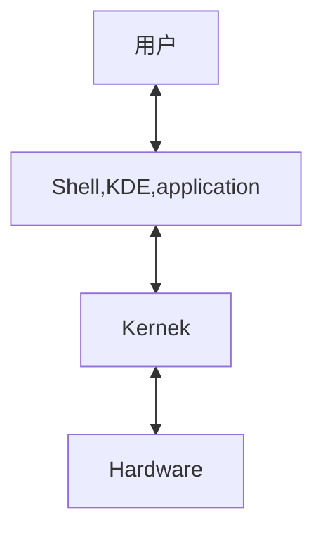
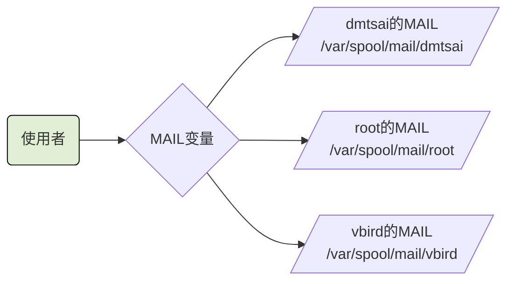

# BASH 与 Shell

## 什么是Shell
> Shell 是使用者的指令与核心进行沟通的工具


> 用户下达的指令 通过 shell 控制核心以便控制硬件实现某些功能

shell版本
>  Bourne SHell(sh)、C SHell、K SHell、TCSH等等
> Linux 使用的版本是 Bourne　Again SHell (bash),这个是Bourne Shell的增强版本。

所有的shell都在/etc/shells这个文件下
为什么系统上合法的shell要写入/etc/shells这个文件下呢。这是因为系统某些服务在运作过程中，会去检查使用者能够使用的shells，而这些shell的查询就是由/etc/shells这个文件

如某些FTP网站会去检查使用者的可用shell，而如果不想要让这些用户使用FTP以为的主机资源，可能会给予使用者一些怪怪的shell，让使用者无法以其他服务登入主机。这时就需要将这个shell写入到/etc/shells中。

```shell
[root@iZbp13op1xah7j3j1x457dZ ~]# cat /etc/passwd
root:x:0:0:root:/root:/bin/bash
bin:x:1:1:bin:/bin:/sbin/nologin
daemon:x:2:2:daemon:/sbin:/sbin/nologin
adm:x:3:4:adm:/var/adm:/sbin/nologin
lp:x:4:7:lp:/var/spool/lpd:/sbin/nologin
sync:x:5:0:sync:/sbin:/bin/sync
shutdown:x:6:0:shutdown:/sbin:/sbin/shutdown
halt:x:7:0:halt:/sbin:/sbin/halt
mail:x:8:12:mail:/var/spool/mail:/sbin/nologin
operator:x:11:0:operator:/root:/sbin/nologin
games:x:12:100:games:/usr/games:/sbin/nologin
ftp:x:14:50:FTP User:/var/ftp:/sbin/nologin
nobody:x:99:99:Nobody:/:/sbin/nologin
systemd-network:x:192:192:systemd Network Management:/:/sbin/nologin
dbus:x:81:81:System message bus:/:/sbin/nologin
polkitd:x:999:998:User for polkitd:/:/sbin/nologin
sshd:x:74:74:Privilege-separated SSH:/var/empty/sshd:/sbin/nologin
postfix:x:89:89::/var/spool/postfix:/sbin/nologin
chrony:x:998:996::/var/lib/chrony:/sbin/nologin
nscd:x:28:28:NSCD Daemon:/:/sbin/nologin
tcpdump:x:72:72::/:/sbin/nologin
rpc:x:32:32:Rpcbind Daemon:/var/lib/rpcbind:/sbin/nologin
rpcuser:x:29:29:RPC Service User:/var/lib/nfs:/sbin/nologin
nfsnobody:x:65534:65534:Anonymous NFS User:/var/lib/nfs:/sbin/nologin
nginx:x:997:995:Nginx web server:/var/lib/nginx:/sbin/nologin
gitlab-www:x:996:993::/var/opt/gitlab/nginx:/bin/false
git:x:995:992::/var/opt/gitlab:/bin/sh
gitlab-redis:x:994:991::/var/opt/gitlab/redis:/bin/false
gitlab-psql:x:993:990::/var/opt/gitlab/postgresql:/bin/sh
gitlab-prometheus:x:992:989::/var/opt/gitlab/prometheus:/bin/sh
az:x:1000:1000::/home/az:/bin/bash
alex:x:1001:1002::/home/alex:/bin/bash
arod:x:1002:1001::/home/arod:/bin/bash
[root@iZbp13op1xah7j3j1x457dZ ~]# 
```
## Bash shell 的功能

- 命令记忆能力（history）
  .bahs_history记录的是前一次登录以前所执行过的指令，而至于这一次登入所执行的指令都被暂存在内存中，当成功注销系统后，该指令记忆才会记录到.bash_history当中
- 命令与文件补全功能 （[tab] 按键的好处）
  [Tab] 接在一串指令的第一个字的后面，则为命令补全
  [Tab] 接在一串指令的第二个字以后时，则为 文件补全
- 命令别名设定功能 （alias）
  自定义指令：alias lm = 'ls -al'
- 工作控制、前景背景控制 （job control, foreground, background）
- 程序化脚本 （shell scripts）
- 通配符 （Wildcard）
  ls -l /usr/bin/X*

### 查询指令是否为Bash shell 的内建命令： type、
|选项|解释|
|---|---|
||没有任何参数时，type 会显示出name是外部指令还是bash内建指令|
|-t|type会将name 以下面这些字眼显示出他的意义|
||file：表示为外部指令|
||alias：表示该指令为命令别名所设定的名称|
||builtin：表示该指令为bash内建的指令功能|
|-p|如果后面接的name为外部指令时，才是显示完整文件名|
|-a|会有PATH变量定义的路径中，将所有含name的指令都显示出来，包含alias|

```shell
[root@iZbp13op1xah7j3j1x457dZ ~]# type ls
ls is aliased to `ls --color=auto'
[root@iZbp13op1xah7j3j1x457dZ ~]# type -t ls
alias
[root@iZbp13op1xah7j3j1x457dZ ~]# type -a ls
ls is aliased to `ls --color=auto'
ls is /usr/bin/ls
[root@iZbp13op1xah7j3j1x457dZ ~]# type cd
cd is a shell builtin
[root@iZbp13op1xah7j3j1x457dZ ~]# 
```

### 指令的下达与快速编辑按钮
```shell
[root@iZbp13op1xah7j3j1x457dZ ~]# cp /var/spool/mail/root /etc/crontab \
> /etc/fstab /root
```

快速的将这串指令整个删除掉。
|组合键|解释|
|---|---|
|[ctrl] + u/[ctrl] + k|分别是从光标处向前删除指令串([ctrl] + u)及向后删除指令串([ctrl] + k)|
|[ctrl] + a/[ctrl] + e|分别是让光标移动到整个指令串的最前面([ctrl] + a) 或最后面([ctrl] + e)|

## Shell的变量功能

- 变量的取用与设定：echo，变量设定的规则，unset

### 取变量值
```shell
[root@iZbp13op1xah7j3j1x457dZ ~]# echo $variable

[root@iZbp13op1xah7j3j1x457dZ ~]# echo $PATH
/root/.vscode-server/bin/019f4d1419fbc8219a181fab7892ebccf7ee29a2/bin/remote-cli:/usr/local/sbin:/usr/local/bin:/usr/sbin:/usr/bin:/root/bin
[root@iZbp13op1xah7j3j1x457dZ ~]# echo ${PATH}
/root/.vscode-server/bin/019f4d1419fbc8219a181fab7892ebccf7ee29a2/bin/remote-cli:/usr/local/sbin:/usr/local/bin:/usr/sbin:/usr/bin:/root/bin
[root@iZbp13op1xah7j3j1x457dZ ~]# 

```

### 设定变量值
```shell
[root@iZbp13op1xah7j3j1x457dZ ~]# echo ${myname}

[root@iZbp13op1xah7j3j1x457dZ ~]# myname=VBrid
[root@iZbp13op1xah7j3j1x457dZ ~]# echo ${myname}
VBrid
[root@iZbp13op1xah7j3j1x457dZ ~]# 

```

### 变量的设定规则
  - 变量与变量内容以一个 = 连结： 如 myname = VBird
  - 等号两边不能直接接空格符
  - 变量名称只能是英文字母与数字，但是开头字符不能是数字
  - 变量内容若有空格符可使用双引号或单引号将变量内容结合起来
      - 双引号的特殊字符如 $ 等，可以保有原本的特性。
        ```shell
        [root@iZbp13op1xah7j3j1x457dZ ~]# var="lang is $LANG"
        [root@iZbp13op1xah7j3j1x457dZ ~]# ehco $var
        bash: ehco: command not found
        [root@iZbp13op1xah7j3j1x457dZ ~]# echo $var
        lang is en_US.UTF-8
        [root@iZbp13op1xah7j3j1x457dZ ~]# 
        ```
      - 单引号内的特殊字符则仅为一般字符（纯文本）
        ```shell
        [root@iZbp13op1xah7j3j1x457dZ ~]# var='lang is $LANG'
        [root@iZbp13op1xah7j3j1x457dZ ~]# echo $var
        lang is $LANG
        [root@iZbp13op1xah7j3j1x457dZ ~]#
        ```
  - 可用跳脱字符 \ 将特殊符号（[Enter], $, \ , 空格符 " 等） 变成一般字符
  - 在一串指令的执行中，还需要其他额外的指令所提供的信息时，可以使用反单引号 &grave;指令&grave; 或 $指令
    ```shell
    [root@iZbp13op1xah7j3j1x457dZ ~]# version=$(uname -r)
    [root@iZbp13op1xah7j3j1x457dZ ~]# echo $version
    3.10.0-1160.114.2.el7.x86_64
    [root@iZbp13op1xah7j3j1x457dZ ~]# 

    ```
  - 若变量为扩展变量内容时，则可用 ”$变量名称“或$｛变量｝累加内容
    ```shell
    [root@iZbp13op1xah7j3j1x457dZ ~]# echo ${myname}
    VBrid
    [root@iZbp13op1xah7j3j1x457dZ ~]# myname="$myname"yes
    [root@iZbp13op1xah7j3j1x457dZ ~]# echo ${myname}
    VBridyes
    [root@iZbp13op1xah7j3j1x457dZ ~]# myname=${myname}yes
    [root@iZbp13op1xah7j3j1x457dZ ~]# echo ${myname}\
    > ^C
    [root@iZbp13op1xah7j3j1x457dZ ~]# echo ${myname}
    VBridyesyes
    [root@iZbp13op1xah7j3j1x457dZ ~]# 
    ```
  - 若该变量需要在其他子程序执行，则需要export来使变量变成环境变量 如 export PATH
    ```shell
    [root@iZbp13op1xah7j3j1x457dZ ~]# bash
    [root@iZbp13op1xah7j3j1x457dZ ~]# echo ${myname}
    
    [root@iZbp13op1xah7j3j1x457dZ ~]# exit
    exit
    [root@iZbp13op1xah7j3j1x457dZ ~]# export myname
    [root@iZbp13op1xah7j3j1x457dZ ~]# bash
    [root@iZbp13op1xah7j3j1x457dZ ~]# echo ${myname}
    VBridyesyes
    [root@iZbp13op1xah7j3j1x457dZ ~]# exit
    exit
    [root@iZbp13op1xah7j3j1x457dZ ~]# 
    ```
  - 通常大写字符为系统默认变量，自行设定变量可以使用小写字符，方便判断
  - 取消变量的方法为使用unst 如 unset myname
    ```shell
    [root@iZbp13op1xah7j3j1x457dZ ~]# unset myname
    [root@iZbp13op1xah7j3j1x457dZ ~]# echo ${myname}
    
    [root@iZbp13op1xah7j3j1x457dZ ~]# 
    ```
### 环境变量的功能
- 用env观察环境变量与常见环境变量说明
  ```shell
  [root@iZbp13op1xah7j3j1x457dZ ~]# env
  XDG_SESSION_ID=8160      # 当前的登录会话
  TERM_PROGRAM=vscode      # 终端程序
  HOSTNAME=iZbp13op1xah7j3j1x457dZ      # 主机名
  TERM=xterm-256color      # 终端机使用的环境类型
  SHELL=/bin/bash      # 目前这个环境下，使用的Shell是哪个程序
  HISTSIZE=1000      # 记录指令的数量 默认是1000
  SSH_CLIENT=36.142.32.177 14018 22      # ssh 客户端地址
  TERM_PROGRAM_VERSION=1.87.0      # 终端程序版本
  OLDPWD=/tmp/vitest      # 最近一次工作目录
  USER=root      # 使用者名称
  LS_COLORS=rs=0:di=38;5;27:ln=38;5;51:mh=44;38;5;15:pi=40;38;5;11:so=38;5;13:do=38;5;5:bd=48;5;232;38;5;11:cd=48;5;232;38;5;3:or=48;5;232;38;5;9:mi=05;48;5;232;38;5;15:su=48;5;196;38;5;15:sg=48;5;11;38;5;16:ca=48;5;196;38;5;226:tw=48;5;10;38;5;16:ow=48;5;10;38;5;21:st=48;5;21;38;5;15:ex=38;5;34:*.tar=38;5;9:*.tgz=38;5;9:*.arc=38;5;9:*.arj=38;5;9:*.taz=38;5;9:*.lha=38;5;9:*.lz4=38;5;9:*.lzh=38;5;9:*.lzma=38;5;9:*.tlz=38;5;9:*.txz=38;5;9:*.tzo=38;5;9:*.t7z=38;5;9:*.zip=38;5;9:*.z=38;5;9:*.Z=38;5;9:*.dz=38;5;9:*.gz=38;5;9:*.lrz=38;5;9:*.lz=38;5;9:*.lzo=38;5;9:*.xz=38;5;9:*.bz2=38;5;9:*.bz=38;5;9:*.tbz=38;5;9:*.tbz2=38;5;9:*.tz=38;5;9:*.deb=38;5;9:*.rpm=38;5;9:*.jar=38;5;9:*.war=38;5;9:*.ear=38;5;9:*.sar=38;5;9:*.rar=38;5;9:*.alz=38;5;9:*.ace=38;5;9:*.zoo=38;5;9:*.cpio=38;5;9:*.7z=38;5;9:*.rz=38;5;9:*.cab=38;5;9:*.jpg=38;5;13:*.jpeg=38;5;13:*.gif=38;5;13:*.bmp=38;5;13:*.pbm=38;5;13:*.pgm=38;5;13:*.ppm=38;5;13:*.tga=38;5;13:*.xbm=38;5;13:*.xpm=38;5;13:*.tif=38;5;13:*.tiff=38;5;13:*.png=38;5;13:*.svg=38;5;13:*.svgz=38;5;13:*.mng=38;5;13:*.pcx=38;5;13:*.mov=38;5;13:*.mpg=38;5;13:*.mpeg=38;5;13:*.m2v=38;5;13:*.mkv=38;5;13:*.webm=38;5;13:*.ogm=38;5;13:*.mp4=38;5;13:*.m4v=38;5;13:*.mp4v=38;5;13:*.vob=38;5;13:*.qt=38;5;13:*.nuv=38;5;13:*.wmv=38;5;13:*.asf=38;5;13:*.rm=38;5;13:*.rmvb=38;5;13:*.flc=38;5;13:*.avi=38;5;13:*.fli=38;5;13:*.flv=38;5;13:*.gl=38;5;13:*.dl=38;5;13:*.xcf=38;5;13:*.xwd=38;5;13:*.yuv=38;5;13:*.cgm=38;5;13:*.emf=38;5;13:*.axv=38;5;13:*.anx=38;5;13:*.ogv=38;5;13:*.ogx=38;5;13:*.aac=38;5;45:*.au=38;5;45:*.flac=38;5;45:*.mid=38;5;45:*.midi=38;5;45:*.mka=38;5;45:*.mp3=38;5;45:*.mpc=38;5;45:*.ogg=38;5;45:*.ra=38;5;45:*.wav=38;5;45:*.axa=38;5;45:*.oga=38;5;45:*.spx=38;5;45:*.xspf=38;5;45:
  PATH=/root/.vscode-server/bin/019f4d1419fbc8219a181fab7892ebccf7ee29a2/bin/remote-cli:/usr/local/sbin:/usr/local/bin:/usr/sbin:/usr/bin:/root/bin      
  MAIL=/var/spool/mail/root      # 用户所取用的mailbox位置
  PWD=/root      # 当前用户所在的工作目录
  LANG=en_US.UTF-8      # 语系
  HISTCONTROL=ignoredups      
  HOME=/root
  SHLVL=5
  LOGNAME=root
  SSH_CONNECTION=36.142.32.177 14018 172.16.100.115 22
  VSCODE_IPC_HOOK_CLI=/run/user/0/vscode-ipc-3d44973d-80c4-4823-bcba-e5faa38779f9.sock
  LESSOPEN=||/usr/bin/lesspipe.sh %s
  BROWSER=/root/.vscode-server/bin/019f4d1419fbc8219a181fab7892ebccf7ee29a2/bin/helpers/browser.sh
  XDG_RUNTIME_DIR=/run/user/0
  COLORTERM=truecolor
  _=/usr/bin/env
  [root@iZbp13op1xah7j3j1x457dZ ~]# 
  ```
- set 观察所有变量（包含环境变量与自定义变量）
  使用｛大写的字母｝来设定的变量，一般为系统内定需要的变量
  - PS1：（提示字符的设定）
    这是命令提示符。每次按下enter取执行某个指令后，最后再次出现提示字符时，就会主动取读取这个变量值

    |选项|解释|
    |---|---|
    |\d|可显示出 星期 月 日 的日期格式 |
    |\H|完整的主机名|
    |\h|仅取主机名在第一个小数点之前的名字|
    |\t|显示时间，为24小时格式的 HH：MM：SS|
    |\T|显示时间，为12小时格式的 HH：MM：SS|
    |\A|显示时间，为24小时格式的 HH：MM|
    |\@|显示时间，为12小时格式的 am/pm |
    |\u|目前使用者的账号名称|
    |\v|BASH的版本信息|
    |\w|完整的工作目录名称，有根目录写器的目录名称。 但家目录会以~代替|
    |\W|利用basename函数取得工作目录名称，所以仅会列出最后一个目录名|
    |\#|下达的第几个指令|
    |\$|提示字符，若是root 则为# 否则为$|
    ```shell
    [root@iZbp13op1xah7j3j1x457dZ ~]# cd /home
    [root@iZbp13op1xah7j3j1x457dZ home]# PS1='[\u@\h \w \A #\#]\$'
    [root@iZbp13op1xah7j3j1x457dZ /home 17:38 #14]#
    ```
  - $ shell的PID（线程代号）
    ```shell
    [root@iZbp13op1xah7j3j1x457dZ ~]# echo $$
    25061
    [root@iZbp13op1xah7j3j1x457dZ ~]# 
    ```
  - ? (关于上个执行指令的回传值)
    执行某些指令时，都会回传一个执行后的代码。一般来说，如果成功的执行了该指令，则会回传一个0值。如果执行过程中发生了错误，就会回传 错误代码
    ```shell
    [root@iZbp13op1xah7j3j1x457dZ ~]# echo $SHELL
    /bin/bash
    [root@iZbp13op1xah7j3j1x457dZ ~]# echo $?
    0
    [root@iZbp13op1xah7j3j1x457dZ ~]# 12name=VBrid
    bash: 12name=VBrid: command not found
    [root@iZbp13op1xah7j3j1x457dZ ~]# echo $?
    127
    # 关于上一个指令的回传值
    [root@iZbp13op1xah7j3j1x457dZ ~]# echo $?
    0
    [root@iZbp13op1xah7j3j1x457dZ ~]# 
    ```
  - OSTYPE，HOSTTYPE，MACHTYPE（主机硬件与核心的等级）
    个人主机的CPU主要分为32/64位，32位又可分为i386，i586，i686,。64位称为x86_64。不同等级的CPU指令集不太相同，这可能需要针对某些CPU进行优化，以取得较佳的性能。高价的硬件通常会向下兼容旧的软件，高价的软件不兼容旧的硬件。
  - export 自定义变量转化成环境变量
    环境变量与自定义的变量差异是该变量是否会被子程序所继承引用
    在一个bash底下下达的任何指令都是由这个bash所衍生出来的，那些被下达的指令就被称为子程序。
    子程序仅会继承父程序的环境变量，不会继承父程序的自定义变量。
### 影响显示结果的语系变量（locale）

locale -a 查看支持的语系
```shell
[root@iZbp13op1xah7j3j1x457dZ ~]# locale -a
aa_DJ
aa_DJ.iso88591
aa_DJ.utf8
aa_ER
aa_ER@saaho
aa_ER.utf8
aa_ER.utf8@saaho
aa_ET
aa_ET.utf8
af_ZA
...
zh_CN
zh_CN.gb18030
zh_CN.gb2312
zh_CN.gbk
zh_CN.utf8
zh_HK
zh_HK.big5hkscs
zh_HK.utf8
zh_SG
zh_SG.gb2312
zh_SG.gbk
zh_SG.utf8
zh_TW
zh_TW.big5
zh_TW.euctw
zh_TW.utf8
zu_ZA
zu_ZA.iso88591
zu_ZA.utf8
[root@iZbp13op1xah7j3j1x457dZ ~]#

# 查看当前使用的语系
[root@iZbp13op1xah7j3j1x457dZ ~]# locale
LANG=en_US.UTF-8      # 系统的默认语言环境
LC_CTYPE="en_US.UTF-8"      # 字符分类、大小写转换、字符编解码等行为的语言环境
LC_NUMERIC="en_US.UTF-8"      # 数字格式,如小数点和千位分隔符的显示方式
LC_TIME="en_US.UTF-8"      # 日期和时间的格式化方式
LC_COLLATE="en_US.UTF-8"      # 字符串的排序和比较规则
LC_MONETARY="en_US.UTF-8"      # 货币符号、小数点、千位分隔符等货币格式
LC_MESSAGES="en_US.UTF-8"      # 系统消息的语言
LC_PAPER="en_US.UTF-8"      # 纸张大小和方向等打印相关的本地化选项
LC_NAME="en_US.UTF-8"      # 人名的格式化方式
LC_ADDRESS="en_US.UTF-8"      # 地址的格式化方式
LC_TELEPHONE="en_US.UTF-8"      # 电话号码的格式化方式
LC_MEASUREMENT="en_US.UTF-8"      # 度量单位的格式化方式
LC_IDENTIFICATION="en_US.UTF-8"      # 包含了 locale 的标识信息
LC_ALL=      # 可以用来覆盖所有其他的 LC_ 设置,将所有本地化选项统一设置为同一个 locale。但在这里它是空的,表示不使用这个设置
[root@iZbp13op1xah7j3j1x457dZ ~]# 
```
如果设定了LANG 或 LC_ALL,则其他的语系变量就会被中两个变量所取代
语系文件在  /usr/lib/locale/ 目录中， 整体系统默认的语系在 /etc/local.conf这个目录下。

### 变量的有效范围
环境变量=全局变量
自定义变量=局部变量

为什么环境变量的数据可以被子程序所引用呢，这是因为内存配置的关系。理论上是这样
- 当启动要给shell，操作系统分配一记忆区块给shell使用，此内存的变量可以让子程序使用
- 若在父程序利用export功能，可以让自定义变量的内容写到上述的记忆区块当中（环境变量）
- 当加载另一个shell时（即启动子程序，而离开原本的父程序），子shell可以将父shell的环境变量所在的记忆区块导入自己的环境变量区块当中

### 变量键盘读取、数组与宣告： read，array，declare

- read
  |选项|解释|
  |---|---|
  |-p|后面可以接提示字符|
  |-t|后面可以接等待的 秒数 |

  ```shell
  # 将用户输入的内容变成 atest变量的内容
  [root@iZbp13op1xah7j3j1x457dZ ~]# read atest
  this is a test
  [root@iZbp13op1xah7j3j1x457dZ ~]# echo ${atest}
  this is a test
  # 30秒内输入自己的名字，并将输入字符串作为名为named的变量内容
  [root@iZbp13op1xah7j3j1x457dZ ~]# read -p "Please keyin your name:" -t 30 named
  Please keyin your name:VBrid Tsai
  [root@iZbp13op1xah7j3j1x457dZ ~]# echo ${named}
  VBrid Tsai
  [root@iZbp13op1xah7j3j1x457dZ ~]# 
  ```
- declare / typeset
  声明变量类型 如果使用declare后面没有接任何参数，bash就会主动将所有变量名称与内容通通叫出来
  |选项|解释|
  |---|---|
  |-a|将后面名为variable的变量定义成为数组array类型|
  |-i|将后面名为variable的变量定义成为整数数字（integer）类型|
  |-x|用法与export一样，就是将后面的variable变成环境变量|
  |-r|将变量设定成为readonly类型，该变量不可被更改内容，也不能unset|
  ```shell
  [root@iZbp13op1xah7j3j1x457dZ ~]# sum=100+400+50
  [root@iZbp13op1xah7j3j1x457dZ ~]# echo ${sum}
  100+400+50
  # 上面没有计算是因为他是文本类型
  [root@iZbp13op1xah7j3j1x457dZ ~]# declare -i sum=100+400+50
  [root@iZbp13op1xah7j3j1x457dZ ~]# echo ${sum}
  550
  [root@iZbp13op1xah7j3j1x457dZ ~]#

  # 将sum变成环境变量
  [root@iZbp13op1xah7j3j1x457dZ ~]# declare -x sum
  [root@iZbp13op1xah7j3j1x457dZ ~]# export | grep sum
  declare -ix sum="550"
  [root@iZbp13op1xah7j3j1x457dZ ~]#

  # 将sum 变成只读属性
  [root@iZbp13op1xah7j3j1x457dZ ~]# declare -r sum
  [root@iZbp13op1xah7j3j1x457dZ ~]# sum=testting
  bash: sum: readonly variable
  [root@iZbp13op1xah7j3j1x457dZ ~]#

  # 将sum变成非环境变量的自定义变量
  [root@iZbp13op1xah7j3j1x457dZ ~]# declare +x sum
  [root@iZbp13op1xah7j3j1x457dZ ~]# declare -p sum
  declare -ir sum="550"
  [root@iZbp13op1xah7j3j1x457dZ ~]# 
  ```
- 数组（array）变量类型
  在bash中 数组的设定方式：var[index]=content
  ```shell
  [root@iZbp13op1xah7j3j1x457dZ ~]# var[1]='small min'
  [root@iZbp13op1xah7j3j1x457dZ ~]# var[2]='big min'
  [root@iZbp13op1xah7j3j1x457dZ ~]# var[3]='nice min'
  [root@iZbp13op1xah7j3j1x457dZ ~]# echo "${var[1]},${var[2]},${var[3]}"
  small min,big min,nice min
  [root@iZbp13op1xah7j3j1x457dZ ~]# 
  ```
### 与文件系统及程序的限制关系：ulimit
限制用户的某些系统资源，包括可以开启的文件数量，可以使用的CUP时间，可以使用的内存总量等等
|选项|解释|
|---|---|
|-H|hard limit，严格的设定，必定不能超过这个设定的数值|
|-S|soft limit，警告的设定，可以超过这个设定值，但是若超过则有警告讯息，在设定上，通常soft会比hard小。如： soft可以设定为80而hard设定为100，那么可以使用到90系统会有警告讯息通知|
|-a|后面不接任何选项与参数，可列出所有限制额度|
|-c|当某些程序发生错误时，系统可能会将该程序在内存中的信息写成文件（除错用）。这种文件就被称为核心文件（core file）。此为限制每个核心文件的最大容量|
|-f|此shell可以建立的最大文件容量（一般可能设定为2GB）单位为KBytes|
|-d|程序可使用的最大断裂内存（segment）容量|
|-l|可用于锁定（lock）的内存量|
|-t|可使用的最大CPU时间（单位为秒）|
|-u|单一用户可以使用的最大程序（process）数量|
```shell
[root@iZbp13op1xah7j3j1x457dZ ~]# ulimit -a
core file size          (blocks, -c) 0      # 只要是0就代表没限制
data seg size           (kbytes, -d) unlimited
scheduling priority             (-e) 0
file size               (blocks, -f) unlimited       # 可建立的单一文件的大小
pending signals                 (-i) 6942
max locked memory       (kbytes, -l) 64
max memory size         (kbytes, -m) unlimited
open files                      (-n) 65535       # 同时可开启的文件数量
pipe size            (512 bytes, -p) 8
POSIX message queues     (bytes, -q) 819200
real-time priority              (-r) 0
stack size              (kbytes, -s) 8192
cpu time               (seconds, -t) unlimited
max user processes              (-u) 6942
virtual memory          (kbytes, -v) unlimited
file locks                      (-x) unlimited
[root@iZbp13op1xah7j3j1x457dZ ~]# 

```
### 变量内容的删除、取代与替换（Optional）
- 变量内容的删除与取代
  |变量设定方式|说明|
  |---|---|
  |${变量#关键词}|若变量内容从头开始的数据符合 关键词 ，则将符合的最短数据删除|
  |${变量##关键词}|若变量内容从头开始的数据符合　关键词，　则将符合的最长数据删除|
  |${变量%关键词}|若变量内容从尾向前的数据符合 关键词， 则将符合的最短数据删除|
  |${变量%%关键词}|若变量内容从尾向前的数据符合 关键词， 则讲符合的最长数据删除|
  |${变量/旧字符串/新字符串}|若变量内容符合 旧字符串 则 第一个旧字符串会被新字符串取代|
  |${变量//旧字符串/新字符串}|若变量内容符合 旧字符串 则 全部的旧字符串会被新字符串取代|
- 变量的测试与内容替换
  ```shell
  [root@iZbp13op1xah7j3j1x457dZ ~]# echo ${username}

  [root@iZbp13op1xah7j3j1x457dZ ~]# username=${username-root}
  [root@iZbp13op1xah7j3j1x457dZ ~]# echo ${usrename}
  
  [root@iZbp13op1xah7j3j1x457dZ ~]# echo ${username}
  root
  [root@iZbp13op1xah7j3j1x457dZ ~]# user='vbird tsai'
  [root@iZbp13op1xah7j3j1x457dZ ~]# user=${user-root}
  [root@iZbp13op1xah7j3j1x457dZ ~]# echo ${user}
  vbird tsai
  [root@iZbp13op1xah7j3j1x457dZ ~]# 

  [root@iZbp13op1xah7j3j1x457dZ ~]# username=""
  [root@iZbp13op1xah7j3j1x457dZ ~]# username=${username-root}
  [root@iZbp13op1xah7j3j1x457dZ ~]# echo ${username}
  
  [root@iZbp13op1xah7j3j1x457dZ ~]# username=${username:-root}
  [root@iZbp13op1xah7j3j1x457dZ ~]# echo ${username}
  root
  [root@iZbp13op1xah7j3j1x457dZ ~]# 

  ```
  |变量设定方式|str没有设定|str为空字符串|str已设定非为空字符串|
  |---|---|---|---|
  |var=${str-expr}|var=expr|var=|var=$str|
  |var=${str:expr}|var=expr|var=expr|var=$str|
  |var=${str+expr}|var=|var=expr|var=expr|
  |var=${str:+expr}|var=|var=|var=expr|
  |var=${str=expr}|str=expr var=expr|str不变 var=|str 不变 var=$str|
  |var=${str:=expr}|str=expr var=expr|str=expr var=expr|str 不变  var=$str|
  |var=${str?expr}|expr输出至stderr|var=|var=$str|
  |var=${str:?expr}|expr输出至stderr|expr输出至stdrr|var=$str|

### 命令别名与历史命令
- 命令别名设定： alias，unalias
- 历史命令：history
|选项|解释|
|---|---|
|n|数字，意思是 要列出最近的n笔命令行表|
|-c|将目前的shell中的所有history内容全部消除|
|-a|将目前新增的history指令新增入的his他file中，若没有加histfiles，则预设写入 ~/.bash_history|
|-r|将histfiles的内容读到目前这个shell的history记忆中|
|-w|将目前的histroy记忆内容写入histfiles中|
  
### Bash Shell 的操作环境
- 路径与指令搜寻顺序
  指令执行的顺序 如下
  ```shell
  [root@iZbp13op1xah7j3j1x457dZ ~]# alias echo="echo -n"
  [root@iZbp13op1xah7j3j1x457dZ ~]# type -a echo
  echo is aliased to `echo -n'
  echo is a shell builtin
  echo is /usr/bin/echo
  [root@iZbp13op1xah7j3j1x457dZ ~]# 

  ```
- bash的进站与欢迎讯息： /etc/issue, /etc/motd
  终端机接口（tty1~tty6）登入的时候，会有几行提示字符串，这就是进站画面，这些字符串写在 /etc/issue里面
  ```shell
  [root@iZbp13op1xah7j3j1x457dZ ~]# cat /etc/issue
  \S
  Kernel \r on an \m
  
  [root@iZbp13op1xah7j3j1x457dZ ~]# 

  ```
  |issue内的各代码意义|
  |---|
  |\d 本地端时间的日期|
  |\l 显示第几个终端机接口|
  |\m 显示硬件的等级（i386/i486/i586/i686...）|
  |\n 显示主机的网络名称|
  |\O 显示domain name|
  |\r 操作系统的版本（相当于 uname -r）|
  |\t 显示本地端时间的时间|
  |\S 操作系统名称|
  |\v 操作系统版本|

  让使用者登入后取得一些讯息， 可以将讯息加入 /etc/motd 里面去！

- bash的环境配置文件
  - login 与 non-login shell
    login shell：取得bash时需要完整的登入流程。如：要使用tty1~tty6登入，需要输入用户的账号与密码，此时取得的bash 称为login shell
    non-login：取得bash接口的方法不需要重复登入的动作。如 在原本的bash环境下再下达bash这个指令，这第二个子程序就是non-login shell。以X window 登入的Linux后，再以X的图形化接口启动终端机，此时这个终端机并没有输入账号与密码，这时它也是non-login shell。
    这两中方式取得bash，读取的配置文件数据是不一样的。
    - login shell读取的配置文件
      
      /etc/profile: 系统整体的设定，
      
      ```shell
        1 # /etc/profile
        2 
        3 # System wide environment and startup programs, for login setup
        4 # Functions and aliases go in /etc/bashrc
        5 
        6 # It's NOT a good idea to change this file unless you know what you
        7 # are doing. It's much better to create a custom.sh shell script in
        8 # /etc/profile.d/ to make custom changes to your environment, as this
        9 # will prevent the need for merging in future updates.
       10 
       11 pathmunge () {
       12     case ":${PATH}:" in
       13         *:"$1":*)
       14             ;;
       15         *)
       16             if [ "$2" = "after" ] ; then
       17                 PATH=$PATH:$1
       18             else
       19                 PATH=$1:$PATH
       20             fi
       21     esac
       22 }
       23 
       24 
       25 if [ -x /usr/bin/id ]; then
       26     if [ -z "$EUID" ]; then
       27         # ksh workaround
       28         EUID=`/usr/bin/id -u`
       29         UID=`/usr/bin/id -ru`
       30     fi
       31     USER="`/usr/bin/id -un`"
       32     LOGNAME=$USER
       33     MAIL="/var/spool/mail/$USER"
       34 fi
       35 
       36 # Path manipulation
       37 if [ "$EUID" = "0" ]; then
       38     pathmunge /usr/sbin
       39     pathmunge /usr/local/sbin
       40 else
       41     pathmunge /usr/local/sbin after
       42     pathmunge /usr/sbin after
       43 fi
       44 
       45 HOSTNAME=`/usr/bin/hostname 2>/dev/null`
       46 HISTSIZE=1000
       47 if [ "$HISTCONTROL" = "ignorespace" ] ; then
       48     export HISTCONTROL=ignoreboth
       49 else
       50     export HISTCONTROL=ignoredups
       51 fi
       52 
       53 export PATH USER LOGNAME MAIL HOSTNAME HISTSIZE HISTCONTROL
       54 
       55 # By default, we want umask to get set. This sets it for login shell
       56 # Current threshold for system reserved uid/gids is 200
       57 # You could check uidgid reservation validity in
       58 # /usr/share/doc/setup-*/uidgid file
       59 if [ $UID -gt 199 ] && [ "`/usr/bin/id -gn`" = "`/usr/bin/id -un`" ]; then
       60     umask 002
       61 else
       62     umask 022
       63 fi
       64 
       65 for i in /etc/profile.d/*.sh /etc/profile.d/sh.local ; do
       66     if [ -r "$i" ]; then
       67         if [ "${-#*i}" != "$-" ]; then
       68             . "$i"
       69         else
       70             . "$i" >/dev/null
       71         fi
       72     fi
       73 done
       74 
       75 unset i
      ```
      - PATH: 会根据UID决定PATH变量要不要含有sbin的系统指令目录
      - MAIL：根据账号设定好使用者的mailbox到/var/spool/mail/账号名
      - USER：根据用户的账号设定这一变量的内容
      - HOSTNAME：根据主机的hostname指令决定这个变量的内容
      - HISTSIZE：历史命令记录笔数
      - umask：root默认为022 而一般用户为002
        
      下面的这些数据也会被呼叫进来
       - /etc/profile.d/*sh
         只要在/etc/profile.d/目录下且扩展名为.sh，使用者有r的权限，那么该文件就会被/etc/profile呼叫进来。这个目录下的文件规范了bash操作接口的颜色、语系、ll与ls指令的命令别名、vi的命令别名、which的命令别名等。如果需要帮助使用者设定一些共享的命令别名时，可以在这个目录下新建扩展名为.sh的文件，并将所需要的数据写入即可
       - /etc/locale.conf
         这个文件是由/etc/profile.d/lang.sh呼叫进来的。这也是决定bash预设哪种语系的重要配置文件。文件里最重要的就是LANG/LC_ALL这些个变量的设定。
       - /usr/share/bash-completion/completions/*
         命令补全、档名补全以及进行指令的选项/参数不全功能，就是从这个目录里面找到相应的指令来处理的。这个目录里的内容是由/etc/profile.d/bash_completion.sh这个文件载入的
    bash的login shell情况下所读取的整体环境配置文件其实只有/etc/profile,但是/etc/profile还会呼叫其他的配置文件，所以可以让bash操作接口变得非常友善    
      \~/.bash_profile或~/.bash_login 或 ~/.profile： 使用者个人设定，
      bash读取完系统整体配置文件后，便会读取使用者的个人配置文件。依序有如下三个主要文件
        1. ~/.bash_profile
        2. ~/.bash_login
        3. \~/.profile
      其实bash的login shell 设定只会读取上面三个文件中的一个，二读取的顺序则是按照上面的顺序进行读取的。也就是说，如果~/.bash_profile存在，那么其他两个文件不论有无存在，都不会被读取。如果~/.bash_profile不存在才会读取~/.bash_login。依此类推。 之所有会有这么多的文件，是因为其他shell转换过来的使用者的习惯
      ```shell
      [root@iZbp13op1xah7j3j1x457dZ ~]# cat ~/.bash_profile
      # .bash_profile
      
      # Get the aliases and functions
      if [ -f ~/.bashrc ]; then
              . ~/.bashrc
      fi
      
      # User specific environment and startup programs
      
      PATH=$PATH:$HOME/bin
      
      export PATH
      [root@iZbp13op1xah7j3j1x457dZ ~]# 

      [az@iZbp13op1xah7j3j1x457dZ root]$ cat ~/.bash_profile
      # .bash_profile
      
      # Get the aliases and functions
      if [ -f ~/.bashrc ]; then      # 判断并读取 ~/.bashrc
              . ~/.bashrc
      fi
      
      # User specific environment and startup programs
      
      PATH=$PATH:$HOME/.local/bin:$HOME/bin   #  处理个人化设定
      
      export PATH
      [az@iZbp13op1xah7j3j1x457dZ root]$ 
      ```
      文件内有设定PATH这个变量，并使用export 将 PATH变成环境变量。由于PATH在/etc/profile当中已经设定过了，所以这里就以累加的方式增加用户家目录下的~/bin/为额外的执行文件放置的目录。也就是说，可以将自己建立的执行档放置到自己家目录下的~/bin/ 目录。就可以直接执行该执行档而不需要使用绝对/相对路径来执行该文件。
      ```mermaid
      flowchart LR;
          A("/etc/profile")--> B("~/.bash_profile")--> C("开始操作BASH")
          A -.->D("/etc/profile.d/*.sh")
          D -.->E("/etc/locale.conf")
          B -.->F("~/.bashrc")
          F -.->G("/etc/bashrc")
      ```
      实现的方向是主流程，虚线的方向则是被呼叫的配置文件。
      - source：读取环境配置文件的指令
        将配置文件设定好后，通常都是注销后再次登入，才会生效，使用source这个指令可以直接读取配置文件而不用注销登录。 使用 `source ~/.bashrc` 与 `. ~/.bashrc` 效果一样
    - non-login shell 读取的配置文件
      - ~/.bashrc
        使用 non-login shell这种非登录情况下取得bash操作接口的环境配置文件仅仅是 ~/.bashrc。
        ```shell
        [az@iZbp13op1xah7j3j1x457dZ root]$ cat ~/.bashrc
        # .bashrc
        
        # Source global definitions
        if [ -f /etc/bashrc ]; then
                . /etc/bashrc
        fi
        
        # Uncomment the following line if you don't like systemctl's auto-paging feature:
        # export SYSTEMD_PAGER=
        
        # User specific aliases and functions
        [az@iZbp13op1xah7j3j1x457dZ root]$ su -
        Password: 
        Last login: Thu Aug  8 11:37:28 CST 2024 from 36.142.32.177 on pts/2
        Last failed login: Sat Aug 17 12:31:05 CST 2024 from 121.196.208.112 on ssh:notty
        There were 183 failed login attempts since the last successful login.
        [root@iZbp13op1xah7j3j1x457dZ ~]# cat ~/.bashrc
        # .bashrc
        
        # User specific aliases and functions
        
        alias rm='rm -i'
        alias cp='cp -i'
        alias mv='mv -i'
        
        # Source global definitions
        if [ -f /etc/bashrc ]; then
                . /etc/bashrc
        fi
        [root@iZbp13op1xah7j3j1x457dZ ~]# 
        ```
        在/etc/bashrc中帮bash定义了如下数据：
          - 根据不同的UID规范出umask的值
          - 根据不同的UID规范出提示字符（PS1的变量）
          - 呼叫/etc/profile.d/*.sh的设定
  - 其他相关配置文件
      - /etc/man_db.conf
      - \~/.bash_history
      - \~/.bash_logout : 当注销bash后，系统需要处理完其他这些任务才能离开    
- 终端机的环境设定：stty，set
- 通配符与特殊符号
  
