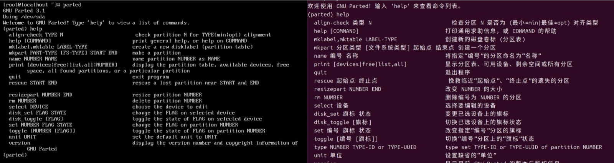

# 鸟哥的 Linux 私房菜鸟叔Linux


## Linux中各硬件的文件名


| 设备              | linux中的文件名                                                               |
| ----------------- | ----------------------------------------------------------------------------- |
| SCSI/SATA/USB硬盘 | /dev/sd[a-p]                                                                  |
| USB闪存           | /dev/sd/[a-p] (与SATA相同)｜                                                  |
| Virtl/O界面       | /dev/vd[a-p] (用于虚拟机内)                                                   |
| 软盘机            | /dev/fd[0-7]                                                                  |
| 打印机            | /dev/lp[0-2] (25针打印机) /dev/usb/lp[0-15] (USB接口)                         |
| 鼠标              | /dev/input/mouse[0-15] (通用) /dev/psaux(PS/2界面) /dev/mouse（当前鼠标）     |
| CDROM/DVDROM      | /dev/scd[0-1] (通用) /dev/sr[0-1] (通用，CentOS较常见) /dev/cdrom (当前CDROM) |
| 磁带机            | /dev/ht0 (IDE界面) /dev/st0 (SATA/SCSI界面) /dev/tape（当前磁带）             |
| IDE硬盘机         | /dev/hd[a-d] (旧式系统才有)                                                   |

## 磁盘

磁盘格式

- MBR（Master Boot Record）模式

  开机管理程序记录区与分区表则统统放到磁盘的第一个扇区，这个扇区通常是512Bytes。

  - 主要开机记录区（Master Boot Record，MBR）：可以安装开机管理程序的地方，446Bytes
  - 分区表（partition table）：记录整颗硬盘分区的状态，64Bytes
    > 由于分区表只有64Bytes，最多只能容纳四笔分区记录，这四个分区的记录被称为主要（Primary）或延伸（Extended）分区
    >
- GPT（GUID partition table）模式

  > GPT将磁盘所以区块以LAB（Logical Block Address, 默认为512Bytes）来规划，而第一个LBA称为LBA0 （从0开始编号）
  > MBR仅使用第一个512Btyes区块来记录不同，GPT使用了34个LBA区块来记录分区信息。
  >

  - LBA0（MBR相容区块）
  - LBA1（GTP表头记录）
  - LBA2-33（实际记录分区信息处）

开机检测程序（BIOS UEFI）

## 开机流程中的BIOS与UEFI开机检测程序

主机系统在载入硬件驱动方面的程序

- BIOS搭配MBR/GPT的开机流程

  > CMOS是记录各项硬件参数且嵌入在主办上面的存储器，BIOS则是一个写入到主板上的一个固件。BIOS就是在开机的时候，计算机系统会主动执行的第一个程序。
  >

  > 接着BIOS会去分析计算机里面有哪些存储设备，BIOS会依据使用者的设置取得能够开机的硬盘，并且到该硬盘里去读取第一个扇区的MBR位置，如果是GPT格式，也能够从LBA0的MRB相容区块读取第一阶段的开机管理程序码。MBR这个仅有446Bytes的硬盘容量里面会放置最基本的开机管理程序。
  >

  > 接着开机管理程序载入核心文件。
  >

  > 启动系统
  >

  开机管理程序除了可以安装在MBR之外，还可以安装在每个分区的开机扇区（boot sector）———多重开机

  - 每个分区都拥有自己的开机扇区
  - 实际可开机的核心文件是放置到各分区的
  - loader只会认识自己的系统盘内的开机核心文件，以及其他loader而已
  - loader可直接指向或者间接将管理权转交给另一个管理程序

  安装多重开机，先安装Windows 再安装Linux

  > 因为Windows在安装的时候，它的安装程序会主动的覆盖MBR以及自己所在分区的开机扇区。
  >
- UEFI BIOS 搭配GPT开机流程
  GPT可以提供64bit的寻址，也能够使用较大的区块来处理开机管理程序。但是BOIS不懂GPT，还得要通过GPT相容模式才能够读写这个磁盘设备，且BIOS斤为16位的程序。
  UEFI主要是想要取代BIOS这个固件界面，UEFI也就是UEFI BIOS。UEFI使用C程序，比起使用组合语言的传统BIOS要更容易开发。甚至可以在UEFI开机阶段就让该系统连接TCP/IP直接上网，而不需要进入操作系统。


| 比较项目               | 传统BIOS                                                   | UEFI               |
| ---------------------- | ---------------------------------------------------------- | ------------------ |
| 使用程序语言           | 组合语言                                                   | C语言              |
| 硬件资源控制           | 使用中断（IRQ）管理 不可变的内存存取 不可变的输入/输出存取 | 使用驱动程序与协定 |
| 处理器运行环境         | 16位                                                       | cpu保护模式        |
| 扩充方式               | 通过IRQ链接                                                | 直接载入驱动程序   |
| 第三方厂商支持         | 较差                                                       | 较佳且可支持多平台 |
| 图形化能力             | 较差                                                       | 较佳               |
| 内置简化操作系统前环境 | 不支持                                                     | 支持               |

## 主机硬盘的主要规划

- 最简单的分区方法：仅分区出根目录与内存交换空间（/ & swap）即可。
- 较麻烦的分区：先分析这部主机的未来用途，再根据用途去分析需要大容量的目录，以及读写较为频繁的目录，将这些重要的目录分别独立出来而不与根目录放在一起，当这些读写频繁的磁盘分区有问题时，至少不会影响到根目录的系统数据。

  比较符合容量大且读写频繁的目录

  - /boot： 挂载点的文件系统
  - /： 根目录
  - /home
  - /var
  - Swap

## 标准分区与 LVM

- 标准分区区：就是我们一直谈的分区啊！类似 /dev/vda1 之类的分区就是了。
- LVM：这是一种可以弹性增加/削减文件系统容量的设备设置，我们会在后面的章节持续介绍 LVM 这个有趣的东西！
- LVM 紧张供应：这个名词翻译的超奇怪的！其实这个是 LVM 的进阶版！与传统 LVM 直接分配固定的容量不同， 这个“ LVM 紧张供应”的项目，可以让你在使用多少容量才分配磁盘多少容量给你，所以如果 LVM 设备内的数据量较少，那么你的磁盘其实还可以作更多的数据储存！ 而不会被平白无故的占用！

## 文件系统项目

- ext2/ext3/ext4：Linux早期适用的文件系统类型。由于ext3/ext4文件系统多了日志的记录， 对于系统的复原比较快速。不过由于磁盘容量越来越大，ext 家族似乎有点挡不住了～所以除非你有特殊的设置需求，否则近来比较少使用 ext4 项目了！
- swap：就是磁盘仿真成为内存，由于swap并不会使用到目录树的挂载，所以用swap就不需要指定挂载点喔。
- BIOS Boot：就是 GPT 分区表可能会使用到的项目，若你使用 MBR 分区，那就不需要这个项目了！
- xfs：这个是目前 CentOS 默认的文件系统，最早是由大型服务器所开发出来的！ 他对于大容量的磁盘管理非常好，而且格式化的时候速度相当快，很适合当今动不动就是好几个 TB 的磁盘的环境喔！因此我们主要用这玩意儿！
- vfat：同时被Linux与Windows所支持的文件系统类型,如果你的主机硬盘内同时存在Windows与Linux操作系统，为了数据的交换， 确实可以创建一个vfat的文件系统。

---

笔记本安装linux时，可能会出现一些问题，导致无法顺利安装Linux到笔记本上。

开机时，需要按下[tab]按键，输入下面选项

```bash
nofb apm=off acpi=off pci=noacpi
```

- apm（Advanced Power Management）：早期的电源管理模块。
- acpi(Advanced Configuration and Power Interface)：近期的电源管理模块。
- nofb： 取消显卡上面的缓冲内存侦测

---

## 多重开机

虚拟机在图形显示的性能依旧不足，某些时刻还是要使用实体机器去安装不同的操作系统

### 安装Centos + windows 规划


| Linux设备文件名 | Linux载点 | Windows设备 | 实际内容         | 文件系统 | 容量  |
| --------------- | --------- | ----------- | :--------------- | :------- | :---- |
| /dev/vda1       | /boot     | -           | Linux开机信息    | xfs      | 2GB   |
| /dev/vda2       | /         | -           | Linux 根目录     | xfs      | 50GB  |
| /dev/vda3       | -         | C           | Windows 系统数据 | NTFS     | 100GB |
| /dev/vda5       | /data     | D           | 共享数据磁盘     | VFAT     | 剩余  |

## parted 分区

1. 基本命令:
   + print - 打印磁盘和分区信息
   + help - 显示帮助信息
   + quit - 退出 parted 工具
2. 分区操作命令:
   + mklabel - 创建新的分区表
   + mkpart - 创建新的分区
   + rm - 删除分区
   + resizepart - 调整分区大小
   + name - 设置分区名称
   + toggle - 切换分区标志
3. 文件系统相关命令:
   + mkfs - 在分区上创建文件系统
   + check - 检查分区表完整性
   + rescue - 尝试恢复丢失的分区
4. 其他命令:
   + align-check - 检查分区对齐
   + unit - 设置显示单位
   + set - 设置分区标志
   + disk_set - 设置磁盘标志
   + disk_toggle - 切换磁盘标志



## locale 语系支持


## 基础指令

- date -- 日期与时间的指令

  ```bash
  zhang@admin-pc:~$ date
  2024年 07月 04日 星期四 20:41:48 CST
  ```

  ```bash
  zhang@admin-pc:~$ date +%Y/%m/%d\ %H:%m:%s
  2024/07/04 20:07:1720097048
  zhang@admin-pc:~$ date +%Y/%m/%d\ %H:%m:%S
  2024/07/04 20:07:14

  ```
- cal -- 显示日历的指令
  


- bc -- 计算机

```bash
  zhang@admin-pc:~$ bc
  bc 1.07.1
  Copyright 1991-1994, 1997, 1998, 2000, 2004, 2006, 2008, 2012-2017 Free Software Foundation, Inc.
  This is free software with ABSOLUTELY NO WARRANTY.
  For details type `warranty'. 
  1+2
  3
  22*5
  110
  quit
```

## man page

用于记录各种命令、函数、配置文件等的文档。它们通过 man 命令访问,提供了详细的使用说明和参考信息，man即manual（操作说明）的简写

```bash
Last login: Fri Jul  5 18:29:35 on ttys000
zhangfeng@zhangfengdeMacBook-Pro ~ % date
2024年 7月 6日 星期六 16时31分05秒 CST
zhangfeng@zhangfengdeMacBook-Pro ~ % man date
DATE(1)                     General Commands Manual                    DATE(1)

NAME
     date – display or set date and time

SYNOPSIS
     date [-nRu] [-I[FMT]] [-r filename] [-r seconds]
          [-v[+|-]val[y|m|w|d|H|M|S]] [+output_fmt]
     date [-jnRu] [-I[FMT]] [-v[+|-]val[y|m|w|d|H|M|S]]
          [[[mm]dd]HH]MM[[cc]yy][.SS] [+output_fmt]
     date [-jnRu] [-I[FMT]] [-v[+|-]val[y|m|w|d|H|M|S]] -f input_fmt new_date
          [+output_fmt]

DESCRIPTION
     When invoked without arguments, the date utility displays the current
     date and time.  Otherwise, depending on the options specified, date will
     set the date and time or print it in a user-defined way.

     The date utility displays the date and time read from the kernel clock.
     When used to set the date and time, both the kernel clock and the
     hardware clock are updated.

     Only the superuser may set the date, and if the system securelevel (see
     securelevel(7)) is greater than 1, the time may not be changed by more
     than 1 second.

     The options are as follows:

     -f input_fmt
             Use input_fmt as the format string to parse the new_date provided
             rather than using the default [[[mm]dd]HH]MM[[cc]yy][.SS] format.
             Parsing is done using strptime(3).

     -I[FMT]
             Use ISO 8601 output format.  FMT may be omitted, in which case
             the default is date.  Valid FMT values are date, hours, minutes,
             and seconds.  The date and time is formatted to the specified
             precision.  When FMT is hours (or the more precise minutes or
             seconds), the ISO 8601 format includes the timezone.

     -j      Do not try to set the date.  This allows you to use the -f flag
             in addition to the + option to convert one date format to
             another.  Note that any date or time components unspecified by
             the -f format string take their values from the current time.

     -n      Obsolete flag, accepted and ignored for compatibility.

     -R      Use RFC 2822 date and time output format.  This is equivalent to
             using “%a, %d %b %Y %T %z” as output_fmt while LC_TIME is set to
             the “C” locale .

     -r seconds
             Print the date and time represented by seconds, where seconds is
             the number of seconds since the Epoch (00:00:00 UTC, January 1,
             1970; see time(3)), and can be specified in decimal, octal, or
             hex.

     -r filename
             Print the date and time of the last modification of filename.

     -u      Display or set the date in UTC (Coordinated Universal) time.  By
             default date displays the time in the time zone described by
             /etc/localtime or the TZ environment variable.
-v [+|-]val[y|m|w|d|H|M|S]
             Adjust (i.e., take the current date and display the result of the
             adjustment; not actually set the date) the second, minute, hour,
             month day, week day, month or year according to val.  If val is
             preceded with a plus or minus sign, the date is adjusted forwards
             or backwards according to the remaining string, otherwise the
             relevant part of the date is set.  The date can be adjusted as
             many times as required using these flags.  Flags are processed in
             the order given.

             When setting values (rather than adjusting them), seconds are in
             the range 0-59, minutes are in the range 0-59, hours are in the
             range 0-23, month days are in the range 1-31, week days are in
             the range 0-6 (Sun-Sat), months are in the range 1-12 (Jan-Dec)
             and years are in a limited range depending on the platform.

             On i386, years are in the range 69-38 representing 1969-2038.  On
             every other platform, years 0-68 are accepted and represent
             2000-2068, and 69-99 are accepted and represent 1969-1999.  In
             both cases, years between 100 and 1900 (both included) are
             accepted and interpreted as relative to 1900 of the Gregorian
             calendar with a limit of 138 on i386 and a much higher limit on
             every other platform.  Years starting at 1901 are also accepted,
             and are interpreted as absolute years.

             If val is numeric, one of either y, m, w, d, H, M or S must be
             used to specify which part of the date is to be adjusted.

             The week day or month may be specified using a name rather than a
             number.  If a name is used with the plus (or minus) sign, the
             date will be put forwards (or backwards) to the next (previous)
             date that matches the given week day or month.  This will not
             adjust the date, if the given week day or month is the same as
             the current one.

             When a date is adjusted to a specific value or in units greater
             than hours, daylight savings time considerations are ignored.
             Adjustments in units of hours or less honor daylight saving time.
             So, assuming the current date is March 26, 0:30 and that the DST
             adjustment means that the clock goes forward at 01:00 to 02:00,
             using -v +1H will adjust the date to March 26, 2:30.  Likewise,
             if the date is October 29, 0:30 and the DST adjustment means that
             the clock goes back at 02:00 to 01:00, using -v +3H will be
             necessary to reach October 29, 2:30.

             When the date is adjusted to a specific value that does not
             actually exist (for example March 26, 1:30 BST 2000 in the
             Europe/London timezone), the date will be silently adjusted
             forwards in units of one hour until it reaches a valid time.
             When the date is adjusted to a specific value that occurs twice
             (for example October 29, 1:30 2000), the resulting timezone will
             be set so that the date matches the earlier of the two times.

             It is not possible to adjust a date to an invalid absolute day,
             so using the switches -v 31d -v 12m will simply fail five months
             of the year.  It is therefore usual to set the month before
             setting the day; using -v 12m -v 31d always works.

             Adjusting the date by months is inherently ambiguous because a
             month is a unit of variable length depending on the current date.
             This kind of date adjustment is applied in the most intuitiveway.  First of all, date tries to preserve the day of the month.
             If it is impossible because the target month is shorter than the
             present one, the last day of the target month will be the result.
             For example, using -v +1m on May 31 will adjust the date to June
             30, while using the same option on January 30 will result in the
             date adjusted to the last day of February.  This approach is also
             believed to make the most sense for shell scripting.
             Nevertheless, be aware that going forth and back by the same
             number of months may take you to a different date.

             Refer to the examples below for further details.

     An operand with a leading plus (‘+’) sign signals a user-defined format
     string which specifies the format in which to display the date and time.
     The format string may contain any of the conversion specifications
     described in the strftime(3) manual page, as well as any arbitrary text.
     A newline (‘\n’) character is always output after the characters
     specified by the format string.  The format string for the default
     display is “+%+”.

     If an operand does not have a leading plus sign, it is interpreted as a
     value for setting the system's notion of the current date and time.  The
     canonical representation for setting the date and time is:

           cc      Century (either 19 or 20) prepended to the abbreviated
                   year.
           yy      Year in abbreviated form (e.g., 89 for 1989, 06 for 2006).
           mm      Numeric month, a number from 1 to 12.
           dd      Day, a number from 1 to 31.
           HH      Hour, a number from 0 to 23.
           MM      Minutes, a number from 0 to 59.
           SS      Seconds, a number from 0 to 60 (59 plus a potential leap
                   second).

     Everything but the minutes is optional.

     date understands the time zone definitions from the IANA Time Zone
     Database, tzdata, located in /usr/share/zoneinfo.  Time changes for
     Daylight Saving Time, standard time, leap seconds and leap years are
     handled automatically.

     There are two ways to specify the time zone:

     If the file or symlink /etc/localtime exists, it is interpreted as a time
     zone definition file, usually in the directory hierarchy
     /usr/share/zoneinfo, which contains the time zone definitions from
     tzdata.

     If the environment variable TZ is set, its value is interpreted as the
     name of a time zone definition file, either an absolute path or a
     relative path to a time zone definition in /usr/share/zoneinfo.  The TZ
     variable overrides /etc/localtime.

     If the time zone definition file is invalid, date silently reverts to
     UTC.

     Previous versions of date included the -d (set daylight saving time flag)
     and -t (set negative time zone offset) options, but these details are now
     handled automatically by tzdata.  Modern offsets are positive for time
     zones ahead of UTC and negative for time zones behind UTC, but like the
     obsolete -t option, the tzdata files in the subdirectory
 /usr/share/zoneinfo/Etc still use an older convention where times ahead
     of UTC are considered negative.

ENVIRONMENT
     The following environment variable affects the execution of date:

     TZ      The timezone to use when displaying dates.  The normal format is
             a pathname relative to /usr/share/zoneinfo.  For example, the
             command “TZ=America/Los_Angeles date” displays the current time
             in California.  The variable can also specify an absolute path.
             See environ(7) for more information.

FILES
     /etc/localtime     Time zone information file for default system time
                        zone.  May be omitted, in which case the default time
                        zone is UTC.
     /usr/share/zoneinfo
                        Directory containing time zone information files.
     /var/log/messages  Record of the user setting the time.

EXIT STATUS
     The date utility exits 0 on success, 1 if unable to set the date, and 2
     if able to set the local date, but unable to set it globally.

EXAMPLES
     The command:

           date "+DATE: %Y-%m-%d%nTIME: %H:%M:%S"

     will display:

           DATE: 1987-11-21
           TIME: 13:36:16

     In the Europe/London timezone, the command:

           date -v1m -v+1y

     will display:

           Sun Jan  4 04:15:24 GMT 1998

     where it is currently Mon Aug  4 04:15:24 BST 1997.

     The command:

           date -v1d -v3m -v0y -v-1d

     will display the last day of February in the year 2000:

           Tue Feb 29 03:18:00 GMT 2000

     So will the command:

           date -v3m -v30d -v0y -v-1m

     because there is no such date as the 30th of February.

     The command:
          date -v1d -v+1m -v-1d -v-fri

     will display the last Friday of the month:

           Fri Aug 29 04:31:11 BST 1997

     where it is currently Mon Aug  4 04:31:11 BST 1997.

     The command:

           date 0613162785

     sets the date to “June 13, 1985, 4:27 PM”.
           date "+%m%d%H%M%Y.%S"

     may be used on one machine to print out the date suitable for setting on
     another.

     The command:

           date 1432

     sets the time to 2:32 PM, without modifying the date.

     The command

           TZ=America/Los_Angeles date -Iseconds -r 1533415339

     will display

           2018-08-04T13:42:19-07:00

     Finally the command:

           date -j -f "%a %b %d %T %Z %Y" "`LC_ALL=C date`" "+%s"

     can be used to parse the output from date and express it in Epoch time.

DIAGNOSTICS
     It is invalid to combine the -I flag with either -R or an output format
     (“+...”) operand.  If this occurs, date prints: ‘multiple output formats
     specified’ and exits with status 1.

LEGACY SYNOPSIS
     As above, except for the second line, which is:

     date [-jnu] [[[[[cc]yy]mm]dd]HH]MM[.SS]

     For more information about legacy mode, see compat(5).

SEE ALSO
     locale(1), gettimeofday(2), getutxent(3), strftime(3), strptime(3),
     tzset(3)

     R. Gusella and S. Zatti, TSP: The Time Synchronization Protocol for UNIX
     4.3BSD.

     Time Zone Database, https://iana.org/time-zones.

STANDARDS
     The date utility is expected to be compatible with IEEE Std 1003.2
     (“POSIX.2”).  With the exception of the -u option, all options are
     extensions to the standard.

     The format selected by the -I flag is compatible with ISO 8601.

HISTORY
     A date command appeared in Version 1 AT&T UNIX.

     A number of options were added and then removed again, including the -d
     (set DST flag) and -t (set negative time zone offset).  Time zones are
     now handled by code bundled with tzdata.

     The -I flag was added in FreeBSD 12.0.

macOS 14.3                       July 28, 2022                      macOS 14.3
```

第一行是“DATE（1）”，DATE是指令 （1）代表 一般使用者可使用的指令
常见的几个数字的意义


| 代号 | 代表内容                                                                 |
| ---- | ------------------------------------------------------------------------ |
| 1    | 使用者在shell环境中可以操作的指令或可执行文件                            |
| 2    | 系统核心可调用的函数与工具等                                             |
| 3    | 一些常用的函数（function）与函数库（library），大部分为C的函数库（libc） |
| 4    | 设备文件的说明，通常在/dev下的文件                                       |
| 5    | 配置文件或者是某些文件的格式                                             |
| 6    | 游戏（games）                                                            |
| 7    | 惯例与协定等，如linux文件系统、网络协定、ASCII code等的说明              |
| 8    | 系统管理员可用的管理指令                                                 |
| 9    | 跟kernel有关的文件                                                       |

man page 组成部分


| 代号        | 内容说明                                                         |
| ----------- | ---------------------------------------------------------------- |
| NAME        | 简短的指令、数据名称说明                                         |
| SYNOPSIS    | 简短的指令下达语法（syntax）简介                                 |
| DESCRIPTION | 较为完整的说明                                                   |
| OPTIONS     | 针对SYNOPSIS部分中，有例举的所有可用的选项说明                   |
| COMMANDS    | 当这个程序（软件）在执行的时候，可以在此程序（软件）中下达的指令 |
| FILES       | 这个程序或数据所使用或参考或链接到的某些文件                     |
| SEE ALSO    | 可以参考的，跟这个指令或数据有相关的其他说明                     |
| EXAMPLE     | 一些可以参考的范例                                               |

man page 常用的按键


| 按键        | 进行工作                                                                                     |
| ----------- | -------------------------------------------------------------------------------------------- |
| 空格键      | 向下翻页                                                                                     |
| [Page Down] | 向下翻页                                                                                     |
| [Page Up]   | 向上翻页                                                                                     |
| [Home]      | 去到第一页                                                                                   |
| [End]       | 去到最后一页                                                                                 |
| /string     | 向“下”搜寻string这个字符串                                                                 |
| ?string     | 向“上”搜寻string这个字符串                                                                 |
| n,N         | 利用/或？来搜寻字符串时，可以用n来继续下一个搜寻（不论是/或？），可以利用N来进行“反向”搜寻 |
| q           | 结束这次到man page                                                                           |

man page的数据在 /usr/share/man在这个目录里。我们可以通过修改它的man page 搜寻路径来改善这个目录的问题。
修改ect/man.conf即可

```shell
 /etc % cat man.conf 
#
# This file is read by man to configure the default manpath (also used
# when MANPATH contains an empty substring), and to indicate support for
# a given locale.  The following configuration variables are supported:
#
# MANCONFIG		config_file_glob
# MANPATH		manpath_element
# MANLOCALE		locale
#
# It is assumed that catdirs are equal to a mandir within a given manpath, i.e.,
# share/man/man1 => share/man/cat1.
#
# Every automatically generated MANPATH includes these fields
#
MANPATH	/usr/share/man
MANPATH	/usr/local/share/man
MANPATH	/usr/X11/man
MANPATH	/Library/Apple/usr/share/man
#
# Uncomment if you want to include one of these by default
#
# MANPATH	/opt/*/man
# MANPATH	/usr/lib/*/man
# MANPATH	/usr/share/*/man
# MANPATH	/usr/kerberos/man
#
# Useful paths - note that COL should not be defined when
# NROFF is defined as "groff -Tascii" or "groff -Tlatin1";
# not only is it superfluous, but it actually damages the output.
# For use with utf-8, NROFF should be "nroff -mandoc" without -T option.
# (Maybe - but today I need -Tlatin1 to prevent double conversion to utf8.)
#
# If you have a new troff (version 1.18.1?) and its colored output
# causes problems, add the -c option to TROFF, NROFF, JNROFF.
#
# Uncomment these if you have installed groff manually.  Note that man(1) will
# not provide defaults for any of these tools; their paths must be specified
# here, and we require absolute paths to make sure we use the correct tools.
#
# TROFF		/usr/local/bin/groff -Tps -mandoc -c
# NROFF		/usr/local/bin/groff -Wall -mtty-char -Tascii -mandoc -c
# EQN		/usr/local/bin/eqn -Tps
# TBL		/usr/local/bin/tbl
# REFER		/usr/local/bin/refer
# PIC		/usr/local/bin/pic
# VGRIND
#
# The default MANPAGER is less(1), while the default WHATISPAGER for whatis and
# apropos remains more(1) for historical compatibility.  This can either
# be switched in the environment, or globally on a system by setting MANPAGER or
# WHATISPAGER:
#
# MANPAGER	/usr/bin/less -s
# WHATISPAGER	/usr/bin/more -E
#
# The output width can also be adjusted to either the literal value "tty" or a
# fixed column size, like so:
#
# MANWIDTH	120
#
# MANWIDTH=tty is the default setting if run in a terminal, which will instruct
# man(1) to detect the terminal size in columns and use that.
#
# Default manual sections (and order) to search if -S is not specified
# and the MANSECT environment variable is not set.
#
MANSECT		1:1p:8:2:3:3p:4:5:6:7:9:0p:tcl:n:l:p:o
```

- 搜寻特定指令/文件的man page说明文档

系统中哪些和“man”这个指令有关的说明文档，可以使用如下的操作

```shell
 % man -f man
mysqlman(1)              - default man page for mysql
Accelerate(7)            - This man page introduces the Accelerate umbrella framework, its constituent libraries and programming support in Mac OS X
man(1), apropos(1), whatis(1) - display online manual documentation pages
man(7)                   - legacy formatting language for manual pages
man.conf(5)              - man(1) and manpath(1) configuration files
zshall(1)                - the Z shell meta-man page
Accelerate(7)            - This man page introduces the Accelerate umbrella framework, its constituent libraries and programming support in Mac OS X
DateTime::Locale::en_IM(3pm) - Locale data examples for the English Isle of Man (en-IM) locale
DateTime::Locale::gv_IM(3pm) - Locale data examples for the Manx Isle of Man (gv-IM) locale
IO::Socket::SSL::Intercept(3pm) - -- SSL interception (man in the middle)
Pod::Man(3pm)            - Convert POD data to formatted *roff input
Pod::Perldoc::ToMan(3pm) - let Perldoc render Pod as man pages
man(1), apropos(1), whatis(1) - display online manual documentation pages
man(7)                   - legacy formatting language for manual pages
man.conf(5)              - man(1) and manpath(1) configuration files
zshall(1)                - the Z shell meta-man page
xml2man(1)               - MPGL to mdoc (man page) translator
```

可以使用如下操作 查看相应的文件数据

```shell
man 1 mysqlman

mysqlman(1)                                                                                        MySQL database                                                                                        mysqlman(1)

NAME
       mysqlman - default man page for mysql

DESCRIPTION
       Certain executables distributed with the MySQL database management system do not have specific man pages.

SEE ALSO
       In most cases, you can run the executable from the command line with a "--help" argument to display a brief summary of the executable's arguments and function.  For more information about MySQL, please
       refer to the MySQL reference manual, which may already be installed locally and which is also available online at http://dev.mysql.com/doc/mysql/en

BUGS
       Please refer to http://bugs.mysql.com/ to report bugs.

MySQL                                                                                               20 July 2004                                                                                         mysqlman(1)

```

man -k 搜索 只要该内容有关键字存在，不需要完全相同的指令（文件）

- info page
  Linux里面额外提供了一种线上求助的方法。
  man可以在所有Unix Like系统中来查询指令或是相关的文件。
  man 和 inof 区别

1. 来源和目的:
   man 命令是 Unix 和 Unix 衍生系统(如 Linux 和 macOS)的标准工具,用于显示程序的手册页。
   info 命令是 GNU 计划提供的一种文档系统,旨在补充和替代 man 命令。
2. 文档格式:
   man 命令显示的是纯文本格式的手册页,通常比较简洁。
   info 命令显示的是分层的超文本文档,可以在文档间跳转。
3. 详细程度:
   man 手册页通常更加简洁和专业,面向经验丰富的用户。
   info 文档更加详细和通俗易懂,对初学者更加友好。
4. 覆盖范围:
   man 手册页覆盖了操作系统及各种程序的大部分文档。
   info 文档主要覆盖了 GNU 软件项目的文档,而对于其他软件的文档支持相对较弱。
5. 可读性:
   man 手册页使用纯文本格式,可读性更强,且常用于终端环境。
   info 文档使用分层超文本格式,可以提供更好的导航体验,但在纯文本终端中可读性略差

## 关于关机

- 观察系统的使用状态

  - who 看看谁在线
  - netstat -a 查看网络的连接状态
  - ps -aux 查看背景执行的程序
- 关机/重新开机

  - sync 将（内存）数据同步写入硬盘中的指令（异常关机会导致此问题）
  - shutdown 惯用的关机指令
  - reboot， halt，poweroff 重新开机，关机

Linux系统的关机/重新开机，只有root才能够进行例如shutdown, reboot等指令。 不过在某些distributions当中，例如我们这里谈到的CentOS系统，他允许你在本机前的tty1~tty7当中（无论是文字界面或图形界面）， 可以用一般帐号来关机或重新开机！但某些distributions则在你要关机时，他会要你输入root的密码呢。
