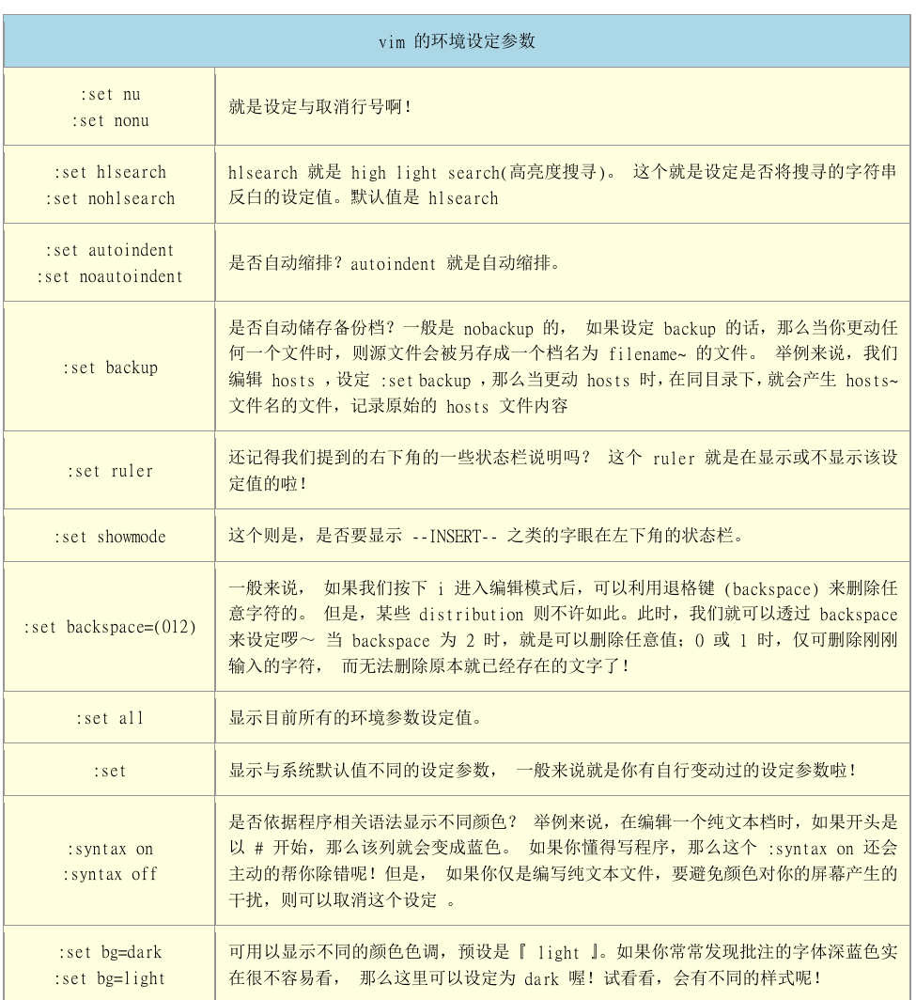

# vim 程序编辑器

## vi 与 vim
>所有的Unix Like系统都会内建vi文本编辑器，其他的文本编辑器则不一定会存在
>
>很多个别软件的编辑接口都会主动呼叫vi
>
>vim具有程序编辑的能力，可以主动的以字体颜色辨别语法的正确性，方便程序设计
>
>因为程序简单，编辑速度相当快速

## vi按键说明
- 一般指令模式
<table>
  <capital>按键说明</capital>
  <tr>
    <td colspan='2' align='center'>移动光标的方法</td>
  </tr>
  <tr>
    <td>h（ $\leftarrow$ ）</td> <td>光标向左移动一个字符</td>
  </tr>
   <tr>
    <td>j （ $\downarrow$ ）</td> <td>光标向下移动一个字符</td>
  </tr>
  <tr>
    <td>k （ $\uparrow$ ）</td> <td>光标向上移动一个字符</td>
  </tr>
   <tr>
    <td>l （ $\rightarrow$）</td> <td>光标向右移动一个字符</td>
  </tr>
  <tr>
    <td colspan='2' align='center'> 如果要进行多次移动的话可以使用 30j 或 30 $\downarrow$ 即可，其他类似</td>
  </tr>
  <tr>
    <td bgcolor="#ffffcc">[ctrl] + f</td><td bgcolor="#ffffcc">向下移动一个页</td>
  </tr>
   <tr>
    <td bgcolor="#ffffcc">[ctrl] + b</td><td bgcolor="#ffffcc">向上移动一个页</td>
  </tr>
   <tr>
    <td>[ctrl] + d</td><td>向下移动半页</td>
  </tr>
  <tr>
    <td>[ctrl] + u</td><td>向上移动半页</td>
  </tr>
  <tr>
    <td>+</td><td>光标移动到非空格符的下一列</td>
  </tr>
  <tr>
    <td>-</td><td>光标移动到非空格符的上一列</td>
  </tr>
  <tr>
    <td>n &lt;space&gt;</td><td>光标向右移动这一列的n个字符</td>
  </tr>
  <tr>
    <td bgcolor="#ffffcc">0 [home]</td><td bgcolor="#ffffcc">移动到这一列的最前面字符处</td>
  </tr>
  <tr>
    <td bgcolor="#ffffcc">$ [end]</td><td bgcolor="#ffffcc">移动到这一列的最后字符处</td>
  </tr>
  <tr>
    <td>H</td><td>光标移动到这个屏幕的最上方那一列的第一个字符</td>
  </tr>
  <tr>
    <td>M</td><td>光标移动到这个屏幕的中央那一列的第一个字符</td>
  </tr>
  <tr>
    <td>L</td><td>光标移动到这个屏幕的最下方那一列的第一个字符</td>
  </tr>
  <tr>
    <td bgcolor="#ffffcc">G</td><td bgcolor="#ffffcc">移动到这个文件的最后一列</td>
  </tr>
  <tr>
    <td>nG</td><td>移动到这个文件的第n列</td>
  </tr>
  <tr>
    <td bgcolor="#ffffcc">gg</td><td bgcolor="#ffffcc">移动到这个文件的第一列，相当于1G</td>
  </tr>
  <tr>
    <td bgcolor="#ffffcc">n &lt;Enter&gt;</td><td bgcolor="#ffffcc">光标向下移动n列</td>
  </tr>
  <tr>
    <td colspan='2' align='center'>搜寻与取代</td>
  </tr>
  <tr>
    <td bgcolor="#ffffcc">/word</td><td bgcolor="#ffffcc">向光标下面查找一个名称为word的字符串</td>
  </tr>
  <tr>
    <td>?word</td><td>向光标上面查询一个名称为word的字符串</td>
  </tr>
  <tr>
    <td>n</td><td>重复前面的一个查询动作</td>
  </tr>
  <tr>
    <td>N</td><td>与n相反，反向查询前一个查询动作</td>
  </tr>
  <tr>
    <td bgcolor="#ffffcc">:n1, n2s/word1/word2/g</td><td bgcolor="#ffffcc">在n1与n2列之间查询word1这个字符串，并将它替换为word2</td>
  </tr>
  <tr>
    <td bgcolor="#ffffcc">:1,$s/word1/word2/g</td><td bgcolor="#ffffcc">从第一列到最后一列查询word1字符串，并将它替换为word2</td>
  </tr>
  <tr>
    <td bgcolor="#ffffcc">:1,$s/word1/word2/gc</td><td bgcolor="#ffffcc">从第一列到最后一列查询word1字符串，并将它替换为word2，且在替换前显示提示字符给用户确认是要替换</td>
  </tr>
  <tr>
    <td colspan='2' align='center'>删除、复制、粘贴</td>
  </tr>
  <tr>
    <td bgcolor="#ffffcc">x,X</td><td bgcolor="#ffffcc">x向后删除一个字符，X为向前删除一个字符，相当于Backspace</td>
  </tr>
  <tr>
    <td bgcolor="#ffffcc">nx</td><td bgcolor="#ffffcc">连续向后删除n个字符</td>
  </tr>
  <tr>
    <td bgcolor="#ffffcc">dd</td><td bgcolor="#ffffcc">删除光标所在行</td>
  </tr>
  <tr>
    <td bgcolor="#ffffcc">ndd</td><td bgcolor="#ffffcc">删除光标所在的向下n行</td>
  </tr>
  <tr>
    <td>d1G</td><td>删除光标所在到第一行的所有数据</td>
  </tr>
  <tr>
    <td>dG</td><td>删除光标所在到最后一行的所有数据</td>
  </tr>
  <tr>
    <td>d$</td><td>删除光标所在到这一行的最后一个字符</td>
  </tr>
  <tr>
    <td>d0</td><td>删除光标所在到这一行的第一个字符</td>
  </tr>
  <tr>
    <td bgcolor="#ffffcc">yy</td><td bgcolor="#ffffcc">复制光标所在行</td>
  </tr>
  <tr>
    <td bgcolor="#ffffcc">nyy</td><td bgcolor="#ffffcc">复制光标所在行到之后向下n行</td>
  </tr>
  <tr>
    <td>y1G</td><td>复制光标所在行到第一行的所有数据</td>
  </tr>
  <tr>
    <td>yG</td><td>复制光标所在行到最后一行的所有数据</td>
  </tr>
  <tr>
    <td>y0</td><td>复制光标所在行到该行首的所有数据</td>
  </tr>
  <tr>
    <td>y$</td><td>复制光标所在行到该行尾的所有数据</td>
  </tr>
  <tr>
    <td bgcolor="#ffffcc">p, P</td><td bgcolor="#ffffcc">将以复制的数据在光标的下一行粘贴，P则为贴在光标所在行的上一行进行粘贴。</td>
  </tr>
  <tr>
    <td>J</td><td>将光标所在行与下一行的数据结合成同一行</td>
  </tr>
  <tr>
    <td>c</td><td>重复删除多个数据，如向下删除10行 10cj</td>
  </tr>
  <tr>
    <td bgcolor="#ffffcc">u</td><td bgcolor="#ffffcc">撤销前一个动作</td>
  </tr>
  <tr>
    <td bgcolor="#ffffcc">[ctrl] + r</td><td bgcolor="#ffffcc">重做前一个动作</td>
  </tr>
   <tr>
    <td bgcolor="#ffffcc">.</td><td bgcolor="#ffffcc">重复前一个动作</td>
  </tr>
</table>

- 一般指令模式切换到编辑模式可用的按钮说明

<table>
  <capital>按键说明</capital>
   <tr>
    <td colspan='2' align='center'>指令模式切换到编辑模式</td>
  </tr>
  <tr>
    <td bgcolor="#ffffcc">i,I</td><td bgcolor="#ffffcc">进入插入模式，i为 从当前光标所插入，I为当前所在行的第一个非空字符出开始插入</td>
  </tr>
  <tr>
    <td bgcolor="#ffffcc">a,A</td><td bgcolor="#ffffcc">进入插入模式，a 从当前光标所在的下一个字符出开始插入，A 从光标所在行的最后一个字符出插入</td>
  </tr>
  <tr>
    <td bgcolor="#ffffcc">o, O</td><td bgcolor="#ffffcc">进入插入模式，o 当前光标所在的下一行处插入新行， O 当前光标所在的上一行插入新的行</td>
  </tr>
  <tr>
    <td bgcolor="#ffffcc">r,R</td><td bgcolor="#ffffcc">进入替换模式， r只会替换光标所在的那一个字符一次， R会一直替换光标所在的文字，知道按下ESC为止</td>
  </tr>
</table>

- 一般指令切换到指令行模式的可选按钮

<table>
  <capital>按键说明</capital>
  <tr>
    <td colspan='2'>指令行模式的存储、离开</td>
  </tr>
  <tr>
    <td>:w</td><td>将编辑的数据写入硬盘文件中</td>
  </tr>
  <tr>
    <td>:w!</td><td>若文件属性为 只读 时， 强制写入该文件。 能不能写入，还跟文件的权限有关</td>
  </tr>
  <tr>
    <td>:q</td><td>离开vi</td>
  </tr>
  <tr>
    <td>:q!</td><td>强制离开不存储文件</td>
  </tr>
  <tr>
    <td>:wq</td><td>存储后离开</td>
  </tr>
  <tr>
    <td>ZZ</td><td>若文件没有改动，则不存储离开，若文件已经被更改过，则存储后离开</td>
  </tr>
  <tr>
    <td>:w [filename]</td><td>将编辑的数据存储成另一个文件</td>
  </tr>
  <tr>
    <td>:r [filename]</td><td>在编辑的数据中，读入另一个文件的数据。</td>
  </tr>
  <tr>
    <td>:n1,n2 w [filename]</td><td>将n1到n2的内容存储成filename这个文件</td>
  </tr>
  <tr>
    <td>:! commond</td><td>暂时离开vi到指令模式下执行command的显示结果 如 :! ls /home 即可在vi当中查看 /home 底下以ls 输出的文件信息</td>
  </tr>
  <tr>
    <td colspan='2'>vim环境的变更</td>
  </tr>
  <tr>
    <td>:set nu</td><td>显示行号，会在每一行前缀显示行号</td>
  </tr>
  <tr>
    <td>:set nonu</td><td>取消行号</td>
  </tr>
</table>

## vim 
vim 功能与vi一样，但是vim提供了颜色显示功能，支持程序语法等。
### vim区块选择
|选项|解释|
|---|---|
|v|字符选择，光标经过的地方都会待被选择|
|V|行选择，光标经过的行都会待被选择|
|ctrl + v|区块选择，用长方形的方式选择|
|y|将选择的地方复制|
|d|将选择的地方删除掉|
|p|将复制的区块，粘贴到光标所在的位置|

### 多文件编辑
|选项|解释|
|---|---|
|:n|编辑下一个文件|
|:N|编辑上一个文件|
|:files|显示出这个vim开启的所有文件|

### 多窗口功能
|选项|解释|
|---|---|
|:sp [filename]|开启一个新窗口，如果有加 filename，表示在新窗口开启一个新文件，否则表示两个窗口为同一个文件内容|
|[ctrl] + w +  j / $\downarrow$|光标移动到下个窗口|
|[ctrl] + w +  k / $\uparrow$|光标移动到上个窗口|
|[ctrl] + w +  q |关闭这个窗口|

### vim 的补全功能
|组合键|内容|
|---|---|
|ctrl + x  ->  ctrl + n| 通过目前正在编辑的这个 文件的内容文字 作为关键词，予以补齐|
|ctrl + x  ->  ctrl + f| 以当前目录内的 文件名 作为关键词， 予以补齐|
|ctrl + x  ->  ctrl + o| 以扩展名作为语法补充，以vim内建的关键词，予以补齐|

### vim 环境设定与记录： ~/.vimrc, ~/.viminfo

