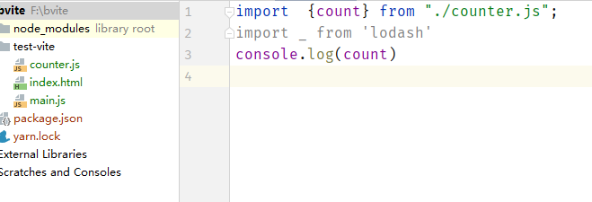
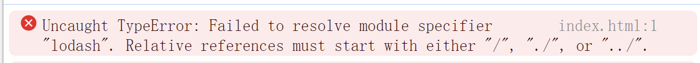
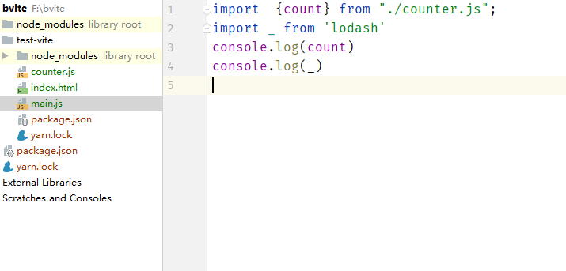
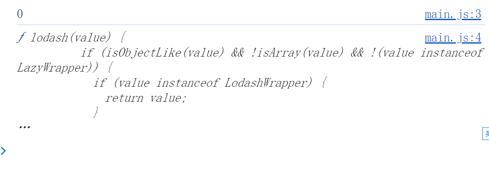
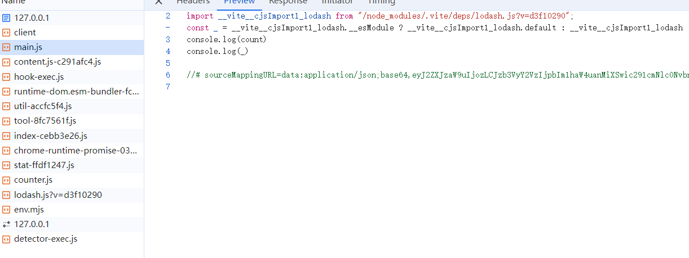
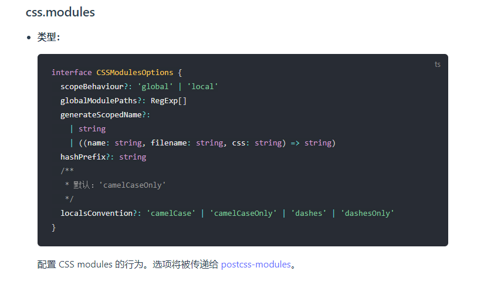
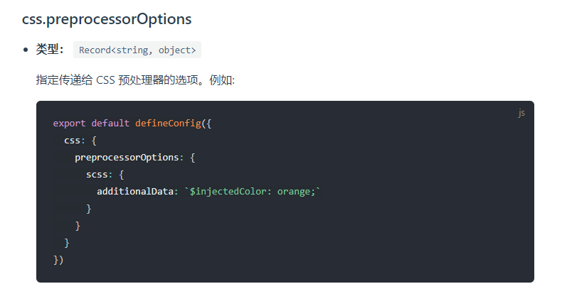

# vite

## vite vs webpack

### vite 解决了哪些webpack解决不了的问题呢？

当我们开始构建越来越大型的应用时，需要处理的 JavaScript 代码量也呈指数级增长。包含数千个模块的大型项目相当普遍。我们开始遇到性能瓶颈 —— 使用 JavaScript 开发的工具通常需要很长时间（甚至是几分钟！）才能启动开发服务器，即使使用 HMR，文件修改后的效果也需要几秒钟才能在浏览器中反映出来。如此循环往复，迟钝的反馈会极大地影响开发者的开发效率和幸福感。

Vite 旨在利用生态系统中的新进展解决上述问题：浏览器开始原生支持 ES 模块，且越来越多 JavaScript 工具使用编译型语言编写

#### 缓慢的服务器启动

当冷启动开发服务器时，基于打包器（webpack）的方式启动必须优先抓取并构建你的整个应用，然后才能提供服务。

vite 通过在一开始将应用中的模块区分**依赖**和**源码**两类，改进了开发服务器启动时间

- 依赖： 大多为在开发时不会变动的纯 JavaScript。一些较大的依赖处理代价也很高。依赖也通常会存在多种模块化格式（ESM或者CommonJS）。
  vite将会使用esbuild预构建依赖。Esbuild 使用GO编写，并且比以JavaScript编写的打包器预构建依赖块10-100倍
- 源码：通常包含一些并非直接是JavaScript的文件，需要转换（如JSX，CSS或者Vue/Svelte组件），时常会被编辑。同时，并不是所有的源码都需要同时被加载（如基于路由拆分的代码模块）

vite以原生ESM方式提供源码。这实际上是让浏览器接管了打包程序的部分工作：vite只需要在浏览器请求源码时进行转换并按需提供源码。根据情景动态导入代码，即只在当前屏幕上实际使用时才会被处理。

#### 缓慢的更新

基于打包器启动时，重建整个包的效率很低。原因：这样更新速度会随着应用体积增长而直线下降，即使引入了HMR，其热更新速度也会随着应用规模的增长而显著下降

Vite中，HMR是在原生的ESM执行的。当编辑一个文件时，Vite只需要精确地使已编辑的模块与其最近的HMR边界之间的链接失活。使得无论应用大小如何，HMR始终能保持快速更新。
vite同时利用了HTTP头来加载整个页面的重新加载（再次让浏览器为我们做很多事情）：源码模块的请求会根据 304 not Modified 进行协商缓存，而依赖模块请求则会通过 Cache-control： max-age=31536000，immutable 进行强缓存，因此一旦被缓存它们将不需要再次请求

#### 为什么生产环境需要打包

原生ESM已得到广泛支持，但是由于嵌套导入导出会导致额外的网络往返，在生产环境中发布未打包的ESM仍然效率底下。为了在生产环境中获得最佳的加载性能，最好还是将代码进行tree-shaking、懒加载和chunk分割（以获得更好的缓存）

#### 为什么不用ESBulid打包

因为没有代码分割和对css方面的处理

### vite是vue官方团队出品，vue的生态强大，且他是vue的‘亲兄弟’，vue后面会主动推vite

### 构建工具：

1. 模块化开发的支持： 支持直接从node_modules引入代码， 支持多种模块化支持
2. 处理代码兼容性：babel语法降级，less，ts 语法转换
3. 提高项目性能：压缩文件，代码分割
4. 优化开发体验：
   - 构建工具自动监听文件的变化，当文件变化时，自动调用对应的集成工具进行重新打包，然后在浏览器重新运行（hot replacement）
   - 开发服务器：跨域问题，vue-cli 解决跨域问题

构建工具它让我们不用每次都关心我们的代码在浏览器如何运行，只需要首次给构建工具提供一个配置文件（这个配置文件也不是必须的，如果不给他，他会有默认值），有了这个集成的配置文件以后，就可以在下次需要更新的时候调用一次对应的命令就好了。

#### create-vite 和 vite  create-vite内置了vite

**在项目中直接引入第三方包 lodash， 浏览器会找不到该文件** ES只会找到相对路径 或 绝对路径，依赖的这个包 在这俩路径下没有被找到，所以会报错




**至于为什么不查找node_modules呢**
因为第三方包可能会有其他依赖，浏览器走的是网络请求模块，若可以直接查找node_modules,那么将会有很多的模块会走网络请求，将会占用很多资源。而Commonjs可以这样查找是因为它是在服务端 可以直接查找文件，而不走网络。

**开箱即用**
安装vite，并运行。
只需要安装vite，并启动vite 就直接能使用了，不需要额外的配置





下面来看看 在`main.js`中引入的`lodash`,经过vite编译后是什么样的



vite处理后的模块，路径补全了后，浏览器就会找到该文件

#### 依赖预构建

vite会找到对应的依赖，然后调用esbuild，将其他规范代码转换成esmodule规范，然后放到当前目录下的node_modules/.vite/deps。

**解决的问题**

不同的第三方包会有不同的导出格式

对路径的处理上可以直接使用.vite/deps,方便路径重写

网络多包传输的性能问题（也是元素ESM规范不敢支持node_modules的原因之一），有了依赖预构建以后，无论他有多少额外的export和import vite都会尽可能的将它们进行集成最后生成一个或几个模块


#### vite 配置文件

##### 语法提示


- 引入 `defineConfig`  使用如下方法，配置选项时，会有语法提示

```js
import { defineConfig } from 'vite'

export default defineConfig({
	optimizeDeps: {
        exclude: []// 这里边中以来不会进行预构建
    }
})
```

- 使用类型标注

```js
/** @type import('vite').UserConfig */
const viteConfig = {
    optimizeDeps: {
        exclude: [],
    },
  
}
```


##### 环境的处理

vite.config.js
```js
import { defineConfig } from 'vite'
import viteBaseConfig from './vite.base.config'
import viteProdConfig from './vite.prod.config'
import viteDevConfig from './vite.dev.config'


// 策略模式

const envResolver = {
	'build': () => Object.assign({}, viteBaseConfig,viteProdConfig),
	'server': () => Object.assign({}, viteBaseConfig, viteDevConfig)
}
export default defineConfig(({command}) => {
	return envResolver[command]()
})
```

##### vite 环境变量配置

> 环境变量：会根据当前的代码环境产生的值变化的变量就叫环境变量

1. 开发环境
2. 测试环境
3. 预发布环境
4. 灰度环境
5. 生成环境

使用第三方库 `dotenv`, 自动读取.evn文件，并解析这个文件中的对应的环境变量，将其注入到process对象下，但是vite考虑到和其他配置的一些冲突问题，vite不会直接注入到process对象下


涉及到vite.config.js中的一些配置:
root
envDir:用来配置当前环境变量的文件地址

```js
export default defineConfig(({command,mode}) => {
	const env = loadEnv(mode,process.cwd(),'')
	console.log(env)
	return envResolver[command]()
})
```

在客户端中，vite会将环境变量注入到`import.meta.env`中。

vite为了防止我们将隐私性的变量直接送进import.meta.env中，它做了一层拦截，如果环境变量不是以`VITE` 开头的，就不会注入到到客户端中，如果想要更改这个前缀，可以使用`envPrefix`配置


为什么 `vite.config.js`可以书写成esm形式，这是因为vite他在读取这个vite.config.js时候会先node去解析文件语法，如果发现是esm规范会直接将esm规范进行替换变成commonjs规范


##### vite处理css

vite 天生就支持对css文件的直接处理

1. vite在读取到js文件中引用到.css文件
2. 直接去使用fs模块去读取css中文件内容
3. 直接创建一个style标签，将css中文件内容直接copy到style标签里
4. 将style标签插入到index.html的head中
5. 将该css文件中的内容直接替换为js脚本（方便热更新或css模块化），同时设置Content-Type为js，从而让浏览器以js脚本来执行该css后缀的文件


##### vite.config.js中css配置

在vite.config.js中配置css属性控制整个vite对css处理行为



- localConvention：改变key的显示方式(驼峰 下划线 中划线)
- scopeBehaviour: 配置当前模块化行为是模块化还是全局化（有hash就是开启了模块化的一个标志，它可以保证产生不同的hash值来控制样式类名不被覆盖）
- generateScopedName: 生成类名的规则
- hashPrefix: hash会根据类名 + 文件名 + 文件内容 进行生成，如果想要生成hash更加独特一点，可以配置hashPrefix，配置的这个字符串会参与到最终的hash生成
- globalModulePaths: 不参与css模块化的路径


##### vite配置文件中css配置流程（preprocessorOption）



```js
 preprocessorOptions:{
      less: { // 整个的配置对象都会最终给到less的执行参数中去（lessc --math=‘always’）
        math: 'always',
        globalVars: {},
      }
  }
```


##### postcss


**对css的属性使用降级**

**前缀补全** 

使用见  项目


##### vite 加载静态资源

对静态资源及别名的配置

vite对svg依旧是开箱即用的


#### vite在生产环境对静态资源的处理


将工程打包后，就会找不到原来的资源

打包后在资源会带有hash，

浏览器有缓存机制，静态资源名字只要不改，那么他就会直接使用缓存

刷新页面：请求的名字是同一个， 他就会读取缓存

故需尽量避免名字一致

利用hash算法，更好的控制缓存


#### vite 插件

vite会在不同的生命周期的不同阶段中调用不同的插件以达到不同的目的


#### vite 性能优化

- 开发时态的速度优化
- 页面性能指标
    - 首屏渲染时：fcp（first content paint）
        - 懒加载：
        - 网络优化： 协商缓存，强缓存
            - 强缓存：服务器给响应头追加一些字段，客户端会记住这些字段，在 expires没有到达之前，无论怎么刷新页面，浏览器都不会重新请求页面吗，而是从缓存中读取
            - 协商缓存：是否使用缓存，需要商量一下，当服务端给我们打上协商缓存的标记后，客户端在下次刷新页面需要重新请求资源时会发送一个协商请求给服务端，服务端如果说需要变化，则会响应具体的内容，如果服务端没有变化则会响应304
    - 页面中最大元素的一个时长：lcp（largest content paint）
- js 逻辑


