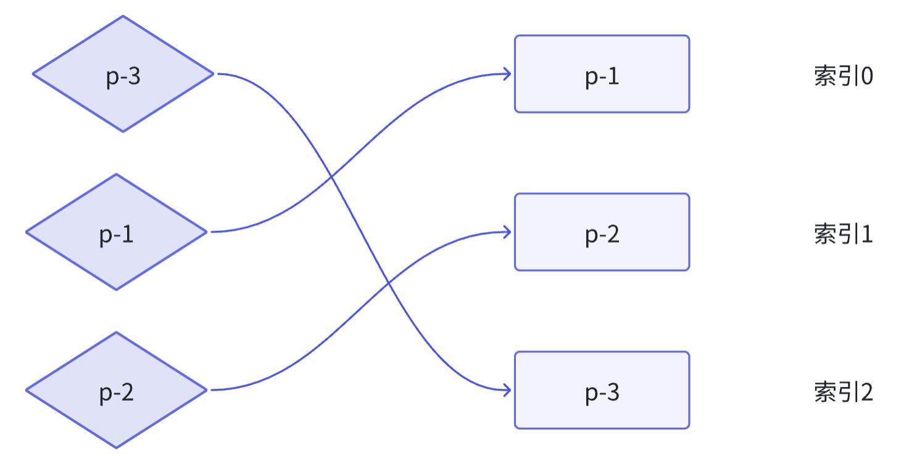
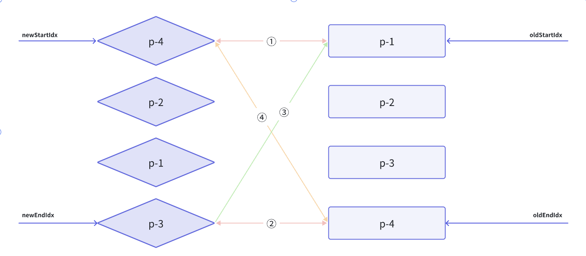

# Diff算法

当新旧`vnode`的子节点都是一组节点时，为了以最小的性能开销完成更新操作，需要比较两组子节点，用于比较大算法就叫作`Diff`算法。操作`DOM`的性能开销通常比较大，而渲染器的核心`Diff`算法就是为了解决这个问题而诞生的。

## 简单的Diff算法

### 减少DOM操作的性能开销

核心`Diff`只关心新旧虚拟节点都存在一组子节点的情况。

```js
function patchChildren(n1, n2, container) {
  // 判断新子节点的类型是否是文本节点
  if (typeof n2.children === 'string') {
    // 旧子节点的类型有三种可能：没有子节点、文本子节点以及一组子节点
    // 只有当旧子节点为一组子节点时，才需要逐个卸载，其他情况下什么都不需要做
    if (Array.isArray(n1.children)) {
      n1.children.forEach((c) => unmount(c))
    }
    // 最后将新的文本节点内容设置给容器元素
    setElementText(container, n2.children)
  } else if (Array.isArray(n2.children)) {
    // 重新实现两组子节点的更新方式 // [!code ++]
      // 新旧children // [!code ++]
      const oldChildren = n1.children // [!code ++]
      const newChildren = n2.children // [!code ++]

      // 旧的一组子节点的长度 // [!code ++]
      const oldLen = oldChildren.length // [!code ++]

      // 新的一组子节点的长度 // [!code ++]
      const newLen = newChildren.length // [!code ++]

      // 两组子节点的公共长度，即两者中较短的那一组子节点的长度 // [!code ++]
      const commonLength = Math.min(oldLen, newLen) // [!code ++]

      // 遍历commonLength次 // [!code ++]
      for(let i = 0; i < commonLength; i++) { // [!code ++]
        patch(oldChildren[i], newChildren[i]) // [!code ++]
      } // [!code ++]
  
      // 如果newLen > oldLen, 说明有新的子节点需要挂载 // [!code ++]
      if(newLen > oldLen) { // [!code ++]
        for(let i = commonLength; i < newLen; i++) { // [!code ++]
          patch(null, newChildren[i], container) // [!code ++]
        } // [!code ++]
      } else if(oldLen > newLen) { // [!code ++]
        // 如果oldLen > newLen，说明有旧的子节点需要卸载 // [!code ++]
        for(let i = commonLength; i < oldLen; i++) { // [!code ++]
          unmount(oldChildren[i]) // [!code ++]
        } // [!code ++]
      } // [!code ++]
  } else {
    // 新子节点不存在
    // 旧子节点是一组子节点，只需逐个卸载即可
    if (Array.isArray(n1.children)) {
      n1.children.forEach(c => unmount(c))
    } else if (typeof n1.children === 'string') {
      // 旧子节点是文本子节点，清空内容即可
      setElementText(container, '')
    }
    // 若没有旧子节点，什么都不需要做
  }
}
```

### DOM复用与key的作用

为了减少`DOM`操作的次数，提升更新性能。可以先观察新旧两组节点，是否都相同，只是内容不同，则可以通过移动操作完成更新。

新旧两组子节点中的确存在可复用的节点。可以通过`DOM`的移动来完成更新。
需要引入额外的`key`来作为`vnode`的标识

```js
// oldChildren
[
  { type: 'p', children: '1', key: 1},
  { type: 'p', children: '2', key: 2},
  { type: 'p', children: '3', key: 3},
]

// newChildren
[
  { type: 'p', children: '3', key: 3},
  { type: 'p', children: '2', key: 2},
  { type: 'p', children: '1', key: 1},
]
```

如果只用`type`来判断两个节点是否相同，向上面一样，`type`的属性值都是相同的，这就导致无法确定新旧两组子节点中节点的对应关系。

`key`就像虚拟节点的 ‘身份证’号，只要两个虚拟节点的`type`属性值和`key`属性值都相同，那么就认为它们是相同的，即可以进行`DOM`的复用。

```js
function patchChildren(n1, n2, container) {
  // 判断新子节点的类型是否是文本节点
  if (typeof n2.children === 'string') {
    // 旧子节点的类型有三种可能：没有子节点、文本子节点以及一组子节点
    // 只有当旧子节点为一组子节点时，才需要逐个卸载，其他情况下什么都不需要做
    if (Array.isArray(n1.children)) {
      n1.children.forEach((c) => unmount(c))
    }
    // 最后将新的文本节点内容设置给容器元素
    setElementText(container, n2.children)
  } else if (Array.isArray(n2.children)) {
    // 重新实现两组子节点的更新方式
    // 新旧children
    const oldChildren = n1.children
    const newChildren = n2.children

    // 旧的一组子节点的长度 // [!code --]
    const oldLen = oldChildren.length // [!code --]

    // 新的一组子节点的长度 // [!code --]
    const newLen = newChildren.length // [!code --]

    // 两组子节点的公共长度，即两者中较短的那一组子节点的长度 // [!code --]
    const commonLength = Math.min(oldLen, newLen) // [!code --]

    // 遍历commonLength次 // [!code --]
    for (let i = 0; i < commonLength; i++) { // [!code --]
      patch(oldChildren[i], newChildren[i]) // [!code --]
    } // [!code --]

    // 如果newLen > oldLen, 说明有新的子节点需要挂载 // [!code --]
    if (newLen > oldLen) { // [!code --]
      for (let i = commonLength; i < newLen; i++) { // [!code --]
        patch(null, newChildren[i], container) // [!code --]
      } // [!code --]
    } else if (oldLen > newLen) { // [!code --]
      // 如果oldLen > newLen，说明有旧的子节点需要卸载 // [!code --]
      for (let i = commonLength; i < oldLen; i++) { // [!code --]
        unmount(oldChildren[i]) // [!code --]
      } // [!code --]
    } // [!code --]


    // 遍历新的children
    for (let i = 0; i < newChildren.length; i++) { // [!code ++]
      const newVnode = newChildren[i] // [!code ++]

      // 遍历旧的children // [!code ++]
      for (let j = 0; j < oldChildren.length; j++) { // [!code ++]
        const oldVnode = oldChildren[j] // [!code ++]
        // 如果找到了具有相同key值的两个节点，说明可以复用，但仍然需要调用patch函数更新 // [!code ++]
        if (newVnode.key === oldVnode.key) { // [!code ++]
          patch(oldVnode, newVnode, container) // [!code ++]
          break // [!code ++]
        } // [!code ++]
      } // [!code ++]
    } // [!code ++]


  } else {
    // 新子节点不存在
    // 旧子节点是一组子节点，只需逐个卸载即可
    if (Array.isArray(n1.children)) {
      n1.children.forEach(c => unmount(c))
    } else if (typeof n1.children === 'string') {
      // 旧子节点是文本子节点，清空内容即可
      setElementText(container, '')
    }
    // 若没有旧子节点，什么都不需要做
  }
}
```

### 找到需要移动的元素

当新旧两组子节点的顺序不变时，就不需要额外的移动操作

在旧children中寻找具有相同key值节点的过程中，遇到的最大索引值

如果新旧节点的key值相同，说明我们在旧children中找到了可复用DOM的节点。此时用该节点在旧的children中索引j与lastIndex进行比较，如果j小于lastIndex，说明当前oldVnode对应的真实DOM需要移动，否则说明不需要移动。

```js
function patchChildren(n1, n2, container) {
    // 判断新子节点的类型是否是文本节点
    if (typeof n2.children === 'string') {
      // 旧子节点的类型有三种可能：没有子节点、文本子节点以及一组子节点
      // 只有当旧子节点为一组子节点时，才需要逐个卸载，其他情况下什么都不需要做
      if (Array.isArray(n1.children)) {
        n1.children.forEach((c) => unmount(c))
      }
      // 最后将新的文本节点内容设置给容器元素
      setElementText(container, n2.children)
    } else if (Array.isArray(n2.children)) {
      // 重新实现两组子节点的更新方式
      // 新旧children
      const oldChildren = n1.children
      const newChildren = n2.children

      // 用来存储寻找过程中遇到的最大索引值 // [!code ++]
      let lastIndex = 0 // [!code ++]

      // 遍历新的children
      for (let i = 0; i < newChildren.length; i++) {
        const newVnode = newChildren[i]

        // 遍历旧的children
        for (let j = 0; j < oldChildren.length; j++) {
          const oldVnode = oldChildren[j]
          // 如果找到了具有相同key值的两个节点，说明可以复用，但仍然需要调用patch函数更新
          if (newVnode.key === oldVnode.key) {
            patch(oldVnode, newVnode, container)
            if (j < lastIndex) { // [!code ++]
              // 如果当前找到的节点在旧children中的索引小于最大索引值lastIndex // [!code ++]
              // 说明该节点对应的真实DOM需要移动 // [!code ++]
            } else { // [!code ++]
              // 如果当前找到的节点在旧children中的索引不小于最大索引值 // [!code ++]
              // 则更新lastIndex 的值 // [!code ++]
              lastIndex = j // [!code ++]
            } // [!code ++]
            break
          }
        }
      }


    } else {
      // 新子节点不存在
      // 旧子节点是一组子节点，只需逐个卸载即可
      if (Array.isArray(n1.children)) {
        n1.children.forEach(c => unmount(c))
      } else if (typeof n1.children === 'string') {
        // 旧子节点是文本子节点，清空内容即可
        setElementText(container, '')
      }
      // 若没有旧子节点，什么都不需要做
    }
  }

```

### 如何移动元素

移动是指移动一个虚拟节点所对应的真实DOM节点，并不是移动虚拟节点本身。既然移动的是真实DOM节点，那么就需要取得对它的引用才行。当一个虚拟节点被挂载后，其对应的真实DOM节点会存储在它的vnode.el属性中。

- 取新的一组子节点中第一个节点，它的key为indexkey，尝试在旧的一组子节点中找到具有相同key值的可复用节点。若能够找到，并且该节点在旧的一组子节点中的索引值不小于lastIndex，则这个节点对应的真实DOM不需要移动，但是需要更新lastIndex值为当前的索引值
- 取新的一组子节点中第二个节点，它的key为indexkey2，尝试在旧的一组子节点中找到具有相同key值的可复用节点。如能够找到，并且该节点在旧的一组子节点中的索引值小于lastIndex，则这个节点对应的真实DOM需要移动。

```js
function patchChildren(n1, n2, container) {
    // 判断新子节点的类型是否是文本节点
    if (typeof n2.children === 'string') {
      // 旧子节点的类型有三种可能：没有子节点、文本子节点以及一组子节点
      // 只有当旧子节点为一组子节点时，才需要逐个卸载，其他情况下什么都不需要做
      if (Array.isArray(n1.children)) {
        n1.children.forEach((c) => unmount(c))
      }
      // 最后将新的文本节点内容设置给容器元素
      setElementText(container, n2.children)
    } else if (Array.isArray(n2.children)) {
      // 重新实现两组子节点的更新方式
      // 新旧children
      const oldChildren = n1.children
      const newChildren = n2.children

      // 用来存储寻找过程中遇到的最大索引值
      let lastIndex = 0

      // 遍历新的children
      for (let i = 0; i < newChildren.length; i++) {
        const newVnode = newChildren[i]

        // 遍历旧的children
        for (let j = 0; j < oldChildren.length; j++) {
          const oldVnode = oldChildren[j]
          // 如果找到了具有相同key值的两个节点，说明可以复用，但仍然需要调用patch函数更新
          if (newVnode.key === oldVnode.key) {
            patch(oldVnode, newVnode, container)
            if (j < lastIndex) {
              // 如果当前找到的节点在旧children中的索引小于最大索引值lastIndex
              // 说明该节点对应的真实DOM需要移动

              // 运行到这里，说明newVnode对应的真实DOM需要移动 // [!code ++]
              // 先获取newVnode的前一个vnode，即prevnode // [!code ++]
              const preVNode = newChildren[i - 1] // [!code ++]

              // 如果preVNode不存在，说明当前newVNode是第一个节点，它不需要移动 // [!code ++]
              if (preVNode) { // [!code ++]
                // 由于我们要将newVnode对应的真实DOM移动到preVNode所对应真实DOM后面 // [!code ++]
                // 索引我们需要获取preVNode所对应真实DOM的下一个兄弟节点，并将其作为锚点 // [!code ++]
                const anchor = preVNode.el.nextSibling // [!code ++]
                // 调用insert方法将newVNode对应的真实DOM插入到锚点元素前面 // [!code ++]
                // 也就是preVNode对应真实DOM后面 // [!code ++]
                insert(newVnode.el, container, anchor) // [!code ++]
              } // [!code ++]

            } else {
              // 如果当前找到的节点在旧children中的索引不小于最大索引值
              // 则更新lastIndex 的值
              lastIndex = j
            }
            break
          }
        }
      }


    } else {
      // 新子节点不存在
      // 旧子节点是一组子节点，只需逐个卸载即可
      if (Array.isArray(n1.children)) {
        n1.children.forEach(c => unmount(c))
      } else if (typeof n1.children === 'string') {
        // 旧子节点是文本子节点，清空内容即可
        setElementText(container, '')
      }
      // 若没有旧子节点，什么都不需要做
    }
  }
```

### 添加新元素

- 取新的一组子节点中第一个节点p1，它的key值为3。尝试在旧的一组子节点中寻找可复用的节点，若能够找到，并且该节点在旧的一组子节点中的索引值为2。此时，变量lastIndex的值为0，索引值2不小于lastIndex值，所以节点p1对应的真实DOM不需要移动，但是需要将变量lastIndex的值更新为2。
- 取新的一组子节点中第二个节点p2，它的key值为1，尝试在旧的一组子节点中寻找可复用的节点，能够找到，并且该节点在旧的一组子节点中的索引值为0。此时变量lasIndex的值为2，索引值0小于lastIndex值2，所以节点p2对应的真实DOM需要移动，并且应该移动到p1对应真实DOM后面。
- 取新的一组子节点中的第三个节点p3，它的key值为4。尝试在旧的一组子节点中寻找可复用的节点，由于在旧的一组子节点中，没有key值为4的节点。因此渲染器会把这个p3看作新增节点并挂载它。那么应该将它挂载到哪里呢?需要观察节点p3在新的一组子节点中的位置，并将它挂载的p3之前节点对应的DOM后面。
- 取新的一组子节点中第四个节点p4，它的key值为2，尝试在旧的一组子节点中寻找可复用的节点，能够找到，并且该节点在旧的一组子节点中的索引值为1。此时变量lastIndex的值为2，索引值1小于lastIndex的值，所以节点p4对应的真实DOM需要移动，并且应该移动到节点p3对应的真实DOM后面。

```js
function patchChildren(n1, n2, container) {
    // 判断新子节点的类型是否是文本节点
    if (typeof n2.children === 'string') {
      // 旧子节点的类型有三种可能：没有子节点、文本子节点以及一组子节点
      // 只有当旧子节点为一组子节点时，才需要逐个卸载，其他情况下什么都不需要做
      if (Array.isArray(n1.children)) {
        n1.children.forEach((c) => unmount(c))
      }
      // 最后将新的文本节点内容设置给容器元素
      setElementText(container, n2.children)
    } else if (Array.isArray(n2.children)) {
      // 重新实现两组子节点的更新方式
      // 新旧children
      const oldChildren = n1.children
      const newChildren = n2.children

      // 用来存储寻找过程中遇到的最大索引值
      let lastIndex = 0

      // 遍历新的children
      for (let i = 0; i < newChildren.length; i++) {
        const newVnode = newChildren[i]

        let j = 0 // [!code ++]
        // 在第一层循环中定义变量find，代表是否在旧的一组子节点中找到可复用的节点 // [!code ++]
        // 初始值为 false， 代表没找到 // [!code ++]
        let find =false // [!code ++]

        // 遍历旧的children
        for (j; j < oldChildren.length; j++) { // [!code ++]
          const oldVnode = oldChildren[j]
          // 如果找到了具有相同key值的两个节点，说明可以复用，但仍然需要调用patch函数更新
          if (newVnode.key === oldVnode.key) {
            find = true // [!code ++]
            patch(oldVnode, newVnode, container)
            if (j < lastIndex) {
              // 如果当前找到的节点在旧children中的索引小于最大索引值lastIndex
              // 说明该节点对应的真实DOM需要移动

              // 运行到这里，说明newVnode对应的真实DOM需要移动
              // 先获取newVnode的前一个vnode，即prevnode
              const preVNode = newChildren[i - 1]

              // 如果preVNode不存在，说明当前newVNode是第一个节点，它不需要移动
              if (preVNode) {
                // 由于我们要将newVnode对应的真实DOM移动到preVNode所对应真实DOM后面
                // 索引我们需要获取preVNode所对应真实DOM的下一个兄弟节点，并将其作为锚点
                const anchor = preVNode.el.nextSibling
                // 调用insert方法将newVNode对应的真实DOM插入到锚点元素前面
                // 也就是preVNode对应真实DOM后面
                insert(newVnode.el, container, anchor)
              }

            } else {
              // 如果当前找到的节点在旧children中的索引不小于最大索引值
              // 则更新lastIndex 的值
              lastIndex = j
            }
            break
          }
        }
        // 如果代码运行到这里，find仍然为false // [!code ++]
        // 说明当前newVNode没有在旧的一组节点中找到可复用的节点 // [!code ++]
        // 也就是说，当前newVNode是新增节点，需要挂载 // [!code ++]
        if(!find){ // [!code ++]
          // 为了将节点挂载到正确位置，我们需要先获取锚点元素 // [!code ++]
          // 首先获取当前newVNode的前一个vnode节点 // [!code ++]
          const preVNode = newChildren[i -1 ] // [!code ++]
          let anchor = null // [!code ++]
          if(preVNode) { // [!code ++]
            // 如果有前一个vnode节点，则使用它的下一个兄弟节点作为锚点元素 // [!code ++]
            anchor = preVNode.el.nextSibling // [!code ++]
          } else { // [!code ++]
            // 如果没有前一个vnode节点，说明即将挂载的新的节点是第一个子节点 // [!code ++]
            // 这是我们使用容器元素的firstChild作为锚点 // [!code ++]
            anchor = container.firstChild // [!code ++]
          } // [!code ++]
          patch(null, newVnode, container, anchor) // [!code ++]
        } // [!code ++]
      }


    } else {
      // 新子节点不存在
      // 旧子节点是一组子节点，只需逐个卸载即可
      if (Array.isArray(n1.children)) {
        n1.children.forEach(c => unmount(c))
      } else if (typeof n1.children === 'string') {
        // 旧子节点是文本子节点，清空内容即可
        setElementText(container, '')
      }
      // 若没有旧子节点，什么都不需要做
    }
  }

function patch(n1, n2, container, anchor) { // [!code ++]
    // 如果n1存在，则对比n1和n2的类型
    if (n1 && n1.type !== n2.type) {
      // 如果新旧vnode的类型不同，则直接将旧的vnode卸载
      unmount(n1)
      n1 = null
    }
    const { type } = n2
    if (typeof type === 'string') {
      // 如果 n1 不存在，意味着挂载，则调用mountElement 函数完成挂载
      // n1 代表旧的vnode， n2 代表新的vnode，当n1不存在时，意味着没有旧的vnode，
      // 这时只需要挂载
      if (!n1) {
        mountElement(n2, container, anchor) // [!code ++]
      } else {
        console.log(n1, n2)
        // n1 存在，意味着打补丁，
        patchElement(n1, n2)
      }
    } else if (type === Text) {
      // 如果新的vnode的类型是Text，则说明该vnode描述的是文本节点

      // 如果没有旧节点，则进行挂载
      if (!n1) {
        // 使用createTextNode 创建文本节点
        const el = n2.el = createText(n2.children)
        // 将文本节点插入到容器中
        insert(el, container)
      } else {
        // 如果旧vnode存在，只需要使用新文本节点的文本内容更新旧文本节点即可
        const el = n2.el = n1.el
        if (n2.children !== n1.children) {
          setText(el, n2.children)
        }
      }
    } else if (type === Comment) {
      if (!n1) {
        const el = n2.el = createComment(n2.children)
        insert(el, container)
      } else {
        const el = n2.el = n1.el
        if (n2.children !== n1.children) {
          setComment(el, n2.children)
        }
      }
    } else if (type === Fragment) {
      if (!n1) {
        // 如果旧vnode不存在，则只需要将Fragment的children逐个挂载即可
        n2.children.forEach(c => patch(null, c, container))
      } else {
        // 如果旧vnode存在，则只需要更新Fragment的children即可
        patchChildren(n1, n2, container)
      }
    }
    else if (typeof type === 'object') {
      // 组件
    } else if (type === 'xxx') {
      // 其他类型的vnode
    }

  }


function mountElement(vnode, container, anchor) { // [!code ++]
    // 创建DOM元素
    const el = vnode.el = createElement(vnode.type)
    // 处理子节点，如果子节点是字符串，代表元素具有文本节点
    if (typeof vnode.children === 'string') {
      setElementText(el, vnode.children)
    } else if (Array.isArray(vnode.children)) {
      // 如果childern是数组，则遍历每一个子节点，并调用patch函数挂载它们
      vnode.children.forEach(child => {
        patch(null, child, el)
      })
    }

    if (vnode.props) {
      for (const key in vnode.props) {
        patchProps(el, key, null, vnode.props[key])
      }
    }
    // 将元素添加到容器中
    insert(el, container, anchor) // [!code ++]
  }
```

### 移除不存在的元素

当基本的更新结束时，需要遍历旧的一组子节点，然后取新的一组子节点中寻找具有相同key值的节点。如果找不到，则说明应该删除该节点

```js
 function patchChildren(n1, n2, container) {
    // 判断新子节点的类型是否是文本节点
    if (typeof n2.children === 'string') {
      // 旧子节点的类型有三种可能：没有子节点、文本子节点以及一组子节点
      // 只有当旧子节点为一组子节点时，才需要逐个卸载，其他情况下什么都不需要做
      if (Array.isArray(n1.children)) {
        n1.children.forEach((c) => unmount(c))
      }
      // 最后将新的文本节点内容设置给容器元素
      setElementText(container, n2.children)
    } else if (Array.isArray(n2.children)) {
      // 重新实现两组子节点的更新方式
      // 新旧children
      const oldChildren = n1.children
      const newChildren = n2.children

      // 用来存储寻找过程中遇到的最大索引值
      let lastIndex = 0

      // 遍历新的children
      for (let i = 0; i < newChildren.length; i++) {
        const newVnode = newChildren[i]

        let j = 0
        // 在第一层循环中定义变量find，代表是否在旧的一组子节点中找到可复用的节点
        // 初始值为 false， 代表没找到
        let find = false

        // 遍历旧的children
        for (j; j < oldChildren.length; j++) {
          const oldVnode = oldChildren[j]
          // 如果找到了具有相同key值的两个节点，说明可以复用，但仍然需要调用patch函数更新
          if (newVnode.key === oldVnode.key) {
            find = true
            patch(oldVnode, newVnode, container)
            if (j < lastIndex) {
              // 如果当前找到的节点在旧children中的索引小于最大索引值lastIndex
              // 说明该节点对应的真实DOM需要移动

              // 运行到这里，说明newVnode对应的真实DOM需要移动
              // 先获取newVnode的前一个vnode，即prevnode
              const preVNode = newChildren[i - 1]

              // 如果preVNode不存在，说明当前newVNode是第一个节点，它不需要移动
              if (preVNode) {
                // 由于我们要将newVnode对应的真实DOM移动到preVNode所对应真实DOM后面
                // 索引我们需要获取preVNode所对应真实DOM的下一个兄弟节点，并将其作为锚点
                const anchor = preVNode.el.nextSibling
                // 调用insert方法将newVNode对应的真实DOM插入到锚点元素前面
                // 也就是preVNode对应真实DOM后面
                insert(newVnode.el, container, anchor)
              }

            } else {
              // 如果当前找到的节点在旧children中的索引不小于最大索引值
              // 则更新lastIndex 的值
              lastIndex = j
            }
            break
          }
        }
        // 如果代码运行到这里，find仍然为false
        // 说明当前newVNode没有在旧的一组节点中找到可复用的节点
        // 也就是说，当前newVNode是新增节点，需要挂载
        if (!find) {
          // 为了将节点挂载到正确位置，我们需要先获取锚点元素
          // 首先获取当前newVNode的前一个vnode节点
          const preVNode = newChildren[i - 1]
          let anchor = null
          if (preVNode) {
            // 如果有前一个vnode节点，则使用它的下一个兄弟节点作为锚点元素
            anchor = preVNode.el.nextSibling
          } else {
            // 如果没有前一个vnode节点，说明即将挂载的新的节点是第一个子节点
            // 这是我们使用容器元素的firstChild作为锚点
            anchor = container.firstChild
          }
          patch(null, newVnode, container, anchor)
        }
      }

      // 遍历旧的一组子节点 // [!code ++]
      for (let i = 0; i < oldChildren.length; i++) { // [!code ++]
        const oldVNode = oldChildren[i] // [!code ++]
        // 拿旧的子节点oldVNode去新的一组子节点中寻找具有相同key值的节点 // [!code ++]
        const has = newChildren.find(vnode => vnode.key === oldVNode.key) // [!code ++]
        if (!has) { // [!code ++]
          // 如果没有找到具有相同key值的节点，则说明需要删除该节点 // [!code ++]
          // 调用unmount函数将其卸载 // [!code ++]
          unmount(oldVNode) // [!code ++]
        } // [!code ++]
      } // [!code ++]

    } else {
      // 新子节点不存在
      // 旧子节点是一组子节点，只需逐个卸载即可
      if (Array.isArray(n1.children)) {
        n1.children.forEach(c => unmount(c))
      } else if (typeof n1.children === 'string') {
        // 旧子节点是文本子节点，清空内容即可
        setElementText(container, '')
      }
      // 若没有旧子节点，什么都不需要做
    }
  }

```

## 双端Diff算法

简单的diff算法，利用虚拟节点的key属性，尽可能地复用DOM元素，并通过移动DOM的方式来完成更新，从而减少不断地创建和销毁DOM元素带来的性能开销。



如图，使用简单diff算法 需要两次移动操作。其实只需要通过一步DOM节点的移动操作即可完成更新，即只需要把真实DOM节点p-3移动到真实DOM节点p-1前面。

双端Diff算法是一种同时对新旧两组子节点的两个端点进行比较的算法

```js
function patchChildren(n1, n2, container) {
    // 判断新子节点的类型是否是文本节点
    if (typeof n2.children === 'string') {
      // 旧子节点的类型有三种可能：没有子节点、文本子节点以及一组子节点
      // 只有当旧子节点为一组子节点时，才需要逐个卸载，其他情况下什么都不需要做
      if (Array.isArray(n1.children)) {
        n1.children.forEach((c) => unmount(c))
      }
      // 最后将新的文本节点内容设置给容器元素
      setElementText(container, n2.children)
    } else if (Array.isArray(n2.children)) {
      // 重新实现两组子节点的更新方式 // [!code --]
      // 新旧children // [!code --]
      const oldChildren = n1.children // [!code --]
      const newChildren = n2.children // [!code --]

      // 用来存储寻找过程中遇到的最大索引值 // [!code --]
      let lastIndex = 0 // [!code --]

      // 遍历新的children // [!code --]
      for (let i = 0; i < newChildren.length; i++) { // [!code --]
        const newVnode = newChildren[i] // [!code --]

        let j = 0 // [!code --]
        // 在第一层循环中定义变量find，代表是否在旧的一组子节点中找到可复用的节点 // [!code --]
        // 初始值为 false， 代表没找到 // [!code --]
        let find = false // [!code --]

        // 遍历旧的children // [!code --]
        for (j; j < oldChildren.length; j++) { // [!code --]
          const oldVnode = oldChildren[j] // [!code --]
          // 如果找到了具有相同key值的两个节点，说明可以复用，但仍然需要调用patch函数更新 // [!code --]
          if (newVnode.key === oldVnode.key) { // [!code --]
            find = true // [!code --]
            patch(oldVnode, newVnode, container) // [!code --]
            if (j < lastIndex) { // [!code --]
              // 如果当前找到的节点在旧children中的索引小于最大索引值lastIndex // [!code --]
              // 说明该节点对应的真实DOM需要移动 // [!code --]

              // 运行到这里，说明newVnode对应的真实DOM需要移动 // [!code --]
              // 先获取newVnode的前一个vnode，即prevnode // [!code --]
              const preVNode = newChildren[i - 1] // [!code --]

              // 如果preVNode不存在，说明当前newVNode是第一个节点，它不需要移动 // [!code --]
              if (preVNode) { // [!code --]
                // 由于我们要将newVnode对应的真实DOM移动到preVNode所对应真实DOM后面 // [!code --]
                // 索引我们需要获取preVNode所对应真实DOM的下一个兄弟节点，并将其作为锚点 // [!code --]
                const anchor = preVNode.el.nextSibling // [!code --]
                // 调用insert方法将newVNode对应的真实DOM插入到锚点元素前面 // [!code --]
                // 也就是preVNode对应真实DOM后面 // [!code --]
                insert(newVnode.el, container, anchor) // [!code --]
              } // [!code --] 

            } else { // [!code --]
              // 如果当前找到的节点在旧children中的索引不小于最大索引值 // [!code --]
              // 则更新lastIndex 的值 // [!code --]
              lastIndex = j // [!code --]
            } // [!code --]
            break // [!code --]
          } // [!code --]
        } // [!code --]
        // 如果代码运行到这里，find仍然为false // [!code --]
        // 说明当前newVNode没有在旧的一组节点中找到可复用的节点 // [!code --]
        // 也就是说，当前newVNode是新增节点，需要挂载 // [!code --]
        if (!find) { // [!code --]
          // 为了将节点挂载到正确位置，我们需要先获取锚点元素 // [!code --]
          // 首先获取当前newVNode的前一个vnode节点 // [!code --]
          const preVNode = newChildren[i - 1] // [!code --]
          let anchor = null // [!code --]
          if (preVNode) { // [!code --]
            // 如果有前一个vnode节点，则使用它的下一个兄弟节点作为锚点元素 // [!code --]
            anchor = preVNode.el.nextSibling // [!code --]
          } else { // [!code --]
            // 如果没有前一个vnode节点，说明即将挂载的新的节点是第一个子节点 // [!code --]
            // 这是我们使用容器元素的firstChild作为锚点 // [!code --]
            anchor = container.firstChild // [!code --]
          } // [!code --]
          patch(null, newVnode, container, anchor) // [!code --]
        } // [!code --]
      } // [!code --]

      // 遍历旧的一组子节点 // [!code --]
      for (let i = 0; i < oldChildren.length; i++) { // [!code --]
        const oldVNode = oldChildren[i] // [!code --]
        // 拿旧的子节点oldVNode去新的一组子节点中寻找具有相同key值的节点 // [!code --]
        const has = newChildren.find(vnode => vnode.key === oldVNode.key) // [!code --]
        if (!has) { // [!code --]
          // 如果没有找到具有相同key值的节点，则说明需要删除该节点 // [!code --]
          // 调用unmount函数将其卸载 // [!code --]
          unmount(oldVNode) // [!code --]
        } // [!code --]
      } // [!code --]

      // 封装patchKeyedChildren函数处理两组子节点 // [!code ++]
      patchKeyedChildren(n1, n2, container) // [!code ++]

    } else {
      // 新子节点不存在
      // 旧子节点是一组子节点，只需逐个卸载即可
      if (Array.isArray(n1.children)) {
        n1.children.forEach(c => unmount(c))
      } else if (typeof n1.children === 'string') {
        // 旧子节点是文本子节点，清空内容即可
        setElementText(container, '')
      }
      // 若没有旧子节点，什么都不需要做
    }
  }


  function patchKeyedChildren(n1, n2, container) { // [!code ++]
    const oldChildren = n1.children // [!code ++]
    const newChildren = n2.children // [!code ++]
  
    let oldStartIdx = 0 // [!code ++]
    let odlEnIdx = oldChildren.length - 1 // [!code ++]
    let newStartIdx = 0 // [!code ++]
    let newEndIdx = newChildren.length - 1 // [!code ++]

      // 四个索引指向的vnode节点 // [!code ++]
    let oldStartVNode = oldChildren[oldStartIdx] // [!code ++]
    let oldEndVNode = oldChildren[odlEnIdx] // [!code ++]
    let newStartVNode = newChildren[newStartIdx] // [!code ++] 
    let newEndVNode = newChildren[newEndIdx] // [!code ++]
  }
```



双端比较，每一轮比较都分为四个步骤

- 比较旧的一组子节点中的第一个子节点p-1与新的一组子节点中的第一个子节点p-4，看看它们是否相同。由于两者的key值不同，因此不相同，不可复用，于是什么都不做
- 比较旧的一组子节点中的最后一个子节点p-4与新的一组子节点中的最后一个子节点p-3，看看它们是否相同。由于两者的key值不同，因此不相同，不可复用，于是什么都不做
- 比较旧的一组子节点中的第一个子节点p-1与新的一组子节点中的最后一个子节点p-3，看看它们是否相同。由于两者的key值不同，因此不相同，不可复用，于是什么都不做
- 比较旧的一组子节点中的最后一个子节点p-4与新的一组子节点中的第一个子节点p-4，看看它们是否相同。由于两者的key值相同，因此可以复用

对应可复用的DOM节点，只需要通过DOM移动操作完成更新即可。

**如何移动？**

节点p-4原本是最后一个子节点，但在新的顺序中，它变成了第一个子节点。
将索引oldEndIdx指向的虚拟节点所对应的真实DOM移动到索引oldStartIdx指向的虚拟节点所对应的真实DOM前面

```js
  function patchKeyedChildren(n1, n2, container) {
    const oldChildren = n1.children
    const newChildren = n2.children

    let oldStartIdx = 0
    let odlEnIdx = oldChildren.length - 1
    let newStartIdx = 0
    let newEndIdx = newChildren.length - 1

    // 四个索引指向的vnode节点
    let oldStartVNode = oldChildren[oldStartIdx]
    let oldEndVNode = oldChildren[odlEnIdx]
    let newStartVNode = newChildren[newStartIdx]
    let newEndVNode = newChildren[newEndIdx]

    if (oldStartVNode.key === newStartVNode.key) {
      // 第一步 oldStartVNode和newStartVNode比较
    } else if (oldEndVNode.key === newEndVNode.key) {
      // 第二步 oldEndVNode 和 newEndVNode比较
    } else if(oldStartVNode.key === newEndVNode.key) {
      // 第三步 oldStartVNode 和 newEndVnode 比较
    } else if(oldEndVNode.key === newStartVNode.key) {
      // 第四步 oldEndVNode 和 newStartVNode 比较
      // 仍然需要调用patch函数进行打补丁
      patch(oldEndVNode, newStartVNode, container)
      // 移动DOM操作
      // oldEndVNode.el 移动到 oldStartVNode.el 前面
      insert(oldEndVNode.el, container, oldStartVNode.el)

      // 移动DOM完成后，更新索引值，并指向下一个位置
      oldEndVNode = oldChildren[--odlEnIdx]
      newStartVNode = newChildren[++newStartIdx]

    }
  }

```

```js
function patchKeyedChildren(n1, n2, container) {
    const oldChildren = n1.children
    const newChildren = n2.children

    let oldStartIdx = 0
    let odlEnIdx = oldChildren.length - 1
    let newStartIdx = 0
    let newEndIdx = newChildren.length - 1

    // 四个索引指向的vnode节点
    let oldStartVNode = oldChildren[oldStartIdx]
    let oldEndVNode = oldChildren[odlEnIdx]
    let newStartVNode = newChildren[newStartIdx]
    let newEndVNode = newChildren[newEndIdx]

    while (oldStartIdx <= odlEnIdx && newStartIdx <= newEndIdx) {
      if (oldStartVNode.key === newStartVNode.key) {
        // 第一步 oldStartVNode和newStartVNode比较
        // 调用patch函数在oldStartVNode与newStartVNode之间打补丁
        patch(oldStartVNode, newStartVNode, container)
        // 更新相关索引，指向下一个位置
        oldStartVNode = oldChildren[++oldStartIdx]
        newStartVNode = newChildren[++newStartIdx]
      } else if (oldEndVNode.key === newEndVNode.key) {
        // 第二步 oldEndVNode 和 newEndVNode比较
        // 由于两者对处于尾部，因此不需要对真实DOM进行移动操作，只需要打补丁即可
        patch(oldEndVNode, newEndVNode, container)
        // 更新索引和头尾部节点变量
        oldEndVNode = oldChildren[--oldEndIdx]
        newEndVNode = newChildren[--newEndVNode]
      } else if (oldStartVNode.key === newEndVNode.key) {
        // 第三步 oldStartVNode 和 newEndVnode 比较
        // 调用patch函数在oldstartVNode和newEndVNode之间打补丁
        patch(oldStartVNode, newEndVNode, container)
        // 将旧的一组子节点的头部节点对应的真实DOM节点oldStartVNode.el移动到旧的一组子
        // 节点的尾部节点对应的真实DOM节点后面
        insert(oldStartVNode.el, container, oldEndVNode.el.nextSibling)
        // 更新相关索引到下一个位置
        oldStartVNode = oldChildren[++oldStartIdx]
        newEndVNode = newChildren[--newEndIdx]

      } else if (oldEndVNode.key === newStartVNode.key) {
        // 第四步 oldEndVNode 和 newStartVNode 比较
        // 仍然需要调用patch函数进行打补丁
        patch(oldEndVNode, newStartVNode, container)
        // 移动DOM操作
        // oldEndVNode.el 移动到 oldStartVNode.el 前面
        insert(oldEndVNode.el, container, oldStartVNode.el)

        // 移动DOM完成后，更新索引值，并指向下一个位置
        oldEndVNode = oldChildren[--odlEnIdx]
        newStartVNode = newChildren[++newStartIdx]

      }
    }
  }
```

### 非理想状况的处理方式

双端diff算法的每一轮比较大过程都分为四个步骤。每一轮比较都会命中四个步骤中的一个，这是理想情况。
当四个步骤的比较过程，都无法找到可复用的节点时，只能通过增加额外的处理步骤来处理这种非理想情况。

既然两个头部和两个尾部的四个节点中都没有可复用的节点，那么就尝试看看非头部、非尾部的节点能否复用。
具体做法：拿新的一组子节点中的头部节点去旧的一组子节点中寻找。

```js
function patchKeyedChildren(n1, n2, container) {
    const oldChildren = n1.children
    const newChildren = n2.children

    let oldStartIdx = 0
    let odlEnIdx = oldChildren.length - 1
    let newStartIdx = 0
    let newEndIdx = newChildren.length - 1

    // 四个索引指向的vnode节点
    let oldStartVNode = oldChildren[oldStartIdx]
    let oldEndVNode = oldChildren[odlEnIdx]
    let newStartVNode = newChildren[newStartIdx]
    let newEndVNode = newChildren[newEndIdx]

    while (oldStartIdx <= odlEnIdx && newStartIdx <= newEndIdx) {
       // 增加两个判断分支，如果头尾部节点为undefined，则说明该节点已经被处理过了，直接跳到下一个位置 // [!code ++]
      if(!oldStartVNode) { // [!code ++]
        oldStartVNode = oldChildren[++oldStartIdx] // [!code ++]
      } else if(!oldEndVNode) { // [!code ++]
        oldEndVNode = newChildren[--oldEndIdx] // [!code ++]
      }else if (oldStartVNode.key === newStartVNode.key) { // [!code ++]
        // 第一步 oldStartVNode和newStartVNode比较
        // 调用patch函数在oldStartVNode与newStartVNode之间打补丁
        patch(oldStartVNode, newStartVNode, container)
        // 更新相关索引，指向下一个位置
        oldStartVNode = oldChildren[++oldStartIdx]
        newStartVNode = newChildren[++newStartIdx]
      } else if (oldEndVNode.key === newEndVNode.key) {
        // 第二步 oldEndVNode 和 newEndVNode比较
        // 由于两者对处于尾部，因此不需要对真实DOM进行移动操作，只需要打补丁即可
        patch(oldEndVNode, newEndVNode, container)
        // 更新索引和头尾部节点变量
        oldEndVNode = oldChildren[--oldEndIdx]
        newEndVNode = newChildren[--newEndVNode]
      } else if (oldStartVNode.key === newEndVNode.key) {
        // 第三步 oldStartVNode 和 newEndVnode 比较
        // 调用patch函数在oldstartVNode和newEndVNode之间打补丁
        patch(oldStartVNode, newEndVNode, container)
        // 将旧的一组子节点的头部节点对应的真实DOM节点oldStartVNode.el移动到旧的一组子节点的尾部节点对应的真实DOM节点后面
        insert(oldStartVNode.el, container, oldEndVNode.el.nextSibling)
        // 更新相关索引到下一个位置
        oldStartVNode = oldChildren[++oldStartIdx]
        newEndVNode = newChildren[--newEndIdx]

      } else if (oldEndVNode.key === newStartVNode.key) {
        // 第四步 oldEndVNode 和 newStartVNode 比较
        // 仍然需要调用patch函数进行打补丁
        patch(oldEndVNode, newStartVNode, container)
        // 移动DOM操作
        // oldEndVNode.el 移动到 oldStartVNode.el 前面
        insert(oldEndVNode.el, container, oldStartVNode.el)

        // 移动DOM完成后，更新索引值，并指向下一个位置
        oldEndVNode = oldChildren[--odlEnIdx]
        newStartVNode = newChildren[++newStartIdx]

      } else { // [!code ++]
        // 遍历旧的一组子节点，试图寻找与newstartVNode拥有相同key值的节点 // [!code ++]
        // idxInOld就是新的一组子节点的头部节点在旧的一组子节点中的索引 // [!code ++]
        const idxInOld = oldChildren.findIndex( // [!code ++]
          node => node.key === newStartVNode.key // [!code ++]
        ) // [!code ++]
        // 如果idxInOld 大于0， 说明找到了可复用的节点，并且需要将其对应的真实DOM // [!code ++]
        // 移动到头部 // [!code ++]
        if (idxInOld > 0) { // [!code ++]
          // idxInOld 位置对应的vnode就是需要移动的节点 // [!code ++]
          const vnodeToMove = oldChildren[idxInOld] // [!code ++]
          // 移动之前需要先打补丁 // [!code ++]
          patch(vnodeToMove, newStartVNode, container) // [!code ++]
          // 将vnodeToMove.el 移动到头部节点oldStartVNode.el之前，因此使用后者作为锚点 // [!code ++]
          insert(vnodeToMove.el, container, oldStartVNode.el) // [!code ++]
          // 由于位置idxInOld处的节点所对应的真实DOM已经移动到了别处，因此将其设置为undefined // [!code ++]
          oldChildren[idxInOld] = undefined // [!code ++]
          // 最后更新newStartIdx 到下一个位置 // [!code ++]
          newStartVNode = newChildren[++newStartIdx] // [!code ++]

        } // [!code ++]
      }
    }
  }
```

### 添加新元素

使用双端算法比较新旧节点的元素，正常情况下没有查找到可复用的节点，非理想情况也没有查找到可复用的节点，此时这个节点，为新增节点。 新增节点需要挂载，拿挂载到哪里呢？

```js
function patchKeyedChildren(n1, n2, container) {
    const oldChildren = n1.children
    const newChildren = n2.children

    let oldStartIdx = 0
    let odlEnIdx = oldChildren.length - 1
    let newStartIdx = 0
    let newEndIdx = newChildren.length - 1

    // 四个索引指向的vnode节点
    let oldStartVNode = oldChildren[oldStartIdx]
    let oldEndVNode = oldChildren[odlEnIdx]
    let newStartVNode = newChildren[newStartIdx]
    let newEndVNode = newChildren[newEndIdx]

    while (oldStartIdx <= odlEnIdx && newStartIdx <= newEndIdx) {
      // 增加两个判断分支，如果头尾部节点为undefined，则说明该节点已经被处理过了，直接跳到下一个位置
      if (!oldStartVNode) {
        oldStartVNode = oldChildren[++oldStartIdx]
      } else if (!oldEndVNode) {
        oldEndVNode = newChildren[--oldEndIdx]
      } else if (oldStartVNode.key === newStartVNode.key) {
        // 第一步 oldStartVNode和newStartVNode比较
        // 调用patch函数在oldStartVNode与newStartVNode之间打补丁
        patch(oldStartVNode, newStartVNode, container)
        // 更新相关索引，指向下一个位置
        oldStartVNode = oldChildren[++oldStartIdx]
        newStartVNode = newChildren[++newStartIdx]
      } else if (oldEndVNode.key === newEndVNode.key) {
        // 第二步 oldEndVNode 和 newEndVNode比较
        // 由于两者对处于尾部，因此不需要对真实DOM进行移动操作，只需要打补丁即可
        patch(oldEndVNode, newEndVNode, container)
        // 更新索引和头尾部节点变量
        oldEndVNode = oldChildren[--oldEndIdx]
        newEndVNode = newChildren[--newEndVNode]
      } else if (oldStartVNode.key === newEndVNode.key) {
        // 第三步 oldStartVNode 和 newEndVnode 比较
        // 调用patch函数在oldstartVNode和newEndVNode之间打补丁
        patch(oldStartVNode, newEndVNode, container)
        // 将旧的一组子节点的头部节点对应的真实DOM节点oldStartVNode.el移动到旧的一组子节点的尾部节点对应的真实DOM节点后面
        insert(oldStartVNode.el, container, oldEndVNode.el.nextSibling)
        // 更新相关索引到下一个位置
        oldStartVNode = oldChildren[++oldStartIdx]
        newEndVNode = newChildren[--newEndIdx]

      } else if (oldEndVNode.key === newStartVNode.key) {
        // 第四步 oldEndVNode 和 newStartVNode 比较
        // 仍然需要调用patch函数进行打补丁
        patch(oldEndVNode, newStartVNode, container)
        // 移动DOM操作
        // oldEndVNode.el 移动到 oldStartVNode.el 前面
        insert(oldEndVNode.el, container, oldStartVNode.el)

        // 移动DOM完成后，更新索引值，并指向下一个位置
        oldEndVNode = oldChildren[--odlEnIdx]
        newStartVNode = newChildren[++newStartIdx]

      } else {
        // 遍历旧的一组子节点，试图寻找与newstartVNode拥有相同key值的节点
        // idxInOld就是新的一组子节点的头部节点在旧的一组子节点中的索引
        const idxInOld = oldChildren.findIndex(
          node => node.key === newStartVNode.key
        )
        // 如果idxInOld 大于0， 说明找到了可复用的节点，并且需要将其对应的真实DOM
        // 移动到头部
        if (idxInOld > 0) {
          // idxInOld 位置对应的vnode就是需要移动的节点
          const vnodeToMove = oldChildren[idxInOld]
          // 移动之前需要先打补丁
          patch(vnodeToMove, newStartVNode, container)
          // 将vnodeToMove.el 移动到头部节点oldStartVNode.el之前，因此使用后者作为锚点
          insert(vnodeToMove.el, container, oldStartVNode.el)
          // 由于位置idxInOld处的节点所对应的真实DOM已经移动到了别处，因此将其设置为undefined
          oldChildren[idxInOld] = undefined
          // 最后更新newStartIdx 到下一个位置
          newStartVNode = newChildren[++newStartIdx] // [!code --]
        } else { // [!code ++]
          // 将newStartVNode作为新节点挂载到头部，使用当前头部节点oldStartVNode.el作为锚点 // [!code ++]
          patch(null, newStartVNode, container, oldStartVNode.el) // [!code ++]
        } // [!code ++]
        newStartVNode = newChildren[++newStartIdx] // [!code ++]
      }
    }

    // 循环结束后检查索引值的情况 // [!code ++]
    if (oldEndIdx < oldStartIdx && newStartIdx <= newEndIdx) { // [!code ++]
      // 如果满足条件，则说明有新的节点遗留，需要挂载它们 // [!code ++]
      for (let i = newStartIdx; i < newEndIdx; i++) { // [!code ++]
        patch(null, newChildren[i], container, oldStartVNode.el) // [!code ++]
      } // [!code ++]
    } // [!code ++]
  }
```

### 移除不存在的元素

```js
function patchKeyedChildren(n1, n2, container) {
    const oldChildren = n1.children
    const newChildren = n2.children

    let oldStartIdx = 0
    let odlEnIdx = oldChildren.length - 1
    let newStartIdx = 0
    let newEndIdx = newChildren.length - 1

    // 四个索引指向的vnode节点
    let oldStartVNode = oldChildren[oldStartIdx]
    let oldEndVNode = oldChildren[odlEnIdx]
    let newStartVNode = newChildren[newStartIdx]
    let newEndVNode = newChildren[newEndIdx]

    while (oldStartIdx <= odlEnIdx && newStartIdx <= newEndIdx) {
      // 增加两个判断分支，如果头尾部节点为undefined，则说明该节点已经被处理过了，直接跳到下一个位置
      if (!oldStartVNode) {
        oldStartVNode = oldChildren[++oldStartIdx]
      } else if (!oldEndVNode) {
        oldEndVNode = newChildren[--oldEndIdx]
      } else if (oldStartVNode.key === newStartVNode.key) {
        // 第一步 oldStartVNode和newStartVNode比较
        // 调用patch函数在oldStartVNode与newStartVNode之间打补丁
        patch(oldStartVNode, newStartVNode, container)
        // 更新相关索引，指向下一个位置
        oldStartVNode = oldChildren[++oldStartIdx]
        newStartVNode = newChildren[++newStartIdx]
      } else if (oldEndVNode.key === newEndVNode.key) {
        // 第二步 oldEndVNode 和 newEndVNode比较
        // 由于两者对处于尾部，因此不需要对真实DOM进行移动操作，只需要打补丁即可
        patch(oldEndVNode, newEndVNode, container)
        // 更新索引和头尾部节点变量
        oldEndVNode = oldChildren[--oldEndIdx]
        newEndVNode = newChildren[--newEndVNode]
      } else if (oldStartVNode.key === newEndVNode.key) {
        // 第三步 oldStartVNode 和 newEndVnode 比较
        // 调用patch函数在oldstartVNode和newEndVNode之间打补丁
        patch(oldStartVNode, newEndVNode, container)
        // 将旧的一组子节点的头部节点对应的真实DOM节点oldStartVNode.el移动到旧的一组子节点的尾部节点对应的真实DOM节点后面
        insert(oldStartVNode.el, container, oldEndVNode.el.nextSibling)
        // 更新相关索引到下一个位置
        oldStartVNode = oldChildren[++oldStartIdx]
        newEndVNode = newChildren[--newEndIdx]

      } else if (oldEndVNode.key === newStartVNode.key) {
        // 第四步 oldEndVNode 和 newStartVNode 比较
        // 仍然需要调用patch函数进行打补丁
        patch(oldEndVNode, newStartVNode, container)
        // 移动DOM操作
        // oldEndVNode.el 移动到 oldStartVNode.el 前面
        insert(oldEndVNode.el, container, oldStartVNode.el)

        // 移动DOM完成后，更新索引值，并指向下一个位置
        oldEndVNode = oldChildren[--odlEnIdx]
        newStartVNode = newChildren[++newStartIdx]

      } else {
        // 遍历旧的一组子节点，试图寻找与newstartVNode拥有相同key值的节点
        // idxInOld就是新的一组子节点的头部节点在旧的一组子节点中的索引
        const idxInOld = oldChildren.findIndex(
          node => node.key === newStartVNode.key
        )
        // 如果idxInOld 大于0， 说明找到了可复用的节点，并且需要将其对应的真实DOM
        // 移动到头部
        if (idxInOld > 0) {
          // idxInOld 位置对应的vnode就是需要移动的节点
          const vnodeToMove = oldChildren[idxInOld]
          // 移动之前需要先打补丁
          patch(vnodeToMove, newStartVNode, container)
          // 将vnodeToMove.el 移动到头部节点oldStartVNode.el之前，因此使用后者作为锚点
          insert(vnodeToMove.el, container, oldStartVNode.el)
          // 由于位置idxInOld处的节点所对应的真实DOM已经移动到了别处，因此将其设置为undefined
          oldChildren[idxInOld] = undefined
          // 最后更新newStartIdx 到下一个位置
          newStartVNode = newChildren[++newStartIdx]
        } else {
          // 将newStartVNode作为新节点挂载到头部，使用当前头部节点oldStartVNode.el作为锚点
          patch(null, newStartVNode, container, oldStartVNode.el)
        }
        newStartVNode = newChildren[++newStartIdx]
      }
    }

    // 循环结束后检查索引值的情况
    if (oldEndIdx < oldStartIdx && newStartIdx <= newEndIdx) {
      // 如果满足条件，则说明有新的节点遗留，需要挂载它们
      for (let i = newStartIdx; i < newEndIdx; i++) {
        patch(null, newChildren[i], container, oldStartVNode.el)
      }
    } else if (newEndIdx < newStartIdx && oldStartIdx <= oldEndIdx) { // [!code ++]
      // 移除操作 // [!code ++]
      for (let i = oldStartIdx; i <= oldEndIdx; i++) { // [!code ++]
        unmount(oldChildren[i]) // [!code ++]
      } // [!code ++]
    } // [!code ++]
  }
```

## 快速Diff算法

快速Diff算法的性能要稍优于vuejs2所采用的双端Diff算法。

快速Diff算法包含预处理步骤。
快速Diff算法借鉴了纯文本Diff算法中与处理的步骤。

在对两段文本进行Diff之前，可以先对它们进行全等比较`if(text1 === text2) return`。如果两段文本全等，就无须进行核心Diff算法步骤了。除此之外，预处理过程还会处理两段文本相同的前缀和后缀。

```js
 function patchKeyedChildren(n1, n2, container) {
    const oldChildren = n1.children
    const newChildren = n2.children

    // 处理相同的前置节点
    // 索引j指向新旧两组子节点的开头
    let j = 0;
    let oldVnode = oldChildren[j]
    let newVnode = newChildren[j]
    // while 循环向后遍历，直到遇到拥有不同key值的节点为止
    while (oldVnode.key === newVnode.key) {
      // 调用patch函数进行更新
      patch(oldVnode, newVnode, container)
      j++
      oldVnode = oldChildren[j]
      newVnode = newChildren[j]
    }

    // 更新相同的后置节点
    // 索引oldEnd指向旧的一组子节点的最后一个节点
    let oldEnd = oldChildren.length - 1
    // 索引newEnd指向新的一组子节点的最后一个节点
    let newEnd = newChildren.length - 1

    oldVnode = oldChildren[oldEnd]
    newVnode = newChildren[newEnd]

    // while 循环从后向前遍历，直到遇到拥有不同key值的节点为止
    while (oldVnode.key === newVnode.key) {
      patch(oldVnode, newVnode, container)

      oldEnd--
      newEnd--
      oldVnode = oldChildren[oldEnd]
      newVnode = newChildren[newEnd]
    }

    // oldEnd < j :在预处理过程中，所有的旧子节点都处理完毕了
    // newEnd >= j : 在预处理过后，在新的一组子节点中，仍然有未被处理的节点，而这些遗留的节点将被视作新增节点
    // 计算锚点的索引值，如果小于新的一组子节点的数量，则说明锚点元素在新的一组子节点中，
    // 所以直接使用newChildren[anchorIndex].el作为锚点元素
    // 否则说明索引newEnd对应的节点已经是尾部节点了，这是无须提供锚点元素。

    if (j > oldEnd && j <= newEnd) {
      const anchorIndex = newEnd + 1
      const anchor = anchorIndex < newChildren.length ? newChildren[anchorIndex].el : null

      while (j <= newEnd) {
        patch(null, newChildren[j++], container, anchor)
      }
    } else if (j > newEnd && j <= oldEnd) {
      // j 到 oldEnd 之间的节点应该被卸载
      while (j <= oldEnd) {
        unmount(oldChildren[j++])
      }
    }
  }
```

### 判断是否需要进行DOM移动操作


- 判断是否有节点需要移动，以及应该如何移动
- 找出那些需要被添加或移除的节点

需要构造一个数组source，它的长度等于新的一组子节点在经过预处理之后剩余未处理节点的数量，并且source中每个元素的初始值都是-1
**source 数组将用来存储新的一组子节点中的节点在旧的一组子节点中的位置索引，后面将会使用它计算出一个最长递增子序列，并用于辅助完成DOM移动的操作**

```js
function patchKeyedChildren(n1, n2, container) {
    const oldChildren = n1.children
    const newChildren = n2.children

    // 处理相同的前置节点
    // 索引j指向新旧两组子节点的开头
    let j = 0;
    let oldVnode = oldChildren[j]
    let newVnode = newChildren[j]
    // while 循环向后遍历，直到遇到拥有不同key值的节点为止
    while (oldVnode.key === newVnode.key) {
      // 调用patch函数进行更新
      patch(oldVnode, newVnode, container)
      j++
      oldVnode = oldChildren[j]
      newVnode = newChildren[j]
    }

    // 更新相同的后置节点
    // 索引oldEnd指向旧的一组子节点的最后一个节点
    let oldEnd = oldChildren.length - 1
    // 索引newEnd指向新的一组子节点的最后一个节点
    let newEnd = newChildren.length - 1

    oldVnode = oldChildren[oldEnd]
    newVnode = newChildren[newEnd]

    // while 循环从后向前遍历，直到遇到拥有不同key值的节点为止
    while (oldVnode.key === newVnode.key) {
      patch(oldVnode, newVnode, container)

      oldEnd--
      newEnd--
      oldVnode = oldChildren[oldEnd]
      newVnode = newChildren[newEnd]
    }

    // oldEnd < j :在预处理过程中，所有的旧子节点都处理完毕了
    // newEnd >= j : 在预处理过后，在新的一组子节点中，仍然有未被处理的节点，而这些遗留的节点将被视作新增节点
    // 计算锚点的索引值，如果小于新的一组子节点的数量，则说明锚点元素在新的一组子节点中，
    // 所以直接使用newChildren[anchorIndex].el作为锚点元素
    // 否则说明索引newEnd对应的节点已经是尾部节点了，这是无须提供锚点元素。

    if (j > oldEnd && j <= newEnd) {
      const anchorIndex = newEnd + 1
      const anchor = anchorIndex < newChildren.length ? newChildren[anchorIndex].el : null

      while (j <= newEnd) {
        patch(null, newChildren[j++], container, anchor)
      }
    } else if (j > newEnd && j <= oldEnd) {
      // j 到 oldEnd 之间的节点应该被卸载
      while (j <= oldEnd) {
        unmount(oldChildren[j++])
      }
    } else { // [!code ++]
      // 构造source数组 // [!code ++]
      // 新的一组子节点中剩余未处理节点的数量 // [!code ++]
      const count = newEnd - j + 1 // [!code ++]
      const source = new Array(count) // [!code ++]
      source.fill(-1) // [!code ++]
      // oldStart 和 newStart 分别为起始索引，即 j // [!code ++]
      const oldStart = j // [!code ++]
      const newStart = j // [!code ++]

      //遍历旧的一组子节点 // [!code ++]
      for(let i = oldStart; i <= oldEnd; i++) { // [!code ++]
        const oldVnode = oldChildren[i] // [!code ++]
        // 遍历新的一组子节点 // [!code ++]
        for(let k = newStart; k <= newEnd; k++) { // [!code ++]
          const newVnode  = newChildren[k] // [!code ++]
          if(oldVnode.key === newVnode.key) { // [!code ++]
            patch(oldVnode, newVnode, container) // [!code ++]
            source[k - newStart] = i // [!code ++]
          } // [!code ++]
        } // [!code ++]
      } // [!code ++]
    } // [!code ++]
  }
```
采用了两层嵌套循环，当新旧两组子节点的数量较多时，两层嵌套循环会带来性能问题。
**优化 -- 为新的一组子节点构建一张索引表，用来存储节点的key和节点位置索引之间的映射**

```js
function patchKeyedChildren(n1, n2, container) {
    const oldChildren = n1.children
    const newChildren = n2.children

    // 处理相同的前置节点
    // 索引j指向新旧两组子节点的开头
    let j = 0;
    let oldVnode = oldChildren[j]
    let newVnode = newChildren[j]
    // while 循环向后遍历，直到遇到拥有不同key值的节点为止
    while (oldVnode.key === newVnode.key) {
      // 调用patch函数进行更新
      patch(oldVnode, newVnode, container)
      j++
      oldVnode = oldChildren[j]
      newVnode = newChildren[j]
    }

    // 更新相同的后置节点
    // 索引oldEnd指向旧的一组子节点的最后一个节点
    let oldEnd = oldChildren.length - 1
    // 索引newEnd指向新的一组子节点的最后一个节点
    let newEnd = newChildren.length - 1

    oldVnode = oldChildren[oldEnd]
    newVnode = newChildren[newEnd]

    // while 循环从后向前遍历，直到遇到拥有不同key值的节点为止
    while (oldVnode.key === newVnode.key) {
      patch(oldVnode, newVnode, container)

      oldEnd--
      newEnd--
      oldVnode = oldChildren[oldEnd]
      newVnode = newChildren[newEnd]
    }

    // oldEnd < j :在预处理过程中，所有的旧子节点都处理完毕了
    // newEnd >= j : 在预处理过后，在新的一组子节点中，仍然有未被处理的节点，而这些遗留的节点将被视作新增节点
    // 计算锚点的索引值，如果小于新的一组子节点的数量，则说明锚点元素在新的一组子节点中，
    // 所以直接使用newChildren[anchorIndex].el作为锚点元素
    // 否则说明索引newEnd对应的节点已经是尾部节点了，这是无须提供锚点元素。

    if (j > oldEnd && j <= newEnd) {
      const anchorIndex = newEnd + 1
      const anchor = anchorIndex < newChildren.length ? newChildren[anchorIndex].el : null

      while (j <= newEnd) {
        patch(null, newChildren[j++], container, anchor)
      }
    } else if (j > newEnd && j <= oldEnd) {
      // j 到 oldEnd 之间的节点应该被卸载
      while (j <= oldEnd) {
        unmount(oldChildren[j++])
      }
    } else {
      // 构造source数组
      // 新的一组子节点中剩余未处理节点的数量
      const count = newEnd - j + 1
      const source = new Array(count)
      source.fill(-1)

      // oldStart 和 newStart 分别为起始索引，即 j
      const oldStart = j
      const newStart = j

      const keyIndex = {} // [!code ++]
      for (let i = newStart; i <= newEnd; i++) { // [!code ++]
        keyIndex[newChildren[i].key] = i // [!code ++]
      } // [!code ++]
      for (let i = oldStart; i <= oldEnd; i++) { // [!code ++]
        oldVnode = oldChildren[i] // [!code ++]
        const k = keyIndex[oldVnode.key] // [!code ++]
        if (typeof k !== 'undefined') { // [!code ++]
          newVnode = newChildren[k] // [!code ++]
          patch(oldVnode, newVnode, container) // [!code ++]
          source[k - newStart] = i // [!code ++]
        } else { // [!code ++]
          unmount(oldVnode) // [!code ++]
        } // [!code ++]
      } // [!code ++]


      //遍历旧的一组子节点 // [!code --]
      for (let i = oldStart; i <= oldEnd; i++) { // [!code --]
        const oldVnode = oldChildren[i] // [!code --]
        // 遍历新的一组子节点 // [!code --]
        for (let k = newStart; k <= newEnd; k++) { // [!code --]
          const newVnode = newChildren[k] // [!code --]
          if (oldVnode.key === newVnode.key) { // [!code --]
            patch(oldVnode, newVnode, container) // [!code --]
            source[k - newStart] = i // [!code --]
          } // [!code --]
        } // [!code --]
      } // [!code --]
    }
  }
```
```js
function patchKeyedChildren(n1, n2, container) {
    const oldChildren = n1.children
    const newChildren = n2.children

    // 处理相同的前置节点
    // 索引j指向新旧两组子节点的开头
    let j = 0;
    let oldVnode = oldChildren[j]
    let newVnode = newChildren[j]
    // while 循环向后遍历，直到遇到拥有不同key值的节点为止
    while (oldVnode.key === newVnode.key) {
      // 调用patch函数进行更新
      patch(oldVnode, newVnode, container)
      j++
      oldVnode = oldChildren[j]
      newVnode = newChildren[j]
    }

    // 更新相同的后置节点
    // 索引oldEnd指向旧的一组子节点的最后一个节点
    let oldEnd = oldChildren.length - 1
    // 索引newEnd指向新的一组子节点的最后一个节点
    let newEnd = newChildren.length - 1

    oldVnode = oldChildren[oldEnd]
    newVnode = newChildren[newEnd]

    // while 循环从后向前遍历，直到遇到拥有不同key值的节点为止
    while (oldVnode.key === newVnode.key) {
      patch(oldVnode, newVnode, container)

      oldEnd--
      newEnd--
      oldVnode = oldChildren[oldEnd]
      newVnode = newChildren[newEnd]
    }

    // oldEnd < j :在预处理过程中，所有的旧子节点都处理完毕了
    // newEnd >= j : 在预处理过后，在新的一组子节点中，仍然有未被处理的节点，而这些遗留的节点将被视作新增节点
    // 计算锚点的索引值，如果小于新的一组子节点的数量，则说明锚点元素在新的一组子节点中，
    // 所以直接使用newChildren[anchorIndex].el作为锚点元素
    // 否则说明索引newEnd对应的节点已经是尾部节点了，这是无须提供锚点元素。

    if (j > oldEnd && j <= newEnd) {
      const anchorIndex = newEnd + 1
      const anchor = anchorIndex < newChildren.length ? newChildren[anchorIndex].el : null

      while (j <= newEnd) {
        patch(null, newChildren[j++], container, anchor)
      }
    } else if (j > newEnd && j <= oldEnd) {
      // j 到 oldEnd 之间的节点应该被卸载
      while (j <= oldEnd) {
        unmount(oldChildren[j++])
      }
    } else {
      // 构造source数组
      // 新的一组子节点中剩余未处理节点的数量
      const count = newEnd - j + 1
      const source = new Array(count)
      source.fill(-1)

      // oldStart 和 newStart 分别为起始索引，即 j
      const oldStart = j
      const newStart = j

      // 新增两个变量，moved 和pos // [!code ++]
      let moved = false // [!code ++]
      let pos = 0 // [!code ++]

      const keyIndex = {}
      for (let i = newStart; i <= newEnd; i++) {
        keyIndex[newChildren[i].key] = i
      }


      // 新增patched变量，代表更新过的节点数量 // [!code ++]
      let patched = 0 // [!code ++]
      for (let i = oldStart; i <= oldEnd; i++) {
        oldVnode = oldChildren[i]
        // 如果更新过的节点数量小于等于需要更新的节点数量，则执行更新 // [!code ++]
        if (patched <= count) { // [!code ++]
          const k = keyIndex[oldVnode.key]
          if (typeof k !== 'undefined') {
            newVnode = newChildren[k]
            patch(oldVnode, newVnode, container)
            // 没更新一个节点，都将patched变量 +1
            patched++ // [!code ++]
            source[k - newStart] = i
            // 判断节点是否需要移动 // [!code ++]
            if (k < pos) { // [!code ++]
              moved = true // [!code ++]
            } else { // [!code ++]
              pos = k // [!code ++]
            } // [!code ++]
          } else {
            unmount(oldVnode)
          }
        } else { // [!code ++]
          // 如果更新过的节点数量大于需要更新的节点数量，则卸载多余的节点 // [!code ++]
          unmount(oldVnode) // [!code ++]
        }
      }
    }
  }
```

### 移动元素
- moved值为true时，需要进行DOM移动操作
- 构建source数组。该数组的长度等于新的一组子节点去掉相同的前置/后置节点后，剩余未处理节点的数量。source数组中存储着新的一组子节点中的节点在旧的一组子节点中的位置。

**最长递增子序列**

给定一个数值序列，找到它的一个子序列，并且该子序列中的值是递增的，子序列中的元素在原序列中不一定连续。一个序列可能有多个递增子序列，其中最长的那一个就称为最长递增子序列。
例： 给定一个数值序列[0, 8, 6, 12]，它的最长递增子序列就是[0, 8, 12],也可以是[0, 6, 12]

```js
function patchKeyedChildren(n1, n2, container) {
    const oldChildren = n1.children
    const newChildren = n2.children

    // 处理相同的前置节点
    // 索引j指向新旧两组子节点的开头
    let j = 0;
    let oldVnode = oldChildren[j]
    let newVnode = newChildren[j]
    // while 循环向后遍历，直到遇到拥有不同key值的节点为止
    while (oldVnode.key === newVnode.key) {
      // 调用patch函数进行更新
      patch(oldVnode, newVnode, container)
      j++
      oldVnode = oldChildren[j]
      newVnode = newChildren[j]
    }

    // 更新相同的后置节点
    // 索引oldEnd指向旧的一组子节点的最后一个节点
    let oldEnd = oldChildren.length - 1
    // 索引newEnd指向新的一组子节点的最后一个节点
    let newEnd = newChildren.length - 1

    oldVnode = oldChildren[oldEnd]
    newVnode = newChildren[newEnd]

    // while 循环从后向前遍历，直到遇到拥有不同key值的节点为止
    while (oldVnode.key === newVnode.key) {
      patch(oldVnode, newVnode, container)

      oldEnd--
      newEnd--
      oldVnode = oldChildren[oldEnd]
      newVnode = newChildren[newEnd]
    }

    // oldEnd < j :在预处理过程中，所有的旧子节点都处理完毕了
    // newEnd >= j : 在预处理过后，在新的一组子节点中，仍然有未被处理的节点，而这些遗留的节点将被视作新增节点
    // 计算锚点的索引值，如果小于新的一组子节点的数量，则说明锚点元素在新的一组子节点中，
    // 所以直接使用newChildren[anchorIndex].el作为锚点元素
    // 否则说明索引newEnd对应的节点已经是尾部节点了，这是无须提供锚点元素。

    if (j > oldEnd && j <= newEnd) {
      const anchorIndex = newEnd + 1
      const anchor = anchorIndex < newChildren.length ? newChildren[anchorIndex].el : null

      while (j <= newEnd) {
        patch(null, newChildren[j++], container, anchor)
      }
    } else if (j > newEnd && j <= oldEnd) {
      // j 到 oldEnd 之间的节点应该被卸载
      while (j <= oldEnd) {
        unmount(oldChildren[j++])
      }
    } else {
      // 构造source数组
      // 新的一组子节点中剩余未处理节点的数量
      const count = newEnd - j + 1
      const source = new Array(count)
      source.fill(-1)

      // oldStart 和 newStart 分别为起始索引，即 j
      const oldStart = j
      const newStart = j

      // 新增两个变量，moved 和pos
      let moved = false
      let pos = 0

      const keyIndex = {}
      for (let i = newStart; i <= newEnd; i++) {
        keyIndex[newChildren[i].key] = i
      }
      console.log(keyIndex)


      // 新增patched变量，代表更新过的节点数量
      let patched = 0
      for (let i = oldStart; i <= oldEnd; i++) {
        oldVnode = oldChildren[i]
        // 如果更新过的节点数量小于等于需要更新的节点数量，则执行更新
        if (patched <= count) {
          const k = keyIndex[oldVnode.key]
          if (typeof k !== 'undefined') {
            newVnode = newChildren[k]
            patch(oldVnode, newVnode, container)
            // 没更新一个节点，都将patched变量 +1
            patched++
            source[k - newStart] = i
            // 判断节点是否需要移动
            if (k < pos) {
              moved = true
            } else {
              pos = k
            }
          } else {
            unmount(oldVnode)
          }
        } else {
          // 如果更新过的节点数量大于需要更新的节点数量，则卸载多余的节点
          unmount(oldVnode)
        }
      }

      if (moved) { // [!code ++]
        const seq = lis(sources) // [!code ++]
        // s 指向最长递增子序列的最后一个元素 // [!code ++]
        let s = seq.length - 1 // [!code ++]
        // i 指向新的一组子节点的最后一个元素 // [!code ++]
        let i = count - 1 // [!code ++]
        // for 循环使得i递减， // [!code ++]
        for (i; i >= 0; i--) { // [!code ++]
          if(source[i]===-1){ // [!code ++]
            const pos = i + newStart // [!code ++]
            const newVnode = newChildren[pos] // [!code ++]
            const nextPos = pos + 1 // [!code ++]
            const anchor = nextPos < newChildren.length ? newChildren[nextPos].el:null // [!code ++]
            patch(null, newVnode, container, anchor) // [!code ++]
          } else if (i !== seq[s]) { // [!code ++]
            // 如果节点的索引i不等于seq[s]的值，说明该节点需要移动 // [!code ++]
            const pos = i + newStart // [!code ++]
            const newVnode = newChildren[pos] // [!code ++]
            const nextPos = pos + 1 // [!code ++]
            const anchor = nextPos < newChildren.length ? newChildren[nextPos]:null // [!code ++]
            insert(newVnode.el, container, anchor) // [!code ++]
          } else { // [!code ++]
            // 当i===seq[s]时，说明该位置的节点不需要移动， 只需要让s指向下一个位置 // [!code ++]
            s-- // [!code ++]
          } // [!code ++]
        } // [!code ++]
      } // [!code ++]
    }
  }
```