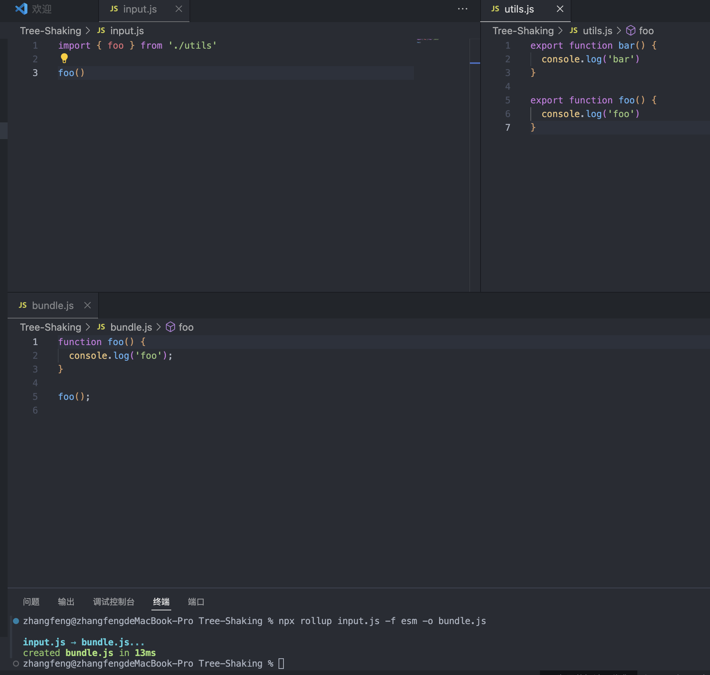
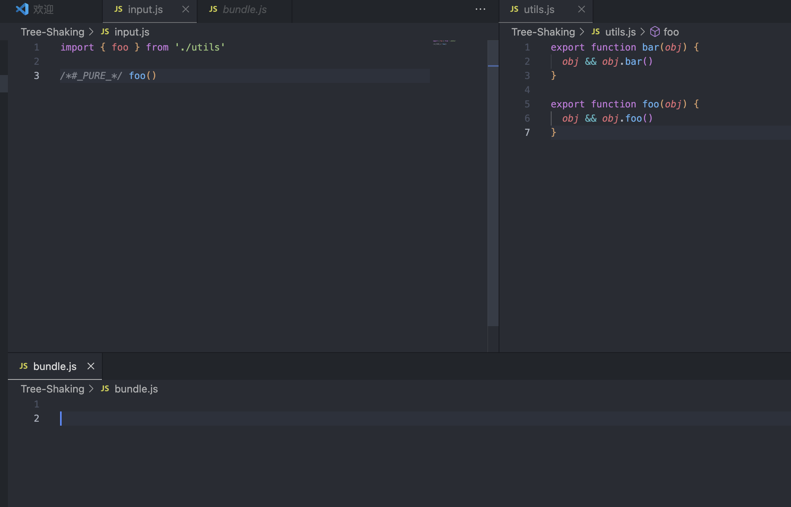

#  {{ $frontmatter.title }}

## 运行时 编译时 运行时 + 编译时

运行时：由于它没有编译的过程，因此我们没办法分析用户提供的内容

编译时：可以分析用户提供的内容。由于不需要任何运行时，而是直接 编译成可执行的JavaScript 代码，因此性能可能会更好，但是这种做法有损灵活性，即用户提供 的内容必须编译后才能用。

运行时 + 编译时： 可以分析用户提供的内容，看看哪些内容未来可 能会改变，哪些内容永远不会改变，这样我们就可以在编译的时候提取这些信息 ，然后将其传递 给Render 函数，Render 函数得到这些信息之后，就可以做进 一步的优化了

## tree-shaking

项目中没有用到的组件，函数等。不需要将它包含在项目最终的构建资源中。

想要实现tree-shaking，模块必须时ESM。tree-shaking 依赖ESM的静态结构

例：input.js 中只导入utils.js 中的foo，并执行foo。然后使用`npx rollup input.js -f esm -o bundle.js`，最终结果中只有foo，没有bar。这是tree-shaking 起了作用。bar并没有使用，所以它作为的dead code 被删除了。

副作用：当调用函数的时候，会对外部产生影响

tree-shaking如果一个函数调用，会产生副作用，就不能将其移出。

javascript是动态语言，静态分析dead code是有难度的。rollup提供了一个机制，我们可以明确告知，哪些代码不会产生副作用，可以移除它。

例：

ESM 格式的资源有两种:用于浏览器的 esm-browser.js 和用于打包工具的 esm-bundler.js。它们的区别在于对预定义常量 _DEV_ 的处理，前者直接将_ DEV_ 常量替换为字 面量true或false，后者则将 _DEV_ 常量替換为process.env.NODE_ENV!== 'production' 语句

## vue的设计思路

虚 拟 D O M 其 实 就 是 用 来 描 述 真 实 D OM 的普通JavaScript 对象

组件就是一组DOM元素的 封装，这组DOM元素就是组件要渲染的内容
