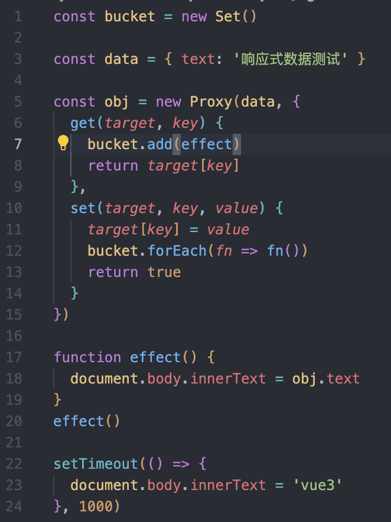
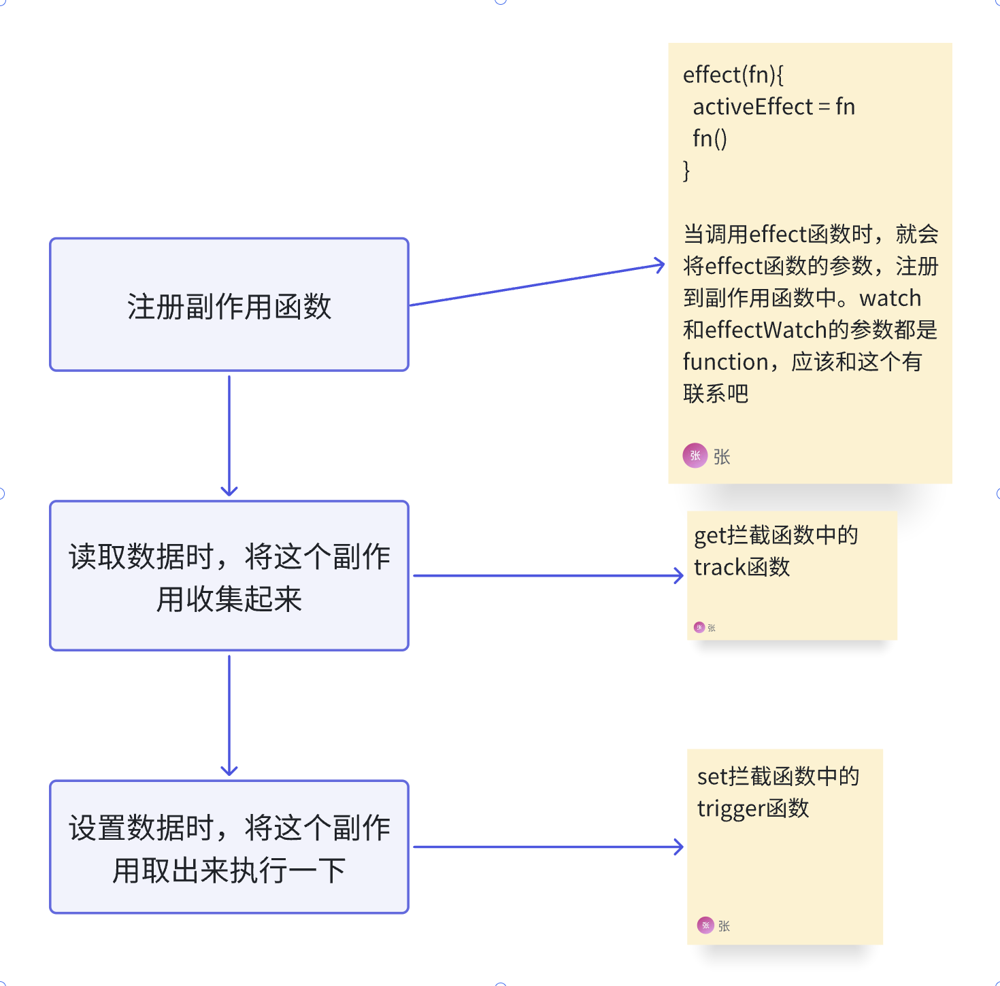
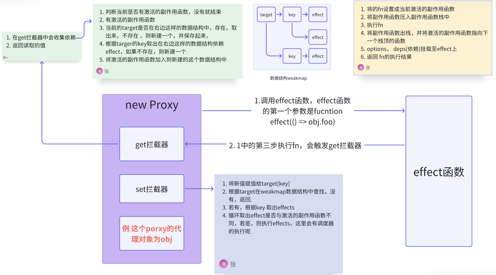

# 响应系统

## 响应式数据和副作用函数

函数的执行会直接或间接影响其他函数的执行，这时我们说这个函数产生了副作用。副作用很容易产生，例如一个函数修改了全局变量， 这其实也是一个副作用。

```js
const obj = { text: 'hello world' }
function effect () {
  document.body.innerText = obj.text
}
```

当 `obj.text`发生变化时，effect函数自动执行。obj就是响应式数据



在浏览器中显示“响应式数据测试” 一秒后会显示 “vue3”

这种方式不灵活，它是直接通过名字（effect ）来获取副作用函数。副作用函数的名字应该可以任意取。

### 改进1

响应式系统的工作流程：

- 读取操作发生时，将副作用函数收集起来
- 设置操作发生时，从收集的函数中取出副作用函数并执行

```js
let activeEffect
const bucket = new Set()
const data = { text: '响应式数据测试' }
const obj = new Proxy(data, {
  get(target, key) {
    if (activeEffect) {
      bucket.add(activeEffect)
    }
    return target[key]
  },
  set(target, key, value) {
    target[key] = value
    bucket.forEach(fn => fn())
    return true
  }
})
function effect(fn) {
  // 注册副作用函数
  activeEffect = fn
  fn()
}
effect(() => {
  document.body.innerText = obj.text
})

setTimeout(() => {
  obj.text = "hahaha"
}, 1000)
```

这种方式没有在副作用函数与被操作的目标字段之间建立明确的联系。当读取属性时，无论读取的时哪一个属性，其实都是一样的，都会把副作用函数收集到起来，当设置属性时，无论设置的是哪一个属性，都会把收集起来的副作用函数取出来并执行。副作用函数与被操作的字段之间没有明确的联系。

解决方法：只需要在副作用函数与被操作的字段之间建立联系就可以了。

- 被操作的代理对象
- 被操作的字段名
- 使用effect函数注册的副作用函数effectFn

### 改进2

```js
let activeEffect
const bucket = new WeakMap()
const data = { text: '响应式数据测试' }
const obj = new Proxy(data, {
  get(target, key) {
    // 没有activeEffect， 直接返回
    if (!activeEffect) {
      return target[key]
    }
    // 根据target 从收集中取出depsMap
    let depsMap = bucket.get(target)
    // 如果不存在， 新建一个Map与target关联
    if (!depsMap) {
      bucket.set(target, (depsMap = new Map()))
    }
    // 根据key从depsMap中取得deps，Set类型。里面存储着所有与当前key相关的副作用函数
    let deps = depsMap.get(key)
    if (!deps) {
      depsMap.set(key, (deps = new Set()))
    }
    deps.add(activeEffect)
    return target[key]
  },
  //拦截设置操作
  set(target, key, value) {
    target[key] = value
    // 根据target 从收集的函数中取出depsMap
    const depsMap = bucket.get(target)
    if (!depsMap) return
    const effects = depsMap.get(key)
    effects && effects.forEach(fn => fn())
  }
})
function effect(fn) {
  // 注册副作用函数
  activeEffect = fn
  fn()
}
effect(() => {
  console.log(2)
  document.body.innerText = obj.text
})

setTimeout(() => {
  obj.text = "hahaha"
}, 1000)
```

这里使用了WeakMap作为收集的数据结构，而没有使用Map，是因为Map可能会导致内存溢出。

WeakMap对key是弱引用，不影响垃圾回收器的工作。所以WeakMap经常用于存储那些只有当key所引用的对象存在时才有价值的信息。

无法获取WeakMap的key值，相比于Map，Map可以遍历它的内容。

WeakMap的key必须是对象或symbol，Map的key可以是任何类型的值。
WeakMap性能比Map好，WeakMap的内存使用高效，因为它可以自动进行健值对的垃圾回收；Map更加灵活易于使用。

### 改进3

在上面的代码实现中，当读取属性值时，直接在get拦截函数里编写把副作用函数收集到收集器里，接下来需要将这部分逻辑单独封装到一个track函数中，函数的名字叫track 表示追踪。把触发副作用函数重新执行的逻辑封装到trigger函数中

```js
let activeEffect
const bucket = new WeakMap()
const data = { text: '响应式数据测试' }
const obj = new Proxy(data, {
  get(target, key) {
    track(target, key)
    return target[key]
  },
  //拦截设置操作
  set(target, key, value) {
    target[key] = value
    trigger(target, key)
  }
})

function track(target, key) {
  // 没有activeEffect， 直接返回
  if (!activeEffect) {
    return
  }
  // 根据target 从收集中取出depsMap
  let depsMap = bucket.get(target)
  // 如果不存在， 新建一个Map与target关联
  if (!depsMap) {
    bucket.set(target, (depsMap = new Map()))
  }
  // 根据key从depsMap中取得deps，Set类型。里面存储着所有与当前key相关的副作用函数
  let deps = depsMap.get(key)
  if (!deps) {
    depsMap.set(key, (deps = new Set()))
  }
  deps.add(activeEffect)
}

function trigger(target, key) {
  const depsMap = bucket.get(target)
  if (!depsMap) return
  const effects = depsMap.get(key)
  effects && effects.forEach(fn => fn())
}

function effect(fn) {
  // 注册副作用函数
  activeEffect = fn
  fn()
}
effect(() => {
  console.log(2)
  document.body.innerText = obj.text
})

setTimeout(() => {
  obj.text = "hahaha"
}, 2000)
```



### 分支切换

```js
const data = { ok: true, text: 'hello world' }
const obj = new Proxy(data, {/* ...*/})
effect(()=>{
  document.body.innerText = obj.ok ? obj.text: 'not'
})
```

这个分支切换可能会产生遗留的副作用函数。

`obj.ok`为 `true`时，会读取 `obj.text`的值，所以 `effectFn`函数执行时会触发字段 `obj.ok`和 `obj.text`这两个属性的读取操作，副作用函数 `effectFn`分别会被字段 `obj.ok`和 `obj.text`对应的依赖集合收集。当字段 `obj.ok`的值修改为 `false`，并触发副作用函数重新执行，`obj.text`不会被读取，只会触发字段 `obj.ok`的读取操作，所以理论上副作用函数 `effectFn`不应该被字段 `obj.text`所对应的依赖集合收集。实际上当 `obj.ok`修改为 `false`时，会触发更新，副作用函数会重新执行。但是由于 `obj.ok`为 `false`，所以不会再读取字段 `obj.text`的值。所以无论 `obj.text`的值怎么变，都不需要重新执行副作用函数。（这要换作是我，就不管了，即使会执行副作用函数，但是不会影响它的基本逻辑，读就读了呗，估计只会影响其性能。功能是完善的。等遇到问题后才会想办法继续优化）

解决方案：
每次副作用函数执行时，可以先把它从所有与之关联的依赖集合中删除。当副作用函数执行完毕后，会重新建立联系，但在新的联系中不会包含遗留的副作用函数。

- 想要将一个副作用函数从所有与之关联的依赖合集中移除，就需要明确知道哪些依赖合集中包含它

```js
let activeEffect
const bucket = new WeakMap()
const data = { text: '响应式数据测试' }
const obj = new Proxy(data, {
  get(target, key) {
    track(target, key)
    return target[key]
  },
  //拦截设置操作
  set(target, key, value) {
    target[key] = value
    trigger(target, key)
  }
})

function track(target, key) {
  // 没有activeEffect， 直接返回
  if (!activeEffect) {
    return
  }
  // 根据target 从收集中取出depsMap
  let depsMap = bucket.get(target)
  // 如果不存在， 新建一个Map与target关联
  if (!depsMap) {
    bucket.set(target, (depsMap = new Map()))
  }
  // 根据key从depsMap中取得deps，Set类型。里面存储着所有与当前key相关的副作用函数
  let deps = depsMap.get(key)
  if (!deps) {
    depsMap.set(key, (deps = new Set()))
  }
  // 把当前激活的副作用函数添加到依赖合集deps中
  deps.add(activeEffect)
  // 将其添加到 activeEffect.deps 数组中
  activeEffect.deps.push(deps)
}

function trigger(target, key) {
  const depsMap = bucket.get(target)
  if (!depsMap) return
  const effects = depsMap.get(key)

  const effectToRun = new Set(effects)
  effectToRun.forEach(effectFn => effectFn())
  // 如果在枚举（遍历）集合的过程中,除了通过迭代器自身的 remove 方法之外,有其他元素被添加到集合或从集合中删除,则枚举的行为是未定义的。
  // 下面代码会造成无限循环执行，
  // effects && effects.forEach(fn => fn())
}

function effect(fn) {
  const effectFn = () => {
    // 当effectFn执行时，将其设置为当前激活的副作用函数
    cleanup(effectFn)
    activeEffect = effectFn
    fn()
  }
  // activeEffect.deps用来存储所有与该副作用函数相关联的依赖合集
  effectFn.deps = []
  // 执行副作用函数
  effectFn()
}

function cleanup(effectFn) {
  for (let i = 0; i < effectFn.deps.length; i++) {
    // deps 是依赖合集
    const deps = effectFn.deps[i]
    // 将effectFn 从依赖集合中移除
    deps.delete(effectFn)
  }
  effectFn.deps.length = 0
}

effect(() => {
  document.body.innerText = obj.text
})

setTimeout(() => {
  obj.text = "hahaha"
}, 2000)
```

### 潜套的effect和effect栈

组件发生嵌套时，就会发生effect嵌套。

由于使用的是全局变量 `activeEffect`来存储通过 `effect`函数注册的副作用函数，意味着同一时刻 `activeEffect`所存储的副作用函数只能有一个。当副作用函数发生嵌套时，内层副作用函数的执行会覆盖activeEffect的值，且永远不会恢复到原来的值。此刻，若再有响应式数据进行依赖收集，即使这个响应式数据时在外层副作用函数中读取的，它们收集的副作用函数也都会时内层副作用函数。

为解决这个问题，需要引入一个副作用函数栈 `effectStack`，在副作用函数执行时，将当前副作用函数压入栈中，待副作用函数执行完毕后将其从栈中弹出，并始终让 `activeEffect`指向栈顶的副作用函数。这样就能做到一个响应式数据只会收集直接读取其值的副作用函数，而不会出现互相影响的情况。

```js
// 当前激活的effect函数
let activeEffect
// effect 栈
const effectStack = [] // [!code ++]

const bucket = new WeakMap()
const data = { text: '响应式数据测试' }
const obj = new Proxy(data, {
  get(target, key) {
    track(target, key)
    return target[key]
  },
  //拦截设置操作
  set(target, key, value) {
    target[key] = value
    trigger(target, key)
  }
})

function track(target, key) {
  // 没有activeEffect， 直接返回
  if (!activeEffect) {
    return
  }
  // 根据target 从收集中取出depsMap
  let depsMap = bucket.get(target)
  // 如果不存在， 新建一个Map与target关联
  if (!depsMap) {
    bucket.set(target, (depsMap = new Map()))
  }
  // 根据key从depsMap中取得deps，Set类型。里面存储着所有与当前key相关的副作用函数
  let deps = depsMap.get(key)
  if (!deps) {
    depsMap.set(key, (deps = new Set()))
  }
  // 把当前激活的副作用函数添加到依赖合集deps中
  deps.add(activeEffect)
  // 将其添加到 activeEffect.deps 数组中
  activeEffect.deps.push(deps)
}

function trigger(target, key) {
  const depsMap = bucket.get(target)
  console.log(bucket)
  if (!depsMap) return
  const effects = depsMap.get(key)

  const effectToRun = new Set(effects)
  effectToRun.forEach(effectFn => effectFn())
  // 如果在枚举（遍历）集合的过程中,除了通过迭代器自身的 remove 方法之外,有其他元素被添加到集合或从集合中删除,则枚举的行为是未定义的。
  // 下面代码会造成无限循环执行，
  // effects && effects.forEach(fn => fn())
}

function effect(fn) {
  const effectFn = () => {
    cleanup(effectFn)
    // 当effectFn执行时，将其设置为当前激活的副作用函数
    activeEffect = effectFn
    // 在调用副作用函数之前将当前副作用函数压入栈中 //[!code ++]
    effectStack.push(effectFn) // [!code ++]
    fn()
    // 在当前副作用函数执行完毕后，将当前副作用函数弹出栈，并把activeEffect 还原为之前的值 // [!code ++]
    effectStack.pop() // [!code ++]
    activeEffect = effectStack[effectStack.length - 1] // [!code ++]
  }
  // activeEffect.deps用来存储所有与该副作用函数相关联的依赖合集
  effectFn.deps = []
  // 执行副作用函数
  effectFn()
}

function cleanup(effectFn) {
  console.log(effectFn)
  for (let i = 0; i < effectFn.deps.length; i++) {
    // deps 是依赖合集
    const deps = effectFn.deps[i]
    // 将effectFn 从依赖集合中移除
    deps.delete(effectFn)
  }
  effectFn.deps.length = 0
}

effect(() => {
  console.log(2)
  document.body.innerText = obj.text
})

setTimeout(() => {
  obj.text = "hahaha"
}, 2000)
```

### 避免无限递归循环

```js
const data = { foo: 1 }
const obj = new Proxy(data, {/* ... */})
effect(()=>obj.foo++)
```

这个effect，既会读取 `obj.foo`，又会设置 `obj.foo`的值。

首先读取 `obj.foo`的值，就会触发 `track`操作，将当前副作用函数收集起来，接着将其加1后再赋值给 `obj.foo`，此时会触发 `trigger`操作，即从收集器中把副作用函数取出来并执行。问题在于该副作用函数正在执行中，还没有执行完毕，就要开始下一次的执行，这样会导致无限递归地调用自己，就会产生栈溢出

读取和设置操作是在同一个副作用函数内进行的。无论是track 还是trigger 触发的副作用函数，都是activeEffect。因此，可以在 `trigger`动作发生时增加守卫条件：**如果trigger触发执行副作用函数与当前在执行的副作用函数相同，则不触发执行**

```js
...
function trigger(target, key) {
  const depsMap = bucket.get(target)
  console.log(bucket)
  if (!depsMap) return
  const effects = depsMap.get(key)
  
  const effectToRun = new Set(effectFn) // [!code --]
  const effectToRun = new Set() // [!code ++]
  effects && effects.forEach(effectFn => { // [!code ++]
    if (effectFn !== activeEffect) { // [!code ++]
      effectToRun.add(effectFn) // [!code ++]
    } // [!code ++]
  }) // [!code ++]
  effectToRun.forEach(effectFn => effectFn())
  // 如果在枚举（遍历）集合的过程中,除了通过迭代器自身的 remove 方法之外,有其他元素被添加到集合或从集合中删除,则枚举的行为是未定义的。
  // 下面代码会造成无限循环执行，
  // effects && effects.forEach(fn => fn())
}
...
```

### 调度执行

当trigger动作触发副作用函数重新执行时，有能力决定副作用函数的执行时机、次数以及方式

可以在用户调用effect函数注册副作用函数时，传递第二个参数options。

```js
...
function effect(fn) { // [!code --]
function effect(fn, options = {}) { // [!code ++]
  const effectFn = () => {
    cleanup(effectFn)
    // 当effectFn执行时，将其设置为当前激活的副作用函数
    activeEffect = effectFn
    // 在调用副作用函数之前将当前副作用函数压入栈中
    effectStack.push(effectFn)
    fn()
    // 在当前副作用函数执行完毕后，将当前副作用函数弹出栈，并把activeEffect 还原为之前的值
    effectStack.pop()
    activeEffect = effectStack[effectStack.length - 1]
  }
  // 将options挂载到effectFn上 // [!code ++]
  effectFn.options = options // [!code ++]
  // activeEffect.deps用来存储所有与该副作用函数相关联的依赖合集
  effectFn.deps = []
  // 执行副作用函数
  effectFn()
}

function trigger(target, key) {
  const depsMap = bucket.get(target)
  console.log(bucket)
  if (!depsMap) return
  const effects = depsMap.get(key)

  const effectToRun = new Set()
  effects && effects.forEach(effectFn => {
    if (effectFn !== activeEffect) {
      effectToRun.add(effectFn)
    }
  })

  effectToRun.forEach(effectFn => effectFn()) // [!code --]
  effectToRun.forEach(effectFn => { // [!code ++]
    if(effectFn.options.scheduler) { // [!code ++]
      effectFn.options.scheduler(effectFn) // [!code ++]
    } else { // [!code ++]
      effectFn() // [!code ++]
    } // [!code ++]
  }) // [!code ++]

  // 如果在枚举（遍历）集合的过程中,除了通过迭代器自身的 remove 方法之外,有其他元素被添加到集合或从集合中删除,则枚举的行为是未定义的。
  // 下面代码会造成无限循环执行，
  // effects && effects.forEach(fn => fn())
}

...
```

### 计算属性computed与lazy

- effect函数，用来注册副作用函数
- options对象，用来控制副作用函数的执行时机和方式
- track函数，用来追踪和收集依赖
- tirgger函数，用来触发副作用函数重新执行

结合起来以上内容可以实现计算属性

懒执行

```js
function effect(fn, options = {}) {
  const effectFn = () => {
    cleanup(effectFn)
    // 当effectFn执行时，将其设置为当前激活的副作用函数
    activeEffect = effectFn
    // 在调用副作用函数之前将当前副作用函数压入栈中
    effectStack.push(effectFn)
    fn() // [!code --]
    const res = fn() // [!code ++]
    // 在当前副作用函数执行完毕后，将当前副作用函数弹出栈，并把activeEffect 还原为之前的值
    effectStack.pop()
    activeEffect = effectStack[effectStack.length - 1]
    return res // [!code ++]
  }
  // 将options挂载到effectFn上
  effectFn.options = options
  // activeEffect.deps用来存储所有与该副作用函数相关联的依赖合集
  effectFn.deps = []
  // 执行副作用函数 // [!code --]
  effectFn() // [!code --]
  if(!options.lazy) { // [!code ++]
    effectFn() // [!code ++]
  } // [!code ++]
  return effectFn // [!code ++]

}

function computed(getter) { // [!code ++]
  const effectFn = effect(getter, { // [!code ++]
    lazy: true // [!code ++]
  }) // [!code ++]
  const obj = { // [!code ++]
    get value() { // [!code ++]
      return effectFn() // [!code ++]
    } // [!code ++]
  } // [!code ++]
  return obj // [!code ++]
} // [!code ++]
const data = { foo: 1, bar: 2 } // [!code ++]
const sumRes = computed(() => obj.foo + obj.bar) // [!code ++]
console.log(sumRes.value) // [!code ++]
```

这样就实现了计算属性的懒计算，只有在读取`sumRes`值时，才会计算并得到其值。但是不会对其值进行缓存。

computed对其计算值进行缓存

```js
function computed(getter) {
  // value 用来缓存上一次计算的值 // [!code ++]
  let value // [!code ++]
  // dirty标志，用来标识是否需要重新计算值，为 true 则意味着 脏，需要计算 // [!code ++]
  let dirty = true // [!code ++]
  const effectFn = effect(getter, {
    lazy: true,
  })
  const obj = {
    get value() {
      return effectFn() // [!code --]
      // 只有脏时才计算值，并将得到的值缓存到value中 // [!code ++]
      if (dirty) { // [!code ++]
        value = effectFn() // [!code ++]
        dirty = false // [!code ++]
      } // [!code ++]
      return value // [!code ++]
    }
  }
  return obj
}
```

上面代码第一次访问后 dirty为false ，不管依赖值是否发生改变，后续都不会重新计算，

```js
function computed(getter) {
  // value 用来缓存上一次计算的值 
  let value 
  // dirty标志，用来标识是否需要重新计算值，为 true 则意味着 脏，需要计算 
  let dirty = true 
  const effectFn = effect(getter, {
    lazy: true,
    // 添加调度器，在调度器中将dirty重置为true // [!code ++]
    scheduler() { // [!code ++]
      dirty = true // [!code ++]
    } // [!code ++]
  })
  const obj = {
    get value() {
      // 只有脏时才计算值，并将得到的值缓存到value中 
      if (dirty) { 
        value = effectFn() 
        dirty = false 
      } 
      return value 
    }
  }
  return obj
}
```

在getter函数中所依赖的响应式数据变化时执行，数据发生变化会触发`new Proxy()`中的set方法，继而执行`trigger`，`trigger`函数中会判断是否有调度器，继而执行调度器，此时`dirty`被设置成`true`


当在另外一个effect中读取计算属性时，如果此时修改了计算属性中的依赖值，不会触发副作用函数的执行。这就是一个effect嵌套。一个计算属性内部拥有自己的effect，并且它是懒执行的，只有当真正读取计算属性的值时，才会执行。对应计算属性的getter函数来说，它里面访问的响应式数据只会把computed内部的effect收集为依赖。而当把计算属性用于另一个effect时，就是发生effect嵌套，外层的effect不会被内层effect中的响应式数据收集。

```js
function computed(getter) {
  // value 用来缓存上一次计算的值 
  let value 
  // dirty标志，用来标识是否需要重新计算值，为 true 则意味着 脏，需要计算 
  let dirty = true 
  const effectFn = effect(getter, {
    lazy: true,
    // 添加调度器，在调度器中将dirty重置为true 
    scheduler() { 
      dirty = true 
      // 当计算属性依赖的响应式数据变化时，手动调用trigger 函数触发响应 // [!code ++]
      trigger(obj, "value") // [!code ++]
    } 
  })
  const obj = {
    get value() {
      // 只有脏时才计算值，并将得到的值缓存到value中 
      if (dirty) { 
        value = effectFn() 
        dirty = false 
      } 
      // 当读取value时，手动调用track函数进行追踪 // [!code ++]
      track(obj, "value") // [!code ++]
      return value 
    }
  }
  return obj
}

```

### watch 的实现原理

watch的实现本质上就是利用了effect以及options.scheduler选项

在一个副作用函数中访问响应式数据。这会在副作用函数与响应式数据之间建立联系，当响应式数据变化时，会触发副作用函数重新执行。但如果副作用函数存在scheduler选项，当响应式数据发生变化时，会触发scheduler调度函数执行，而非直接触发副作用函数执行。其实scheduler调度函数就相当于一个回调函数，而watch的实现就是利用了这个特点。

```js
...
// watch 函数接受两个参数，source是响应式数据，cb是回调函数 // [!code ++]
function watch(source, cb) { // [!code ++]
  effect( // [!code ++]
    // 触发读取操作，从而建立联系 // [!code ++]
    () => source.foo, // [!code ++]
    { // [!code ++]
      scheduler() { // [!code ++]
        // 当数据变化时，调用回调函数cb // [!code ++]
        cb() // [!code ++]
      } // [!code ++]
    } // [!code ++]
  ) // [!code ++]
} // [!code ++]

const watchObj = new Proxy(data, { // [!code ++]
  get(target, key) { // [!code ++]
    track(target, key) // [!code ++]
    return target[key] // [!code ++]
  }, // [!code ++]
  //拦截设置操作 // [!code ++]
  set(target, key, value) { // [!code ++]
    target[key] = value // [!code ++]
    trigger(target, key) // [!code ++]
  } // [!code ++]
}) // [!code ++]

const watchData = { foo: 1 } // [!code ++]
watch(watchObj, () => { // [!code ++]
  console.log('changed') // [!code ++]
}) // [!code ++]
watchObj.foo++ // [!code ++]
...
```

### 改进1

```js
// watch 函数接受两个参数，source是响应式数据，cb是回调函数
function watch(source, cb) {
  effect(
    // 触发读取操作，从而建立联系 // [!code --]
    // () => source.foo, // [!code --]
    // 调用traverse递归地读取 // [!code ++]
    () => traverse(source), // [!code ++]
    {
      scheduler() {
        // 当数据变化时，调用回调函数cb
        cb()
      }
    }
  )
}

function traverse(value, seen = new Set()) { // [!code ++]
  // 如果要读取的数据是原始值，或者已经被读取过了，直接返回 // [!code ++]
  if(typeof value !== 'object' || value === null || seen.has(value)) return // [!code ++]
  // 将数据添加到seen中，代表遍历地读取过了，避免循环引用引起的死循环 // [!code ++]
  seen.add(value) // [!code ++] 
  for(const i in value) { // [!code ++]
    traverse(value[i],seen) // [!code ++]
  } // [!code ++]
  return value // [!code ++]
} // [!code ++]
```

在watch内部的effect 中调用traverse函数进行递归的读取操作，代替硬编码的方式，这样就能读取一个对象上的任意属性，从而当任意属性发生变化时都能够触发 回调函数执行

### 改进2

watch函数除了可以观测响应式数据，还可以接收一个getter函数

```js
watch(() => watchObj.foo, () => { console.log('objdata changed!') }) // [!code ++]

function watch(source, cb) {
  let getter // [!code ++]
  if(typeof source === 'function') { // [!code ++]
    getter = source // [!code ++]
  } else { // [!code ++]
    getter = () =>traverse(source) // [!code ++]
  } // [!code ++]

  effect(
    () => traverse(source), // [!code --]
    () => getter(), // [!code ++]
    {
      scheduler() {
        // 当数据变化时，调用回调函数cb
        cb()
      }
    }
  )
}

```

### 改进3

获取新值和旧值。利用effect函数的lazy选项

```js
// watch 函数接受两个参数，source是响应式数据，cb是回调函数
function watch(source, cb) {
  let getter 
  if (typeof source === 'function') { 
    getter = source 
  } else {
    getter = () => traverse(source) 
  } 
  let oldValue, newValue // [!code ++]
  const effectFn = effect( // [!code ++]
    () => getter(), 
    {
      lazy: true, // [!code ++]
      scheduler() {
        cb() // [!code --]
        // 在scheduler中重新执行副作用函数，得到的是新值 // [!code ++]
        newValue = effectFn() // [!code ++]
        // 将旧值和新值作为回调函数的参数 // [!code ++]
        cb(newValue, oldValue) // [!code ++]
        // 更新旧值， // [!code ++]
        oldValue = newValue // [!code ++]
      }
    }
  )
  // 手动调用副作用函数，拿到的值就是旧值 // [!code ++]
  oldValue = effectFn() // [!code ++]
}
```

利用lazy选项创建一个懒执行的effect。手动调用effectFn函数得到旧值。当变化发生并触发scheduler调度函数执行时，会重新调用effectFn函数并得到新值。

### 立即执行的watch与回调执行时机

watch的本质其实是对effect的二次封装

```js
function watch(source, cb) {
  let getter 
  if (typeof source === 'function') { 
    getter = source 
  } else {
    getter = () => traverse(source) 
  } 
  let oldValue, newValue 
  const job = () => { // [!code ++]
    newValue = effectFn() // [!code ++]
    cb(newValue, oldValue) // [!code ++]
    oldValue = newValue  // [!code ++]
  } // [!code ++]
  const effectFn = effect( 
    () => getter(), 
    {
      lazy: true, 
      scheduler() { // [!code --]
        // 在scheduler中重新执行副作用函数，得到的是新值 // [!code --]
        newValue = effectFn() // [!code --]
        // 将旧值和新值作为回调函数的参数 // [!code --]
        cb(newValue, oldValue) // [!code --]
        // 更新旧值， // [!code --]
        oldValue = newValue // [!code --]
      }, // [!code --]
      scheduler: obj // [!code ++]
    }
  )
  if(options.immediate) { // [!code ++]
    job() // [!code ++]
  } else { // [!code ++]
    oldValue = effectFn() // [!code ++]
  } // [!code ++]
  // 手动调用副作用函数，拿到的值就是旧值 // [!code --]
  oldValue = effectFn() // [!code --]
}

watch(watchObj, () => {
  console.log('changed')
}, {
  immediate: true
})

```

watch执行时机

调度函数需要将副作用函数放到一个微任务队列中，并等待DOM更新结束后再执行

```js
// watch 函数接受两个参数，source是响应式数据，cb是回调函数
function watch(source, cb, options = {}) {
  let getter
  if (typeof source === 'function') {
    getter = source
  } else {
    getter = () => traverse(source)
  }
  let oldValue, newValue
  const job = () => { 
    newValue = effectFn() 
    cb(newValue, oldValue) 
    oldValue = newValue 
  } 
  const effectFn = effect(
    () => getter(),
    {
      lazy: true,
      scheduler: job, // [!code --]
      scheduler: () => { // [!code ++]
        // 在调度函数中判断flush是否为post，如果是，将其放到微任务队列中执行 // [!code ++]
        if(options.flush === 'post') { // [!code ++]
          const p = Promise.resolve() // [!code ++]
          p.then(job) // [!code ++]
        } else { // [!code ++]
          job() // [!code ++]
        } // [!code ++]
      }
    }
  )
  if (options.immediate) { 
    job() 
  } else { 
    oldValue = effectFn() 
  } 
}
```

### 过期的副作用

```js
// watch 函数接受两个参数，source是响应式数据，cb是回调函数
function watch(source, cb, options = {}) {
  let getter
  if (typeof source === 'function') {
    getter = source
  } else {
    getter = () => traverse(source)
  }
  let oldValue, newValue
  // cleanup 用来存储用户注册的过期回调 // [!code ++]
  let cleanup // [!code ++]
  function onInvalidate(fn) { // [!code ++]
    cleanup = fn // [!code ++]
  } // [!code ++]
  const job = () => {
    newValue = effectFn()
    if (cleanup) { // [!code ++]
      cleanup() // [!code ++]
    } // [!code ++]
    cb(newValue, oldValue) // [!code --]
    cb(newValue, oldValue, onInvalidate) // [!code ++]
    oldValue = newValue
  }
  const effectFn = effect(
    () => getter(),
    {
      lazy: true,
      scheduler: () => {
        // 在调度函数中判断flush是否为post，如果是，将其放到微任务队列中执行 
        if (options.flush === 'post') {
          const p = Promise.resolve()
          p.then(job)
        } else {
          job()
        }
      }
    }
  )
  if (options.immediate) {
    job()
  } else {
    oldValue = effectFn()
  }
}
```

```js
watch(id, async (newId, oldId, onCleanup) => {
  const { response, cancel } = doAsyncWork(newId)
  // 当 `id` 变化时，`cancel` 将被调用，
  // 取消之前的未完成的请求
  onCleanup(cancel)
  data.value = await response
})

watch(obj, async(newValue, oldValue, onCleanup) => {
  let expired = false
  onCleanup(()=>{
    expired = true
  })
  const res = await doAsyncWork(obj.id)
  // 赋值最终的结果，没有取消方法的执行，只是抛弃了过期的函数的结果，
  if(!expired) {
    const finalData = res 
  }
})
```



